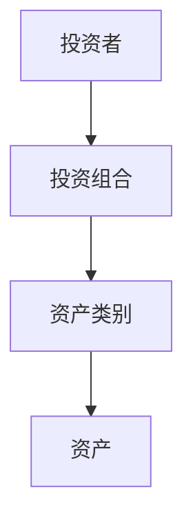
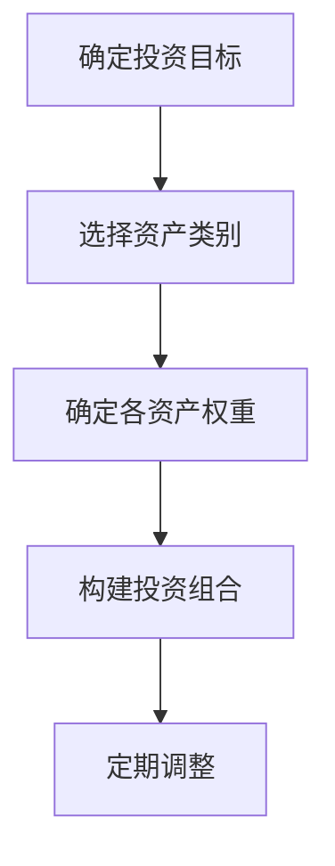
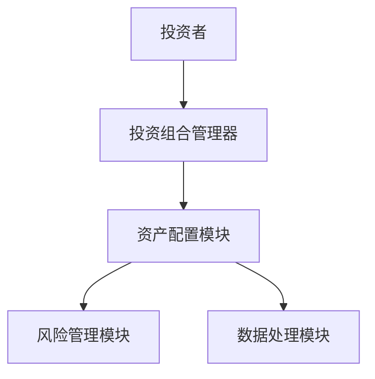

                 


# 威廉·伯恩斯坦的资产配置型价值投资：科学构建投资组合

> 关键词：资产配置型价值投资，投资组合优化，威廉·伯恩斯坦，现代投资组合理论，投资组合管理

> 摘要：本文深入探讨了威廉·伯恩斯坦在资产配置型价值投资领域的重要贡献，从理论基础到算法实现，结合实际案例，系统地阐述了如何科学构建投资组合。通过分析资产配置的核心概念、算法原理、数学模型、系统架构以及项目实战，为读者提供了一套完整的投资组合优化方法论。

---

## 第一部分: 资产配置型价值投资概述

### 第1章: 资产配置型价值投资的背景与核心概念

#### 1.1 资产配置型价值投资的背景
##### 1.1.1 投资领域中的问题背景
在金融市场中，投资者面临的核心问题是如何在不确定性中实现收益的最大化。资产配置型价值投资作为一种科学的投资策略，旨在通过合理分配资产类别，降低投资风险，同时捕捉市场收益。威廉·伯恩斯坦作为该领域的权威，提出了许多创新性的理论和方法。

##### 1.1.2 资产配置的重要性
资产配置是投资组合管理的核心，它决定了投资组合的风险和收益特征。通过科学的资产配置，投资者可以在不同市场环境下实现收益的最大化。

##### 1.1.3 价值投资的基本原理
价值投资强调购买被市场低估的资产，长期持有，等待其价值回归。威廉·伯恩斯坦将价值投资与资产配置相结合，提出了一种更为系统和科学的投资方法。

#### 1.2 资产配置型价值投资的核心概念
##### 1.2.1 资产配置的定义与特点
资产配置是指将资金分配到不同的资产类别（如股票、债券、房地产等）中，以实现风险和收益的平衡。其特点包括分散性、系统性和动态调整。

##### 1.2.2 价值投资与成长投资的区别
价值投资关注低估资产，而成长投资关注高增长潜力的资产。资产配置型价值投资通过资产配置将两者的优势结合起来。

##### 1.2.3 资产配置型价值投资的边界与外延
资产配置型价值投资不仅限于单一资产类别，而是涵盖多种资产，并通过科学的方法进行优化。

---

### 第2章: 资产配置型价值投资的理论基础

#### 2.1 现代投资组合理论（MPT）
##### 2.1.1 MPT的核心思想
MPT由哈里·马科维茨提出，强调通过分散投资降低风险。威廉·伯恩斯坦在此基础上进一步发展了资产配置理论。

##### 2.1.2 风险与收益的平衡
投资组合的收益与风险之间存在权衡关系。通过优化资产配置，可以在风险可控的前提下实现收益最大化。

##### 2.1.3 有效前沿的概念
有效前沿是指在给定风险水平下，能够提供最高收益的投资组合的集合。威廉·伯恩斯坦通过资产配置优化，帮助投资者找到位于有效前沿的投资组合。

#### 2.2 威廉·伯恩斯坦的贡献
##### 2.2.1 伯恩斯坦的学术背景
威廉·伯恩斯坦是著名的投资专家，其研究领域涵盖资产配置、风险管理等。

##### 2.2.2 伯恩斯坦对资产配置的创新
伯恩斯坦提出了基于现代投资组合理论的资产配置方法，并结合价值投资理念，形成了独特的资产配置型价值投资策略。

##### 2.2.3 伯恩斯坦的投资哲学
伯恩斯坦强调长期投资、分散投资和风险管理的重要性，认为这是实现投资目标的关键。

---

### 第3章: 资产配置型价值投资的核心要素

#### 3.1 投资组合的构建要素
##### 3.1.1 资产类别划分
将资产分为股票、债券、现金等类别，并根据市场环境调整各部分的权重。

##### 3.1.2 资产权重分配
根据风险承受能力和收益目标，确定各资产类别的权重。

##### 3.1.3 风险管理策略
通过设定止损、分散投资等方式，降低投资组合的整体风险。

#### 3.2 核心概念与联系
##### 3.2.1 资产配置的ER实体关系图

##### 3.2.2 资产配置的Mermaid流程图


---

### 第4章: 资产配置型价值投资的算法原理

#### 4.1 现代投资组合理论（MPT）的算法
##### 4.1.1 均值-方差优化模型
通过优化投资组合的期望收益和方差，找到最优资产配置。

##### 4.1.2 马科维茨的有效前沿算法
通过计算有效前沿，确定最优投资组合。

##### 4.1.3 算法的数学模型与公式
优化目标函数：
$$ \text{Minimize } \sigma^2 \text{ (方差)} $$
约束条件：
$$ \sum w_i = 1 $$
其中，\( w_i \) 表示第 \( i \) 个资产的权重。

#### 4.2 价值投资的算法实现
##### 4.2.1 价值投资的核心算法
通过筛选低估资产，构建投资组合。

##### 4.2.2 资产配置的优化算法
使用优化算法（如遗传算法）进行资产配置。

##### 4.2.3 算法的Python源代码实现
```python
import numpy as np
import pandas as pd
from scipy.optimize import minimize

def portfolio Optimization(returns):
    # 定义优化目标函数
    def objective(weights):
        return np.dot(weights.T, np.dot(returns, weights))
    
    # 定义约束条件
    constraints = [{'type': 'eq', 'fun': lambda w: sum(w) - 1}]
    
    # 初始化权重
    n = len(returns.columns)
    initial_weights = np.array([1/n]*n)
    
    # 使用SLSQP求解器进行优化
    result = minimize(objective, initial_weights, method='SLSQP', constraints=constraints)
    return result.x
```

---

### 第5章: 资产配置型价值投资的数学模型与公式

#### 5.1 投资组合的数学模型
##### 5.1.1 投资组合的期望收益公式
$$ E[r_p] = \sum w_i E[r_i] $$
其中，\( w_i \) 是第 \( i \) 个资产的权重，\( E[r_i] \) 是第 \( i \) 个资产的期望收益。

##### 5.1.2 投资组合的方差公式
$$ \sigma_p^2 = \sum w_i^2 \sigma_i^2 + \sum w_i w_j \sigma_{ij} $$
其中，\( \sigma_i^2 \) 是第 \( i \) 个资产的方差，\( \sigma_{ij} \) 是第 \( i \) 和 \( j \) 个资产的协方差。

##### 5.1.3 风险调整后的收益公式
$$ \text{夏普比率} = \frac{E[r_p] - r_f}{\sigma_p} $$
其中，\( r_f \) 是无风险利率。

#### 5.2 资本资产定价模型（CAPM）
##### 5.2.1 CAPM的公式推导
$$ r_i = r_f + \beta_i (r_m - r_f) $$
其中，\( r_i \) 是第 \( i \) 个资产的期望收益，\( r_f \) 是无风险利率，\( \beta_i \) 是第 \( i \) 个资产的贝塔系数，\( r_m \) 是市场期望收益。

##### 5.2.2 CAPM的应用实例
通过CAPM模型，可以评估不同资产的预期收益，并据此进行资产配置。

---

## 第六章: 资产配置型价值投资的系统分析与架构设计

### 6.1 系统功能设计
#### 6.1.1 领域模型Mermaid类图


### 6.2 系统架构设计
#### 6.2.1 系统架构Mermaid架构图


### 6.3 系统接口设计
#### 6.3.1 API接口设计
```json
{
    "api": "/portfolio/optimize",
    "method": "POST",
    "params": {
        "returns": "...",
        "constraints": "..."
    }
}
```

---

## 第七章: 资产配置型价值投资的项目实战

### 7.1 环境安装
安装必要的Python库，如numpy、pandas、scipy等。

### 7.2 核心实现源代码
```python
def portfolio_optimizer(returns):
    # 优化目标函数
    def objective(weights):
        return np.dot(weights.T, np.dot(returns, weights))
    
    # 约束条件
    constraints = [{'type': 'eq', 'fun': lambda w: sum(w) - 1}]
    
    # 初始化权重
    n = len(returns.columns)
    initial_weights = np.array([1/n]*n)
    
    # 优化
    result = minimize(objective, initial_weights, method='SLSQP', constraints=constraints)
    return result.x
```

### 7.3 实际案例分析
通过具体案例，展示如何使用上述算法进行资产配置优化。

---

## 第八章: 资产配置型价值投资的最佳实践

### 8.1 小结
资产配置型价值投资是一种科学且有效的方法，能够帮助投资者实现长期稳定的收益。

### 8.2 注意事项
投资者在实际操作中需要注意市场风险、数据质量以及模型的适用性。

### 8.3 未来的发展方向
随着人工智能和大数据技术的发展，资产配置型价值投资将更加智能化和个性化。

### 8.4 拓展阅读
推荐相关书籍和论文，供读者进一步学习。

---

通过以上内容，读者可以系统地了解威廉·伯恩斯坦的资产配置型价值投资方法，并能够将其应用到实际投资中。

