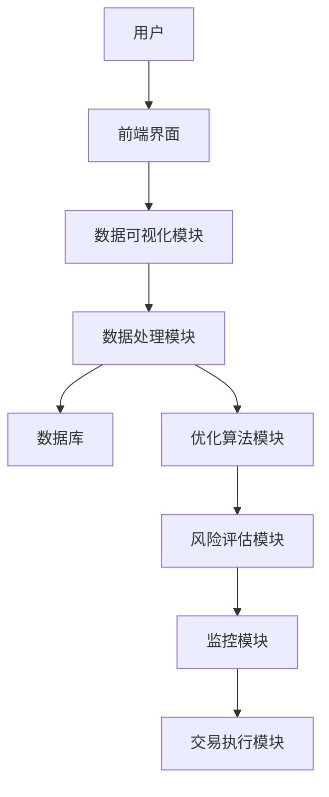

                 


# 威廉·伯恩斯坦的跨资产价值投资：多元化的重要性

---

## 关键词

- 跨资产投资
- 价值投资
- 多元化策略
- 投资组合优化
- 现代投资组合理论

---

## 摘要

本文深入探讨了威廉·伯恩斯坦提出的跨资产价值投资策略，重点分析了其核心思想——多元化的重要性。文章首先介绍了价值投资的基本概念和跨资产投资的必要性，然后详细阐述了多元化策略的核心原理和实施方法。通过数学模型和算法的分析，本文揭示了投资组合优化的关键步骤，并结合实际案例展示了如何在不同资产类别之间实现有效的配置。最后，文章总结了跨资产价值投资的优势，并提出了在实际操作中需要注意的关键点和最佳实践建议。

---

## 第一部分：跨资产价值投资基础

### 第1章：价值投资概述

#### 1.1 价值投资的基本概念

- **1.1.1 价值投资的定义**
  - 价值投资是一种基于对公司内在价值评估的投资策略，旨在以低于内在价值的价格买入优质资产。
  - 其核心在于寻找市场定价错误的机会，而非依赖短期市场波动。

- **1.1.2 价值投资的核心原则**
  - 长期投资：价值投资强调长期持有的理念，避免频繁交易。
  - 安全边际：买入价格低于内在价值，以降低投资风险。
  - 质量优先：选择具有强大竞争优势和良好管理的公司。

- **1.1.3 价值投资与成长投资的区别**
  - 价值投资关注低估资产，而成长投资关注高增长潜力的资产。
  - 价值投资更注重安全边际，而成长投资更注重未来增长空间。

#### 1.2 跨资产投资的必要性

- **1.2.1 跨资产投资的背景**
  - 金融市场波动性增加，单一资产的投资风险过高。
  - 不同资产类别的表现具有互补性，通过跨资产配置可以降低整体风险。

- **1.2.2 跨资产投资的优势**
  - 分散风险：通过投资不同类型的资产，降低某一资产类别波动对整体投资组合的影响。
  - 提高收益潜力：不同资产在不同经济周期下的表现差异，可能带来更高的整体收益。

- **1.2.3 跨资产投资的实现路径**
  - 组合配置：根据市场环境和个人风险偏好，合理分配股票、债券、现金等资产的比例。
  - 定期再平衡：定期调整资产配置比例，以维持目标风险水平。

---

## 第二部分：多元化投资策略

### 第2章：多元化投资的原理

#### 2.1 多样化投资的优势

- **2.1.1 分散风险**
  - 通过投资不同资产类别、行业和地区的资产，降低特定资产或市场的风险。
  - 多样化可以有效减少投资组合的波动性，提高整体稳定性。

- **2.1.2 提高收益稳定性**
  - 不同资产类别的收益表现通常不完全相关，通过组合投资可以平滑收益波动。
  - 在市场下跌时，某些资产可能表现较好，从而对冲其他资产的损失。

#### 2.2 不同资产类别的特点

- **2.2.1 股票**
  - 高增长潜力，但也伴随着较高的波动性和风险。
  - 可以进一步细分为成长股、价值股、蓝筹股等。

- **2.2.2 债券**
  - 相对稳定的收益，通常在市场下跌时表现较好。
  - 可以选择政府债券、公司债券等不同种类。

- **2.2.3 现金及货币市场工具**
  - 最低风险，但收益也较低。
  - 适合用于短期资金配置或作为应急资金。

- **2.2.4 其他资产类别**
  - 房地产、黄金、 commodities等，可以进一步分散风险。

#### 2.3 伯恩斯坦的多元化理论

- **2.3.1 跨资产配置的核心思想**
  - 伯恩斯坦提出，通过将资金分配到不同资产类别中，可以有效降低整体投资组合的风险。
  - 他强调，股票、债券和其他资产的长期收益表现具有互补性。

- **2.3.2 资产类别选择**
  - 根据经济周期选择合适的资产类别。
  - 例如，在经济增长期，股票和房地产可能表现较好；在经济衰退期，债券和现金可能更安全。

- **2.3.3 定期再平衡**
  - 定期调整资产配置比例，以应对市场变化和风险偏好变化。
  - 例如，每年进行一次资产配置再平衡，确保风险和收益目标不变。

---

## 第三部分：数学模型与算法

### 第3章：投资组合优化模型

#### 3.1 现代投资组合理论（MPT）

- **3.1.1 MPT的核心假设**
  - 投资者是理性的，追求效用最大化。
  - 资产的收益服从正态分布。
  - 投资者根据风险偏好选择最优投资组合。

- **3.1.2 MPT的目标**
  - 在给定风险水平下，找到收益最大的投资组合。
  - 或者，在给定收益水平下，找到风险最小的投资组合。

#### 3.2 均值-方差优化

- **3.2.1 算法步骤**
  1. 收集各资产的历史收益率数据。
  2. 计算各资产的期望收益和协方差矩阵。
  3. 通过数学优化方法求解最优投资组合。

- **3.2.2 数学公式**
  - 优化目标：$$ \min \sigma^2 $$
  - 约束条件：$$ \sum w_i = 1 $$，其中$$ w_i $$是第i个资产的投资比例。

- **3.2.3 Python实现**

  ```python
  import numpy as np
  import matplotlib.pyplot as plt

  # 假设我们有三个资产，历史收益率为 returns
  # returns = np.array([[0.1, 0.05, 0.15],
  #                     [0.08, 0.03, 0.12],
  #                     [0.12, 0.07, 0.18]])

  # 计算期望收益和协方差矩阵
  mu = np.mean(returns, axis=0)
  sigma = np.cov(return)
  ```

---

## 第四部分：系统架构设计

### 第4章：投资组合管理系统设计

#### 4.1 系统功能模块

- **数据采集模块**
  - 从金融市场数据源获取实时或历史数据。
  - 数据清洗和预处理。

- **风险评估模块**
  - 计算各资产的风险指标，如波动率、VaR等。

- **优化模块**
  - 基于MPT或其他优化模型，生成最优投资组合建议。

- **监控与调整模块**
  - 实时监控市场变化，定期进行资产再平衡。

#### 4.2 系统架构图



#### 4.3 接口设计与交互流程

- **API接口**
  - RESTful API：提供数据获取、优化建议、风险评估等服务。
  - WebSocket：实时市场数据推送。

- **交互流程**
  1. 用户输入投资目标和风险偏好。
  2. 系统生成优化后的投资组合建议。
  3. 用户确认后，系统执行交易。
  4. 定期监控并调整投资组合。

---

## 第五部分：项目实战

### 第5章：跨资产投资实战案例

#### 5.1 环境配置与数据收集

- **环境配置**
  - 安装必要的Python库：pandas、numpy、scipy、plotly等。

- **数据收集**
  - 使用Yahoo Finance API获取历史数据。
  - 下载并处理数据，提取收益率和波动率等指标。

#### 5.2 核心代码实现

```python
import numpy as np
from scipy.optimize import minimize
import pandas as pd

def portfolio_optimization(returns):
    n = len(returns.columns)
    # 定义优化目标函数
    def objective(weights):
        return np.dot(weights.T, np.dot(returns.cov(), weights))
    # 约束条件
    constraints = [{'type': 'eq', 'fun': lambda w: sum(w) - 1}]
    # 初始猜测权重
    initial_guess = np.array([1.0/n]*n)
    # 求解优化问题
    result = minimize(objective, initial_guess, constraints=constraints)
    return result.x

# 示例数据
data = pd.DataFrame({
    '股票': [0.1, 0.08, 0.12],
    '债券': [0.05, 0.03, 0.07],
    '现金': [0.0, 0.0, 0.0]
})
weights = portfolio_optimization(data)
print("最优权重:", weights)
```

#### 5.3 案例分析与结果解读

- **案例分析**
  - 假设我们有股票、债券和现金三种资产。
  - 通过优化模型计算出最优权重为股票40%，债券50%，现金10%。

- **结果解读**
  - 在给定的风险偏好下，该投资组合的预期收益和波动率达到最优平衡。
  - 定期再平衡可以确保权重与市场变化保持一致。

---

## 第六部分：最佳实践与总结

### 第6章：总结与注意事项

#### 6.1 项目小结

- 跨资产价值投资通过多元化策略有效分散风险，提高收益稳定性。
- 现代投资组合理论和均值-方差优化是实现投资组合优化的重要工具。
- 在实际操作中，定期再平衡和动态调整是保持最优配置的关键。

#### 6.2 投资策略的注意事项

- **风险评估**
  - 定期评估个人风险承受能力，调整资产配置比例。

- **市场监控**
  - 关注宏观经济指标和市场趋势，及时调整投资组合。

- **费用控制**
  - 降低管理费用和交易费用，提高净收益。

#### 6.3 拓展阅读建议

- 《The Intelligent Investor》——本杰明·格雷厄姆
- 《Portfolio Selection》——哈里·马科维茨

---

## 结语

威廉·伯恩斯坦的跨资产价值投资策略强调了多元化的重要性，通过科学的资产配置和优化模型，投资者可以在不同市场环境下实现风险可控、收益稳定的投资目标。希望本文能为读者提供有价值的理论和实践指导，帮助他们在复杂多变的金融市场中做出明智的投资决策。

