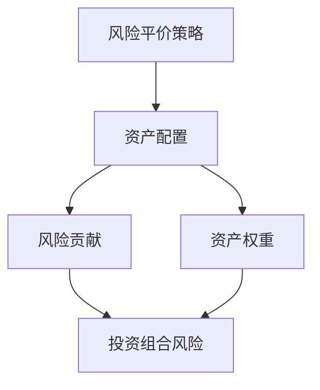
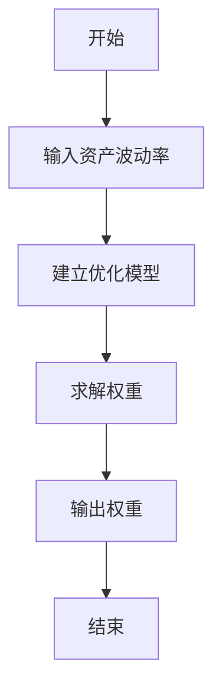
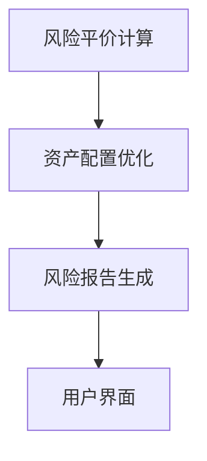
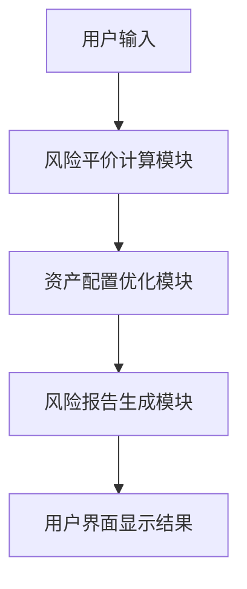

                 


# 威廉·伯恩斯坦的风险平价策略

> 关键词：风险平价、资产配置、投资策略、优化模型、威廉·伯恩斯坦、数学公式、系统架构

> 摘要：本文深入探讨了威廉·伯恩斯坦提出的“风险平价”策略，分析其在投资管理中的背景、核心概念、算法原理、数学模型、系统架构和项目实战。文章从风险平价的起源与发展入手，详细讲解其与传统投资策略的区别，分析其优化模型的数学推导和算法实现，并通过系统架构设计和实际案例展示其在投资管理中的应用。最后，本文总结了风险平价策略的最佳实践和注意事项，展望了未来的研究方向。

---

## 第1章: 风险平价策略的背景介绍

### 1.1 风险平价策略的起源与发展

#### 1.1.1 风险平价策略的起源
风险平价策略起源于投资学领域，旨在通过优化资产配置来平衡不同资产的风险贡献，从而实现投资组合的风险和收益的最优匹配。威廉·伯恩斯坦是这一领域的先驱之一，他提出的风险平价方法为现代投资组合管理提供了新的视角。

#### 1.1.2 风险平价策略的发展历程
从20世纪70年代至今，风险平价策略经历了从理论提出到实践应用的演变。随着计算技术的进步和金融市场的复杂化，风险平价策略逐渐成为机构投资者的重要工具。

#### 1.1.3 风险平价策略在投资管理中的地位
风险平价策略通过量化资产的风险贡献，帮助投资者在不同市场环境下调整资产配置，从而降低投资组合的整体风险，同时优化收益。

### 1.2 风险平价策略的核心概念

#### 1.2.1 风险平价的定义
风险平价是一种资产配置方法，旨在通过调整各资产的权重，使得每种资产对组合风险的贡献相等。这种配置方式通常能够提高组合的鲁棒性，降低尾部风险。

#### 1.2.2 风险平价与传统投资策略的区别
| 特性         | 风险平价策略              | 传统投资策略              |
|--------------|--------------------------|---------------------------|
| 目标         | 平衡各资产的风险贡献      | 追求单一资产的超额收益    |
| 方法         | 优化资产权重              | 基于历史表现或市场预测     |
| 风险管理     | 强调风险分散              | 更关注收益最大化           |

#### 1.2.3 风险平价策略的核心要素
- 风险贡献计算
- 资产权重优化
- 组合风险平衡

---

## 第2章: 风险平价策略的核心概念与联系

### 2.1 风险平价策略的原理

#### 2.1.1 风险贡献的定义
风险贡献是指某资产对投资组合整体风险的贡献程度，通常用标准差或波动率来衡量。

#### 2.1.2 风险平价的数学表达式
$$ \text{风险平价目标} = \argmin_{w} \sum_{i=1}^{n} w_i^2 \cdot \sigma_i^2 $$
其中，\( w_i \) 是资产 \( i \) 的权重，\( \sigma_i \) 是资产 \( i \) 的波动率。

#### 2.1.3 风险平价策略与资产配置的关系
风险平价通过优化权重，使得每种资产的风险贡献相等，从而实现资产间的均衡配置。

### 2.2 核心概念对比表格
表2.1展示了风险平价与传统投资策略的核心区别：

| 比较维度      | 风险平价策略              | 传统投资策略              |
|---------------|--------------------------|---------------------------|
| 配置目标      | 平衡风险贡献              | 追求超额收益               |
| 优化方法      | 凸优化模型                | 基于历史表现或市场预测     |
| 风险管理      | 强调风险分散              | 更关注收益最大化           |

### 2.3 ER实体关系图
图2.1展示了风险平价策略的核心要素及其关系：



---

## 第3章: 风险平价策略的算法原理

### 3.1 风险平价策略的优化模型

#### 3.1.1 凸优化模型的建立
风险平价策略可以转化为一个凸优化问题，目标是最小化组合风险，约束条件为各资产的风险贡献相等。

$$ \min_w \sum_{i=1}^{n} w_i^2 \cdot \sigma_i^2 $$
$$ \text{subject to} \quad \sum_{i=1}^{n} w_i = 1 $$

#### 3.1.2 风险平价的数学推导
通过拉格朗日乘数法，可以求解上述优化问题。设拉格朗日函数为：
$$ L(w, \lambda) = \sum_{i=1}^{n} w_i^2 \cdot \sigma_i^2 + \lambda \left(1 - \sum_{i=1}^{n} w_i\right) $$

对 \( w_i \) 求导并令导数为零，可以得到：
$$ 2 w_i \cdot \sigma_i^2 - \lambda = 0 $$
解得：
$$ w_i = \frac{\lambda}{2 \sigma_i^2} $$

#### 3.1.3 求解过程的详细说明
1. 确定各资产的波动率 \( \sigma_i \)。
2. 建立优化模型，目标是最小化组合风险，约束条件为权重之和为1。
3. 使用拉格朗日乘数法求解权重 \( w_i \)。
4. 根据求解结果调整各资产的权重。

### 3.2 算法流程图
图3.1展示了风险平价策略的算法流程：



### 3.3 Python代码实现
以下是风险平价策略的Python实现示例：

```python
import numpy as np

def risk_parity(weights, returns):
    covariance = returns.cov()
    risk_contribution = weights * np.sqrt(np.diag(weights.T @ covariance @ weights))
    return np.mean(risk_contribution)

def optimize_weights(returns):
    n = returns.shape[1]
    ones = np.ones(n)
    G = np.diagflat(ones)
    h = ones.T
    A = {'type': 'eq', 'fun': lambda x: np.sum(x) - 1}
    b = {}
    bounds = [(0, 1) for _ in range(n)]
    result = optimize.minimize(risk_parity, np.ones(n)/n, args=(returns,), 
                              method='SLSQP', bounds=bounds, constraints=A)
    return result.x
```

---

## 第4章: 风险平价策略的数学模型与公式

### 4.1 风险平价的数学表达式

#### 4.1.1 风险平价的数学公式
$$ \text{优化目标} = \argmin_w \sum_{i=1}^{n} w_i^2 \cdot \sigma_i^2 $$
$$ \text{约束条件} = \sum_{i=1}^{n} w_i = 1 $$

#### 4.1.2 优化算法的数学推导
通过拉格朗日乘数法，可以求解上述优化问题：
$$ L(w, \lambda) = \sum_{i=1}^{n} w_i^2 \cdot \sigma_i^2 + \lambda \left(1 - \sum_{i=1}^{n} w_i\right) $$

对 \( w_i \) 求导：
$$ \frac{\partial L}{\partial w_i} = 2 w_i \cdot \sigma_i^2 - \lambda = 0 $$

解得：
$$ w_i = \frac{\lambda}{2 \sigma_i^2} $$

### 4.2 举例说明

#### 4.2.1 简单两资产组合的风险平价计算
假设资产A和B的波动率分别为0.2和0.3，求风险平价权重。

解：
$$ w_A = \frac{\lambda}{2 \cdot 0.2^2} $$
$$ w_B = \frac{\lambda}{2 \cdot 0.3^2} $$

权重之和为1：
$$ \frac{\lambda}{0.08} + \frac{\lambda}{0.18} = 1 $$
解得：
$$ \lambda = 0.08 \times 0.18 / (0.18 + 0.08) = 0.0432 $$

因此：
$$ w_A = \frac{0.0432}{0.08} = 0.54 $$
$$ w_B = \frac{0.0432}{0.18} = 0.24 $$

---

## 第5章: 风险平价策略的系统分析与架构设计

### 5.1 系统功能设计

#### 5.1.1 系统功能模块
- 风险平价计算模块
- 资产配置优化模块
- 风险报告生成模块

### 5.2 系统架构设计

#### 5.2.1 系统架构图
图5.1展示了风险平价系统的架构：



### 5.3 系统接口设计

#### 5.3.1 输入接口
- 资产波动率矩阵
- 目标权重约束

#### 5.3.2 输出接口
- 优化后的资产权重
- 风险报告

### 5.4 系统交互流程图



---

## 第6章: 风险平价策略的项目实战

### 6.1 环境安装与配置

#### 6.1.1 Python环境的安装
安装Python和必要的库：
```bash
pip install numpy pandas scipy
```

#### 6.1.2 依赖库的安装
安装优化库：
```bash
pip install scikit-learn
```

### 6.2 系统核心实现

#### 6.2.1 Python代码实现
```python
import numpy as np
from sklearn.datasets import make_spd_matrix
import scipy.optimize as optimize

def risk_parity(weights, covariance):
    risk_contribution = weights * np.sqrt(np.diag(weights.T @ covariance @ weights))
    return np.mean(risk_contribution)

def optimize_weights(covariance):
    n = covariance.shape[0]
    ones = np.ones(n)
    G = np.diagflat(ones)
    h = ones.T
    A = {'type': 'eq', 'fun': lambda x: np.sum(x) - 1}
    bounds = [(0, 1) for _ in range(n)]
    result = optimize.minimize(risk_parity, np.ones(n)/n, args=(covariance,), 
                              method='SLSQP', bounds=bounds, constraints=A)
    return result.x

# 示例数据
n_assets = 3
covariance = make_spd_matrix(n_assets)
weights = optimize_weights(covariance)
print("优化后的权重:", weights)
```

### 6.3 项目案例分析

#### 6.3.1 数据获取与预处理
- 获取资产的历史收益率数据
- 计算资产的协方差矩阵

#### 6.3.2 风险平价策略实现
- 使用优化算法求解各资产的风险平价权重
- 输出优化结果

#### 6.3.3 结果分析
- 比较风险平价权重与等权重配置的差异
- 分析不同市场环境下的表现

---

## 第7章: 风险平价策略的最佳实践与小结

### 7.1 最佳实践 tips

#### 7.1.1 确保数据质量
- 使用高质量的资产收益和波动率数据
- 定期更新模型参数

#### 7.1.2 灵活调整
- 根据市场变化动态优化权重
- 考虑杠杆和对冲因素

### 7.2 注意事项

#### 7.2.1 算法的局限性
- 依赖于波动率假设
- 忽略了资产之间的非对称相关性

#### 7.2.2 实际应用中的挑战
- 数据不足问题
- 计算复杂性

### 7.3 拓展阅读

#### 7.3.1 推荐书籍
- 《投资组合的平方风险》
- 《现代投资组合理论与实证分析》

#### 7.3.2 推荐论文
- "Risk Parity and Its Implementation"

### 7.4 小结
威廉·伯恩斯坦的风险平价策略为投资组合管理提供了新的视角，通过优化资产权重，实现风险的均衡配置。本文详细分析了风险平价的背景、核心概念、算法原理、系统架构和项目实战，并给出了最佳实践和注意事项，为读者提供了全面的指导。

---

## 总结

本文系统地介绍了威廉·伯恩斯坦的风险平价策略，从理论到实践，从算法到系统，全面阐述了其在投资管理中的应用。希望读者能够通过本文深入了解风险平价策略的核心思想，并能够在实际投资中灵活运用这一策略，优化资产配置，降低投资风险。

