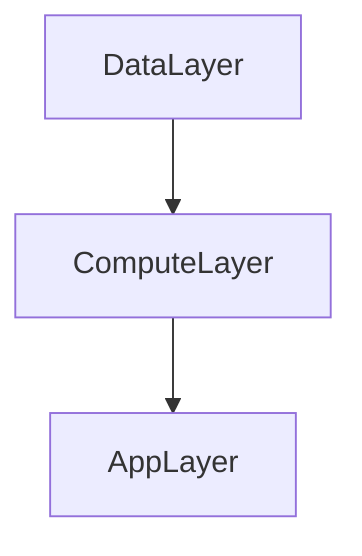

                 


# 威廉·伯恩斯坦的高效投资组合构建

## 关键词
- 投资组合构建
- 现代投资组合理论
- 优化算法
- 系统架构设计
- 项目实战

## 摘要
本文深入探讨了威廉·伯恩斯坦提出的高效投资组合构建方法，结合现代投资组合理论和实际应用场景，详细分析了构建过程中的关键算法、系统架构设计和项目实战案例。通过逐步分析，本文旨在帮助读者理解高效投资组合构建的核心原理和实现方法。

---

# 第1章: 投资组合构建概述

## 1.1 投资组合构建的基本概念

### 1.1.1 投资组合的定义与特征
投资组合是指将一定资金分配到多种不同资产上的策略，以实现风险分散和收益最大化。其主要特征包括多样性、风险分散性和收益稳定性。

### 1.1.2 投资组合构建的目标与意义
投资组合构建的目标是在满足特定风险承受能力的前提下，实现最大化的收益。其意义在于通过科学的配置策略，降低投资风险，提高收益稳定性。

### 1.1.3 投资组合构建的参与者与流程
参与者包括投资者、投资顾问、数据供应商和投资经理。流程包括目标设定、数据收集、资产配置、优化调整和绩效评估。

## 1.2 投资组合构建的历史发展

### 1.2.1 传统投资组合构建方法
传统方法主要依赖于经验判断和定性分析，存在主观性强、风险控制不足等问题。

### 1.2.2 现代投资组合理论的兴起
以马科维茨的均值-方差理论为基础，现代投资组合理论强调通过数学模型优化投资组合。

### 1.2.3 当代投资组合构建的演变
随着技术进步，投资组合构建逐渐融入量化分析、算法优化和大数据技术。

## 1.3 投资组合构建的核心要素

### 1.3.1 资产配置与风险分散
资产配置是构建投资组合的基础，通过分散投资降低非系统性风险。

### 1.3.2 投资目标与约束条件
投资目标包括收益最大化和风险最小化，约束条件包括资金规模、时间跨度和流动性需求。

### 1.3.3 市场环境与数据来源
市场环境影响投资组合的构建策略，数据来源包括历史价格、市场指数和宏观经济指标。

## 1.4 本章小结
本章介绍了投资组合构建的基本概念、历史发展和核心要素，为后续章节的分析奠定基础。

---

# 第2章: 现代投资组合理论基础

## 2.1 有效前沿与风险收益平衡

### 2.1.1 有效前沿的定义与特征
有效前沿是指在给定风险水平下，能够提供最高预期收益的投资组合的集合。

### 2.1.2 风险与收益的权衡关系
投资组合的收益与风险呈正相关，投资者需要在两者之间找到平衡点。

### 2.1.3 有效前沿的数学模型
$$ \text{收益} = \mu \cdot w + \sigma^2 \cdot w^T \cdot \Sigma \cdot w $$

## 2.2 资本资产定价模型（CAPM）

### 2.2.1 CAPM的基本假设与公式
CAPM假设市场是有效的，资产的预期收益由市场风险决定。

$$ E(r_i) = r_f + \beta_i (E(r_m) - r_f) $$

### 2.2.2 CAPM在投资组合构建中的应用
通过CAPM可以评估资产的预期收益，进而指导投资组合的配置。

### 2.2.3 CAPM的局限性与改进
CAPM假设存在一些缺陷，例如忽略了非系统性风险和交易成本。

## 2.3 多因素模型与投资组合构建

### 2.3.1 Fama-French三因子模型
三因子模型引入了市值和价值因子，扩展了CAPM的分析维度。

$$ E(r_i) = r_f + \beta_i (E(r_m) - r_f) + \beta_i (因子2) + \beta_i (因子3) $$

### 2.3.2 其他多因素模型简介
其他模型包括Fama和French的五因子模型，以及Momentum因子模型。

### 2.3.3 多因素模型在投资组合构建中的应用
多因素模型可以更准确地预测资产收益，优化投资组合配置。

## 2.4 本章小结
本章详细介绍了现代投资组合理论中的关键模型，为后续的优化算法和系统设计奠定了理论基础。

---

# 第3章: 投资组合构建的核心算法与数学模型

## 3.1 均值-方差优化算法

### 3.1.1 均值-方差优化的数学模型
目标是最小化投资组合的风险（方差），在给定收益下。

$$ \min_{w} \frac{1}{2} w^T \Sigma w $$
$$ \text{约束条件}：w^T \mu = \mu_{target}, w^T \mathbf{1} = 1 $$

### 3.1.2 算法实现步骤
1. 收集资产的历史数据，计算收益和协方差矩阵。
2. 构建优化模型，设定目标和约束。
3. 使用优化算法求解，得到最优权重。

### 3.1.3 算法的优缺点与适用场景
优点：优化效果显著，计算高效。
缺点：假设资产收益符合正态分布，实际可能不适用。

## 3.2 风险中性组合构建算法

### 3.2.1 风险中性组合的定义与目标
风险中性组合是指在相同风险水平下，收益最大化。

### 3.2.2 风险中性组合的构建方法
通过调整资产权重，使组合的风险与市场一致。

### 3.2.3 算法的数学推导与实现
$$ w = \frac{\Sigma^{-1} \mu}{\mu^T \Sigma^{-1} \mu} $$

## 3.3 资本资产定价模型与投资组合优化

### 3.3.1 基于CAPM的投资组合优化
使用CAPM模型预测资产收益，构建最优组合。

### 3.3.2 基于多因素模型的投资组合优化
结合多因素模型，优化组合的收益和风险。

### 3.3.3 数学模型与算法实现
使用二次规划算法求解优化问题，考虑多个因子的影响。

## 3.4 本章小结
本章详细讲解了投资组合构建中的核心算法，分析了它们的优缺点和适用场景。

---

# 第4章: 投资组合构建的系统分析与架构设计

## 4.1 投资组合构建系统的功能模块划分

### 4.1.1 数据采集与处理模块
负责收集和处理市场数据，包括价格、收益和宏观经济指标。

### 4.1.2 风险评估与分析模块
评估投资组合的风险，包括VaR和CVaR等指标。

### 4.1.3 组合优化与配置模块
根据优化算法，生成最优投资组合。

### 4.1.4 性能评估与反馈模块
评估投资组合的绩效，并提供反馈。

## 4.2 系统架构设计

### 4.2.1 分层架构设计
分为数据层、计算层和应用层，确保系统的高效运行。

### 4.2.2 模块间交互关系
使用mermaid图展示模块之间的交互关系。



### 4.2.3 系统架构的可扩展性与灵活性
通过模块化设计，确保系统易于扩展和维护。

## 4.3 系统接口设计

### 4.3.1 数据接口规范
定义数据格式和接口协议，确保数据的准确传输。

### 4.3.2 优化算法接口规范
定义算法输入和输出接口，确保算法模块的独立性。

### 4.3.3 用户交互界面设计
设计友好的用户界面，方便用户操作和结果查看。

## 4.4 本章小结
本章详细介绍了投资组合构建系统的功能模块划分、架构设计和接口设计。

---

# 第5章: 投资组合构建的项目实战

## 5.1 项目背景与目标

### 5.1.1 项目背景
选择一个具体的市场环境，例如股票和债券市场。

### 5.1.2 项目目标
构建一个高效的投资组合，实现风险控制和收益最大化。

## 5.2 项目环境与工具安装

### 5.2.1 环境配置
安装Python、NumPy、Pandas和优化库。

### 5.2.2 工具安装
安装PyPortfolioOpt等优化工具。

## 5.3 核心代码实现

### 5.3.1 数据处理
读取数据并进行清洗。

```python
import pandas as pd
data = pd.read_csv('data.csv')
data = data.dropna()
```

### 5.3.2 优化算法实现
使用均值-方差优化算法生成最优组合。

```python
from pyportfolioopt import mean_variance

mu = data.mean()
Sigma = data.cov()
w = mean_variance.optimize(mu, Sigma)
```

### 5.3.3 风险与收益分析
计算组合的风险和收益。

```python
expected_return = mu.dot(w)
risk = np.sqrt(w.T.dot(Sigma).dot(w))
```

## 5.4 项目小结

### 5.4.1 项目实现的关键点
详细讲解代码实现和优化算法的应用。

### 5.4.2 项目成果展示
展示优化后的投资组合及其收益和风险分析。

### 5.4.3 项目经验总结
总结项目中的经验教训，提出改进建议。

## 5.5 本章小结
本章通过一个具体项目展示了投资组合构建的实际应用，验证了理论的可行性。

---

# 第6章: 投资组合构建的总结与展望

## 6.1 最佳实践 tips

### 6.1.1 投资组合构建的关键注意事项
包括数据质量、模型选择和风险控制。

### 6.1.2 优化算法的应用建议
根据具体情况选择合适的优化算法。

## 6.2 小结
总结全文的核心内容，重申高效投资组合构建的重要性和实现方法。

## 6.3 注意事项
提醒读者在实际应用中注意数据偏差和模型假设的局限性。

## 6.4 拓展阅读
推荐相关书籍和文献，供读者深入学习。

---

# 附录

## 附录 A: 常用投资组合优化算法

### A.1 均值-方差优化
详细解释均值-方差优化的数学模型和实现步骤。

### A.2 风险中性组合构建
详细讲解风险中性组合的构建方法和应用场景。

## 附录 B: 优化算法的Python实现

### B.1 使用PyPortfolioOpt实现均值-方差优化
提供PyPortfolioOpt的代码示例和使用说明。

### B.2 使用其他优化工具实现组合优化
介绍其他优化工具，如CVXOPT的使用方法。

---

通过以上结构，本文系统地介绍了威廉·伯恩斯坦的高效投资组合构建方法，从理论到实践，为读者提供了全面的知识和实际操作指南。

