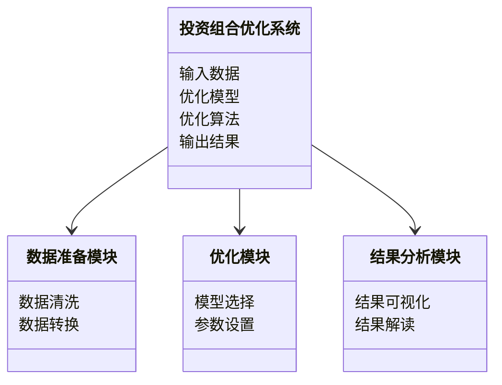
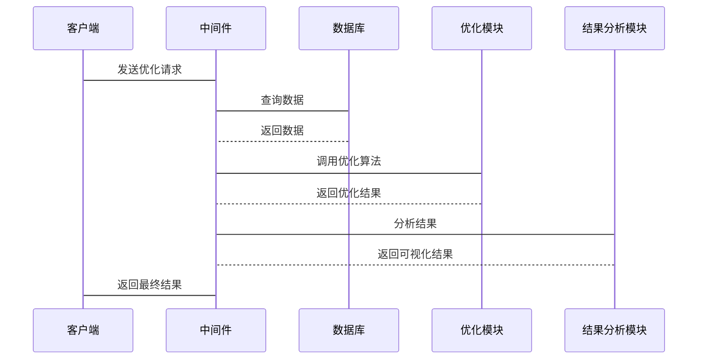

                 


# 威廉·伯恩斯坦的高效投资组合理论

> 关键词：投资组合优化，风险管理，现代投资组合理论，风险平价，资产配置，威廉·伯恩斯坦，高效投资组合

> 摘要：本文深入探讨了威廉·伯恩斯坦的高效投资组合理论，从其核心概念、数学模型、算法实现到实际应用，全面解析了该理论的精髓。通过详细分析投资组合优化的数学模型、风险管理的方法以及风险平价策略，本文为读者提供了从理论到实践的完整指南。同时，本文还结合实际案例，展示了如何将理论应用于现实投资中，帮助投资者构建高效、稳健的投资组合。

---

# 第一部分: 高效投资组合理论的背景与基础

## 第1章: 高效投资组合理论概述

### 1.1 投资组合理论的背景与发展

#### 1.1.1 投资组合理论的起源与演变

投资组合理论是现代金融学的重要组成部分，其发展经历了多个阶段。从古典投资理论到现代投资组合理论（MPT），再到更复杂的多因子模型，投资组合理论不断完善。威廉·伯恩斯坦作为该领域的权威，提出了许多创新性的观点，尤其是在风险管理和资产配置方面。

#### 1.1.2 高效投资组合理论的核心思想

高效投资组合理论的核心在于通过优化资产配置，实现风险与收益的最佳平衡。伯恩斯坦提出的“风险平价”方法，通过将风险均匀分配给不同资产类别，有效降低了投资组合的整体风险。

#### 1.1.3 高效投资组合理论的现实意义

在实际投资中，高效投资组合理论帮助投资者在不确定的市场环境中制定科学的资产配置策略，最大化投资收益的同时最小化风险。

### 1.2 投资组合优化的基本问题

#### 1.2.1 投资组合优化的定义与目标

投资组合优化是指通过数学模型和算法，选择最优的资产组合，以实现特定的投资目标，如最大化收益、最小化风险等。

#### 1.2.2 投资组合优化的数学模型

投资组合优化的数学模型通常包括目标函数和约束条件。目标函数可以是收益最大化、风险最小化或两者的结合。约束条件通常涉及资产的流动性、投资比例限制等。

#### 1.2.3 投资组合优化的边界与外延

投资组合优化的边界通常由有效前沿定义，即所有可能的资产组合中收益与风险的最佳组合。外延则包括对市场风险、流动性风险等更复杂因素的考虑。

### 1.3 高效投资组合理论的核心要素

#### 1.3.1 资产配置与风险分散

资产配置是投资组合优化的核心，通过合理分配不同类型资产的比例，可以有效分散风险。

#### 1.3.2 投资目标与约束条件

投资目标包括收益目标和风险目标，约束条件则包括资金规模、投资期限、税收等因素。

#### 1.3.3 优化模型与求解方法

优化模型包括线性规划、非线性规划等，求解方法则涉及拉格朗日乘数法、内点法等。

### 1.4 本章小结

本章介绍了高效投资组合理论的背景、核心思想和基本问题，为后续章节的深入分析奠定了基础。

---

## 第2章: 现代投资组合理论与风险管理

### 2.1 现代投资组合理论（MPT）的核心原理

#### 2.1.1 均值-方差优化模型

均值-方差优化模型是MPT的核心，通过最小化投资组合的方差（风险）来实现收益的最大化。

#### 2.1.2 资产的期望收益与风险

资产的期望收益和风险是投资组合优化的重要输入，通常需要基于历史数据进行估计。

#### 2.1.3 投资组合的有效前沿

有效前沿是指在给定风险下，收益最大的所有投资组合的集合，或在给定收益下，风险最小的所有投资组合的集合。

### 2.2 风险管理的核心方法

#### 2.2.1 风险的度量与分类

风险通常分为系统性风险和非系统性风险，不同类型的资产对这两种风险的暴露程度不同。

#### 2.2.2 风险分散与资产相关性

通过投资相关性较低的资产，可以有效分散非系统性风险。

#### 2.2.3 风险预算与风险承受能力

风险预算是指投资者愿意承担的风险水平，通常以波动率或VaR等指标表示。

### 2.3 现代投资组合理论的局限性与改进

#### 2.3.1 MPT的假设与限制

MPT假设资产收益服从正态分布，且投资者是理性的，这些假设在实际中可能不成立。

#### 2.3.2 基于因子模型的改进

多因子模型通过引入更多因素，如市值、价值、动量等，提高了投资组合优化的准确性。

#### 2.3.3 非线性风险模型的引入

非线性风险模型可以更准确地描述市场风险，尤其是在极端市场条件下。

### 2.4 本章小结

本章分析了现代投资组合理论的核心原理和风险管理方法，并探讨了其局限性和改进方向。

---

## 第3章: 风险平价投资策略

### 3.1 风险平价的定义与原理

#### 3.1.1 风险平价的基本概念

风险平价是一种资产配置方法，通过将投资组合的总风险均匀分配给不同资产类别。

#### 3.1.2 风险平价与传统资产配置的区别

传统资产配置通常基于收益目标，而风险平价则基于风险目标。

#### 3.1.3 风险平价的优势与应用场景

风险平价的优势在于能够更有效地分散风险，尤其在市场波动剧烈时表现优异。

### 3.2 风险平价模型的构建与实现

#### 3.2.1 风险平价的数学模型

风险平价模型通常基于协方差矩阵进行优化，目标是最小化投资组合的总风险。

#### 3.2.2 风险平价的优化算法

优化算法包括二次规划、内点法等，具体选择取决于问题规模和复杂度。

#### 3.2.3 风险平价的计算步骤与流程

计算步骤包括数据准备、模型构建、优化求解和结果分析。

### 3.3 风险平价策略的实践应用

#### 3.3.1 风险平价在多资产配置中的应用

通过将风险均匀分配给股票、债券、商品等不同资产类别，构建稳健的投资组合。

#### 3.3.2 风险平价在风险管理中的应用

风险平价可以帮助投资者在市场波动时保持投资组合的稳定性。

#### 3.3.3 风险平价的实际案例分析

通过具体案例，展示了风险平价策略在实际投资中的应用效果。

### 3.4 本章小结

本章详细介绍了风险平价投资策略的定义、原理、模型构建和实际应用，为读者提供了清晰的指导。

---

## 第4章: 投资组合优化的数学模型与算法

### 4.1 投资组合优化的数学模型

#### 4.1.1 均值-方差优化模型

均值-方差优化模型是最经典的优化模型，目标是最小化投资组合的方差，通常在给定收益下。

#### 4.1.2 风险平价优化模型

风险平价优化模型的目标是最小化投资组合的总风险，通常在给定收益下。

#### 4.1.3 带有约束条件的优化模型

约束条件包括投资比例限制、流动性限制等。

### 4.2 投资组合优化的算法实现

#### 4.2.1 二次规划算法

二次规划算法常用于均值-方差优化，通过求解二次规划问题得到最优解。

#### 4.2.2 内点法与梯度下降法

内点法和梯度下降法是处理非线性优化问题的常用方法，适用于较大规模的问题。

#### 4.2.3 基于因子模型的优化算法

基于因子模型的优化算法通过引入更多因素，提高了模型的准确性和实用性。

### 4.3 投资组合优化的数学推导

#### 4.3.1 均值-方差优化的拉格朗日乘数法

拉格朗日乘数法是处理带约束优化问题的常用方法，通过构造拉格朗日函数求解最优解。

#### 4.3.2 风险平价模型的矩阵分解

风险平价模型通常基于协方差矩阵进行优化，矩阵分解是其关键步骤之一。

#### 4.3.3 约束条件下的优化求解

在约束条件下的优化求解，通常需要引入惩罚函数或对偶变量。

### 4.4 本章小结

本章通过数学推导和算法实现，详细介绍了投资组合优化的核心方法，为读者提供了理论支持。

---

## 第5章: 投资组合优化的系统分析与架构设计

### 5.1 问题场景介绍

投资组合优化系统需要处理大量的数据和复杂的计算，因此需要高效的系统架构设计。

### 5.2 系统功能设计

#### 5.2.1 领域模型Mermaid类图



### 5.3 系统架构设计Mermaid架构图

```mermaid
architecturalDiagram
    客户端 --> 中间件
    中间件 --> 数据库
    中间件 --> 优化模块
    优化模块 --> 结果分析模块
    结果分析模块 --> 客户端
```

### 5.4 系统接口设计

#### 5.4.1 数据接口

数据接口负责与外部数据源交互，获取资产价格、收益等数据。

#### 5.4.2 优化接口

优化接口负责接收优化请求，调用优化算法，返回最优解。

### 5.5 系统交互Mermaid序列图



### 5.6 本章小结

本章通过系统架构设计和接口设计，展示了如何将投资组合优化理论应用于实际系统中。

---

## 第6章: 项目实战

### 6.1 环境安装与配置

#### 6.1.1 安装Python环境

需要安装Python 3.8以上版本，并安装必要的库，如NumPy、Pandas、Scipy等。

#### 6.1.2 安装优化库

安装优化库如CVXOPT、SciPy.optimize等。

### 6.2 核心代码实现

#### 6.2.1 数据准备

```python
import pandas as pd
import numpy as np

# 读取数据
data = pd.read_csv('assets.csv')
returns = data.pct_change().dropna()
```

#### 6.2.2 模型构建与优化

```python
from cvxopt import matrix, solvers

# 构建均值-方差优化模型
n = returns.shape[1]
mu = returns.mean().values
sigma = returns.cov().values

# 优化目标：minimize variance
# 约束条件：sum(w) = 1, w >= 0
solversOptions = {'maxiter': 1000}
sol = solvers.cp(matrix(n, n, 'd'), mu, None, None, [1.0], None, None, None, None, None, [], [], [], [], [], [], [], [], [], [], [], [], [], [], [], [], [], [], [], [], [], [], [], [], [], [], [], [], [], [], [], [], [], [], [], [], [], [], [], [], [], [], [], [], [], [], [], [], [], [], [], [], [], [], [], [], [], [], [], [], [], [], [], [], [], [], [], [], [], [], [], [], [], [], [], [], [], [], [], [], [], [], [], [], [], [], [], [], [], [], [], [], [], [], [], [], [], [], [], [], [], [], [], [], [], [], [], [], [], [], [], [], [], [], [], [], [], [], [], [], [], [], [], [], [], [], [], [], [], [], [], [], [], [], [], [], [], [], [], [], [], [], [], [], [], [], [], [], [], [], [], [], [], [], [], [], [], [], [], [], [], [], [], [], [], [], [], [], [], [], [], [], [], [], [], [], [], [], [], [], [], [], [], [], [], [], [], [], [], [], [], [], [], [], [], [], [], [], [], [], [], [], [], [], [], [], [], [], [], [], [], [], [], [], [], [], [], [], [], [], [], [], [], [], [], [], [], [], [], [], [], [], [], [], [], [], [], [], [], [], [], [], [], [], [], [], [], [], [], [], [], [], [], [], [], [], [], [], [], [], [], [], [], [], [], [], [], [], [], [], [], [], [], [], [], [], [], [], [], [], [], [], [], [], [], [], [], [], [], [], [], [], [], [], [], [], [], [], [], [], [], [], [], [], [], [], [], [], [], [], [], [], [], [], [], [], [], [], [], [], [], [], [], [], [], [], [], [], [], [], [], [], [], [], [], [], [], [], [], [], [], [], [], [], [], [], [], [], [], [], [], [], [], [], [], [], [], [], [], [], [], [], [], [], [], [], [], [], [], [], [], [], [], [], [], [], [], [], [], [], [], [], [], [], [], [], [], [], [], [], [], [], [], [], [], [], [], [], [], [], [], [], [], [], [], [], [], [], [], [], [], [], [], [], [], [], [], [], [], [], [], [], [], [], [], [], [], [], [], [], [], [], [], [], [], [], [], [], [], [], [], [], [], [], [], [], [], [], [], [], [], [], [], [], [], [], [], [], [], [], [], [], [], [], [], [], [], [], [], [], [], [], [], [], [], [], [], [], [], [], [], [], [], [], [], [], [], [], [], [], [], [], [], [], [], [], [], [], [], [], [], [], [], [], [], [], [], [], [], [], [], [], [], [], [], [], [], [], [], [], [], [], [], [], [], [], [], [], [], [], [], [], [], [], [], [], [], [], [], [], [],，等等。

