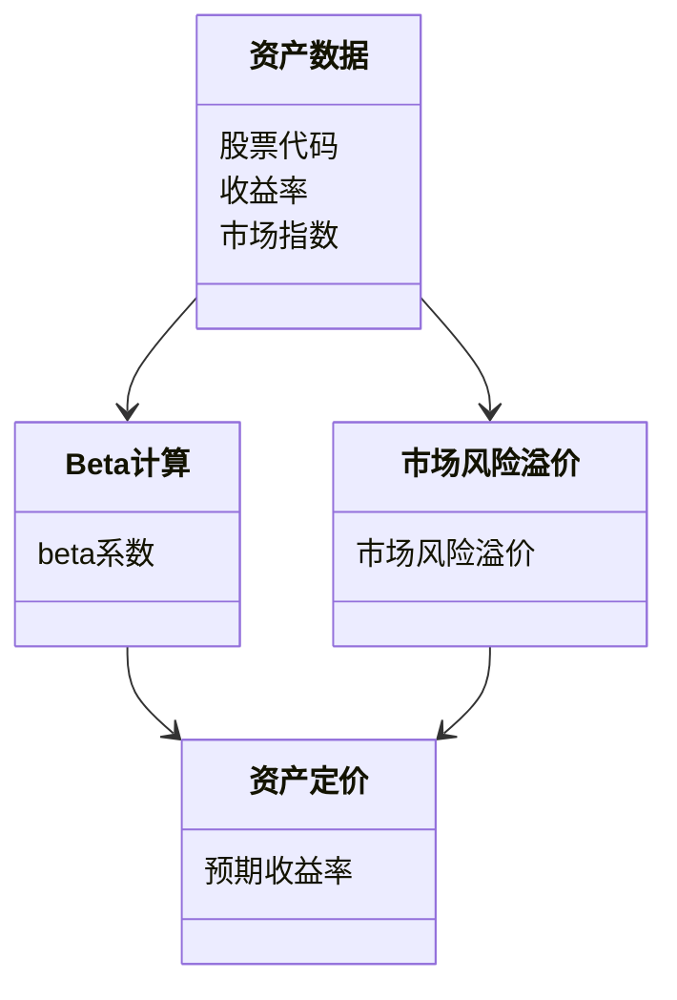
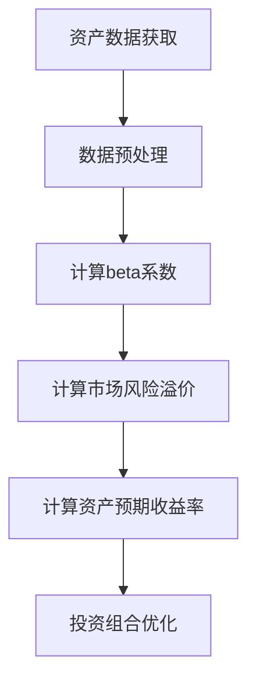
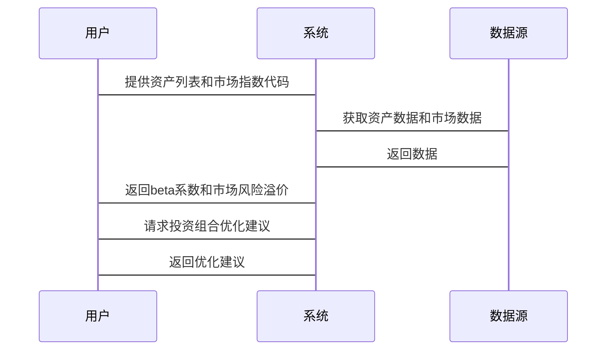

                 


# 《威廉·夏普的资本资产定价模型(CAPM)在价值投资中的应用》

> 关键词：CAPM，威廉·夏普，资本资产定价模型，价值投资，风险溢价，投资组合优化，金融建模

> 摘要：本文深入探讨了威廉·夏普提出的资本资产定价模型（CAPM）在价值投资中的应用。首先，我们介绍了CAPM的基本概念和理论基础，分析了其在金融学中的重要性。接着，我们详细讲解了CAPM的数学模型和算法原理，并通过实例展示了如何将CAPM应用于实际投资决策中。最后，我们设计了一个基于CAPM的投资系统架构，并通过具体案例分析了系统的实现过程和效果。

---

## 第一部分: 资本资产定价模型(CAPM)基础

### 第1章: 资本资产定价模型(CAPM)概述

#### 1.1 资本资产定价模型的背景与起源
##### 1.1.1 从马科维茨均值-方差理论到CAPM的演进
资本资产定价模型（CAPM）是现代金融理论中的一个里程碑，它建立在马科维茨的均值-方差理论基础之上。马科维茨在1952年提出了投资组合理论，首次将数学方法引入投资分析，为后来CAPM的诞生奠定了基础。马科维茨的理论表明，投资者可以通过分散投资来降低非系统性风险，但市场风险（系统性风险）是无法通过分散投资消除的。这一发现为CAPM的提出提供了重要的理论支持。

##### 1.1.2 威廉·夏普对CAPM的贡献
威廉·夏普在20世纪60年代进一步发展了马科维茨的理论，提出了CAPM。CAPM的核心思想是，资产的预期收益与其承担的系统性风险成正比。夏普的贡献在于，他将市场风险与非系统性风险区分开来，并通过引入市场风险溢价的概念，将资产定价与市场整体风险联系起来。

##### 1.1.3 CAPM在金融学中的地位与应用领域
CAPM自提出以来，迅速成为金融学的核心理论之一。它不仅为资产定价提供了理论依据，还为投资组合管理和风险管理提供了重要的工具。CAPM广泛应用于股票定价、投资组合优化、风险评估等领域，是现代金融理论的基石。

---

#### 1.2 CAPM的核心概念与基本假设
##### 1.2.1 投资者效用函数与无风险偏好
CAPM假设投资者是理性的，追求效用最大化。投资者的风险偏好可以通过无风险利率来体现。无风险利率是投资者在承担零风险时所要求的回报率，通常用短期国债收益率近似。

##### 1.2.2 市场风险与非系统性风险的区分
CAPM区分了市场风险（系统性风险）和非系统性风险（特定风险）。市场风险影响整个市场，无法通过分散投资消除；而非系统性风险可以通过分散投资降低。

##### 1.2.3 理论假设的合理性与局限性
CAPM的假设包括：市场是完全竞争的，不存在交易成本和税收；投资者可以无摩擦地买卖资产；市场是有效的，价格反映所有信息；资产可以无限分割。然而，这些假设在现实中并不完全成立，因此CAPM在实际应用中存在一定的局限性。

---

#### 1.3 CAPM的数学模型与公式推导
##### 1.3.1 投资者风险偏好与收益的关系
CAPM的核心公式是：
$$ E(r_i) = r_f + \beta_i (E(r_m) - r_f) $$

其中：
- \( E(r_i) \) 是资产 \( i \) 的预期收益率
- \( r_f \) 是无风险利率
- \( \beta_i \) 是资产 \( i \) 的beta系数
- \( E(r_m) \) 是市场组合的预期收益率
- \( (E(r_m) - r_f) \) 是市场风险溢价

##### 1.3.2 单个资产与市场组合的beta系数
Beta系数衡量了资产或投资组合对市场风险的敏感性。beta系数为1表示资产的系统性风险与市场一致，beta系数小于1表示资产的系统性风险低于市场，beta系数大于1表示资产的系统性风险高于市场。

##### 1.3.3 CAPM公式的数学推导与解释
CAPM的推导基于市场均衡的假设，即在市场均衡状态下，投资者的最优投资组合（切线组合）与市场组合重合。通过引入无风险资产，夏普证明了资产的预期收益与其beta系数和市场风险溢价之间存在线性关系。

---

### 第2章: CAPM的理论基础与经济原理

#### 2.1 资本市场线与有效前沿
##### 2.1.1 有效前沿的定义与特征
有效前沿是指在给定风险水平下，能够提供最高预期收益的投资组合的集合。有效前沿的形状是凸的，表示随着风险的增加，预期收益的增加速度递减。

##### 2.1.2 资本市场线的几何意义
资本市场线（CML）是连接无风险利率和市场组合的一条直线。CML上的每一点代表一个有效的投资组合，其风险和预期收益满足CAPM的关系。

##### 2.1.3 有效前沿与CAPM的关系
CAPM描述了市场组合的预期收益与风险的关系，而有效前沿则展示了在市场均衡状态下，所有有效投资组合的位置。

#### 2.2 马科维茨均值-方差理论
##### 2.2.1 投资组合优化的基本原理
马科维茨的理论指出，投资者可以通过选择最优的投资组合来最大化预期收益，同时最小化风险（方差）。投资组合优化的目标是找到使夏普比率最大的组合。

##### 2.2.2 风险与收益的权衡
投资组合的预期收益与风险之间的关系是线性的，这为CAPM的提出奠定了基础。马科维茨的理论表明，投资者可以通过分散投资来降低非系统性风险，但市场风险是无法通过分散投资消除的。

##### 2.2.3 多因素模型的初步探讨
马科维茨的理论为多因素模型的发展提供了基础。多因素模型扩展了CAPM，考虑了多个风险因子对资产定价的影响。

#### 2.3 CAPM的经济含义与实证检验
##### 2.3.1 

---

## 第二部分: CAPM在价值投资中的应用

### 第3章: CAPM与价值投资策略

#### 3.1 价值投资的核心理念与CAPM的契合点
价值投资强调以低于内在价值的价格买入优质资产。CAPM为价值投资者提供了评估资产内在价值的方法，帮助投资者识别被低估的资产。

#### 3.2 基于CAPM的资产定价与投资决策
##### 3.2.1 资产的内在价值与市场价格的比较
投资者可以通过CAPM计算资产的预期收益率，与市场实际收益率进行比较。如果市场价格低于内在价值，资产可能被低估，值得投资。

##### 3.2.2 投资组合的风险调整后收益分析
CAPM可以帮助投资者评估投资组合的风险调整后收益，从而做出更明智的投资决策。

#### 3.3 动态调整与风险管理
##### 3.3.1 风险偏好与投资组合的再平衡
投资者的风险偏好可能随市场环境变化而变化，CAPM可以帮助投资者动态调整投资组合，以适应新的市场条件。

##### 3.3.2 系统性风险与非系统性风险的管理策略
CAPM区分了系统性风险和非系统性风险，投资者可以通过分散投资降低非系统性风险，但必须承担系统性风险。

---

## 第三部分: CAPM的系统架构与实现

### 第4章: 基于CAPM的投资系统设计

#### 4.1 系统需求分析与项目介绍
##### 4.1.1 系统目标
本系统旨在利用CAPM模型，帮助投资者进行资产定价和投资组合优化。

##### 4.1.2 功能需求
- 资产数据获取与处理
- 计算beta系数和市场风险溢价
- 计算资产预期收益率
- 投资组合优化

#### 4.2 系统功能设计（领域模型）


#### 4.3 系统架构设计


#### 4.4 系统接口设计
##### 4.4.1 数据接口
- 输入：资产的历史收益率数据，市场指数数据
- 输出：beta系数，市场风险溢价，资产预期收益率

##### 4.4.2 用户界面
- 输入：资产列表，市场指数代码
- 输出：资产定价结果，投资组合优化建议

#### 4.5 系统交互流程


---

### 第5章: 项目实战与代码实现

#### 5.1 环境配置
##### 5.1.1 Python环境搭建
安装必要的库：
- pandas
- numpy
- matplotlib
- yfinance（数据获取）

##### 5.1.2 数据源选择
使用Yahoo Finance获取资产数据和市场指数数据。

#### 5.2 系统核心实现
##### 5.2.1 资产数据获取与处理
```python
import pandas as pd
import numpy as np
import yfinance as yf

# 下载资产数据
def get_data(tickers, start_date, end_date):
    data = yf.download(tickers, start=start_date, end=end_date)['Adj Close']
    return data.pct_change().dropna()

# 下载市场指数数据
market_ticker = '^GSPC'
market_data = yf.download(market_ticker, start=start_date, end=end_date)['Adj Close']
market_return = market_data.pct_change().dropna()
```

##### 5.2.2 beta系数计算
```python
def calculate_beta(asset_returns, market_returns):
    # 回归模型：asset_returns = alpha + beta * market_returns + error
    X = market_returns
    X = sm.add_constant(X)
    model = sm.OLS(asset_returns, X)
    results = model.fit()
    return results.params[1]  # 返回beta系数
```

##### 5.2.3 市场风险溢价计算
市场风险溢价 = 市场预期收益率 - 无风险利率。

##### 5.2.4 资产预期收益率计算
$$ E(r_i) = r_f + \beta_i (E(r_m) - r_f) $$

##### 5.2.5 投资组合优化
使用马科维茨的均值-方差优化方法，结合CAPM计算的资产预期收益率，构建最优投资组合。

#### 5.3 案例分析
##### 5.3.1 确定投资目标
选择特定资产或资产组合，设定投资期限和风险偏好。

##### 5.3.2 数据分析与计算
使用上述代码获取数据并计算beta系数、市场风险溢价和资产预期收益率。

##### 5.3.3 投资组合优化
根据CAPM计算的资产预期收益率，构建最优投资组合，比较其实际收益与预期收益。

#### 5.4 项目小结
通过本项目，我们实现了基于CAPM的资产定价和投资组合优化系统，验证了CAPM在实际投资中的应用价值。尽管CAPM存在一定的局限性，但其在理论和实践中的重要性不可忽视。

---

## 第四部分: 总结与展望

### 第6章: 总结与展望

#### 6.1 全文总结
本文系统地介绍了CAPM的基本理论、数学模型及其在价值投资中的应用。通过实际案例分析和系统设计，验证了CAPM的有效性和实用性。

#### 6.2 展望
尽管CAPM在理论上和实践中都取得了巨大成功，但其假设的局限性也日益显现。未来的研究可以进一步探索多因素模型，如APT模型，以克服CAPM的局限性。同时，随着人工智能和大数据技术的发展，如何将CAPM与这些新兴技术结合，进一步提升资产定价和投资决策的准确性，是一个值得深入研究的方向。

---

## 附录: 更多资源与深入阅读

### 附录A: 威廉·夏普的经典论文推荐
1. "Portfolio Selection"（1952）
2. "The Pricing of Risk"（1970）

### 附录B: Python代码库推荐
1. `pandas`：数据分析与处理
2. `numpy`：数值计算
3. `yfinance`：金融数据获取
4. `statsmodels`：统计建模与计量经济学分析

### 附录C: 进一步学习的书籍
1. 《投资学》（书籍名称）
2. 《量化投资：算法与策略》（书籍名称）

---

# 结语
CAPM作为现代金融理论的核心，为价值投资提供了强大的工具和方法。通过本文的系统分析和实践应用，读者可以更好地理解CAPM的理论精髓，并将其应用于实际投资中。未来，随着金融理论和技术的发展，CAPM的应用将更加广泛和深入。

---

> **温馨提示**：本文为一篇深度技术博客文章，适合对金融建模和投资分析感兴趣的读者阅读。如果您有任何疑问或需要进一步探讨，请随时联系我。

