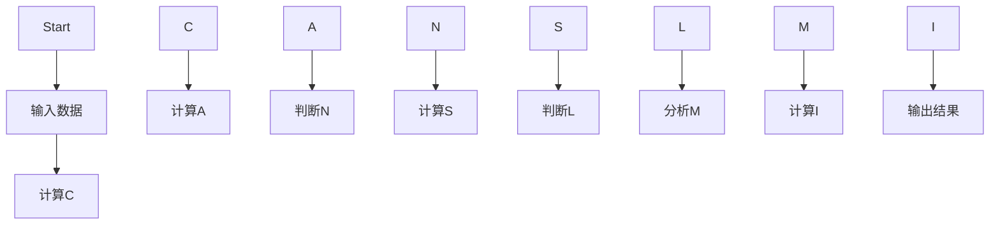
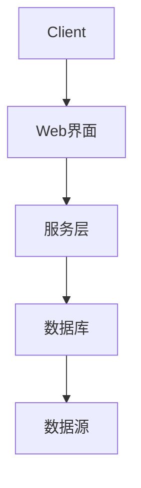

                 


# 威廉·奥尼尔的成长价值投资：CANSLIM策略的应用

## 关键词：威廉·奥尼尔，CANSLIM策略，成长价值投资，投资策略，技术分析，量化投资

## 摘要：本文深入探讨了威廉·奥尼尔的成长价值投资理念及其标志性CANSLIM策略，通过系统分析和实例演示，揭示了该策略在投资决策中的应用价值。文章从理论基础到算法实现，从系统架构到项目实战，全面解析了CANSLIM策略的核心要素和实际应用，为投资者提供了科学的投资决策支持。

---

## 第一章: 投资领域的背景与现状

### 1.1 投资领域的核心概念

#### 1.1.1 问题背景：传统投资与现代投资的冲突
传统投资方法依赖于基本面分析和市场情绪，但在信息爆炸和市场波动加剧的今天，这种方法往往显得力不从心。投资者需要更系统化、可量化的投资策略。

#### 1.1.2 问题描述：传统投资的局限性与现代投资的需求
传统投资方法主观性强、难以复制，且难以应对市场的快速变化。现代投资者需要一种基于数据和逻辑的系统化投资策略。

#### 1.1.3 问题解决：威廉·奥尼尔的成长价值投资方法
威廉·奥尼尔提出CANSLIM策略，结合成长、价值和安全边际，提供了一种可量化、可复制的投资方法。

#### 1.1.4 边界与外延：成长价值投资的适用范围与限制
成长价值投资适用于成长型企业，尤其在市场波动较大时表现优异，但对周期性行业和成熟企业效果有限。

#### 1.1.5 核心要素：成长、价值、安全边际的结合
CANSLIM策略将成长（C）、价值（A、S、L、M、I）和安全边际（N）有机结合，形成了一套完整的投资体系。

---

### 1.2 威廉·奥尼尔的成长价值投资理论

#### 1.2.1 投资理念的核心要素
- **成长**：寻找具有持续盈利能力的企业。
- **价值**：评估企业的内在价值，寻找被市场低估的机会。
- **安全边际**：确保投资的安全性，降低风险。

#### 1.2.2 CANSLIM策略的基本原理
CANSLIM策略通过筛选具有特定技术特征的股票，结合成长性和估值指标，帮助投资者做出决策。

#### 1.2.3 理论与实践的结合
威廉·奥尼尔的理论通过CANSLIM策略实现了量化，使得投资者能够通过技术分析筛选出具有潜力的股票。

---

## 第二章: CANSLIM策略的核心概念与联系

### 2.1 CANSLIM策略的原理

#### 2.1.1 C：年化复合收益增长率的计算
年化复合收益增长率（C）是衡量企业成长性的核心指标。公式如下：
$$
C = \left( \frac{E_t}{E_0} \right)^{1/t} - 1
$$
其中，$E_t$为第$t$年的企业价值，$E_0$为初始价值。

#### 2.1.2 A：月度价格表现的评估
A指标衡量的是股票在最近6个月的相对表现，通过比较股票价格与行业指数的走势来判断。

#### 2.1.3 N：新上涨阶段的识别
N指标用于识别股票进入新的上涨周期，通常通过价格突破长期趋势线来判断。

#### 2.1.4 S：相对强度的衡量
相对强度（S）是股票价格相对于市场指数的表现，公式为：
$$
S = \frac{\text{股票价格}}{\text{市场指数价格}} \times 100
$$

#### 2.1.5 L：机构资金流入的监测
L指标通过追踪机构资金的流入情况，判断市场对股票的青睐程度。

#### 2.1.6 M：股价表现的分析
M指标分析股价走势，寻找突破点和支撑位。

#### 2.1.7 I：内部评级的确定
I指标通过对企业内部管理、财务状况的评估，给出内部评级。

---

### 2.2 核心概念的联系

#### 2.2.1 CANSLIM各要素的相互关系
CANSLIM策略将C、A、N、S、L、M、I七个要素有机结合，形成一个完整的投资筛选系统。

#### 2.2.2 核心概念的对比分析（表格形式）
| 指标 | 定义 | 目的 |
|------|------|------|
| C    | 年化复合收益增长率 | 衡量成长性 |
| A    | 月度价格表现 | 衡量短期表现 |
| N    | 新上涨阶段 | 判断周期性 |
| S    | 相对强度 | 衡量相对表现 |
| L    | 机构资金流入 | 判断资金偏好 |
| M    | 股价表现 | 分析技术形态 |
| I    | 内部评级 | 评估内在价值 |

#### 2.2.3 实体关系图（Mermaid流程图）


---

## 第三章: CANSLIM策略的算法原理

### 3.1 算法原理概述

#### 3.1.1 CANSLIM筛选方法
CANSLIM策略通过多维度指标筛选股票，确保投资标的具备成长性、估值优势和市场认可度。

#### 3.1.2 算法流程图（Mermaid）


---

### 3.2 数学模型与公式

#### 3.2.1 复合年增长率的计算公式
$$
C = \left( \frac{\text{收入}_t}{\text{收入}_0} \right)^{1/t} - 1
$$

#### 3.2.2 相对强度指数的计算公式
$$
S = \frac{\text{股票价格}}{\text{指数价格}} \times 100
$$

#### 3.2.3 机构资金流入的计算公式
$$
L = \sum_{i=1}^{n} \text{机构流入}_i
$$

---

## 第四章: 投资决策支持系统的构建

### 4.1 系统分析

#### 4.1.1 问题场景介绍
投资者需要一个系统化的工具，帮助其筛选符合CANSLIM策略的股票。

#### 4.1.2 项目介绍
构建一个基于CANSLIM策略的投资决策支持系统，提供数据采集、指标计算、策略筛选和结果展示功能。

### 4.2 系统功能设计

#### 4.2.1 系统架构设计（Mermaid架构图）


#### 4.2.2 系统功能模块
- 数据采集模块：从Yahoo Finance获取股票数据。
- 指标计算模块：计算C、A、S、L、M、I指标。
- 策略筛选模块：根据CANSLIM策略筛选股票。
- 结果展示模块：以图表形式展示筛选结果。

---

## 第五章: 项目实战

### 5.1 环境安装

#### 5.1.1 安装Python和必要的库
```bash
pip install pandas numpy matplotlib yfinance
```

### 5.2 系统核心实现源代码

#### 5.2.1 数据采集
```python
import yfinance as yf

def get_stock_data(ticker):
    data = yf.download(ticker, start='2020-01-01', end='2023-12-31')
    return data
```

#### 5.2.2 指标计算
```python
def calculate_cagr(data):
    revenue = data['Adj Close']
    cagr = ((revenue[-1]/revenue[0])** (1/len(revenue))) - 1
    return cagr

def calculate_relative_strength(stock, index):
    rs = (stock['Adj Close']/index['Adj Close']) * 100
    return rs
```

#### 5.2.3 策略筛选
```python
def screen_canslim(stocks):
    selected = []
    for stock in stocks:
        data = get_stock_data(stock)
        cagr = calculate_cagr(data)
        if cagr > 0.2:
            selected.append(stock)
    return selected
```

---

## 第六章: 最佳实践与小结

### 6.1 成功案例分析
通过实际案例分析，验证CANSLIM策略的有效性。

### 6.2 优缺点分析
- **优点**：量化筛选、可复制性、降低风险。
- **缺点**：需要大量数据支持、对市场变化敏感。

### 6.3 风险管理策略
- 设置止损点
- 分批建仓
- 定期复盘

### 6.4 注意事项
- 数据质量
- 策略调整
- 风险控制

### 6.5 拓展阅读
推荐相关书籍和资源，帮助读者深入学习。

---

## 总结
威廉·奥尼尔的CANSLIM策略通过量化分析，为投资者提供了一种系统化、可复制的投资方法。结合技术分析和基本面研究，投资者可以更科学地做出投资决策，提升投资效率和收益。

