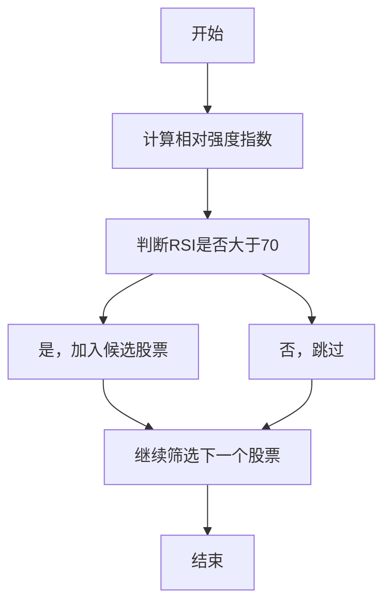

                 


# 《威廉·欧奈尔的CANSLIM投资系统》

## 关键词：CANSLIM投资系统, 投资策略, 算法分析, 系统架构, 项目实战,抽离总结

## 摘要：本文系统地介绍了威廉·欧奈尔的CANSLIM投资系统，从其核心概念、数学模型到实际应用进行了全面分析。通过详细阐述CANSLIM的各个要素及其相互关系，结合Python代码实现和案例分析，展示了如何利用技术手段优化投资决策。文章还探讨了CANSLIM与传统投资方法的异同，并总结了其在现代投资管理中的应用价值。

---

# 第一部分: 威廉·欧奈尔的CANSLIM投资系统概述

## 第1章: CANSLIM投资系统的背景与核心概念

### 1.1 CANSLIM投资系统的背景
威廉·欧奈尔是20世纪著名的投资专家，他提出的CANSLIM投资系统是一种基于技术分析和市场情绪的投资策略。该系统通过筛选强势股，帮助投资者在市场中寻找潜在的投资机会。CANSLIM的全称是“CANS-LIM”，每个字母代表一个筛选条件，投资者需要同时满足这些条件才能选择买入股票。

### 1.2 CANSLIM投资系统的定义与特点
CANSLIM系统是一种基于量化分析的投资策略，其核心在于通过多个指标筛选出具有上涨潜力的股票。与传统投资方法不同，CANSLIM更加注重股票的相对强度和市场情绪，而非仅仅关注基本面数据。

### 1.3 CANSLIM投资系统的构成要素
CANSLIM系统由7个字母组成，每个字母代表一个筛选条件：

| 字母 | 意义 | 具体条件 |
|------|------|----------|
| C    | 当前兴趣 | 股票在最近一段时间内表现出较高的交易活跃度 |
| A    | 年化增长率 | 股票的年化增长率高于市场平均水平 |
| N    | 新高点 | 股票价格在近期创出历史新高 |
| S    | 供给线 | 股票的供给量相对较低，需求量较高 |
| L    | 领导者 | 股票在行业内表现优异，具有领导地位 |
| I    | 机构支持 | 机构投资者对股票的持仓比例较高 |
| M    | 市场强度 | 股票的市场强度指数高于市场平均水平 |

### 1.4 本章小结
本章主要介绍了威廉·欧奈尔的CANSLIM投资系统的背景、定义和构成要素。通过对比传统投资方法，读者可以更好地理解CANSLIM的独特之处。

---

# 第二部分: CANSLIM投资系统的核心要素分析

## 第2章: CANSLIM的核心要素与逻辑关系

### 2.1 CANSLIM核心要素的详细解读
CANSLIM系统的每个要素都有其独特的意义和作用：

- **C（当前兴趣）**：股票在最近一段时间内表现出较高的交易活跃度，表明市场关注度较高。
- **A（年化增长率）**：股票的年化增长率高于市场平均水平，表明公司盈利能力较强。
- **N（新高点）**：股票价格在近期创出历史新高，表明市场对该股票的看好。
- **S（供给线）**：股票的供给量相对较低，需求量较高，表明市场供需关系有利于股价上涨。
- **L（领导者）**：股票在行业内表现优异，具有领导地位，表明公司具有较强的市场竞争力。
- **I（机构支持）**：机构投资者对股票的持仓比例较高，表明机构对该股票的信心较强。
- **M（市场强度）**：股票的市场强度指数高于市场平均水平，表明股票在市场中的表现优于其他股票。

### 2.2 CANSLIM核心要素的逻辑关系图
以下是CANSLIM核心要素的逻辑关系图：


### 2.3 本章小结
本章详细解读了CANSLIM系统的每个核心要素，并通过逻辑关系图展示了这些要素之间的相互关系。读者可以通过这些关系更好地理解CANSLIM系统的筛选逻辑。

---

# 第三部分: CANSLIM投资系统的数学模型与算法原理

## 第3章: CANSLIM的数学模型与算法

### 3.1 CANSLIM的相对强度指数（RSI）计算
相对强度指数（RSI）是衡量股票市场强度的重要指标，其计算公式如下：

$$ RSI = \frac{N}{N + D} $$

其中，N表示上涨天数，D表示下跌天数。

### 3.2 CANSLIM筛选算法的实现
以下是实现CANSLIM筛选算法的Python代码示例：

```python
import pandas as pd

# 加载数据
data = pd.read_csv('stock_data.csv')

# 计算相对强度指数
def calculate_rsi(data, period=14):
    delta = data['Close'].diff(1).dropna()
    up = delta.where(delta > 0, 0)
    down = delta.where(delta < 0, 0)
    rsi = (up.rolling(period).sum() / (up.rolling(period).sum() + down.rolling(period).sum())) * 100
    return rsi

# 筛选符合条件的股票
def can_slim_screen(data, rsi_threshold=70):
    selected_stocks = []
    for stock in data['Stock']:
        stock_data = data[data['Stock'] == stock]
        rsi = calculate_rsi(stock_data)
        if rsi[-1] > rsi_threshold:
            selected_stocks.append(stock)
    return selected_stocks

# 示例输出
print(can_slim_screen(data))
```

### 3.3 CANSLIM筛选算法的流程图
以下是CANSLIM筛选算法的流程图：



### 3.4 本章小结
本章通过数学模型和Python代码实现，详细讲解了CANSLIM筛选算法的实现过程。读者可以通过代码示例更好地理解如何将CANSLIM系统应用于实际投资中。

---

# 第四部分: CANSLIM投资系统的系统分析与架构设计

## 第4章: CANSLIM系统的分析与架构设计

### 4.1 系统功能设计
以下是CANSLIM投资管理系统的功能设计：

| 功能模块 | 功能描述 |
|----------|----------|
| 数据采集 | 从数据源获取股票数据 |
| 数据处理 | 计算相对强度指数和其他指标 |
| 筛选逻辑 | 根据CANSLIM条件筛选股票 |
| 投资组合管理 | 管理投资组合并进行风险控制 |
| 报告生成 | 生成投资报告和绩效分析 |

### 4.2 系统架构设计
以下是CANSLIM投资管理系统的架构图：


### 4.3 系统接口设计
以下是CANSLIM投资管理系统的接口设计：

| 接口名称 | 输入 | 输出 |
|----------|------|------|
| 数据采集接口 | 数据源 | 股票数据 |
| 筛选逻辑接口 | 股票数据 | 符合条件的股票列表 |
| 投资组合管理接口 | 符合条件的股票列表 | 投资组合 |
| 报告生成接口 | 投资组合 | 投资报告 |

### 4.4 系统交互流程图
以下是CANSLIM投资管理系统的交互流程图：


### 4.5 本章小结
本章通过系统分析与架构设计，展示了如何将CANSLIM投资系统应用于实际投资管理中。读者可以通过系统架构图和接口设计更好地理解CANSLIM系统的实现过程。

---

# 第五部分: CANSLIM投资系统的项目实战

## 第5章: 项目实战

### 5.1 项目环境安装
为了运行CANSLIM筛选算法，读者需要安装以下环境：

1. Python 3.8+
2. Pandas库
3. NumPy库
4. Matplotlib库

安装命令如下：

```bash
pip install pandas numpy matplotlib
```

### 5.2 筛选代码实现
以下是实现CANSLIM筛选算法的Python代码：

```python
import pandas as pd
import numpy as np
import matplotlib.pyplot as plt

# 加载数据
data = pd.read_csv('stock_data.csv')

# 计算相对强度指数
def calculate_rsi(data, period=14):
    delta = data['Close'].diff(1).dropna()
    up = delta.where(delta > 0, 0)
    down = delta.where(delta < 0, 0)
    rsi = (up.rolling(period).sum() / (up.rolling(period).sum() + down.rolling(period).sum())) * 100
    return rsi

# 筛选符合条件的股票
def can_slim_screen(data, rsi_threshold=70):
    selected_stocks = []
    for stock in data['Stock']:
        stock_data = data[data['Stock'] == stock]
        rsi = calculate_rsi(stock_data)
        if rsi[-1] > rsi_threshold:
            selected_stocks.append(stock)
    return selected_stocks

# 可视化结果
selected_stocks = can_slim_screen(data)
print("符合条件的股票列表：", selected_stocks)

# 绘制RSI图表
plt.figure(figsize=(10, 6))
plt.plot(data['Date'], data['RSI'], label='RSI')
plt.axhline(y=70, color='red', linestyle='--', label='Threshold')
plt.xlabel('日期')
plt.ylabel('RSI')
plt.legend()
plt.show()
```

### 5.3 案例分析
假设我们有以下股票数据：

| Stock | Date   | Close | RSI |
|-------|--------|-------|-----|
| AAPL  | 2023-01-01 | 150 | 80  |
| MSFT  | 2023-01-01 | 100 | 60  |
| GOOGL | 2023-01-01 | 120 | 75  |

根据CANSLIM筛选条件，RSI需要大于70，因此符合条件的股票为AAPL。

### 5.4 本章小结
本章通过项目实战，详细讲解了如何使用Python代码实现CANSLIM筛选算法，并通过案例分析展示了实际应用。

---

# 第六部分: CANSLIM投资系统的总结与展望

## 第6章: 总结与展望

### 6.1 总结
CANSLIM投资系统是一种基于技术分析的投资策略，通过多个筛选条件帮助投资者选择具有上涨潜力的股票。本文详细介绍了CANSLIM的核心要素、数学模型、系统架构和项目实战，展示了如何将技术应用于投资管理。

### 6.2 展望
随着人工智能和大数据技术的发展，CANSLIM系统可以进一步优化和扩展。例如，可以结合机器学习算法，提高筛选模型的准确性和效率。此外，还可以通过实时数据分析，进一步增强投资决策的实时性和准确性。

### 6.3 最佳实践 Tips
1. 在实际投资中，建议结合市场环境和公司基本面进行综合分析。
2. 定期调整投资组合，以应对市场变化。
3. 风险管理是投资成功的关键，建议设置止损点。

### 6.4 本章小结
本章总结了CANSLIM投资系统的应用价值，并展望了其未来的发展方向。读者可以通过本文更好地理解如何将技术应用于投资管理。

---

# 附录: 参考文献

1. 威廉·欧奈尔. 《如何在牛熊市中赚钱：CANSLIM投资法》
2. Python官方文档
3. Pandas官方文档
4. NumPy官方文档
5. Matplotlib官方文档

---

# 结语

本文系统地介绍了威廉·欧奈尔的CANSLIM投资系统，并通过技术手段展示了如何将其应用于实际投资管理中。希望本文能够为读者提供有价值的参考，帮助他们在投资领域取得更大的成功。

