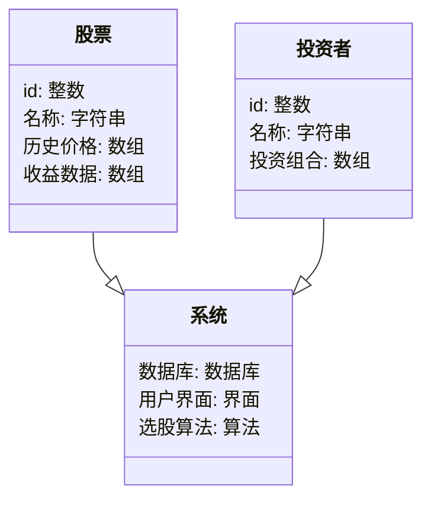
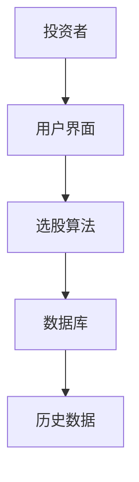
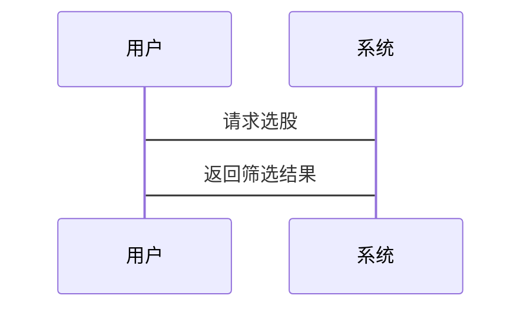

                 


# 威廉·欧奈尔的CANSLIM选股系统

## 关键词：CANSLIM选股系统，威廉·欧奈尔，投资策略，股票分析，技术指标

## 摘要：威廉·欧奈尔的CANSLIM选股系统是一种基于技术分析和基本面分析的投资策略，旨在帮助投资者识别具有增长潜力的股票。本文详细解释了CANSLIM系统的组成部分、数学模型、系统架构以及实际应用案例，帮助读者系统地理解和掌握这一选股方法。

## 第1章: CANSLIM选股系统的背景与核心概念

### 1.1 投资学的基本原理
#### 1.1.1 投资学的定义与核心原则
投资学是研究资金分配、资产管理和风险控制的学科。其核心原则包括分散投资、长期视角和价值评估。

#### 1.1.2 股票市场分析的基本方法
股票分析通常分为基本面分析和技术分析。基本面分析关注公司的财务状况，而技术分析则关注价格走势和交易量。

#### 1.1.3 技术分析与基本面分析的结合
成功的投资策略往往结合了技术分析和基本面分析，以全面评估股票的投资价值。

### 1.2 威廉·欧奈尔的生平与投资理念
#### 1.2.1 威廉·欧奈尔的简介
威廉·欧奈尔是一位著名的投资专家，以其独特的选股方法闻名。

#### 1.2.2 欧奈尔的投资哲学
欧奈尔强调长期增长和市场趋势的重要性，提倡通过分析股票的历史表现来预测未来走势。

#### 1.2.3 CANSLIM系统的发展历程
CANSLIM系统由欧奈尔在20世纪60年代提出，经过不断完善，成为一种经典的选股方法。

### 1.3 CANSLIM选股系统的定义与特点
#### 1.3.1 CANSLIM的定义
CANSLIM是一种基于特定指标的选股系统，旨在筛选出具有持续增长潜力的股票。

#### 1.3.2 CANSLIM的核心特点
- 量化指标：基于多个量化指标的综合评估。
- 长期视角：注重长期增长而非短期波动。
- 系统性：提供明确的筛选标准和操作流程。

### 1.4 CANSLIM选股系统的应用场景
#### 1.4.1 适用于哪些类型的投资者
适用于中长期投资者，尤其是那些希望寻找具有稳定增长潜力的投资者。

#### 1.4.2 CANSLIM在不同市场环境中的表现
在牛市中表现尤为突出，而在熊市中则需要调整策略。

#### 1.4.3 CANSLIM的局限性与改进空间
- 数据依赖性强：需要大量历史数据支持。
- 适应性有限：在市场环境变化时可能需要调整指标权重。

## 第2章: CANSLIM选股系统的组成部分

### 2.1 C: Current Interest
#### 2.1.1 当前兴趣的定义
当前兴趣是指投资者对某只股票的关注度，通常通过媒体和市场动量来衡量。

#### 2.1.2 当前兴趣的计算方法
通过分析媒体提到次数、投资者关注度等指标来计算。

#### 2.1.3 当前兴趣在选股中的作用
高当前兴趣表明该股票受到市场关注，可能具有上涨潜力。

### 2.2 A: Annual Earnings Growth
#### 2.2.1 年度收益增长率的定义
年度收益增长率是衡量公司盈利能力的重要指标。

#### 2.2.2 年度收益增长率的计算
通过比较公司连续几年的收益数据计算得出。

#### 2.2.3 年度收益增长率对选股的影响
高增长的公司通常具有更大的投资价值。

### 2.3 N: Number of Earnings Growth
#### 2.3.1 收益增长次数的定义
收益增长次数是指公司在一定时期内收益增长的次数。

#### 2.3.2 收益增长次数的计算
通过统计公司过去几年的收益增长情况得出。

#### 2.3.3 收益增长次数对选股的意义
持续增长的公司更具有投资价值。

### 2.4 S: Supply Line
#### 2.4.1 供应线的定义
供应线是技术分析中的一个重要指标，用于判断市场的供需平衡。

#### 2.4.2 供应线的绘制方法
通过分析历史价格和成交量数据来确定供应线的位置。

#### 2.4.3 供应线在技术分析中的应用
帮助投资者判断价格支撑位和阻力位。

### 2.5 L: Leader
#### 2.5.1 领导股的定义
领导股是指在市场中表现优于大多数股票的个股。

#### 2.5.2 领导股的识别方法
通过比较股票的相对表现来确定领导股。

#### 2.5.3 领导股在投资组合中的作用
领导股通常具有较高的增长潜力和市场影响力。

### 2.6 I: Institutional Support
#### 2.6.1 机构支持的定义
机构支持是指专业投资机构对某只股票的投资和支持。

#### 2.6.2 机构支持的衡量指标
通过分析机构持有量和机构交易量来衡量。

#### 2.6.3 机构支持对股价的影响
机构支持通常会推动股价上涨，特别是在市场波动期间。

### 2.7 M: Market Momentum
#### 2.7.1 市场动量的定义
市场动量是指市场整体的走势和趋势。

#### 2.7.2 市场动量的计算方法
通过分析市场指数的走势和成交量变化来计算。

#### 2.7.3 市场动量在选股中的应用
高动量的市场通常会推动股价上涨。

### 2.8 本章小结
CANSLIM系统的每个字母代表不同的指标，综合评估有助于筛选出具有增长潜力的股票。

## 第3章: CANSLIM选股系统的数学模型与算法原理

### 3.1 CANSLIM系统的核心算法
#### 3.1.1 CANSLIM算法的定义
CANSLIM算法是一种多指标综合评估算法，用于筛选股票。

#### 3.1.2 CANSLIM算法的数学模型
$$
\text{综合得分} = \sum_{i=1}^{n} (w_i \times score_i)
$$
其中，\( w_i \) 是指标 \( i \) 的权重，\( score_i \) 是指标 \( i \) 的得分。

#### 3.1.3 CANSLIM算法的实现步骤
1. 收集相关数据：包括各指标的历史数据。
2. 计算各指标得分：根据预设的标准计算每个指标的得分。
3. 综合评估：根据权重计算综合得分，筛选出得分较高的股票。

### 3.2 CANSLIM系统的数学公式
#### 3.2.1 年度收益增长率的计算公式
$$
\text{Annual Earnings Growth} = \frac{\text{当前收益} - \text{上期收益}}{\text{上期收益}} \times 100\%
$$

#### 3.2.2 收益增长次数的计算
收益增长次数通过统计过去几年收益是否增长得出，增长年数越多，得分越高。

### 3.3 CANSLIM系统的技术分析方法
#### 3.3.1 供应线的计算方法
供应线通常基于价格和成交量数据，通过统计方法确定价格支撑位。

#### 3.3.2 市场动量的计算
市场动量可以通过计算市场指数的走势变化率来衡量：
$$
\text{Market Momentum} = \frac{\text{当前指数} - \text{前期指数}}{\text{前期指数}} \times 100\%
$$

### 3.4 CANSLIM系统的数据处理流程
#### 3.4.1 数据收集
从可靠的金融数据库获取历史价格、收益数据等。

#### 3.4.2 数据清洗
处理缺失值和异常值，确保数据的准确性和完整性。

#### 3.4.3 数据转换
将数据转换为适合分析的格式，例如标准化或归一化处理。

### 3.5 CANSLIM系统的指标权重分配
#### 3.5.1 指标权重的确定
根据经验或统计方法确定各指标的权重，通常采用等权或根据重要性分配权重。

#### 3.5.2 权重调整
根据市场变化和投资策略的需要，定期调整各指标的权重。

### 3.6 本章小结
CANSLIM系统通过多指标综合评估，帮助投资者筛选出具有增长潜力的股票。

## 第4章: CANSLIM选股系统的系统分析与架构设计

### 4.1 系统分析
#### 4.1.1 系统目标
设计一个基于CANSLIM指标的选股系统，帮助投资者自动筛选股票。

#### 4.1.2 项目介绍
本项目旨在实现一个自动化选股系统，基于CANSLIM指标进行股票筛选。

### 4.2 系统功能设计
#### 4.2.1 领域模型设计
使用Mermaid绘制领域模型类图，展示系统中的主要实体及其关系。



#### 4.2.2 系统架构设计
使用Mermaid绘制系统架构图，展示系统的模块划分和交互流程。



#### 4.2.3 系统接口设计
定义系统的主要接口，包括数据输入接口、算法调用接口和结果输出接口。

#### 4.2.4 系统交互设计
使用Mermaid绘制交互序列图，展示用户与系统之间的交互流程。



### 4.3 系统实现
#### 4.3.1 环境配置
安装必要的软件和库，如Python、Pandas、Matplotlib等。

#### 4.3.2 核心代码实现
实现选股算法的核心部分，包括数据处理和指标计算。

```python
import pandas as pd

def calculate_growth(revenue):
    growth = (revenue['current'] - revenue['previous']) / revenue['previous'] * 100
    return growth

def can_slim_filter(stocks, threshold):
    selected = []
    for stock in stocks:
        if stock['annual_growth'] > threshold and stock['supply_line'] > 0:
            selected.append(stock)
    return selected
```

### 4.4 本章小结
通过系统设计和架构分析，为实现CANSLIM选股系统提供了理论基础和技术支持。

## 第5章: CANSLIM选股系统的项目实战

### 5.1 项目环境配置
#### 5.1.1 环境安装
安装必要的工具和库，如Jupyter Notebook、Pandas、NumPy等。

#### 5.1.2 数据获取
从金融数据库获取股票的历史数据，包括价格和收益数据。

### 5.2 系统核心实现
#### 5.2.1 数据处理
清洗和转换数据，确保数据质量。

```python
data = pd.read_csv('stocks.csv')
data.dropna(inplace=True)
data['price_change'] = data['close'].pct_change()
```

#### 5.2.2 指标计算
计算各个CANSLIM指标，如年度收益增长率和供应线。

```python
data['annual_growth'] = data['earnings'].pct_change(12)
data['supply_line'] = data['close'].rolling(50).mean()
```

#### 5.2.3 筛选股票
根据设定的阈值筛选出符合条件的股票。

```python
selected_stocks = can_slim_filter(data, 0.1)
```

### 5.3 案例分析
#### 5.3.1 案例背景
选择一个时间段和市场环境，分析CANSLIM系统在该环境下的表现。

#### 5.3.2 数据分析
使用筛选后的数据进行详细分析，验证系统的有效性。

#### 5.3.3 系统小结
总结项目实施过程中的经验和教训，提出改进建议。

## 第6章: CANSLIM选股系统的最佳实践与注意事项

### 6.1 最佳实践
#### 6.1.1 数据来源的选择
确保数据的准确性和完整性，优先选择可靠的金融数据库。

#### 6.1.2 指标权重的调整
根据市场环境和投资目标调整各指标的权重，以优化筛选效果。

#### 6.1.3 系统的定期更新
定期更新数据和调整算法，以适应市场变化。

### 6.2 小结
通过不断优化和调整，可以使CANSLIM选股系统更加高效和准确。

### 6.3 注意事项
- 数据质量：确保数据的准确性和及时性。
- 系统维护：定期更新和维护系统，确保其正常运行。
- 风险控制：合理分散投资，避免过度集中。

### 6.4 拓展阅读
推荐相关书籍和资源，帮助读者进一步深入学习CANSLIM系统。

## 第7章: 总结与展望

### 7.1 本章总结
CANSLIM选股系统通过多指标综合评估，帮助投资者筛选出具有增长潜力的股票。

### 7.2 未来展望
随着技术的发展，CANSLIM系统可以进一步优化和扩展，结合更多的指标和分析方法，提高筛选的准确性和效率。

### 7.3 最终寄语
投资需谨慎，建议投资者在使用CANSLIM系统时，结合自身情况和市场环境，做出明智的投资决策。

---

# 结语
通过本文的详细介绍，读者可以系统地理解和掌握威廉·欧奈尔的CANSLIM选股系统，从理论到实践，逐步掌握这一经典的投资方法。

