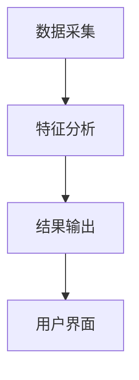

                 


# 威廉·欧奈尔的市场领导者特征分析

## 关键词：市场领导者，威廉·欧奈尔，领导力，战略管理，执行力，特征分析

## 摘要：威廉·欧奈尔是市场领导者特征分析领域的权威专家，其研究成果为识别和培养市场领导者提供了重要的理论依据。本文系统地分析了威廉·欧奈尔提出的市场领导者特征，包括领导力、战略管理、执行力和团队协作等方面，并通过对比分析、算法模型和实际案例，深入探讨了这些特征的内在联系和实际应用。通过对威廉·欧奈尔市场领导者特征的全面解读，本文旨在为企业管理者提供科学的理论指导和实践参考。

---

## 第一章：威廉·欧奈尔与市场领导者特征概述

### 1.1 威廉·欧奈尔的生平简介

威廉·欧奈尔（William O’Neil）是市场领导者特征分析领域的权威专家，以其深入的研究和实践成果闻名。他出生于1933年，是一位成功的企业家和投资者，曾在多家知名公司担任高管，积累了丰富的管理经验。欧奈尔的研究成果为市场领导者特征分析提供了重要的理论基础，他的著作和研究成果被广泛应用于企业管理实践中。

### 1.2 市场领导者特征研究的背景与意义

市场领导者特征研究的背景可以追溯到20世纪中叶，随着企业竞争的加剧，识别和培养市场领导者成为企业成功的关键。威廉·欧奈尔的研究填补了市场领导者特征分析领域的空白，为企业管理者提供了科学的理论指导。通过分析市场领导者特征，企业可以更好地识别和培养具有领导力的人才，提升企业的核心竞争力。

### 1.3 市场领导者特征分析的核心目标

市场领导者特征分析的核心目标是通过系统的方法，识别和评估市场领导者的关键特征，为企业提供科学的理论依据和实践指导。通过分析领导力、战略管理、执行力和团队协作等特征，企业可以更好地理解市场领导者的内在逻辑，从而制定有效的管理策略。

---

## 第二章：市场领导者特征的核心概念与联系

### 2.1 领导力特征

领导力是市场领导者的核心特征之一，主要包括以下几点：

- **领导力的定义与属性**：领导力是指个体在组织中引导和激励团队实现目标的能力。它不仅包括决策能力，还包括沟通能力、情感智慧和变革管理能力。

- **不同领导风格对市场领导者特征的影响**：威廉·欧奈尔提出了多种领导风格，包括变革型领导、交易型领导和仆人型领导。不同的领导风格对市场领导者特征的影响也不同，变革型领导更能激发团队的潜力。

- **领导力特征的量化与评估**：通过问卷调查、绩效评估和团队反馈等方式，可以量化领导力特征，并评估其对市场领导者的影响。

### 2.2 战略管理特征

战略管理是市场领导者特征的重要组成部分，主要包括以下几点：

- **战略管理的核心概念**：战略管理是指企业在不确定的环境中制定和实施战略的过程，以实现长期目标。它包括战略制定、战略实施和战略评估三个阶段。

- **战略目标与市场领导者特征的关系**：战略目标是市场领导者的核心驱动力，市场领导者需要通过战略管理来实现目标，并在竞争中占据优势。

- **战略执行中的关键因素**：战略执行的关键因素包括资源分配、团队协作和外部环境的适应能力。市场领导者需要具备强大的战略执行能力，才能将战略目标转化为实际成果。

### 2.3 执行力特征

执行力是市场领导者特征的重要组成部分，主要包括以下几点：

- **执行力的定义与特点**：执行力是指个体或组织在实现目标过程中，将战略转化为具体行动的能力。它包括计划、组织、执行和控制四个环节。

- **执行力对市场领导者的影响**：强大的执行力是市场领导者成功的关键，它能够确保战略目标的顺利实施，并在竞争中占据优势。

- **提升执行力的关键策略**：市场领导者需要通过优化组织结构、加强团队建设和完善激励机制等策略，提升组织的执行力。

### 2.4 团队协作特征

团队协作是市场领导者特征的重要组成部分，主要包括以下几点：

- **团队协作的重要性**：团队协作是指团队成员之间相互配合，共同完成任务的过程。它是市场领导者成功的关键因素之一，能够提升组织的效率和创新能力。

- **团队协作与市场领导者特征的关系**：市场领导者需要具备强大的团队协作能力，才能有效协调团队成员，实现共同目标。

- **提高团队协作能力的方法**：市场领导者可以通过建立清晰的沟通机制、加强团队建设活动和优化团队结构等方法，提高团队的协作能力。

---

## 第三章：市场领导者特征分析的算法与数学模型

### 3.1 市场领导者特征分析的数学模型

市场领导者特征分析的数学模型主要包括以下几点：

- **基于统计学的特征分析模型**：通过统计分析方法，识别市场领导者特征的显著性。例如，利用回归分析模型，分析领导力、战略管理和执行力对市场领导者的影响。

- **基于机器学习的特征分析模型**：利用机器学习算法，如支持向量机（SVM）和随机森林（Random Forest），对市场领导者特征进行分类和预测。

- **基于自然语言处理的特征分析模型**：通过自然语言处理技术，分析市场领导者特征的文本数据，提取关键特征。

### 3.2 算法原理的详细讲解

- **基于统计学的特征分析模型**：回归分析是一种常用的统计方法，用于分析变量之间的关系。例如，通过多元回归分析，可以研究领导力、战略管理和执行力对市场领导者的影响。

- **基于机器学习的特征分析模型**：支持向量机（SVM）是一种常用的分类算法，能够通过训练数据，识别市场领导者特征的分类边界。随机森林（Random Forest）是一种基于树的集成算法，能够通过投票机制，提高分类的准确性。

- **基于自然语言处理的特征分析模型**：自然语言处理技术可以通过分词、词干提取和情感分析等方法，分析市场领导者特征的文本数据，提取关键特征。

### 3.3 算法实现的Python代码示例

```python
# 基于统计学的特征分析模型：多元回归分析

import statsmodels.api as sm

# 数据预处理
X = data[['领导力', '战略管理', '执行力']]
y = data['市场领导者']

# 多元回归分析
model = sm.OLS(y, sm.add_constant(X))
result = model.fit()

print(result.summary())
```

### 3.4 算法原理的图形化解释

可以通过绘制回归分析的散点图和回归线，直观地展示变量之间的关系。例如，通过绘制领导力与市场领导者之间的散点图和回归线，可以直观地看到领导力对市场领导者的影响。

---

## 第四章：市场领导者特征的系统分析与架构设计

### 4.1 问题场景介绍

市场领导者特征分析的系统需要解决以下问题：

- 如何有效地识别和评估市场领导者特征？
- 如何通过系统化的分析方法，提高市场领导者特征分析的效率和准确性？

### 4.2 系统功能设计

- **领域模型**：通过构建领域模型，明确市场领导者特征分析的核心要素及其关系。例如，可以通过类图展示市场领导者特征、领导力、战略管理、执行力和团队协作之间的关系。

- **系统架构设计**：通过架构图展示系统的组成部分及其交互关系。例如，可以通过分层架构图展示数据采集、特征分析和结果输出三个模块的关系。

### 4.3 系统架构设计图



### 4.4 系统接口设计

- **数据接口**：系统需要通过数据接口，从数据库中获取市场领导者特征的数据。
- **用户界面**：系统需要提供友好的用户界面，方便用户输入和查看分析结果。

### 4.5 系统交互设计

- **交互流程**：用户通过输入市场领导者特征的数据，系统通过分析算法，生成分析结果，并通过用户界面输出。

---

## 第五章：市场领导者特征分析的项目实战

### 5.1 项目介绍

以某知名科技公司为例，通过市场领导者特征分析，识别和培养市场领导者。

### 5.2 核心实现源代码

```python
# 项目实战代码示例：市场领导者特征分析

import pandas as pd
from sklearn.ensemble import RandomForestClassifier

# 数据加载
data = pd.read_csv('market_leaders.csv')

# 特征选择
X = data[['领导力', '战略管理', '执行力']]
y = data['市场领导者']

# 模型训练
model = RandomForestClassifier()
model.fit(X, y)

# 模型预测
 predictions = model.predict(X)

# 模型评估
print('模型准确率:', model.score(X, y))
```

### 5.3 案例分析与解读

以苹果公司为例，分析其市场领导者特征，包括领导力、战略管理和执行力等方面。

---

## 第六章：总结与展望

### 6.1 本章小结

通过本文的系统分析，威廉·欧奈尔的市场领导者特征分析为企业管理者提供了科学的理论指导和实践参考。市场领导者特征分析的核心要素包括领导力、战略管理、执行力和团队协作，这些特征相互关联，共同构成了市场领导者的核心竞争力。

### 6.2 最佳实践 tips

- **领导力**：市场领导者需要具备强大的领导力，能够引导团队实现目标。
- **战略管理**：市场领导者需要具备清晰的战略眼光，能够制定和实施有效的战略。
- **执行力**：市场领导者需要具备强大的执行力，能够将战略转化为具体行动。
- **团队协作**：市场领导者需要具备优秀的团队协作能力，能够协调团队成员，实现共同目标。

### 6.3 注意事项

- **数据质量**：市场领导者特征分析的结果依赖于高质量的数据，数据的准确性和完整性至关重要。
- **模型选择**：不同的算法适用于不同的场景，需要根据具体需求选择合适的算法。
- **结果解释**：市场领导者特征分析的结果需要结合实际业务背景进行解释，避免片面解读。

### 6.4 拓展阅读

- 威廉·欧奈尔的其他研究成果。
- 市场领导者特征分析的最新研究进展。
- 市场领导者特征分析在不同行业中的应用案例。

---

## 附录：参考文献

- 威廉·欧奈尔的著作。
- 相关学术论文。
- 其他参考文献。

---

以上是《威廉·欧奈尔的市场领导者特征分析》的技术博客文章的详细大纲和内容。希望这篇文章能够为您提供有价值的见解和启示。

