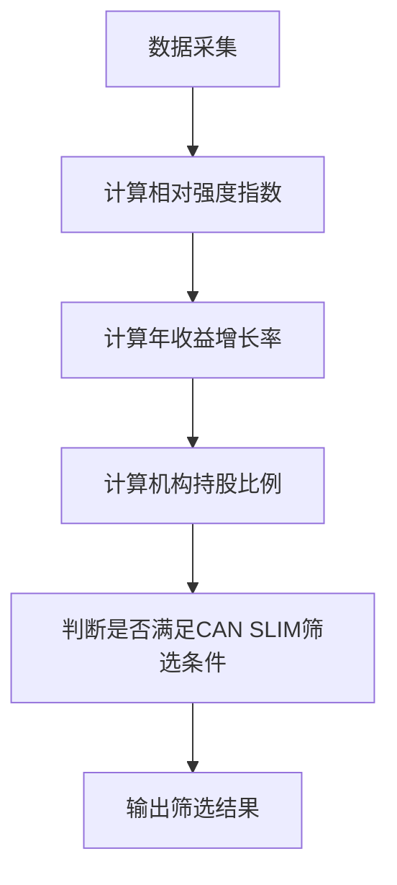
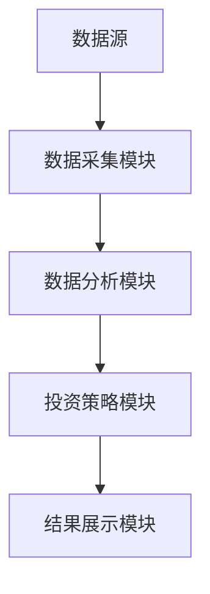

                 


# 威廉·欧奈尔的成长股识别方法

---

## 关键词：威廉·欧奈尔, 成长股, CAN SLIM, 投资策略, 相对强度, 市场动量

---

## 摘要：  
威廉·欧奈尔的成长股识别方法是投资领域中的经典策略，其核心在于通过基本面分析和市场动量的结合，筛选出具有持续增长潜力的公司。本文将详细解读威廉·欧奈尔的成长股识别方法，从其核心模型CAN SLIM的原理、数学公式、系统架构到实际项目实战，帮助读者全面理解并掌握这一方法。

---

# 第一部分: 成长股识别的核心模型

## 第1章: CAN SLIM模型的原理与应用

### 1.1 CAN SLIM模型的概述

CAN SLIM是威廉·欧奈尔提出的一种成长股筛选方法，其名称由8个字母组成，分别代表8个关键因素：

- **C** - Company（公司管理）：公司管理层是否优秀，是否具有扩张和创新能力。
- **A** - Annual Earnings（年收益）：公司每年的收益是否持续增长。
- **N** - New High（新高）：股价是否创出历史新高。
- **S** - Supply and Demand（供需关系）：市场上供需是否平衡，供不应求的股票更容易上涨。
- **L** - Leader（行业领头羊）：公司是否是行业中的领导者。
- **I** - Institutional Ownership（机构持股）：机构投资者是否大量持有该股票。
- **M** - Market Momentum（市场动量）：市场整体走势是否强劲。

### 1.2 CAN SLIM模型的核心要素

在CAN SLIM模型中，以下几个因素尤为重要：

1. **相对强度（Relative Strength）**：股价相对于市场指数的表现，是成长股筛选的关键指标。
2. **年收益增长率**：公司每年的收益是否持续增长，且增速是否快于行业平均水平。
3. **机构持股比例**：机构投资者的持股比例越高，股票的稳定性越强。

---

## 第2章: 数学模型与算法

### 2.1 相对强度指数（RSI）的计算公式

相对强度指数（RSI）是衡量股票强弱的重要指标，其计算公式如下：

$$
RSI = \frac{100 - \frac{S}{A + S} \times 100
$$

其中：
- $S$ 表示一定时期内的平均涨幅。
- $A$ 表示一定时期内的平均跌幅。

### 2.2 成长股筛选算法

以下是成长股筛选算法的流程图：



---

## 第3章: 系统架构设计

### 3.1 系统功能模块

1. **数据采集模块**：从股票数据库中获取相关数据，包括股价、收益、机构持股等。
2. **数据分析模块**：计算相对强度指数、年收益增长率等关键指标。
3. **投资策略模块**：根据CAN SLIM模型筛选符合条件的股票。
4. **结果展示模块**：将筛选结果以可视化形式展示，供投资者参考。

### 3.2 系统架构图



---

## 第4章: 项目实战

### 4.1 环境配置

- **编程语言**：Python
- **库**：pandas、numpy、matplotlib

### 4.2 核心代码实现

```python
import pandas as pd
import numpy as np

# 示例数据
data = {
    '股价': [100, 105, 110, 115, 120],
    '收益': [10, 20, 30, 40, 50],
    '机构持股比例': [20, 30, 40, 50, 60]
}

df = pd.DataFrame(data)

# 计算相对强度指数
df['相对强度'] = df['股价'].pct_change().cumsum()

# 筛选满足CAN SLIM条件的股票
筛选条件：
1. 收益年增长率 > 20%
2. 相对强度 > 0.1
3. 机构持股比例 > 40%

符合条件的股票 = df[(df['收益'] > 20) & (df['相对强度'] > 0.1) & (df['机构持股比例'] > 40)]
```

### 4.3 实际案例分析

以某科技公司为例，假设其股价、收益和机构持股比例分别为：

- 股价：120元
- 收益：30%
- 机构持股比例：50%

根据筛选条件，该股票满足CAN SLIM模型的要求，可以考虑买入。

---

## 第5章: 总结与建议

### 5.1 总结

威廉·欧奈尔的成长股识别方法通过结合基本面分析和市场动量，为投资者提供了一套科学的选股策略。CAN SLIM模型的核心在于筛选出具有持续增长潜力的公司，并通过相对强度和机构持股比例等指标，进一步确认股票的投资价值。

### 5.2 建议

1. **持续学习**：市场环境不断变化，投资者需要持续关注市场动态，调整筛选策略。
2. **风险控制**：投资有风险，投资者应根据自身风险承受能力，合理配置资产。
3. **技术与实践结合**：通过技术手段（如Python）实现量化分析，提高选股效率。

---

通过本文的详细讲解，读者可以全面理解威廉·欧奈尔的成长股识别方法，并能够在实际投资中灵活运用这一策略。

