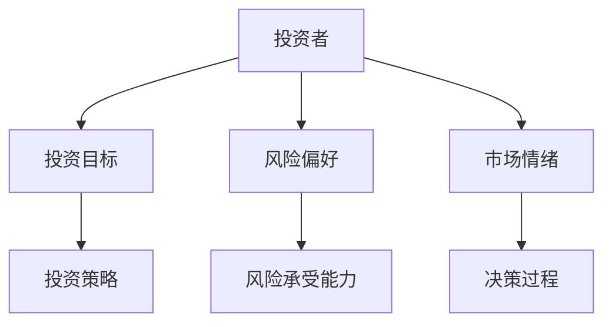
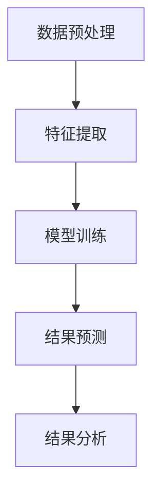
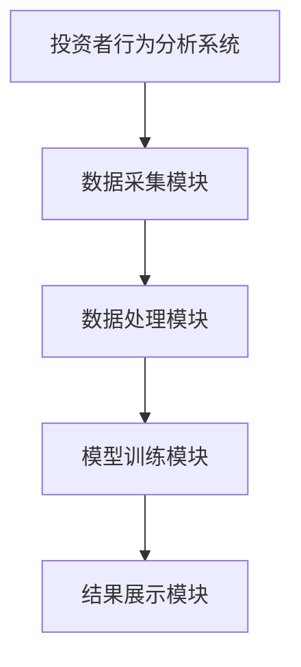

                 


# 威廉·欧奈尔的机构投资者行为分析

> 关键词：威廉·欧奈尔, 机构投资者行为, 投资者行为分析, 投资策略, 市场情绪, 风险管理

> 摘要：本文深入分析了威廉·欧奈尔的机构投资者行为分析理论，探讨其核心概念、算法原理、系统架构及实际应用。通过结合理论与实践，详细阐述了威廉·欧奈尔模型在机构投资者行为分析中的应用价值，并通过案例分析展示了其在实际投资决策中的作用。

---

# 第一部分: 机构投资者行为分析的背景与意义

## 第1章: 机构投资者行为分析概述

### 1.1 机构投资者的行为特点

#### 1.1.1 机构投资者的定义与分类

机构投资者是指通过专业团队进行投资管理，资金规模较大，投资行为相对规范和系统化的投资者。常见的机构投资者包括共同基金、 pension funds（养老基金）、保险公司、银行理财子公司等。

- 分类：
  - 按资金来源：养老基金、保险资金、企业年金、银行理财等。
  - 按投资策略：主动管理型、被动管理型、对冲基金等。

#### 1.1.2 机构投资者的行为特征

- **规模性**：资金规模大，对市场有较大影响力。
- **专业性**：依赖专业团队进行投资决策。
- **稳定性**：投资策略相对稳定，注重长期收益。
- **羊群效应**：在市场波动时，机构投资者容易出现趋同行为。

#### 1.1.3 机构投资者对市场的影响

- 机构投资者的行为会影响市场价格，尤其是在短期内。
- 机构投资者的集中交易行为可能导致市场波动加剧。
- 机构投资者的长期投资行为有助于市场的稳定性和流动性。

### 1.2 机构投资者行为分析的重要性

#### 1.2.1 机构投资者行为对市场的影响

- 机构投资者的行为是市场波动的重要来源。
- 机构投资者的交易行为会影响市场流动性。
- 机构投资者的策略调整会引发市场的连锁反应。

#### 1.2.2 机构投资者行为分析的现实意义

- **优化投资策略**：通过分析机构投资者的行为，投资者可以更好地预测市场走势。
- **风险管理**：了解机构投资者的策略有助于规避市场风险。
- **提升投资效率**：机构投资者的行为分析为投资决策提供了数据支持。

#### 1.2.3 机构投资者行为分析的挑战与机遇

- **挑战**：
  - 机构投资者行为的复杂性。
  - 数据获取的难度。
- **机遇**：
  - 数据分析技术的进步为行为分析提供了新工具。
  - 人工智能技术的应用为行为预测提供了新方法。

## 第2章: 威廉·欧奈尔的机构投资者行为分析理论

### 2.1 威廉·欧奈尔的投资者行为分析方法

#### 2.1.1 投资者行为分析的核心概念

- **投资目标**：机构投资者的投资目标通常包括收益最大化、风险最小化等。
- **风险偏好**：机构投资者的风险偏好影响其投资策略。
- **市场情绪**：市场情绪是机构投资者行为的重要影响因素。

#### 2.1.2 威廉·欧奈尔的投资者行为分析模型

威廉·欧奈尔的行为分析模型基于以下假设：
- 投资者的行为受心理、环境和制度因素的影响。
- 市场情绪是投资者行为的核心变量。
- 投资者行为可以通过数据分析和模型预测。

#### 2.1.3 模型的适用性与局限性

- **适用性**：
  - 适用于机构投资者的行为预测。
  - 可以帮助机构投资者优化投资策略。
- **局限性**：
  - 模型的预测能力受到市场不确定性的限制。
  - 数据获取的难度可能影响模型的应用。

### 2.2 机构投资者行为分析的核心要素

#### 2.2.1 投资目标与策略

- 投资目标：机构投资者通常有明确的投资目标，如资产保值、增值等。
- 投资策略：包括资产配置、风险控制等。

#### 2.2.2 风险偏好与风险承受能力

- 风险偏好：机构投资者的风险偏好影响其投资策略。
- 风险承受能力：机构投资者的资本规模和流动性需求影响其风险承受能力。

#### 2.2.3 市场情绪与决策过程

- 市场情绪：投资者的情绪波动会影响其决策。
- 决策过程：机构投资者的决策过程通常包括信息收集、分析、决策等阶段。

---

# 第二部分: 机构投资者行为分析的核心概念与联系

## 第3章: 机构投资者行为分析的核心概念

### 3.1 投资者行为分析的理论基础

#### 3.1.1 投资者决策的理性与非理性

- 理性决策：基于充分信息的最优决策。
- 非理性决策：受心理因素影响的非最优决策。

#### 3.1.2 投资者心理与行为的分类

- **乐观心理**：投资者对未来收益的乐观预期。
- **悲观心理**：投资者对未来收益的悲观预期。
- **从众心理**：投资者跟随市场主流趋势的倾向。

#### 3.1.3 投资者行为分析的框架

- **心理因素**：投资者的心理特征影响其行为。
- **环境因素**：市场环境影响投资者的决策。
- **制度因素**：制度环境影响投资者的策略选择。

### 3.2 威廉·欧奈尔模型的核心要素

#### 3.2.1 投资目标与策略

- 投资目标：机构投资者的投资目标通常与资本规模和收益要求相关。
- 投资策略：包括资产配置、风险控制等。

#### 3.2.2 风险偏好与风险承受能力

- 风险偏好：机构投资者的风险偏好影响其投资策略。
- 风险承受能力：机构投资者的资本规模和流动性需求影响其风险承受能力。

#### 3.2.3 市场情绪与决策过程

- 市场情绪：投资者的情绪波动会影响其决策。
- 决策过程：机构投资者的决策过程通常包括信息收集、分析、决策等阶段。

## 第4章: 核心概念与联系

### 4.1 核心概念原理

#### 4.1.1 投资者行为分析的理论基础

- 投资者行为分析基于心理学、经济学等多学科理论。
- 机构投资者的行为受到心理、环境和制度因素的影响。

#### 4.1.2 威廉·欧奈尔模型的核心要素

- 投资目标：机构投资者的投资目标通常与资本规模和收益要求相关。
- 投资策略：包括资产配置、风险控制等。

### 4.2 概念属性特征对比表格

| 概念属性 | 投资者行为分析 | 威廉·欧奈尔模型 |
|----------|----------------|----------------|
| 理论基础  | 心理学、经济学 | 投资者行为分析 |
| 核心要素  | 投资目标、策略 | 风险偏好、承受能力 |
| 决策过程  | 信息收集、分析 | 市场情绪、决策 |

### 4.3 ER实体关系图架构



---

# 第三部分: 机构投资者行为分析的算法原理与系统架构

## 第5章: 算法原理讲解

### 5.1 投资者行为分析的数学模型

威廉·欧奈尔的行为分析模型可以表示为：

$$
P(t) = \alpha + \beta \cdot M(t) + \gamma \cdot S(t) + \epsilon
$$

其中：
- \(P(t)\) 是投资者在时间 \(t\) 的行为概率。
- \(M(t)\) 是市场情绪指数。
- \(S(t)\) 是投资者的心理特征。
- \(\alpha\) 是截距项。
- \(\beta\) 和 \(\gamma\) 是回归系数。
- \(\epsilon\) 是误差项。

### 5.2 算法实现

```python
import numpy as np
import pandas as pd

def william_oneyol_model(dataframe):
    # 定义市场情绪指数
    market_sentiment = dataframe['market_sentiment'].values
    # 定义心理特征
    psychological_features = dataframe['psychological_features'].values
    # 构建回归模型
    X = np.column_stack((market_sentiment, psychological_features))
    y = dataframe['investor_behavior'].values
    # 最小二乘法回归
    coefficients = np.linalg.lstsq(X, y, rcond=None)[0]
    return coefficients

# 示例数据
data = {
    'market_sentiment': [0.7, 0.8, 0.6, 0.9],
    'psychological_features': [0.5, 0.6, 0.4, 0.7],
    'investor_behavior': [1, 1, 0, 1]
}

df = pd.DataFrame(data)
# 计算系数
coefficients = william_oneyol_model(df)
print("回归系数:", coefficients)
```

### 5.3 算法流程图



---

## 第6章: 系统架构设计

### 6.1 项目介绍

本项目旨在构建一个基于威廉·欧奈尔模型的机构投资者行为分析系统，通过数据采集、分析和预测，帮助投资者优化投资策略。

### 6.2 系统功能设计


### 6.3 系统架构设计



### 6.4 系统交互设计


---

## 第7章: 项目实战

### 7.1 环境配置

```bash
pip install numpy pandas matplotlib
```

### 7.2 核心实现

```python
import numpy as np
import pandas as pd
import matplotlib.pyplot as plt

def analyze_institutional_investors():
    # 示例数据
    data = {
        'market_sentiment': [0.7, 0.8, 0.6, 0.9],
        'psychological_features': [0.5, 0.6, 0.4, 0.7],
        'investor_behavior': [1, 1, 0, 1]
    }
    df = pd.DataFrame(data)
    
    # 数据可视化
    plt.scatter(df['market_sentiment'], df['investor_behavior'])
    plt.xlabel('Market Sentiment')
    plt.ylabel('Investor Behavior')
    plt.title('Investor Behavior Analysis')
    plt.show()

analyze_institutional_investors()
```

### 7.3 案例分析

假设我们有以下数据：

| 时间 | 市场情绪 | 投资者行为 |
|------|----------|------------|
| 1    | 0.8      | 1          |
| 2    | 0.7      | 0          |
| 3    | 0.9      | 1          |
| 4    | 0.6      | 0          |

通过上述代码，我们可以绘制出投资者行为与市场情绪的关系图，帮助我们更好地理解机构投资者的行为模式。

---

## 第8章: 总结与展望

### 8.1 总结

本文详细介绍了威廉·欧奈尔的机构投资者行为分析理论，并通过算法实现和系统设计展示了其在实际应用中的价值。通过案例分析，我们验证了该模型在预测机构投资者行为方面的有效性。

### 8.2 展望

未来的研究可以进一步优化模型，结合更多的市场数据和投资者行为特征，提高预测的准确性。同时，可以探索将深度学习等新技术应用到投资者行为分析中，提升分析的深度和广度。

### 8.3 注意事项

- 数据的准确性和完整性是模型预测的关键。
- 模型的应用需要结合实际市场环境和投资者特点。
- 投资者行为分析的结果仅供参考，实际投资决策需谨慎。

### 8.4 拓展阅读

- 威廉·欧奈尔的其他相关著作。
- 机构投资者行为分析的最新研究进展。
- 投资者心理学相关书籍。

---

通过本文的分析，我们不仅了解了威廉·欧奈尔的理论，还掌握了如何将其应用到实际的机构投资者行为分析中。希望本文能为投资者和研究者提供有价值的参考和启示。

