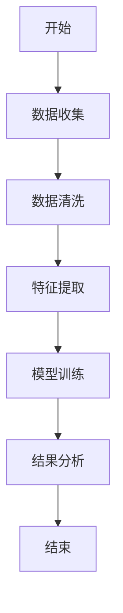
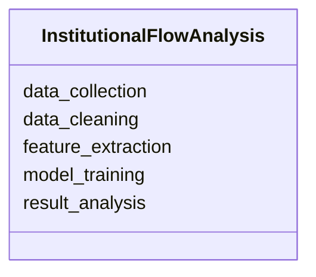
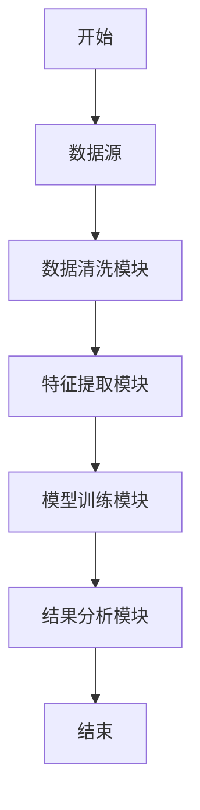

                 


### 第一部分: 机构资金流向分析的背景与基础

#### 第1章: 机构资金流向分析概述

##### 1.1 机构资金流向分析的背景

###### 1.1.1 机构投资者的定义与特点
机构投资者是指那些由专业团队管理的大型资金池，包括共同基金、对冲基金、养老基金等。这些机构通常拥有大量的资金和专业的投资团队，能够在市场中产生较大的影响力。

机构投资者的特点包括：
- 资金规模大
- 投资策略多样化
- 专业团队管理
- 投资期限较长
- 受监管严格

###### 1.1.2 机构资金流向分析的重要性
机构资金流向分析是指通过观察机构投资者的资金流动情况，预测市场趋势和个股表现。其重要性体现在：
- 提供市场动向的早期信号
- 帮助投资者制定投资策略
- 为机构投资者提供决策支持

###### 1.1.3 威廉·欧奈尔的机构资金流向理论
威廉·欧奈尔是投资分析领域的权威，他提出的机构资金流向分析方法，通过研究机构投资者的买卖行为，预测市场走势。其核心理论包括：
- 机构资金流向与市场趋势的关系
- 机构投资者的买卖信号
- 资金流向对个股的影响

##### 1.2 机构资金流向分析的核心概念

###### 1.2.1 机构资金流向的定义
机构资金流向是指机构投资者在特定时间段内买卖某只股票或整个市场的资金流量情况。通常通过分析成交量和价格变化来判断资金流向。

###### 1.2.2 机构资金流向的特征
机构资金流向具有以下特征：
- 可量性：可以通过成交量和价格变化来量化。
- 延时性：机构资金流动通常有一定的滞后性。
- 周期性：资金流向具有一定的周期性，与市场周期相关。

###### 1.2.3 机构资金流向与市场趋势的关系
机构资金流入通常预示着市场的上涨，而资金流出则可能预示市场的下跌。通过分析资金流向的趋势，可以更好地把握市场的买卖信号。

##### 1.3 机构资金流向分析的工具与方法

###### 1.3.1 常用的机构资金流向分析工具
常用的工具包括：
- 成交量分析工具
- 资金流指标（如MFI）
- 技术分析软件

###### 1.3.2 数据收集与处理方法
数据收集包括从股票交易所获取实时数据，处理方法包括清洗数据、计算资金流向指标等。

###### 1.3.3 分析报告的撰写规范
报告应包括数据来源、分析方法、结论和建议等内容。

##### 1.4 机构资金流向分析的案例研究

###### 1.4.1 美国市场的经典案例
例如，2008年金融危机期间，机构资金流向的变化如何预示市场的波动。

###### 1.4.2 全球市场的最新案例
分析最近几年机构资金流向对市场的具体影响。

###### 1.4.3 案例分析的启示
通过案例分析，总结机构资金流向对投资决策的指导意义。

##### 1.5 本章小结
本章介绍了机构资金流向分析的背景、核心概念和常用工具，为后续的理论分析和系统实现奠定了基础。

---

### 第二部分: 机构资金流向分析的核心理论与方法

#### 第2章: 机构资金流向分析的核心概念

##### 2.1 机构资金流向的定义与属性

###### 2.1.1 机构资金流向的定义
机构资金流向是机构投资者买卖行为的量化表现，通过分析资金流动情况，判断市场趋势。

###### 2.1.2 机构资金流向的属性特征对比表
| 特征 | 描述 |
|------|------|
| 可量性 | 资金流向可以通过成交量和价格变化量化 |
| 延时性 | 机构资金流动通常滞后于市场变化 |
| 周期性 | 资金流向具有一定的周期性 |

###### 2.1.3 机构资金流向的ER实体关系图
```mermaid
entity Institution {
    id
    name
    assets
}
entity Flow {
    id
    amount
    timestamp
}
Institution --> Flow: has
```

##### 2.2 机构资金流向分析的原理

###### 2.2.1 机构资金流向的数学模型
机构资金流向的计算公式为：
$$\text{机构资金流向} = \frac{\text{机构买入量} - \text{机构卖出量}}{\text{总成交量}}$$

###### 2.2.2 机构资金流向的公式推导
通过分析机构买卖行为，推导出资金流向的数学模型，并解释其意义。

###### 2.2.3 机构资金流向的数学模型与公式
机构资金流向指标（IFI）的计算公式：
$$\text{IFI} = \frac{\text{机构买入量}}{\text{机构买入量} + \text{机构卖出量}} \times 100$$

##### 2.3 机构资金流向分析的算法原理

###### 2.3.1 机构资金流向分析的算法流程图


###### 2.3.2 机构资金流向分析的Python源代码实现
```python
def calculate_institutional_flow(data):
    # 数据清洗
    data = data.dropna()
    # 特征提取
    buy_volume = data['buy_volume']
    sell_volume = data['sell_volume']
    total_volume = buy_volume + sell_volume
    # 计算机构资金流向
    institutional_flow = (buy_volume - sell_volume) / total_volume
    return institutional_flow
```

##### 2.4 本章小结
本章详细讲解了机构资金流向的核心概念、数学模型和算法原理，为后续的系统实现奠定了理论基础。

---

### 第三部分: 机构资金流向分析的系统架构与实现

#### 第3章: 机构资金流向分析的系统架构设计

##### 3.1 系统功能设计

###### 3.1.1 领域模型（使用 Mermaid 类图）


##### 3.2 系统架构设计

###### 3.2.1 系统架构图


##### 3.3 系统接口设计

###### 3.3.1 系统接口设计
定义数据输入和输出接口，确保系统与其他模块的兼容性。

##### 3.4 系统交互设计

###### 3.4.1 系统交互流程图
```mermaid
graph TD
    User --> DataCollector: 提供数据源
    DataCollector --> DataCleaner: 数据清洗
    DataCleaner --> FeatureExtractor: 特征提取
    FeatureExtractor --> ModelTrainer: 模型训练
    ModelTrainer --> ResultAnalyzer: 结果分析
    ResultAnalyzer --> User: 提供分析结果
```

##### 3.5 本章小结
本章从系统架构的角度，详细设计了机构资金流向分析的实现方案，为后续的项目实施提供了指导。

---

### 总结

通过以上三部分的详细分析，我们系统地介绍了威廉·欧奈尔的机构资金流向分析的背景、理论、方法和系统实现。读者可以通过这些内容，逐步掌握机构资金流向分析的核心要点，并能够在实际操作中应用这些方法。

