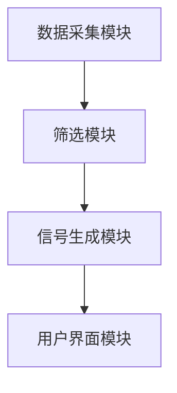

                 

# 威廉欧奈尔的图表分析技巧

> 关键词：威廉欧奈尔，图表分析，CAN SLIM策略，投资技巧，技术分析

> 摘要：本文深入探讨了威廉欧奈尔的图表分析技巧，结合其经典的CAN SLIM策略，分析了技术分析与基本面分析的结合方法，并通过实际案例展示了如何通过图表分析实现有效的投资决策。

---

# 第一部分: 图表分析基础与威廉·欧奈尔的投资理念

## 第1章: 图表分析与威廉·欧奈尔的投资方法概述

### 1.1 图表分析的定义与重要性
#### 1.1.1 图表分析的基本概念
图表分析是一种通过分析价格走势、成交量等市场数据，预测未来市场趋势的技术分析方法。它通过研究历史数据，识别价格形态、趋势线、支撑位、阻力位等关键要素，帮助投资者做出投资决策。

#### 1.1.2 图表分析在金融投资中的作用
图表分析在金融投资中扮演着重要角色。它可以帮助投资者快速识别市场趋势、判断买卖时机、评估风险和收益，从而制定有效的投资策略。

#### 1.1.3 威廉·欧奈尔的生平与投资理念
威廉·欧奈尔是美国著名的投资专家，其投资理念以CAN SLIM策略闻名。他强调通过技术分析和基本面分析的结合，寻找具有成长潜力的股票，并在合适的时机进行投资。

---

## 第2章: 图表分析的核心概念与原理

### 2.1 技术分析与基本面分析的结合
#### 2.1.1 技术分析的基本原理
技术分析通过研究价格走势和成交量数据，预测未来市场趋势。常用的技术指标包括移动平均线、相对强度指数（RSI）、MACD等。

#### 2.1.2 基本面分析的核心要素
基本面分析关注公司的财务状况、行业地位、盈利能力等内在因素。通过分析这些因素，可以评估公司的成长潜力和投资价值。

#### 2.1.3 技术分析与基本面分析的整合方法
威廉·欧奈尔的CAN SLIM策略正是技术分析与基本面分析结合的典范。通过筛选具有成长性和较强市场表现的股票，投资者可以在合适的时机进行投资。

---

## 第3章: 图表分析的算法实现与数学模型

### 3.1 图表分析的算法原理
#### 3.1.1 基于CAN SLIM策略的算法流程
CAN SLIM策略通过筛选具有以下特征的股票：公司 earnings 增长、股票价格表现强于市场指数、相对强度高等。算法流程包括数据采集、筛选、信号生成等步骤。

#### 3.1.2 算法实现的关键步骤
1. 数据采集：获取目标股票的历史价格和财务数据。
2. 筛选：通过技术指标和基本面指标筛选符合条件的股票。
3. 信号生成：根据价格走势和成交量变化，生成买入或卖出信号。

#### 3.1.3 算法的优化与改进
通过调整筛选标准和优化信号生成逻辑，可以提高算法的准确性和稳定性。

---

## 第4章: 图表分析的系统架构与设计

### 4.1 系统分析与架构设计
#### 4.1.1 系统功能模块划分
系统分为数据采集模块、筛选模块、信号生成模块和用户界面模块。

#### 4.1.2 系统架构设计图

#### 4.1.3 系统接口设计
系统接口包括数据接口和用户接口。数据接口用于获取外部数据，用户接口用于显示分析结果。

---

## 第5章: 图表分析的项目实战与案例分析

### 5.1 项目背景与目标
#### 5.1.1 项目背景介绍
本项目旨在通过威廉·欧奈尔的图表分析技巧，筛选具有成长潜力的股票，并在合适时机进行投资。

#### 5.1.2 项目目标设定
目标是通过技术分析和基本面分析，实现股票筛选和交易信号生成。

#### 5.1.3 项目范围界定
项目范围包括数据采集、筛选、信号生成和结果展示。

---

## 第6章: 图表分析的最佳实践与注意事项

### 6.1 最佳实践
#### 6.1.1 技术分析与基本面分析的结合
通过结合技术分析和基本面分析，可以提高投资决策的准确性。

#### 6.1.2 筛选标准的优化
根据市场变化，及时调整筛选标准，以适应不同的市场环境。

### 6.2 注意事项
#### 6.2.1 风险控制
投资者应注重风险控制，避免过度依赖单一策略。

#### 6.2.2 市场情绪的影响
市场情绪对股票价格有重要影响，投资者应密切关注市场情绪变化。

### 6.3 拓展阅读
推荐阅读威廉·欧奈尔的《如何在股市中获利》一书，深入了解CAN SLIM策略的详细内容。

---

## 本章小结

通过本文的介绍，读者可以全面了解威廉·欧奈尔的图表分析技巧，包括其核心理念、算法实现、系统设计和实际应用。通过结合技术分析和基本面分析，投资者可以更好地把握市场趋势，做出明智的投资决策。

---

以上是《威廉欧奈尔的图表分析技巧》的技术博客文章框架和内容，涵盖了从基础概念到实际应用的各个方面，帮助读者系统地理解和掌握威廉·欧奈尔的图表分析技巧。

