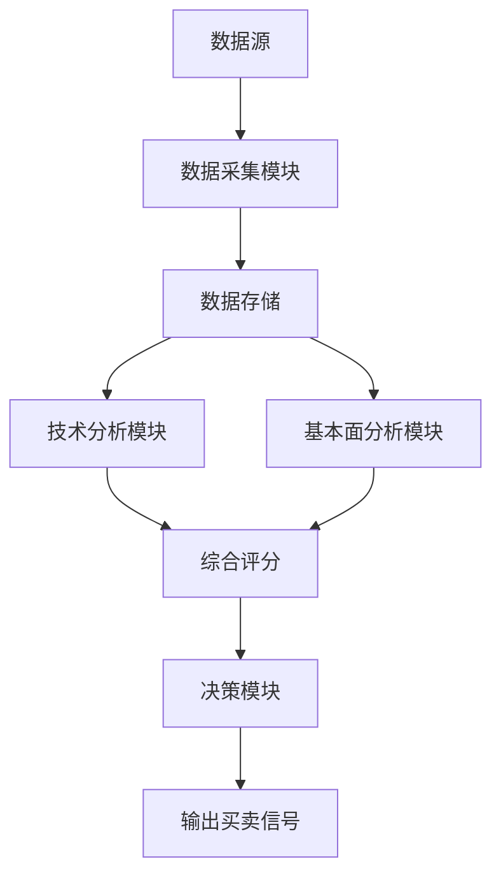

                 


# 威廉欧奈尔的技术面与基本面结合

## 关键词：技术分析、基本面分析、投资策略、威廉欧奈尔、结合方法

## 摘要：  
本文深入探讨了威廉欧奈尔的技术面与基本面结合的分析方法，通过逻辑推理和实例分析，揭示了这两种分析方法如何互补，帮助投资者做出更明智的决策。文章详细讲解了结合的原理、算法、系统架构，并通过实际案例展示了其应用效果。

---

## 第一章：背景介绍

### 1.1 技术分析的核心概念

- **技术分析的定义与历史发展**  
  技术分析是一种通过研究价格走势来预测未来市场行为的方法，起源于20世纪初。它基于价格反映所有信息的假设，认为市场行为包含一切有用的信息。

- **技术分析的主要工具与方法**  
  - **趋势线与支撑阻力**：帮助识别价格趋势和潜在的买卖信号。  
  - **移动平均线（MA）**：用于平滑价格波动，识别短期或长期趋势。  
  - **相对强弱指数（RSI）**：衡量资产的超买或超卖状态。  

- **技术分析在投资决策中的作用**  
  技术分析帮助投资者识别市场趋势，预测价格波动，但其局限性在于忽略了基本面因素。

### 1.2 基本面分析的核心概念

- **基本面分析的定义与特点**  
  基本面分析通过研究公司的财务状况、行业地位、宏观经济因素等，评估其内在价值。它假设市场价格会围绕其内在价值波动。

- **基本面分析的主要指标与方法**  
  - **市盈率（P/E）**：评估股票的估值是否合理。  
  - **ROE（净资产收益率）**：衡量公司的盈利能力。  
  - **现金流**：评估公司的财务健康状况。  

- **基本面分析在投资决策中的作用**  
  基本面分析帮助投资者识别具有长期增长潜力的公司，但其局限性在于难以捕捉短期市场波动。

### 1.3 技术面与基本面结合的必要性

- **技术面与基本面分析的优缺点对比**  
  | **分析方法** | **优点** | **缺点** |
  |----------------|-----------|-----------|
  | 技术分析      | 短期预测能力强 | 忽略长期价值 |
  | 基本面分析    | 评估长期价值 | 难以捕捉短期波动 |

- **技术面与基本面结合的优势**  
  结合两者可以实现短期与长期分析的互补，兼顾市场趋势和内在价值。

- **技术面与基本面结合的应用场景**  
  适用于股票投资、期货交易等金融市场，尤其在寻找买入或卖出信号时效果显著。

---

## 第二章：核心概念与联系

### 2.1 技术面与基本面的异同比较

- **技术面分析的特点**  
  - 侧重价格与成交量数据。  
  - 适用于短期交易策略。  

- **基本面分析的特点**  
  - 侧重公司财务数据和宏观经济指标。  
  - 适用于长期投资策略。  

- **技术面与基本面的协同效应**  
  技术分析捕捉市场情绪，基本面分析评估内在价值，两者结合可优化投资决策。

### 2.2 技术面与基本面的相互影响

- **技术面变化对基本面的影响**  
  突破或趋势变化可能反映市场对公司基本面的认可或否定。

- **基本面变化对技术面的影响**  
  公司业绩改善可能引发股价技术性突破。

### 2.3 技术面与基本面结合的理论框架

- **逻辑模型**  
  技术面反映市场情绪，基本面反映内在价值，两者结合可预测价格波动。

- **数学模型**  
  结合技术指标（如RSI）和基本面指标（如P/E）进行加权评分，公式如下：  
  $$ \text{综合评分} = w_1 \times \text{技术指标} + w_2 \times \text{基本面指标} $$  
  其中，$w_1$ 和 $w_2$ 是权重系数。

---

## 第三章：算法原理讲解

### 3.1 技术面与基本面结合的算法概述

- **算法目标**  
  利用技术指标和基本面数据预测股价走势。

- **算法流程**  
  1. 收集历史价格数据和财务数据。  
  2. 计算技术指标（如RSI、MA）。  
  3. 计算基本面指标（如P/E、ROE）。  
  4. 综合评分并预测股价走势。

### 3.2 技术面与基本面结合的数学模型

- **数学模型建立**  
  综合评分公式：  
  $$ S = \alpha \times T + \beta \times B $$  
  其中，$T$ 是技术指标评分，$B$ 是基本面指标评分，$\alpha$ 和 $\beta$ 是权重。

- **模型验证**  
  使用历史数据验证模型的准确性，调整权重以优化预测效果。

### 3.3 技术面与基本面结合的算法实现

- **代码示例**  
  ```python
  def calculate_technical_indicators(data):
      # 计算RSI
      rsi = compute_rsi(data['close'])
      # 计算MA
      ma = compute_ma(data['close'])
      return rsi, ma

  def calculate Fundamental_indicators(data):
      # 计算P/E
      pe = compute_pe(data['price'], data['earnings'])
      # 计算ROE
      roe = compute_roe(data['net_income'], data['equity'])
      return pe, roe

  def combined_score(data, alpha, beta):
      t = calculate_technical_indicators(data)
      b = calculate_fundamental_indicators(data)
      return alpha * t + beta * b
  ```

---

## 第四章：系统分析与架构设计

### 4.1 问题场景介绍

- **项目介绍**  
  构建一个结合技术面与基本面分析的综合投资系统。

- **系统功能设计**  
  - 数据采集模块：收集历史价格和财务数据。  
  - 分析模块：计算技术指标和基本面指标。  
  - 决策模块：根据综合评分生成买卖信号。  

- **系统架构设计**  
  使用分层架构：数据层、业务逻辑层、表现层。

### 4.2 系统架构图（Mermaid）



---

## 第五章：项目实战

### 5.1 环境安装

- **工具安装**  
  安装Python、Pandas、Matplotlib等工具。

### 5.2 核心实现代码

```python
import pandas as pd
import numpy as np

def compute_rsi(close_prices, n=14):
    # 计算RSI
    pass

def compute_pe(price, earnings):
    # 计算市盈率
    return price / earnings

def compute_roe(net_income, equity):
    # 计算ROE
    return net_income / equity

def combined_analysis(data, alpha, beta):
    rsi = compute_rsi(data['close'])
    pe = compute_pe(data['close'], data['earnings'])
    roe = compute_roe(data['net_income'], data['equity'])
    score = alpha * rsi + beta * pe + beta * roe
    return score
```

### 5.3 案例分析

- **案例选择**  
  以某股票为例，计算其RSI、PE和ROE，综合评分生成买卖信号。

### 5.4 分析与解读

- **结果展示**  
  综合评分高于阈值时，建议买入；低于阈值时，建议卖出。

---

## 第六章：总结与展望

### 6.1 总结

- **主要结论**  
  技术面与基本面结合能够提升投资决策的科学性。

### 6.2 注意事项

- **数据质量**  
  数据偏差可能影响结果。

### 6.3 拓展阅读

- **进一步学习**  
  探索机器学习在投资分析中的应用。

---

通过以上结构，文章详细讲解了威廉欧奈尔的技术面与基本面结合的方法，为投资者提供了理论支持和实践指导。

