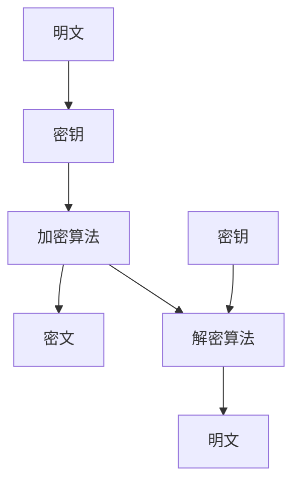
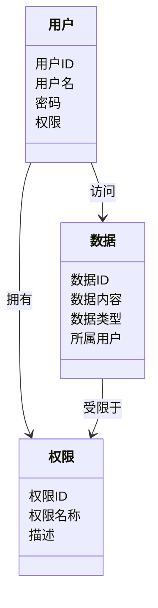
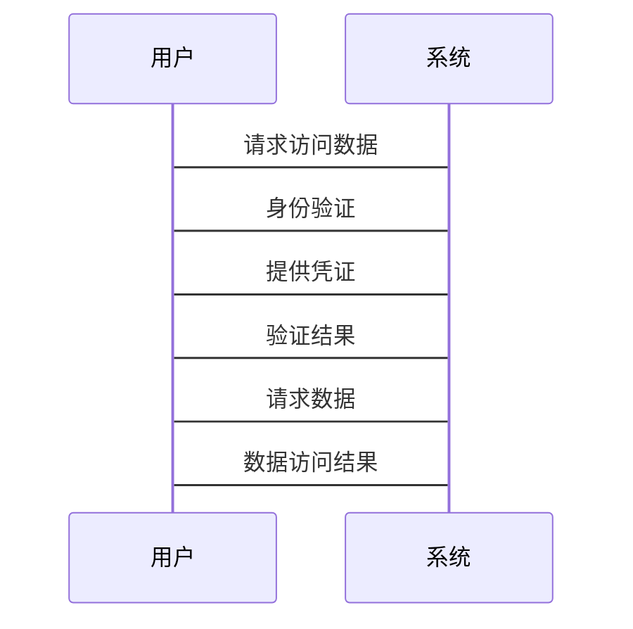

                 


# 安全性与数据隐私

## 关键词：
数据隐私，安全性，数据保护，加密技术，安全协议，身份验证。

## 摘要：
本文深入探讨了数据隐私与安全的核心概念、技术原理、系统设计和实际应用。通过分析数据隐私与安全的联系，介绍了加密技术、访问控制、身份验证等关键手段，并结合实际案例，展示了如何在系统中实现数据隐私与安全。

---

## 正文：

### 第一部分: 数据隐私与安全的基础概念

#### 第1章: 数据隐私与安全概述

##### 1.1 数据隐私的基本概念
数据隐私是指在收集、处理和存储个人数据时，保护这些数据不被未经授权的访问或泄露。数据隐私的核心原则包括数据最小化、目的限制和数据主体同意。保护个人隐私是数据隐私的重要目标，可以防止身份盗窃和欺诈。

##### 1.2 数据安全的基本概念
数据安全是指通过技术手段保护数据的完整性、机密性和可用性。数据安全的目标是防止数据泄露、篡改和丢失。常用的技术手段包括加密、访问控制和防火墙。

##### 1.3 数据隐私与安全的重要性
数据隐私与安全对个人、企业和社会都至关重要。数据泄露事件频发，技术进步带来的数据收集增多，使得数据隐私与安全面临挑战。遵守相关法规（如GDPR）和提高企业责任是实现数据隐私与安全的关键。

---

### 第二部分: 数据隐私与安全的核心概念与联系

#### 第2章: 数据隐私与安全的核心概念

##### 2.1 数据隐私的核心要素
数据隐私的核心要素包括数据主体、数据客体、数据处理者、数据最小化原则和数据匿名化。数据主体是数据的拥有者，数据客体是数据的载体，数据处理者负责处理数据。数据最小化原则要求只收集必要的数据，数据匿名化去除个人识别信息。

##### 2.2 数据安全的核心要素
数据安全的核心要素包括数据完整性、机密性和可用性，以及访问控制和身份验证。数据完整性确保数据未被篡改，机密性防止未经授权的访问，可用性保证数据在需要时可访问。访问控制和身份验证限制数据访问权限。

##### 2.3 数据隐私与安全的关联性
数据隐私与安全的目标一致，都是保护数据不被滥用。数据安全是实现数据隐私的手段，数据隐私是数据安全的目标。数据隐私关注个人数据，数据安全涉及整体系统。

---

#### 第3章: 数据隐私与安全的核心概念对比与联系

##### 3.1 数据隐私与安全的核心概念对比
数据隐私与安全的目标一致，但手段不同。数据隐私依赖数据最小化和匿名化，数据安全依赖加密和访问控制。数据隐私适用于个人数据处理，数据安全适用于所有数据处理。

##### 3.2 数据隐私与安全的联系与依赖关系
数据安全是数据隐私的基础，数据隐私是数据安全的目标。数据隐私依赖数据安全实现，数据安全需要数据隐私来实现最终目标。数据隐私与安全协同作用，保护数据不被滥用。

##### 3.3 数据隐私与安全的ER实体关系图（Mermaid）
```mermaid
erDiagram
    actor 用户 {
        <属性> 用户ID
        <属性> 用户名
        <属性> 密码
    }
    actor 数据 {
        <属性> 数据ID
        <属性> 数据内容
        <属性> 数据类型
    }
    actor 权限 {
        <属性> 权限ID
        <属性> 权限名称
        <属性> 权限描述
    }
    用户 --> 数据 : 访问
    用户 --> 权限 : 拥有
    数据 --> 权限 : 受限于
```

---

### 第三部分: 数据隐私与安全的算法原理

#### 第4章: 数据隐私与安全的算法原理

##### 4.1 加密技术
加密技术是数据安全的核心手段，包括对称加密（AES）和非对称加密（RSA）。AES加密用于保护数据的机密性，支持多种密钥长度。RSA加密基于公钥加密技术，用于安全通信。

##### 4.2 加密算法的流程图（Mermaid）


##### 4.3 加密技术的Python实现
```python
from cryptography.hazmat.primitives.ciphers import Cipher, algorithms, modes
from cryptography.hazmat.primitives.asymmetric import padding, rsa
from hashlib import sha256

# 对称加密（AES）
def aes_encrypt(plaintext, key):
    key = bytes.fromhex(key)
    cipher = Cipher(algorithms.AES(key), modes.ECB())
    encryptor = cipher.encryptor()
    return encryptor.update(plaintext) + encryptor.finalize()

# 非对称加密（RSA）
def rsa_encrypt(plaintext, public_key):
    rsa_cipher = rsa.RSAPublicNumbers(
        modulus=public_key.n,
        exponent=public_key.e
    ).private_key()
    encryptor = padding.RSAPKCS1v1_5(sym_algorithm=padding.AES128(), mgf1_hash=sha256)
    return encryptor.encrypt(plaintext)

# 哈希函数
def hash_function(data):
    hashed = sha256(data).hexdigest()
    return hashed
```

##### 4.4 加密算法的数学模型
AES加密基于置换和线性变换的分组密码，分组长度为128位，密钥长度可为128、192、256位。RSA加密基于大整数分解的公钥加密算法，公钥和私钥的生成涉及模运算和欧拉函数。

---

### 第四部分: 数据隐私与安全的系统设计

#### 第5章: 数据隐私与安全的系统设计

##### 5.1 问题场景分析
数据管理系统需要存储和管理用户数据，确保数据隐私和安全。应用场景包括企业级数据管理系统，处理大量敏感数据。

##### 5.2 系统功能设计（领域模型类图，Mermaid）


##### 5.3 系统架构设计（架构图，Mermaid）


##### 5.4 系统接口设计
用户身份验证接口、数据加密接口和数据访问控制接口是系统设计的关键部分。用户身份验证接口验证用户凭证，数据加密接口加密明文数据，数据访问控制接口根据用户权限控制数据访问。

##### 5.5 系统交互流程图（Mermaid）


---

### 第五部分: 项目实战

#### 第6章: 项目实战

##### 6.1 环境安装与配置
开发环境安装Python 3.x，配置虚拟环境，并安装cryptography库。

```bash
pip install cryptography
```

##### 6.2 核心代码实现
实现非对称加密和对称加密功能，使用RSA和AES算法进行数据加密和解密。

```python
from cryptography.hazmat.primitives.asymmetric.rsa import (
    RSAPublicNumbers, 
    RSAParameters, 
    PublicKey
)
from cryptography.hazmat.primitives.asymmetric import padding
from cryptography.hazmat.primitives import hashes

# 非对称加密
def generate_rsa_key():
    key = rsa.generate_private_key(
        public_exponent=65537,
        key_size=2048
    )
    return key

def rsa_encrypt(key, plaintext):
    public_key = key.public_key()
    cipher = padding.RSAPKCS1v1_5(
        mgry_hash=hashes.SHA256()
    )
    ciphertext = public_key.encrypt(
        plaintext,
        cipher
    )
    return ciphertext

def rsa_decrypt(key, ciphertext):
    plaintext = key.decrypt(ciphertext)
    return plaintext

# 对称加密
def aes_encrypt(key, plaintext):
    cipher = Cipher(algorithms.AES(key), modes.ECB())
    encryptor = cipher.encryptor()
    return encryptor.update(plaintext) + encryptor.finalize()

def aes_decrypt(key, ciphertext):
    cipher = Cipher(algorithms.AES(key), modes.ECB())
    decryptor = cipher.decryptor()
    return decryptor.update(ciphertext) + decryptor.finalize()
```

##### 6.3 代码应用解读
非对称加密使用RSA算法，生成公钥和私钥，用于数据的安全传输。对称加密使用AES算法，对数据进行加密和解密，保证数据的机密性。

##### 6.4 实际案例分析
开发一个数据加密工具，用于保护敏感数据。用户输入明文数据，生成RSA密钥对，使用公钥对数据进行加密，存储密文数据和公钥，用户使用私钥解密数据。

##### 6.5 项目小结
成功实现数据的加密和解密功能，提高数据安全性。密钥管理和加密算法的选择是实现数据隐私与安全的关键。

---

### 第六部分: 最佳实践、小结、注意事项、拓展阅读

#### 第7章: 最佳实践、小结、注意事项、拓展阅读

##### 7.1 最佳实践
制定安全策略，明确数据分类、访问控制和加密策略。定期进行安全审计，检查系统漏洞，确保策略的有效性。提高员工的安全意识，防止人为错误。

##### 7.2 小结
本文详细讲解了数据隐私与安全的核心概念、技术原理和系统设计。通过实际案例展示了如何在项目中应用这些技术，实现数据隐私与安全。

##### 7.3 注意事项
密钥管理是数据安全的关键，必须妥善保管。遵守相关法律法规，如GDPR。随着技术的发展，及时更新安全措施，应对新的安全威胁。

##### 7.4 拓展阅读
推荐书籍：《网络安全：技术与实践》。推荐博客：TechCrunch的安全与隐私专栏。推荐在线课程：Coursera上的《网络安全基础》。

---

以上是《安全性与数据隐私》的技术博客文章的详细内容，涵盖了数据隐私与安全的核心概念、技术原理、系统设计和实际应用。通过理论与实践相结合，帮助读者深入理解数据隐私与安全的重要性，并掌握相关技术手段。

