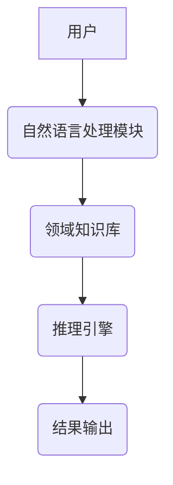
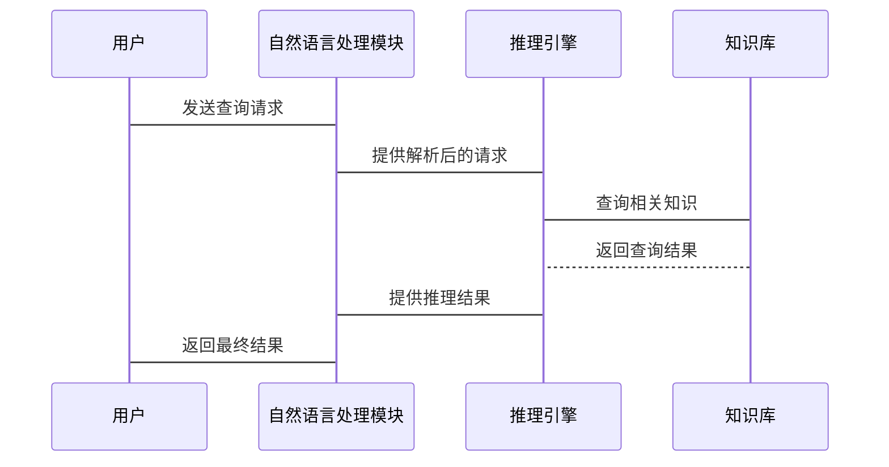

                 


# 定制化AI Agent：满足特定行业需求

> 关键词：定制化AI Agent，自然语言处理，机器学习，知识图谱，行业需求，系统架构，对话系统

> 摘要：定制化AI Agent是人工智能领域的重要研究方向，旨在根据特定行业的需求，设计和实现能够满足该行业独特要求的智能代理系统。本文从定制化AI Agent的背景、核心技术、算法原理、系统架构设计、项目实战等方面进行深入分析，探讨如何在不同行业中有效应用定制化AI Agent，并通过实际案例展示其应用价值。

---

## 第一部分：定制化AI Agent的背景与概念

### 第1章：定制化AI Agent的背景与概念

#### 1.1 定制化AI Agent的定义与特点

定制化AI Agent（Customized AI Agent）是指根据特定行业或应用场景的需求，量身定制的智能代理系统。与通用AI Agent相比，定制化AI Agent更加专注于解决特定领域的问题，能够更好地满足行业需求。

- **定义**：定制化AI Agent是一种基于人工智能技术的智能系统，通过深度学习、自然语言处理和知识图谱等技术，实现对特定领域问题的精准理解和智能响应。
- **特点**：
  - 针对性：专注于特定行业或领域的需求。
  - 可定制性：可以根据不同行业的需求进行灵活调整。
  - 高效性：通过优化算法和数据处理流程，提高问题解决效率。
  - 可扩展性：支持不同行业的扩展和集成。

#### 1.2 定制化AI Agent的重要性

随着人工智能技术的快速发展，各行各业都在积极探索如何利用AI技术提升效率和竞争力。定制化AI Agent的出现，为各行业提供了更加精准和高效的解决方案。

- **重要性**：
  - 提高行业效率：通过定制化AI Agent，企业可以更高效地处理复杂问题，减少人工干预。
  - 降低成本：定制化AI Agent可以通过自动化流程，降低企业的运营成本。
  - 提升用户体验：定制化AI Agent能够根据用户需求提供个性化的服务，提升用户体验。

#### 1.3 定制化AI Agent的核心要素

定制化AI Agent的核心要素包括：

- **领域知识**：特定行业的专业知识和数据。
- **自然语言处理**：实现人机交互的自然语言理解与生成。
- **机器学习算法**：用于模型训练和优化。
- **知识图谱**：构建行业领域的知识库，支持智能推理。

---

## 第二部分：定制化AI Agent的核心技术

### 第2章：自然语言处理技术

自然语言处理（NLP）是定制化AI Agent的核心技术之一，主要用于实现人机交互中的语言理解和生成。

#### 2.1 自然语言处理基础

- **NLP的基本概念**：自然语言处理是研究如何让计算机理解和生成人类语言的技术。
- **常见NLP任务**：
  - 语言理解（NLU）：如文本分类、实体识别、意图识别。
  - 语言生成（NLG）：如机器翻译、文本摘要、对话生成。

#### 2.2 语言模型的定制化

- **预训练语言模型的微调**：利用大规模预训练语言模型（如BERT、GPT），针对特定行业数据进行微调，提升模型的领域适应性。
- **行业特定词典的构建**：针对特定行业，构建行业专属的词典和知识库，提升模型对行业术语的理解能力。

#### 2.3 对话系统的定制化

- **基于规则的对话系统**：通过预定义的规则和逻辑，实现简单的人机对话。
- **基于生成模型的对话系统**：利用生成式模型（如GPT、Transformer），生成自然流畅的对话内容。

---

### 第3章：机器学习算法

机器学习是定制化AI Agent的另一项核心技术，主要用于模型训练和优化。

#### 3.1 监督学习

- **分类任务**：如垃圾邮件分类、客户情感分析。
- **回归任务**：如房价预测、销售预测。

#### 3.2 无监督学习

- **聚类分析**：如客户分群、文档聚类。
- **主题模型**：如LDA（主题模型）用于文档主题分析。

#### 3.3 强化学习

- **状态、动作、奖励**：强化学习通过不断试错，学习最优策略。
- **策略网络与价值网络**：如DQN算法用于智能体决策。

---

## 第三部分：定制化AI Agent的系统架构

### 第4章：系统架构设计

#### 4.1 问题场景介绍

定制化AI Agent的系统架构设计需要根据具体的行业需求进行量身定制。以下是一个通用的系统架构设计框架：

#### 4.2 系统功能设计

- **领域模型**：构建行业领域的知识图谱，支持智能推理。
- **对话系统**：实现自然语言理解和生成。
- **推理引擎**：基于知识图谱和逻辑推理，提供智能决策支持。

#### 4.3 系统架构设计



#### 4.4 系统接口设计

- **输入接口**：接收用户的自然语言输入。
- **输出接口**：输出智能代理的响应结果。
- **知识库接口**：与领域知识库进行数据交互。

#### 4.5 系统交互设计



---

## 第四部分：定制化AI Agent的项目实战

### 第5章：项目实战

#### 5.1 环境配置

- **安装Python环境**：建议使用Python 3.8及以上版本。
- **安装依赖库**：如TensorFlow、Keras、NLTK、spaCy等。

#### 5.2 核心代码实现

```python
# 自然语言处理模块
import spacy

# 加载预训练的英语模型
nlp = spacy.load("en_core_web_sm")

# 自定义实体识别
def custom_entityRecognizer(text):
    doc = nlp(text)
    entities = []
    for ent in doc.ents:
        entities.append((ent.start_char, ent.end_char, ent.label_))
    return entities

# 机器学习模型训练
import tensorflow as tf
from tensorflow.keras import layers

model = tf.keras.Sequential([
    layers.Dense(64, activation='relu'),
    layers.Dense(1, activation='sigmoid')
])

model.compile(optimizer='adam', loss='binary_crossentropy', metrics=['accuracy'])
model.fit(x_train, y_train, epochs=10, batch_size=32)
```

#### 5.3 实际案例分析

- **案例背景**：假设我们需要为医疗行业定制一个AI Agent，用于辅助医生进行疾病诊断。
- **系统实现**：
  - 使用自然语言处理模块，理解医生的输入描述。
  - 利用知识图谱进行疾病推理。
  - 返回可能的疾病诊断结果。

#### 5.4 项目小结

通过实际案例分析，我们可以看到定制化AI Agent在特定行业中的巨大潜力。通过结合自然语言处理、知识图谱和机器学习技术，我们可以为不同行业提供高效的解决方案。

---

## 第五部分：总结与展望

### 第6章：总结与展望

#### 6.1 本章总结

定制化AI Agent是人工智能领域的重要研究方向。通过结合自然语言处理、机器学习和知识图谱等技术，我们可以为不同行业提供高效、精准的智能代理系统。

#### 6.2 未来展望

未来，随着人工智能技术的不断发展，定制化AI Agent将在更多行业中得到广泛应用。同时，如何进一步优化算法、提升系统性能，也将成为研究的重点方向。

---

## 参考文献

1. TensorFlow官方文档
2. PyTorch官方文档
3. spaCy官方文档
4. BERT论文：《BERT: Pre-training of Deep Bidirectional Transformers for Natural Language Processing》
5. GPT论文：《The GPT-2 paper: "Next Generation Text Generation"》

---

通过本文的详细分析，我们可以看到定制化AI Agent在特定行业中的巨大潜力。希望本文能够为读者提供有价值的参考，帮助他们在实际应用中更好地利用定制化AI Agent技术。

