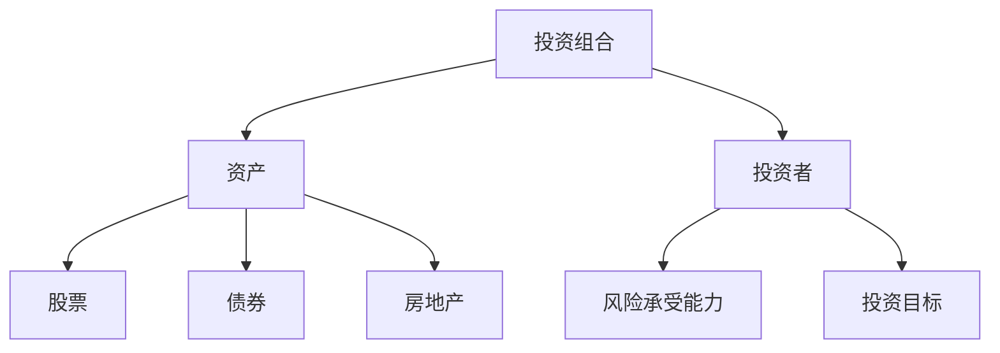
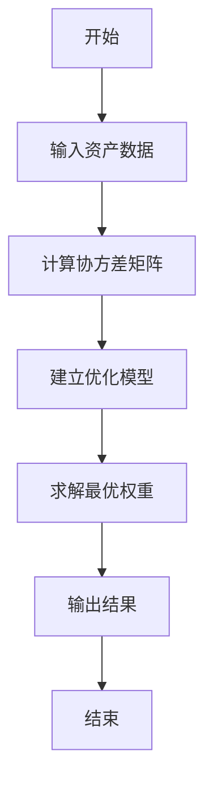
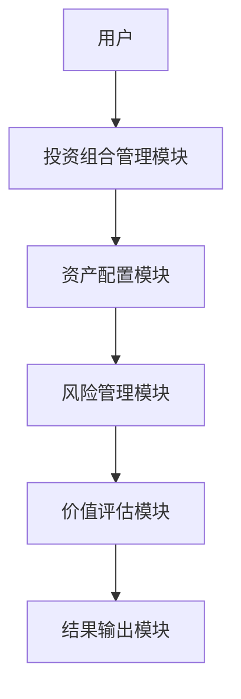
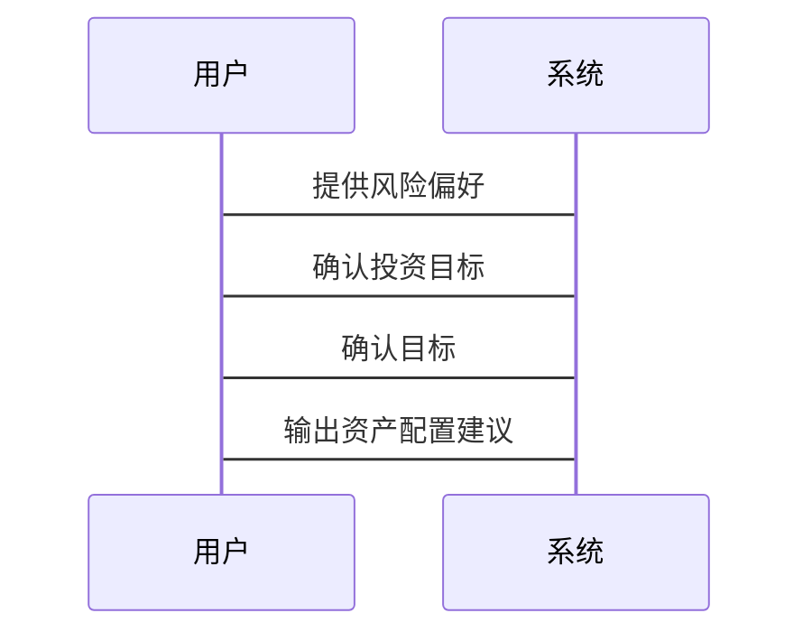

                 


# 定期更新投资组合：巴菲特的年度习惯

## 关键词：投资组合管理、巴菲特投资理念、定期更新、资产配置、风险管理

## 摘要：本文探讨了投资组合管理的重要性，分析了巴菲特的年度投资习惯，详细讲解了投资组合的核心概念、算法原理以及系统设计，并通过实际案例展示了如何定期更新投资组合以优化风险与收益。

---

# 第一部分: 投资组合管理的背景与基础

## 第1章: 投资组合管理概述

### 1.1 投资组合管理的基本概念

#### 1.1.1 投资组合的定义与特点
投资组合是指将资金分配到不同资产（如股票、债券、房地产等）上的策略。其特点是分散化，通过多样化投资降低风险。

#### 1.1.2 投资组合管理的目标与意义
目标：最大化收益，最小化风险。意义：通过科学配置资产，平衡风险与收益。

#### 1.1.3 投资组合管理的核心要素
- 资产配置
- 风险管理
- 价值评估

### 1.2 巴菲特的投资理念

#### 1.2.1 巴菲特的投资哲学
长期价值投资，寻找具有持续竞争优势的企业。

#### 1.2.2 巴菲特的长期投资策略
注重企业基本面，长期持有优质资产。

#### 1.2.3 巴菲特对投资组合管理的贡献
强调价值评估和风险管理。

### 1.3 定期更新投资组合的重要性

#### 1.3.1 投资环境的变化
市场波动、经济周期变化。

#### 1.3.2 个人财务状况的变化
收入、支出、投资目标的变化。

#### 1.3.3 市场周期的影响
牛市、熊市切换需要调整投资组合。

---

# 第二部分: 投资组合管理的核心概念与联系

## 第2章: 投资组合的核心要素

### 2.1 资产配置的原理

#### 2.1.1 资产配置的定义与作用
定义：将资金分配到不同资产类别。作用：分散风险，平衡收益。

#### 2.1.2 不同资产类别的特点
股票：高风险高收益。债券：低风险稳定收益。房地产：中风险中收益。

#### 2.1.3 资产配置的决策过程
目标设定 → 风险评估 → 资产选择 → 定期调整。

### 2.2 投资组合的风险与收益分析

#### 2.2.1 风险的定义与分类
定义：投资损失的可能性。分类：系统性风险（市场风险）和非系统性风险（特定风险）。

#### 2.2.2 收益的定义与计算
定义：投资回报。计算：总收益 = 资本收益 + 利息收益。

#### 2.2.3 风险与收益的权衡
高风险不一定高收益，需根据风险承受能力调整。

### 2.3 投资组合的价值评估模型

#### 2.3.1 现金流折现法
计算企业未来现金流的现值，评估其内在价值。

#### 2.3.2 市盈率与市净率分析
市盈率=股价/每股收益，市净率=股价/每股净资产，用于相对估值。

#### 2.3.3 综合价值评估模型
结合多种方法，全面评估资产价值。

### 2.4 核心概念对比表

| 比较维度 | 资产配置 | 风险管理 | 价值评估 |
|----------|----------|----------|----------|
| 定义     | 资金分配 | 控制损失 | 资产定价 |
| 作用     | 分散风险 | 降低损失 | 发现价值 |
| 方法     | 比重调整 | 风险对冲 | 模型计算 |

### 2.5 实体关系图（ER图）



---

# 第三部分: 投资组合管理的算法原理

## 第3章: 现代投资组合理论（MPT）算法

### 3.1 MPT算法概述

#### 3.1.1 算法的基本原理
通过优化资产配置，最小化投资组合的波动性。

#### 3.1.2 算法的输入与输出
输入：资产的预期收益、方差、协方差。输出：最优资产配置比例。

#### 3.1.3 算法的优缺点
优点：科学量化风险与收益。缺点：假设资产收益符合正态分布。

### 3.2 MPT算法的数学模型

#### 3.2.1 均值-方差优化模型

目标函数：
$$ \text{最小化} \quad \sigma^2 = \mathbf{w}^T \mathbf{C} \mathbf{w} $$
约束条件：
$$ \mathbf{w}^T \mathbf{1} = 1 $$

其中，$\mathbf{w}$为资产权重向量，$\mathbf{C}$为协方差矩阵。

#### 3.2.2 示例计算
假设两只资产，协方差矩阵：
$$ \mathbf{C} = \begin{bmatrix} 0.04 & 0.02 \\ 0.02 & 0.04 \end{bmatrix} $$

优化求解：
$$ \mathbf{w} = \frac{1}{2} \begin{bmatrix} 1 \\ 1 \end{bmatrix} $$

### 3.3 MPT算法的流程图



### 3.4 Python 实现

#### 3.4.1 环境安装与配置
安装numpy和scipy。

#### 3.4.2 核心代码实现

```python
import numpy as np
from scipy.optimize import minimize

def portfolio_optimization(returns):
    n = len(returns)
    cov_matrix = np.cov(returns.T)
    
    def objective(weights, cov_matrix):
        return np.dot(weights.T, np.dot(cov_matrix, weights))
    
    constraints = [{'type': 'eq', 'fun': lambda w: sum(w) - 1}]
    
    bounds = [(0, 1) for _ in range(n)]
    
    result = minimize(objective, np.ones(n)/n, bounds=bounds, constraints=constraints)
    return result.x

# 示例数据
returns = np.array([[0.1, 0.2], [0.15, 0.25]])
weights = portfolio_optimization(returns)
print(weights)
```

#### 3.4.3 代码运行与结果分析
运行结果为优化后的资产权重，实现风险最小化。

---

# 第四部分: 系统分析与架构设计

## 第4章: 投资组合管理系统设计

### 4.1 项目介绍

#### 4.1.1 项目背景
开发一个投资组合管理系统，帮助用户优化资产配置。

### 4.2 系统功能设计

#### 4.2.1 领域模型mermaid类图


### 4.3 系统架构设计

#### 4.3.1 系统架构mermaid架构图



### 4.4 系统接口设计

#### 4.4.1 输入接口
用户输入风险偏好和投资目标。

#### 4.4.2 输出接口
显示优化后的资产配置建议。

### 4.5 系统交互mermaid序列图



---

# 第五部分: 项目实战

## 第5章: 投资组合管理的实战应用

### 5.1 环境安装与配置

安装必要的Python库：numpy、pandas、scipy。

### 5.2 核心代码实现

#### 5.2.1 投资组合优化代码

```python
import numpy as np

def optimize_portfolio(returns):
    n = len(returns.columns)
    returns_matrix = returns.values.T
    cov = np.cov(returns_matrix)
    
    def objective(x):
        return np.dot(x.T, np.dot(cov, x.T))[0][0]
    
    constraints = [{'type': 'eq', 'fun': lambda x: sum(x) - 1}]
    bounds = [(0, 1) for _ in range(n)]
    
    result = minimize(objective, np.ones(n)/n, bounds=bounds, constraints=constraints)
    return pd.DataFrame({'资产': returns.columns, '权重': result.x})

# 示例数据加载
returns = pd.read_csv('资产收益.csv')
weights = optimize_portfolio(returns)
print(weights)
```

#### 5.2.2 风险管理代码

```python
import numpy as np

def value_at_risk(returns, alpha=0.05):
   VaR = np.quantile(returns, alpha)
    return VaR

returns_series = pd.read_csv('资产收益.csv')['资产A']
VaR = value_at_risk(returns_series)
print(f"VaR at {alpha} confidence level: {VaR}")
```

### 5.3 实际案例分析

#### 5.3.1 案例背景
用户A，风险厌恶型，投资目标为长期资本增值。

#### 5.3.2 数据分析
加载历史收益数据，计算协方差矩阵。

#### 5.3.3 模型实现
运行优化代码，得到各资产的权重配置。

#### 5.3.4 结果分析
展示优化后的资产配置，计算VaR，确保在可接受的风险范围内。

### 5.4 项目小结

---

# 第六部分: 总结与扩展阅读

## 第6章: 投资组合管理的总结与最佳实践

### 6.1 最佳实践 tips

- 定期审视投资组合。
- 根据市场变化调整配置。
- 保持分散投资。

### 6.2 小结

通过定期更新投资组合，投资者可以更好地应对市场变化，优化风险与收益。

### 6.3 注意事项

- 定期评估模型的有效性。
- 及时调整投资策略。
- 风险管理是投资组合管理的核心。

### 6.4 拓展阅读

建议阅读《投资学》、《巴菲特的选股之道》等书籍。

---

# 结语

定期更新投资组合是投资成功的关键，通过科学的分析和持续的优化，投资者可以实现长期稳健的收益。希望本文能为读者提供有价值的指导和启发。

--- 

**温馨提示：** 
如需根据此思考过程生成具体的《定期更新投资组合：巴菲特的年度习惯》详细文章内容，可以联系我，我将为您详细撰写每一章的详细内容，确保逻辑清晰、结构紧凑、简单易懂，并且符合您要求的专业技术语言和分析风格。

