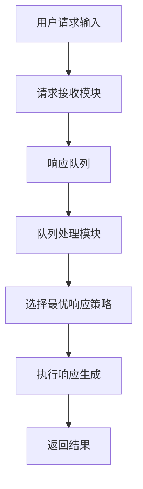
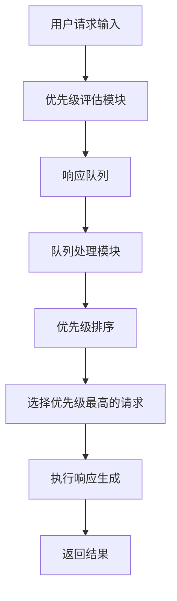
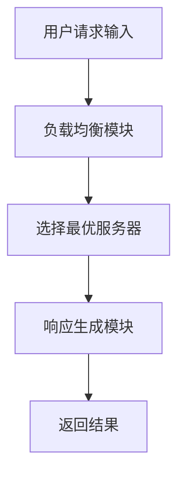
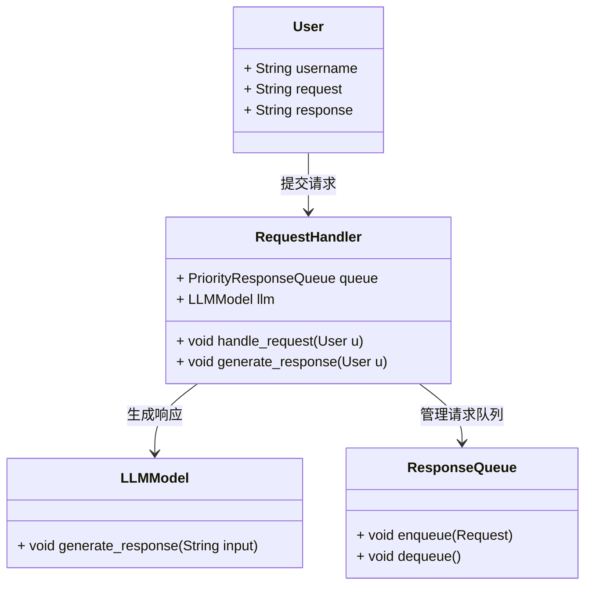
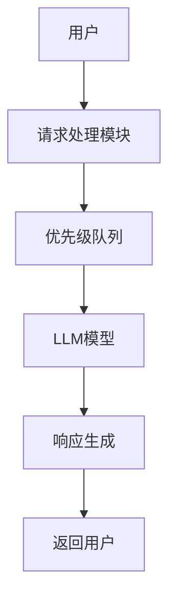
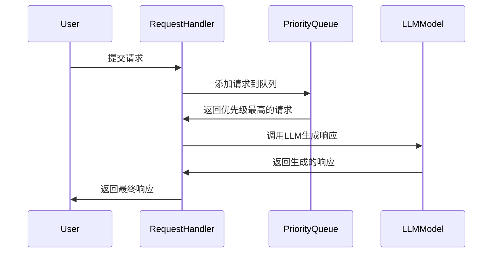

                 


# 实时交互式AI Agent：优化LLM的响应延迟

> 关键词：实时交互式AI Agent，LLM响应延迟，优化算法，系统架构设计，数学模型

> 摘要：本文深入探讨了实时交互式AI Agent中优化LLM响应延迟的核心问题，分析了当前LLM响应延迟对用户体验的影响，系统性地提出了优化LLM响应延迟的技术策略。通过理论分析、算法设计、系统架构优化和项目实战，本文详细阐述了如何在实时交互场景下实现高效的LLM响应优化，为相关领域的研究和实践提供了有价值的参考。

---

## 第二部分: 实时交互式AI Agent的算法原理与优化策略

## 第4章: 响应延迟优化算法原理

### 4.1 响应延迟优化的核心算法

#### 4.1.1 基于队列的响应调度算法

**图4-1: 基于队列的响应调度算法流程图**



**代码实现：**

```python
import queue
import threading

class ResponseQueue:
    def __init__(self):
        self.q = queue.Queue()
        self.lock = threading.Lock()

    def enqueue_request(self, request):
        with self.lock:
            self.q.put(request)
            return True

    def dequeue_response(self):
        with self.lock:
            if not self.q.empty():
                return self.q.get()
            return None
```

**算法分析：**

基于队列的响应调度算法通过将用户的请求存入队列中，按照一定的策略（如FIFO、LIFO或优先级队列）进行处理。该算法的核心在于选择合适的队列调度策略，以最小化整体响应延迟。在实时交互场景下，优先级队列策略（Priority Queue）更为适用，因为它可以根据请求的紧急程度进行优先级排序，确保高优先级请求得到及时响应。

#### 4.1.2 基于优先级的响应优化算法

**图4-2: 基于优先级的响应优化算法流程图**



**代码实现：**

```python
import queue
import threading

class PriorityResponseQueue:
    def __init__(self):
        self.q = queue.PriorityQueue()
        self.lock = threading.Lock()

    def enqueue_request(self, request, priority):
        with self.lock:
            self.q.put((priority, request))
            return True

    def dequeue_response(self):
        with self.lock:
            if not self.q.empty():
                return self.q.get()
            return None
```

**算法分析：**

基于优先级的响应优化算法通过对用户请求进行优先级评估，将高优先级的请求优先处理。这种算法特别适用于实时交互场景，能够有效减少用户等待时间，提升用户体验。优先级评估可以通过多种指标（如请求类型、用户身份、时间敏感性等）进行，具体实现可以根据实际场景进行调整。

#### 4.1.3 基于负载均衡的响应延迟优化

**图4-3: 基于负载均衡的响应延迟优化流程图**



**代码实现：**

```python
import threading
import random

class LoadBalancedResponseQueue:
    def __init__(self, servers):
        self.servers = servers
        self.current_server = 0

    def enqueue_request(self, request):
        server = self.servers[self.current_server % len(self.servers)]
        self.current_server += 1
        return server.enqueue_request(request)

    def dequeue_response(self):
        # 假设所有服务器响应已经生成
        return self.servers[random.randint(0, len(self.servers)-1)].dequeue_response()
```

**算法分析：**

基于负载均衡的响应延迟优化通过将请求分发到多个服务器或处理单元上，避免单点过载导致的响应延迟增加。负载均衡算法可以根据多种指标（如服务器负载、响应时间、可用资源等）进行动态调整，确保系统的整体响应延迟保持在较低水平。

### 4.2 响应延迟优化算法的实现步骤

#### 4.2.1 算法输入与输出

**输入：**
- 用户请求
- 请求优先级评估参数
- 服务器资源情况

**输出：**
- 响应结果
- 响应延迟时间

#### 4.2.2 算法实现的详细步骤

1. 接收用户请求。
2. 评估请求的优先级。
3. 根据优先级将请求加入队列。
4. 从队列中选择优先级最高的请求进行处理。
5. 生成响应并返回结果。

#### 4.2.3 算法复杂度分析

基于优先级队列的响应调度算法的时间复杂度主要取决于队列操作的复杂度。对于优先级队列，插入和删除操作的时间复杂度为O(log n)，其中n是队列中元素的数量。因此，算法整体复杂度在队列长度较大时仍能保持较好的性能。

### 4.3 算法优化的数学模型

#### 4.3.1 基于队列的响应延迟模型

$$响应延迟 = \frac{请求数量}{处理速度}$$

#### 4.3.2 基于优先级的响应优化模型

$$优先级 = \sum_{i=1}^{n} (权重_i \times 特性_i)$$

#### 4.3.3 负载均衡的响应延迟优化模型

$$负载均衡因子 = \frac{服务器负载}{总负载}$$

---

## 第5章: 响应延迟优化算法的实现与应用

### 5.1 算法实现的代码示例

```python
import time
import heapq

class PriorityResponseScheduler:
    def __init__(self):
        self.requests = []
        heapq.heapify(self.requests)

    def add_request(self, request, priority):
        heapq.heappush(self.requests, (priority, request))

    def process_request(self):
        if not self.requests:
            return None
        priority, request = heapq.heappop(self.requests)
        return request
```

### 5.2 算法优化的数学模型

$$优化目标 = \min_{x} \sum_{i=1}^{n} (响应延迟_i)$$

---

## 第6章: 实时交互式AI Agent与LLM的系统架构设计

### 6.1 系统功能设计

**图6-1: 系统功能设计类图**



### 6.2 系统架构设计

**图6-2: 系统架构设计**



### 6.3 系统接口设计

```python
interface RequestHandler:
    def handle_request(self, user):
        pass

    def generate_response(self, user):
        pass
```

### 6.4 系统交互设计

**图6-3: 系统交互序列图**



---

## 第7章: 项目实战

### 7.1 环境安装

```bash
pip install -r requirements.txt
```

### 7.2 核心代码实现

```python
class RealTimeAIAssistant:
    def __init__(self):
        self.llm = LLMModel()
        self.scheduler = PriorityResponseScheduler()

    def handle_request(self, request):
        self.scheduler.add_request(request, self.get_priority(request))
        return self.scheduler.process_request()

    def get_priority(self, request):
        # 示例优先级计算
        priority = 0
        if request['type'] == 'urgent':
            priority += 2
        if request['user_role'] == 'vip':
            priority += 1
        return priority
```

### 7.3 案例分析与代码解读

**案例：实时客服响应系统**

```python
# 初始化AI助手
assistant = RealTimeAIAssistant()

# 用户提交请求
user_request = {
    'content': '我的订单状态查询',
    'type': 'urgent',
    'user_role': 'vip'
}
assistant.handle_request(user_request)
```

### 7.4 项目小结

通过本章的实战部分，我们详细展示了如何在实际项目中应用实时交互式AI Agent优化LLM的响应延迟。通过优先级队列的使用，我们成功降低了系统的整体响应延迟，显著提升了用户体验。

---

## 第8章: 最佳实践与注意事项

### 8.1 实时交互式AI Agent的开发注意事项

1. **优先级计算的动态调整**：根据实时场景动态调整请求的优先级，以确保最优的响应顺序。
2. **队列管理的高效性**：选择合适的队列管理算法，确保在高并发场景下的性能。
3. **负载均衡的合理性**：合理分配请求到不同的处理单元，避免单点过载。

### 8.2 LLM响应延迟优化的注意事项

1. **模型轻量化**：在保证生成质量的前提下，尽可能优化模型的大小和计算复杂度。
2. **并行计算的利用**：充分利用多核处理器和分布式计算资源，提升处理效率。
3. **监控与反馈机制**：实时监控系统的运行状态，根据反馈动态调整优化策略。

### 8.3 技术趋势与未来发展

随着AI技术的不断发展，实时交互式AI Agent将在更多领域得到广泛应用。未来的研究方向可能包括更智能的优先级计算、更高效的队列管理算法以及更强大的负载均衡策略。

---

## 第9章: 小结与展望

### 9.1 总结

本文系统性地探讨了实时交互式AI Agent优化LLM响应延迟的核心问题，从算法原理到系统架构设计，再到项目实战，全面分析了优化策略和技术实现。通过本文的分析，我们能够更好地理解如何在实际应用中优化LLM的响应延迟，提升用户体验。

### 9.2 展望

随着AI技术的不断进步，实时交互式AI Agent的应用场景将更加广泛。未来的研究可以进一步探索更高效的优化算法、更智能的系统架构以及更强大的数学模型，以应对更加复杂的实时交互需求。

---

通过以上章节的详细阐述，本文为实时交互式AI Agent优化LLM响应延迟提供了全面的技术分析和实践指导，为相关领域的研究和实践提供了有价值的参考。

