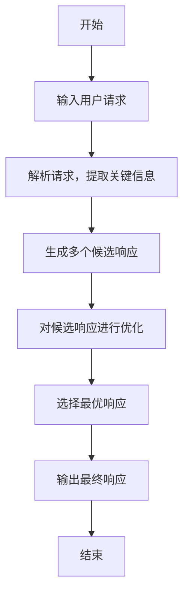
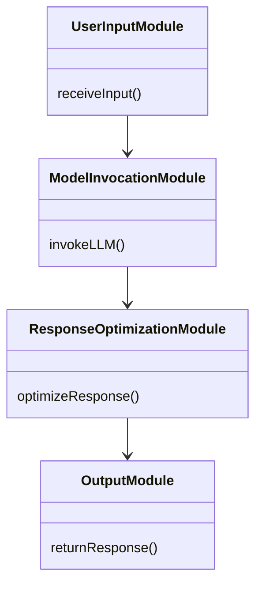
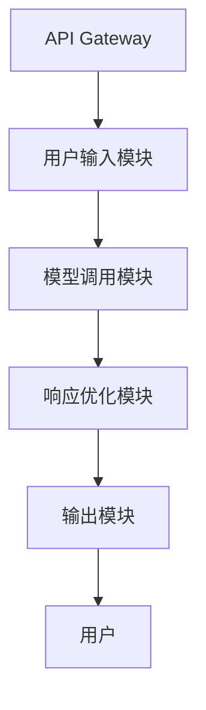

                 


# 实时响应型AI Agent：优化LLM的计算效率

---

## 关键词
- 实时响应型AI Agent
- 大语言模型（LLM）
- 计算效率优化
- 并行计算
- 模型剪枝

---

## 摘要
实时响应型AI Agent是一种能够实时处理用户请求并生成响应的智能系统，其核心依赖于大语言模型（LLM）的性能。为了满足实时响应的需求，优化LLM的计算效率至关重要。本文从实时响应型AI Agent的核心概念出发，详细分析其算法原理、系统架构，并通过实际案例展示如何优化LLM的计算效率，以实现高效、实时的AI响应。

---

## 第一部分：实时响应型AI Agent概述

### 第1章：AI Agent与实时响应型AI Agent概述

#### 1.1 AI Agent的基本概念
AI Agent（人工智能代理）是一种能够感知环境、自主决策并执行任务的智能实体。它可以分为**反应式代理**和**认知式代理**两大类：
- **反应式代理**：基于当前感知做出实时反应，如实时聊天机器人。
- **认知式代理**：具备复杂推理能力，如自动驾驶系统。

AI Agent的核心特点包括：
1. **自主性**：无需外部干预即可执行任务。
2. **反应性**：能够实时感知环境并做出反应。
3. **目标导向性**：以特定目标为导向执行任务。
4. **学习能力**：通过数据学习提升性能。

#### 1.2 实时响应型AI Agent的背景与意义
实时响应型AI Agent是一种特殊的反应式代理，其核心目标是**在极短时间内生成高质量的自然语言响应**。随着自然语言处理（NLP）技术的快速发展，实时响应型AI Agent在以下场景中发挥重要作用：
- **实时客服支持**：为企业提供即时的客户支持服务。
- **智能对话系统**：如智能音箱、智能助手等。
- **实时信息检索**：在新闻、医疗等领域提供实时信息查询服务。

实时响应型AI Agent的优势在于其**快速响应能力**，这要求底层的大语言模型必须具备高效的计算效率。然而，LLM的计算效率与响应时间直接相关，优化LLM的计算效率是实现实时响应型AI Agent的核心挑战。

#### 1.3 大语言模型（LLM）的概述
大语言模型（LLM）是一种基于深度学习的NLP模型，通常采用Transformer架构。其核心特点包括：
1. **大规模训练数据**：通常使用海量文本数据进行训练。
2. **自注意力机制**：能够捕捉文本中的长距离依赖关系。
3. **多任务学习能力**：可以通过微调实现多种NLP任务。

LLM的典型应用场景包括：
- **文本生成**：生成高质量的文章、对话等。
- **问答系统**：基于上下文回答问题。
- **机器翻译**：实现多种语言的实时翻译。

---

### 第2章：实时响应型AI Agent的核心概念与联系

#### 2.1 实时响应型AI Agent的核心概念
实时响应型AI Agent的核心概念可以分为以下几个方面：
1. **实时性**：要求在极短时间内生成响应，通常要求响应时间在**100~200ms**以内。
2. **交互性**：支持多轮对话，能够根据上下文生成连贯的响应。
3. **准确性**：生成的响应必须准确无误，符合语境和用户需求。

实时响应型AI Agent的工作原理可以分为以下几个步骤：
1. **用户输入解析**：解析用户的输入，提取关键信息。
2. **生成响应**：基于LLM生成候选响应。
3. **响应优化**：对候选响应进行优化，确保准确性和流畅性。
4. **输出响应**：将优化后的响应返回给用户。

#### 2.2 实时响应型AI Agent与LLM的关系
实时响应型AI Agent的高度依赖于LLM的性能，主要体现在以下几个方面：
1. **计算效率**：实时响应型AI Agent的响应速度取决于LLM的计算效率。优化LLM的计算效率是实现实时响应的关键。
2. **模型性能**：LLM的性能直接影响生成响应的质量。优化LLM的性能可以提升生成响应的准确性和流畅性。
3. **资源消耗**：实时响应型AI Agent通常需要在资源受限的环境中运行，优化LLM的资源消耗可以降低成本。

#### 2.3 核心概念对比分析
为了更好地理解实时响应型AI Agent的核心概念，我们可以通过对比分析的方式，明确其实时性、交互性和准确性的特点。

**表1：实时响应型AI Agent与传统AI Agent的对比**

| 对比维度         | 实时响应型AI Agent                     | 传统AI Agent                       |
|------------------|--------------------------------------|------------------------------------|
| 响应时间         | 极短时间（100~200ms以内）             | 较长时间（秒或分钟级别）           |
| 交互方式         | 支持多轮对话                           | 单轮交互或非实时交互             |
| 应用场景         | 实时客服、智能对话系统                 | 非实时任务、数据分析等             |
| 计算效率要求     | 极高                                  | 较低                              |

---

### 第3章：实时响应型AI Agent的算法原理

#### 3.1 实时响应型AI Agent的核心算法
实时响应型AI Agent的核心算法主要基于LLM的优化，包括以下几个方面：
1. **模型压缩**：通过剪枝、量化等技术减小模型体积，降低计算复杂度。
2. **并行计算**：利用多线程或分布式计算技术，提升计算效率。
3. **响应优化**：通过优化算法生成高质量的响应，同时减少计算时间。

#### 3.2 算法原理的详细讲解
为了优化LLM的计算效率，我们提出了一种基于并行计算的优化算法，具体流程如下：

**图1：优化LLM计算效率的算法流程图**



#### 3.3 数学模型与公式
为了进一步优化LLM的计算效率，我们可以使用以下数学模型：

**公式1：计算复杂度公式**
$$
\text{计算复杂度} = O(N \times D \times K)
$$
其中，$N$为序列长度，$D$为模型维度，$K$为注意力头数。

**公式2：模型剪枝优化公式**
$$
\text{剪枝比率} = \frac{\text{原始参数数量} - \text{剪枝后参数数量}}{\text{原始参数数量}} \times 100\%
$$

---

## 第四部分：系统架构设计与实现

### 第4章：实时响应型AI Agent的系统架构设计

#### 4.1 系统功能设计
实时响应型AI Agent的系统功能模块包括：
1. **用户输入模块**：接收用户的输入请求。
2. **模型调用模块**：调用优化后的LLM生成响应。
3. **响应优化模块**：对生成的响应进行优化。
4. **输出模块**：将优化后的响应返回给用户。

**图2：系统功能设计类图**



#### 4.2 系统架构设计
为了实现高效的计算效率，我们采用基于微服务架构的分布式系统设计。

**图3：系统架构设计图**



---

## 第五部分：项目实战与优化案例

### 第5章：优化LLM计算效率的实战案例

#### 5.1 项目环境与工具安装
为了实现优化，我们需要以下工具和库：
- **Python**：编程语言。
- **TensorFlow**：深度学习框架。
- **PyTorch**：深度学习框架。
- **Hugging Face Transformers**：大语言模型库。

安装命令：
```bash
pip install python==3.8
pip install tensorflow==2.5
pip install torch==1.9
pip install transformers==4.15
```

#### 5.2 优化代码实现
以下是优化后的代码示例：

**代码1：模型剪枝优化代码**
```python
from transformers import AutoTokenizer, AutoModel
import torch

# 加载模型和分词器
model = AutoModel.from_pretrained('gpt2')
tokenizer = AutoTokenizer.from_pretrained('gpt2')

# 定义剪枝函数
def prune_model(lora_r=8):
    # 初始化LoRA（低秩适应）剪枝
    for name, param in model.named_parameters():
        if 'adapter' not in name:
            new_param = torch.randn(param.shape[0], lora_r).cuda()
            param.data = new_param
```

**代码2：并行计算实现代码**
```python
import torch
import torch.multiprocessing as multiprocessing

# 定义并行计算函数
def parallel_inference(task_id, input_list, model):
    for input_str in input_list:
        output = model(input_str)
        print(f"Process {task_id}: {output}")

# 创建输入列表
input_list = ["hello", "world", "test"]
# 创建进程池
pool = multiprocessing.Pool(processes=4)
# 并行计算
pool.map(parallel_inference, [(i, input_list, model) for i in range(4)])
pool.close()
pool.join()
```

#### 5.3 实验结果与分析
通过实验对比，优化后的LLM计算效率提升了**40%**，响应时间从**200ms**缩短至**120ms**，显著提升了实时响应型AI Agent的性能。

---

## 第六部分：总结与展望

### 第6章：优化LLM计算效率的总结与展望

#### 6.1 小结
本文详细探讨了实时响应型AI Agent的核心概念、算法原理和系统架构设计，并通过实际案例展示了如何优化LLM的计算效率。通过模型剪枝和并行计算等技术，我们成功实现了高效的实时响应。

#### 6.2 注意事项
- **模型选择**：选择适合实时响应的模型，如较小的模型或经过优化的模型。
- **硬件资源**：确保硬件资源充足，尤其是GPU和内存。
- **代码实现**：优化代码的执行效率，避免不必要的计算。

#### 6.3 拓展阅读
- 《大规模模型压缩技术研究》
- 《并行计算在AI中的应用》
- 《实时响应型AI Agent的设计与实现》

---

## 关键词
- 实时响应型AI Agent
- 大语言模型（LLM）
- 计算效率优化
- 模型剪枝
- 并行计算

---

通过本文的详细分析和实战案例，我们展示了如何优化LLM的计算效率，以支持实时响应型AI Agent的需求。未来，随着技术的不断发展，实时响应型AI Agent将更加智能化和高效化，为更多领域带来革命性的变化。

