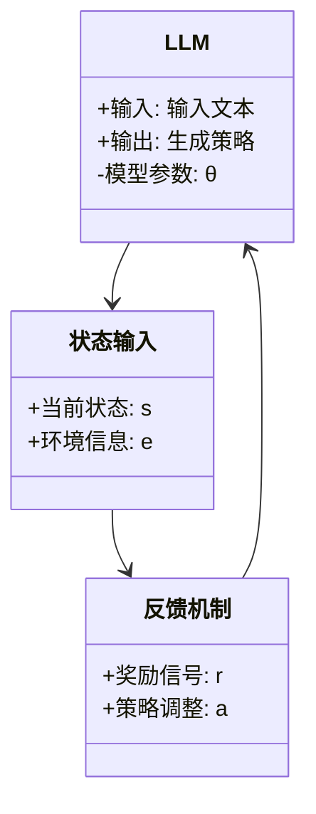
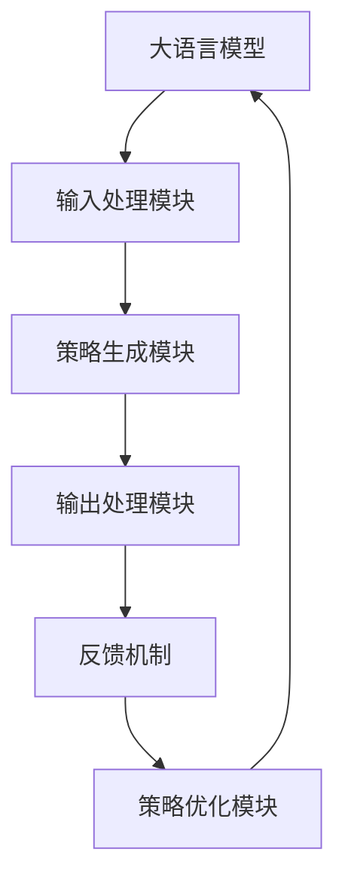
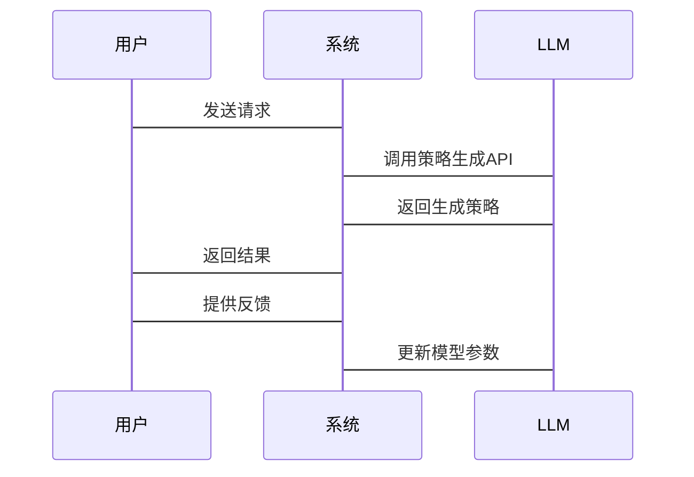

                 


# 实时策略生成AI Agent：LLM在动态决策中的应用

> 关键词：实时策略生成，LLM，动态决策，大语言模型，AI Agent，策略优化，强化学习

> 摘要：本文深入探讨了实时策略生成AI Agent的核心概念、算法原理和系统架构，结合实际案例分析，详细阐述了LLM在动态决策中的应用及其优化方法。

---

# 第一部分: 实时策略生成AI Agent概述

## 第1章: 实时策略生成与LLM的背景介绍

### 1.1 问题背景与挑战

#### 1.1.1 动态决策问题的复杂性
动态决策问题的核心是根据实时变化的环境做出最优或近似最优的决策。这种决策过程需要处理高度不确定性、信息不完全以及决策的即时性。

#### 1.1.2 LLM在实时决策中的优势
大语言模型（LLM）凭借其强大的自然语言理解和生成能力，能够快速处理复杂文本信息，提供实时策略生成的能力。LLM的优势在于其泛化能力、知识覆盖范围以及快速生成策略的能力。

#### 1.1.3 当前技术的局限性与改进方向
传统基于规则的决策系统存在灵活性差、难以应对复杂场景的局限性。而基于强化学习的策略优化方法虽然具有较好的适应性，但其训练过程复杂，需要大量的样本数据和计算资源。LLM与强化学习的结合为实时策略生成提供了新的可能性。

### 1.2 LLM的基本概念与特点

#### 1.2.1 大语言模型的定义与核心特征
LLM是一种基于深度学习的自然语言处理模型，其核心特征包括：
- 大规模预训练：通过海量数据的预训练，模型能够理解上下文和生成连贯的文本。
- 自注意力机制：能够捕捉文本中的长程依赖关系。
- 模型的可扩展性：适用于多种任务，如文本生成、问答系统、翻译等。

#### 1.2.2 LLM在实时策略生成中的应用潜力
LLM能够生成自然语言的策略描述，适用于多种场景，如游戏AI、推荐系统、对话系统等。其优势在于快速生成策略，并能够根据上下文进行调整。

#### 1.2.3 LLM与传统决策算法的对比分析
| 对比维度 | LLM | 基于强化学习的传统算法 |
|----------|------|------------------------|
| 决策速度 | 实时生成 | 需要多次迭代优化       |
| 策略表达 | 文本形式 | 数值或向量形式          |
| 灵活性 | 高，适用于多种任务 | 较低，需要针对特定任务定制 |

### 1.3 动态决策中的实时策略生成

#### 1.3.1 实时策略生成的定义与目标
实时策略生成是指在动态变化的环境中，快速生成适用于当前状态的决策策略。其目标是在有限时间内提供最优或近似最优的策略。

#### 1.3.2 动态环境中的策略调整机制
在动态环境中，策略生成需要具备自适应能力，能够根据环境变化实时调整策略。这通常通过反馈机制和在线学习实现。

#### 1.3.3 LLM在动态决策中的应用前景
LLM结合实时策略生成技术，能够在复杂动态环境中提供高效的决策支持。其应用领域包括自动驾驶、智能客服、金融交易等。

## 第2章: LLM的核心原理与数学模型

### 2.1 LLM的训练原理

#### 2.1.1 Transformer模型的基本结构
Transformer模型由编码器和解码器组成，编码器负责将输入序列编码为语义向量，解码器根据编码结果生成输出序列。

#### 2.1.2 自注意力机制的数学公式
自注意力机制通过计算输入序列中每个位置的权重，生成位置相关的表示。其数学公式如下：
$$ \text{Attention}(Q, K, V) = \text{softmax}\left( \frac{QK^T}{\sqrt{d_k}} \right)V $$
其中，$Q$、$K$、$V$分别为查询、键和值向量，$d_k$为键的维度。

#### 2.1.3 损失函数与优化目标
LLM的损失函数通常采用交叉熵损失，优化目标是最小化损失函数：
$$ \text{损失函数} = -\sum_{i=1}^{n} y_i \log(p_i) $$
$$ \text{优化目标} = \min_{\theta} \text{损失函数} $$

### 2.2 实时策略生成的算法原理

#### 2.2.1 基于LLM的策略生成流程
基于LLM的实时策略生成流程包括以下步骤：
1. 输入当前状态和环境信息。
2. 通过LLM生成候选策略。
3. 根据反馈机制优化策略。

#### 2.2.2 基于强化学习的策略优化
强化学习通过奖励机制优化策略，其策略梯度公式为：
$$ \text{策略梯度公式} = \nabla_\theta J(\theta) = \mathbb{E}_{\tau \sim \pi_\theta}[\nabla_\theta \log \pi_\theta(a|s) Q(s,a)] $$

## 第3章: LLM与实时策略生成的系统架构

### 3.1 系统功能设计

#### 3.1.1 领域模型设计（Mermaid类图）


#### 3.1.2 系统架构设计（Mermaid架构图）


#### 3.1.3 接口设计与交互流程图


---

## 第4章: 项目实战与案例分析

### 4.1 环境安装与配置

#### 4.1.1 安装Python与相关库
```bash
pip install python-transformer
pip install torch
pip install numpy
```

#### 4.1.2 安装LLM框架
选择一个合适的LLM框架，例如：
```bash
pip install transformers
pip install sentence-transformers
```

### 4.2 系统核心实现

#### 4.2.1 核心代码实现
```python
import torch
import torch.nn as nn
import torch.optim as optim

class LLM(nn.Module):
    def __init__(self, vocab_size, d_model, n_head, dff):
        super().__init__()
        self.encoder = nn.TransformerEncoder(...)
        self.decoder = nn.TransformerDecoder(...)
        
    def forward(self, x):
        return self.decoder(self.encoder(x))
```

#### 4.2.2 代码解读与分析
```python
# 初始化模型
model = LLM(vocab_size=30000, d_model=512, n_head=8, dff=2048)
# 定义损失函数
criterion = nn.CrossEntropyLoss()
# 定义优化器
optimizer = optim.Adam(model.parameters(), lr=0.001)
```

#### 4.2.3 案例分析与详细讲解
以一个具体的案例为例，详细讲解LLM在动态决策中的应用过程。例如，在一个游戏中，AI Agent需要根据当前状态和对手的策略实时生成最优的行动策略。

### 4.3 最佳实践与经验分享

#### 4.3.1 系统优化建议
- 使用高效的优化算法，如AdamW。
- 增加模型的训练数据多样性。
- 定期更新模型参数以适应环境变化。

#### 4.3.2 开发注意事项
- 确保系统的实时性，避免引入过多的延迟。
- 处理好模型的内存占用，避免资源耗尽。

## 第5章: 总结与展望

### 5.1 小结
本文详细探讨了实时策略生成AI Agent的核心概念、算法原理和系统架构，结合实际案例分析，深入讲解了LLM在动态决策中的应用及其优化方法。

### 5.2 注意事项
在实际应用中，需要考虑模型的实时性、准确性和可解释性，同时注意数据隐私和模型安全问题。

### 5.3 未来展望
未来的研究方向包括更高效的实时策略生成算法、更强大的LLM模型以及更广泛的应用场景探索。

### 5.4 扩展阅读
推荐以下书籍和论文：
1. 《Deep Learning》 - Ian Goodfellow
2. 《Transformer解构与强化学习实战》 - 李航
3. "Attention Is All You Need" - Vaswani et al.

---

# 结语
实时策略生成AI Agent的开发和应用是一个充满挑战和机遇的领域。通过不断的技术创新和实践积累，我们相信LLM在动态决策中的应用将会更加广泛和深入。

