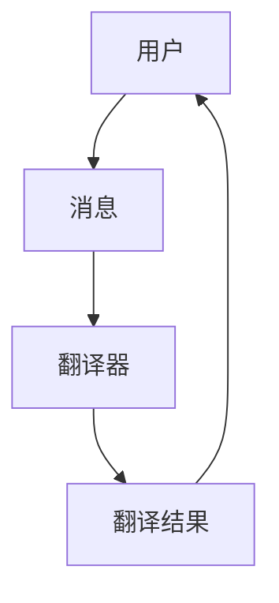
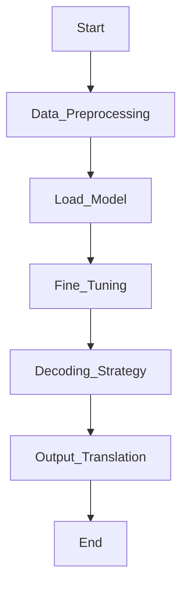
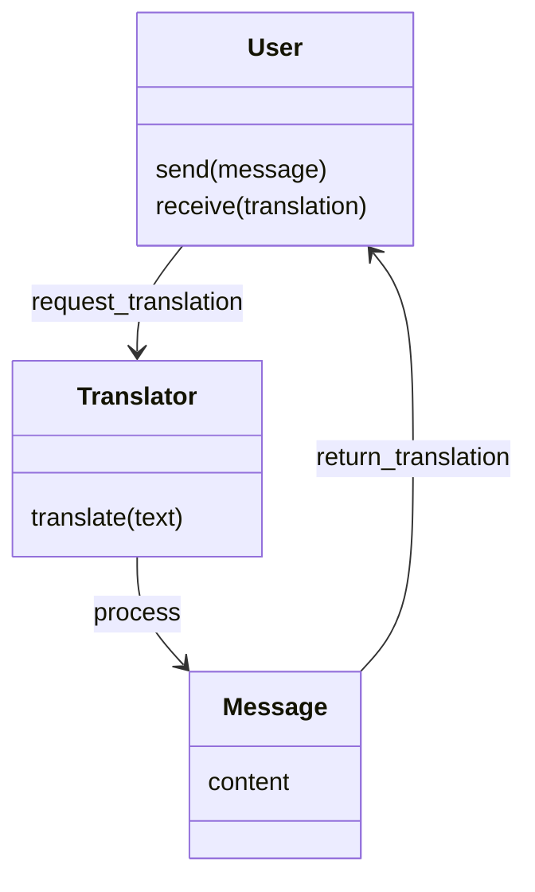

                 


# 实时翻译AI Agent：LLM在即时通讯中的应用

> 关键词：实时翻译、LLM、AI Agent、即时通讯、分布式计算、自然语言处理

> 摘要：本文探讨了实时翻译AI Agent在即时通讯中的应用，详细分析了基于大语言模型（LLM）的实时翻译技术，包括算法原理、系统架构设计、项目实现等内容，旨在为技术开发者和研究人员提供理论指导和实践参考。

---

## 第1章 实时翻译AI Agent的概念与背景

### 1.1 问题背景

#### 1.1.1 现代通讯中的语言障碍
在跨国交流日益频繁的今天，语言障碍成为阻碍有效沟通的主要问题。特别是在即时通讯场景中，用户需要快速理解不同语言的信息，传统的翻译工具往往无法满足实时性的需求。

#### 1.1.2 实时翻译的需求与挑战
用户在聊天、视频通话或社交媒体互动中，希望能在发送消息的同时获得即时翻译，而传统翻译工具通常存在延迟较高、准确率不足的问题。

#### 1.1.3 AI技术在实时翻译中的潜力
大语言模型（LLM）通过其强大的语言理解和生成能力，为实时翻译提供了新的解决方案。LLM能够快速处理自然语言文本，并生成高质量的翻译结果。

### 1.2 问题描述

#### 1.2.1 实时翻译的核心问题
实时翻译需要在极短的时间内完成文本的解析、翻译和生成，同时确保翻译的准确性和流畅性。

#### 1.2.2 LLM在实时翻译中的应用场景
LLM可以应用于跨语言通讯、实时字幕生成、多语言客服支持等多个场景。

#### 1.2.3 实时翻译的性能要求与边界
实时翻译需要在低延迟、高准确率下运行，适用于文本长度较短、实时性要求较高的场景。

### 1.3 解决方案概述

#### 1.3.1 基于LLM的实时翻译技术
利用LLM进行实时翻译，通过模型的解码能力快速生成翻译结果。

#### 1.3.2 分布式计算在实时翻译中的应用
采用分布式计算框架，将翻译任务分解为多个子任务，提高处理效率。

#### 1.3.3 优化策略与实现方法
通过模型优化、算法改进和系统架构设计，提升实时翻译的准确率和响应速度。

---

## 第2章 LLM与实时翻译AI Agent的核心概念

### 2.1 LLM的基本原理

#### 2.1.1 大语言模型的定义与特点
LLM是一种基于深度学习的自然语言处理模型，具有上下文理解、多语言支持和生成能力强等特点。

#### 2.1.2 LLM的训练目标与损失函数
训练目标是优化模型的生成能力，损失函数通常采用交叉熵损失函数。

#### 2.1.3 LLM的解码策略与优化方法
解码策略包括贪婪算法和基于BLEU的策略，优化方法涉及调整温度参数和使用惩罚项。

### 2.2 实时翻译AI Agent的结构

#### 2.2.1 Agent的基本概念
AI Agent是一种智能体，能够感知环境并执行任务，实时翻译Agent负责接收、处理和返回翻译结果。

#### 2.2.2 实时翻译Agent的功能模块
功能模块包括自然语言理解模块、翻译模块和响应生成模块。

#### 2.2.3 LLM在Agent中的角色与作用
LLM作为翻译模块的核心，负责将源语言文本翻译为目标语言。

### 2.3 核心概念对比表

| 对比内容 | LLM | 传统机器翻译模型 |
|----------|------|------------------|
| 模型结构  | 基于Transformer | 基于规则或统计方法 |
| 训练数据 | 大规模真实数据 | 有限领域数据 |
| 翻译质量 | 高 | 中等 |

### 2.4 实时翻译AI Agent的ER实体关系图


---

## 第3章 实时翻译AI Agent的算法原理

### 3.1 LLM的训练过程

#### 3.1.1 监督微调的流程
1. 数据预处理：清洗和标注数据。
2. 模型加载：加载预训练的LLM。
3. 微调训练：在特定领域数据上进行微调。

#### 3.1.2 解码策略与优化方法
- 解码策略：使用贪心算法或随机采样。
- 优化方法：调整温度参数和使用核化损失。

### 3.2 实时翻译的算法实现

#### 3.2.1 分布式计算框架
使用分布式计算框架如Ray或Distributed来提高处理效率。

#### 3.2.2 并行计算的实现
通过并行处理减少延迟，提高翻译速度。

#### 3.2.3 实时响应的优化方法
优化网络传输和缓存机制，减少响应时间。

### 3.3 算法流程图


---

## 第4章 数学模型与公式解析

### 4.1 LLM的训练目标函数

$$ \text{损失函数} = -\sum_{i=1}^{n} \log P(x_i|x_{<i}) $$

其中，$x_i$ 表示生成的第 $i$ 个词，$P(x_i|x_{<i})$ 是在给定前 $i-1$ 个词的条件下生成第 $i$ 个词的概率。

### 4.2 解码策略的数学表示

使用交叉熵损失函数进行优化：

$$ \text{损失} = -\log P(y|x) $$

其中，$y$ 是目标翻译结果，$x$ 是源语言文本。

---

## 第5章 系统分析与架构设计

### 5.1 应用场景介绍

#### 5.1.1 跨语言即时通讯
用户发送多语言消息，系统实时翻译并返回。

#### 5.1.2 实时字幕生成
在视频通话中实时生成多语言字幕。

### 5.2 领域模型设计



### 5.3 系统架构设计

```mermaid
graph TD
    User --> API Gateway
    API Gateway --> Load Balancer
    Load Balancer --> Translator Service
    Translator Service --> LLM Model
    LLM Model --> Translator Service
    Translator Service --> Result Cache
    Result Cache --> API Gateway
    API Gateway --> User
```

### 5.4 系统交互流程图

```mermaid
sequenceDiagram
    User ->+> API Gateway: send message
    API Gateway ->+> Load Balancer: request translation
    Load Balancer ->+> Translator Service: process
    Translator Service ->+> LLM Model: translate
    LLM Model ->+> Translator Service: return translation
    Translator Service ->+> Result Cache: cache result
    Result Cache ->+> API Gateway: send result
    API Gateway ->+> User: return translation
```

---

## 第6章 项目实战

### 6.1 环境安装

```bash
pip install transformers torch ray
```

### 6.2 核心代码实现

```python
from transformers import AutoTokenizer, AutoModelForSeq2Seq
import ray

class TranslatorAgent:
    def __init__(self, model_name):
        self.tokenizer = AutoTokenizer.from_pretrained(model_name)
        self.model = AutoModelForSeq2Seq.from_pretrained(model_name)
    
    @ray.remote
    def translate(self, text):
        inputs = self.tokenizer.encode(text, return_tensors="pt")
        outputs = self.model.generate(inputs, max_length=50)
        return self.tokenizer.decode(outputs[0], skip_special_tokens=True)

def main():
    agent = TranslatorAgent("facebook/m2m")
    remote_agent = agent.remote()
    future = remote_agent.translate.remote("你好")
    result = ray.get(future)
    print(result)

if __name__ == "__main__":
    main()
```

### 6.3 代码解读与分析

- 初始化TranslatorAgent，加载预训练模型。
- 使用Ray进行分布式计算，提高翻译速度。
- 翻译函数处理输入文本并返回结果。

### 6.4 实际案例分析

案例：用户发送中文消息“你好”，系统实时翻译为英文“Hello”。

### 6.5 项目小结

通过代码实现了一个简单的实时翻译AI Agent，展示了LLM在即时通讯中的应用。

---

## 第7章 总结与展望

### 7.1 最佳实践 tips

- 使用高效的分布式计算框架。
- 优化模型参数和解码策略。
- 建立缓存机制减少延迟。

### 7.2 小结

本文详细探讨了实时翻译AI Agent的设计与实现，结合理论分析和代码实现，为实际应用提供了指导。

### 7.3 注意事项

- 注意模型的计算资源消耗。
- 确保数据安全和隐私保护。
- 定期更新模型以保持翻译质量。

### 7.4 拓展阅读

建议阅读相关文献，深入了解LLM的优化方法和分布式计算技术。

---

通过以上结构，本文系统地介绍了实时翻译AI Agent的设计与实现，为开发者提供了理论和实践的双重指导。

