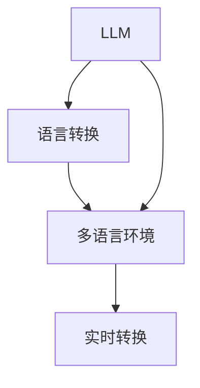
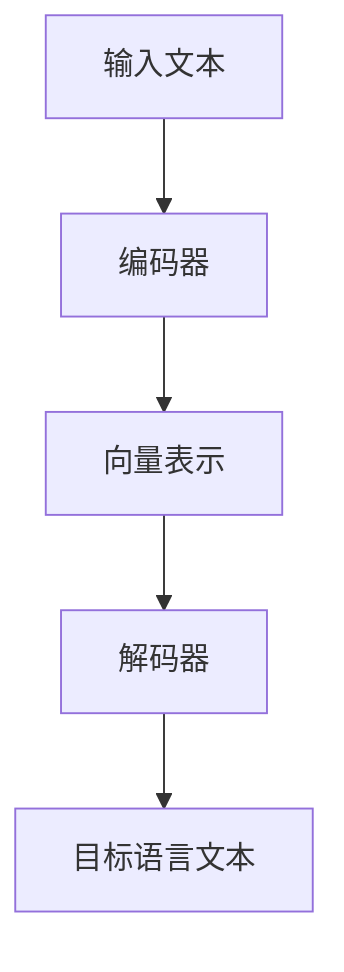
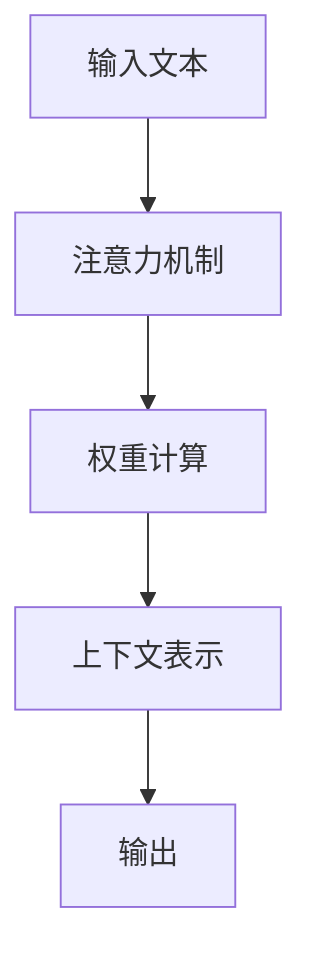
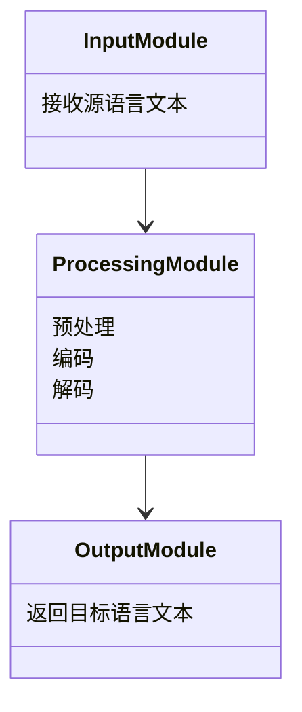
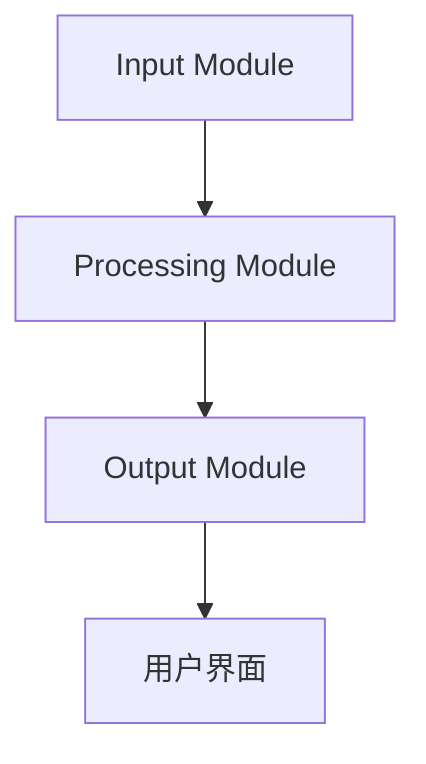
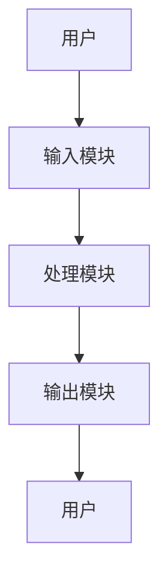

                 


# 实时语言转换AI Agent：LLM在多语言环境中的应用

> 关键词：实时语言转换、AI Agent、LLM、多语言环境、自然语言处理、机器学习

> 摘要：本文深入探讨了基于大语言模型（LLM）的实时语言转换AI Agent在多语言环境中的应用。从问题背景、核心概念、算法原理、系统架构到项目实战，系统性地分析了实时语言转换的技术实现和实际应用。通过详细的技术分析和案例解读，展示了如何利用LLM构建高效、准确的多语言实时转换系统。

---

# 第一部分：背景与概述

## 第1章：问题背景与概述

### 1.1 问题背景

#### 1.1.1 多语言交流的挑战
- **背景介绍**：随着全球化的发展，跨语言交流的需求日益增加，尤其是在商务、教育、旅游等领域，多语言实时转换的需求迫在眉睫。
- **具体问题**：传统语言转换工具存在延迟高、准确率低、无法处理复杂语境等问题，难以满足实时场景的需求。
- **LLM的优势**：基于LLM的语言转换工具能够利用其强大的上下文理解和生成能力，实现更准确、更自然的实时语言转换。

#### 1.1.2 技术现状
- **传统语言转换技术**：基于统计机器翻译或规则引擎的翻译工具，存在模型固定、难以实时更新等问题。
- **LLM的应用现状**：LLM（如GPT-3、PaLM）在多语言处理方面表现出色，能够实时生成高质量的翻译结果。
- **技术趋势**：随着LLM的不断进化，实时语言转换的准确性和效率将不断提升，应用场景也将更加广泛。

#### 1.1.3 应用价值与边界
- **价值**：实时语言转换AI Agent能够提高跨语言交流的效率，降低误解风险，为多语言用户带来更好的体验。
- **边界**：目前主要适用于简单的文本转换，复杂语境下的准确性和上下文理解仍需进一步优化。

---

## 第2章：核心概念与原理

### 2.1 LLM的基本原理

#### 2.1.1 大语言模型的定义与特点
- **定义**：LLM（Large Language Model）是一种基于深度学习的自然语言处理模型，具有参数量大、训练数据丰富、上下文理解能力强的特点。
- **特点**：
  - 多语言支持能力强。
  - 能够理解上下文和语境。
  - 具备生成能力，可以实时生成翻译结果。

#### 2.1.2 LLM的核心技术架构
- **编码器-解码器结构**：LLM通常采用编码器将输入文本编码为向量，解码器将向量解码为目标语言的文本。
- **注意力机制**：通过自注意力机制捕捉输入文本中的长距离依赖关系，提升翻译质量。

### 2.2 语言转换的实现机制

#### 2.2.1 语言转换的基本流程
1. **输入处理**：将源语言文本输入模型。
2. **编码**：模型将输入文本编码为向量表示。
3. **解码**：模型根据向量生成目标语言的文本。
4. **输出结果**：将目标语言文本返回给用户。

#### 2.2.2 基于LLM的语言转换模型
- **模型选择**：可以选择开源的LLM（如Falcon、Llama）或商业模型（如Google Translate API）。
- **微调与适配**：根据具体需求对模型进行微调，以提高特定场景下的转换效果。

#### 2.2.3 多语言环境下的模型训练策略
- **多任务学习**：在训练过程中同时学习多种语言的转换任务，提升模型的多语言能力。
- **数据增强**：通过数据增强技术（如同义词替换、句式变换）扩展训练数据，提高模型的泛化能力。

### 2.3 核心概念对比表

| 概念 | 描述 |
|------|------|
| LLM  | 大语言模型，能够处理多种语言的自然语言处理模型 |
| 语言转换 | 将一种语言的文本转换为另一种语言的过程 |
| 多语言环境 | 支持多种语言交互和处理的系统环境 |

### 2.4 实体关系图



---

## 第3章：算法原理讲解

### 3.1 模型训练过程

#### 3.1.1 数据预处理
- **分词**：将输入文本分割为单词或短语。
- **对齐**：将源语言和目标语言的文本对齐，便于模型学习对应关系。

#### 3.1.2 模型训练
- **训练目标**：最小化生成结果与真实结果之间的误差。
- **损失函数**：通常使用交叉熵损失函数。
- **优化算法**：常用Adam优化器。

#### 3.1.3 模型结构
- **编码器**：将输入文本转换为向量表示。
- **解码器**：根据向量生成目标语言的文本。

### 3.2 转换算法实现

#### 3.2.1 编码器-解码器结构


#### 3.2.2 注意力机制


#### 3.2.3 模型优化策略
- **批量训练**：通过批量处理数据提高训练效率。
- **学习率调整**：使用学习率衰减策略，避免过拟合。

### 3.3 算法实现代码

```python
import torch
import torch.nn as nn

class LLM(nn.Module):
    def __init__(self, input_dim, hidden_dim, output_dim):
        super(LLM, self).__init__()
        self.encoder = nn.Linear(input_dim, hidden_dim)
        self.decoder = nn.Linear(hidden_dim, output_dim)
    
    def forward(self, x):
        encoded = self.encoder(x)
        decoded = self.decoder(encoded)
        return decoded

# 示例代码：模型训练
model = LLM(input_dim=100, hidden_dim=256, output_dim=50)
criterion = nn.CrossEntropyLoss()
optimizer = torch.optim.Adam(model.parameters(), lr=0.001)
```

---

## 第4章：系统分析与架构设计

### 4.1 系统功能设计

#### 4.1.1 功能模块
- **输入模块**：接收源语言文本。
- **处理模块**：对文本进行预处理、编码、解码。
- **输出模块**：返回目标语言文本。

#### 4.1.2 领域模型



### 4.2 系统架构设计

#### 4.2.1 模块化架构



#### 4.2.2 接口设计
- **输入接口**：接收源语言文本。
- **输出接口**：返回目标语言文本。
- **控制接口**：接收用户的控制指令（如语言切换）。

#### 4.2.3 交互设计
- **用户输入**：用户输入源语言文本。
- **系统处理**：系统进行实时转换。
- **用户反馈**：用户收到目标语言文本并进行反馈。

### 4.3 系统架构图



---

## 第5章：项目实战

### 5.1 环境安装

```bash
pip install torch transformers
```

### 5.2 核心代码实现

```python
from transformers import AutoTokenizer, AutoModelForSeq2Seq

model_name = "facebook/palm-rtd"
tokenizer = AutoTokenizer.from_pretrained(model_name)
model = AutoModelForSeq2Seq.from_pretrained(model_name)

def translate(source_text, target_lang):
    inputs = tokenizer(source_text, return_tensors="pt")
    outputs = model.generate(inputs.input_ids, max_length=50, forced_bos_token_id=tokenizer.lang_to_id[target_lang])
    return tokenizer.decode(outputs[0], skip_special_tokens=True)
```

### 5.3 案例分析

#### 5.3.1 案例1：中文到英文
- **输入**：你好，今天天气很好。
- **输出**：Hello, the weather is nice today.

#### 5.3.2 案例2：英文到法语
- **输入**：The meeting will be held tomorrow.
- **输出**：La réunion aura lieu demain.

### 5.4 项目总结
- **优势**：基于LLM的实时语言转换系统具有高效、准确的特点。
- **不足**：对于某些复杂语境的处理仍需进一步优化。

---

## 第6章：最佳实践与小结

### 6.1 小结
- **总结**：基于LLM的实时语言转换系统在多语言环境下具有广阔的应用前景。
- **经验分享**：在实际应用中，建议根据具体需求对模型进行微调，以提高转换效果。

### 6.2 注意事项
- **数据质量**：确保训练数据的质量和多样性。
- **模型选择**：根据需求选择合适的LLM模型。
- **性能优化**：通过模型压缩和优化算法提升系统性能。

### 6.3 拓展阅读
- **推荐书籍**：《Deep Learning》、《自然语言处理实战》
- **推荐论文**：《Attention Is All You Need》、《Large Language Models: The New AI Classifiers》

---

通过以上内容，我们详细分析了实时语言转换AI Agent的实现过程和应用价值，希望对读者在实际项目中有所帮助。

