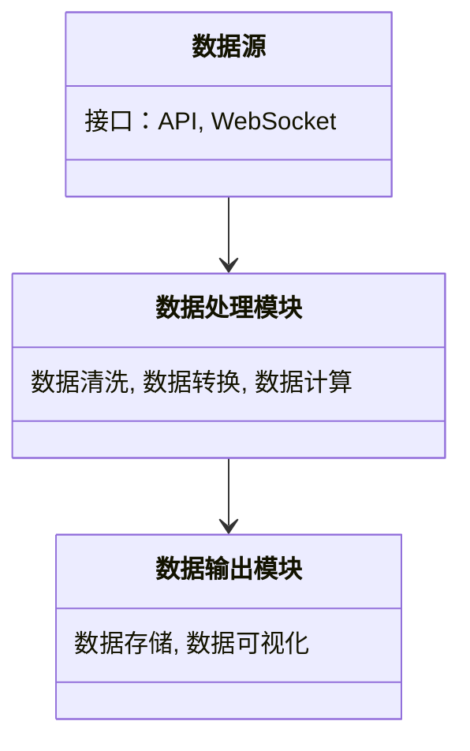

                 


# 实时金融数据接入与处理：技术与挑战

## 关键词：实时金融数据，数据接入，数据处理，流数据，实时计算，金融系统架构

## 摘要：  
本文将深入探讨实时金融数据接入与处理的核心技术与挑战。随着金融市场的快速发展，实时数据的处理需求日益增加，如何高效、准确地接入和处理实时金融数据成为金融技术领域的重要课题。本文将从数据源的接入、数据流的处理、实时计算的实现等多方面展开，结合实际案例和系统架构设计，详细阐述实时金融数据处理的技术要点和解决方案。

---

# 第一部分: 实时金融数据的背景与挑战

## 第1章: 实时金融数据的重要性

### 1.1 金融数据的特点
金融数据具有以下特点：
- **高实时性**：金融市场中的数据（如股票价格、汇率等）需要实时更新。
- **多样性**：数据来源广泛，包括API、WebSocket、文件等多种形式。
- **高频率**：金融交易的频率极高，要求数据处理必须实时完成。
- **准确性**：数据的准确性直接关系到金融决策的正确性。

### 1.2 实时数据在金融领域的作用
实时数据在金融领域的应用非常广泛，例如：
- **高频交易**：依赖实时数据进行快速决策。
- **风险控制**：实时监控市场波动，及时发现和应对风险。
- **实时报告**：生成实时市场分析报告，为投资者提供决策支持。

### 1.3 金融数据的分类与应用场景
金融数据可以分为以下几类：
1. **市场数据**：如股票价格、指数、成交量等。
2. **交易数据**：如订单簿、成交记录等。
3. **新闻数据**：如财经新闻、公司公告等。
4. **外部数据**：如宏观经济指标、政策变化等。

应用场景包括：
- **高频交易**：基于实时数据的快速决策。
- **风险监控**：实时监测市场波动和交易风险。
- **智能投顾**：基于实时数据为投资者提供个性化建议。

## 第2章: 实时数据处理的挑战

### 2.1 数据量大与实时性的矛盾
金融数据的实时性要求非常高，但数据量的增加可能导致处理延迟。例如，高频交易中，每秒可能产生数百万条数据，如何在保证实时性的前提下处理如此大的数据量是一个挑战。

### 2.2 数据源的多样性与接入复杂性
金融数据的来源多样，包括API、WebSocket、文件等多种形式。不同的数据源具有不同的接口和数据格式，如何统一接入并进行标准化处理是一个复杂的问题。

### 2.3 数据安全与隐私保护的挑战
金融数据涉及大量的敏感信息，如何在实时处理过程中确保数据的安全性和隐私性是一个重要的挑战。例如，如何防止数据泄露、如何保护用户隐私等。

---

# 第二部分: 数据接入技术

## 第3章: 数据源与接入方式

### 3.1 数据源的类型
数据源可以分为以下几类：
- **API接口**：如金融数据供应商提供的API。
- **WebSocket**：用于实时推送数据。
- **文件数据**：如CSV、JSON文件。

### 3.2 数据接入技术

#### 3.2.1 API接口的实现与优化
API接口的实现需要注意以下几点：
1. **请求频率控制**：避免对API服务造成过大的压力。
2. **缓存机制**：对重复请求进行缓存，减少对API的调用次数。
3. **错误处理**：处理API返回的错误信息，确保程序的健壮性。

#### 3.2.2 WebSocket协议的使用
WebSocket是一种实时通信协议，适用于需要实时推送数据的场景。其优点包括：
- 低延迟。
- 支持双向通信。
- 适合实时数据流的传输。

#### 3.2.3 其他数据源的接入方法
除了API和WebSocket，还可以通过以下方式接入数据：
- **文件批量处理**：将文件数据批量导入到系统中。
- **数据库接入**：从数据库中读取实时数据。

### 3.3 数据采集与预处理

#### 3.3.1 数据采集的基本流程
数据采集的基本流程包括：
1. **数据获取**：通过API、WebSocket等方式获取数据。
2. **数据解析**：将获取的数据进行解析，转换为系统可处理的格式。
3. **数据存储**：将数据存储到数据库或其他存储系统中。

#### 3.3.2 数据清洗与格式转换
数据清洗包括：
- 去除无效数据。
- 处理数据格式不一致的问题。
- 填充缺失数据。

#### 3.3.3 数据校验与异常处理
数据校验包括：
- 检查数据的完整性。
- 检查数据的一致性。
- 处理异常数据，例如重复数据、异常值等。

---

# 第三部分: 数据处理技术

## 第4章: 数据流处理与计算

### 4.1 数据流处理模型
数据流处理模型包括以下几个步骤：
1. **数据接收**：通过数据源接收实时数据。
2. **数据处理**：对数据进行清洗、转换、计算等处理。
3. **数据输出**：将处理后的数据输出到目标系统或存储。

#### 4.1.1 时间序列数据的处理
时间序列数据是指按时间顺序排列的数据，例如股票价格、指数等。时间序列数据的处理包括：
- 数据平滑：去除噪声。
- 数据预测：基于历史数据预测未来趋势。

#### 4.1.2 流数据的特征与处理方法
流数据的特征包括：
- 持续性：数据是不断流动的。
- 不可预测性：数据的未来是不确定的。
- 高速性：数据处理必须实时完成。

### 4.2 实时计算框架

#### 4.2.1 常见实时计算框架（Flink、Storm、Spark Streaming）
实时计算框架的选择取决于具体的业务需求和技术要求。以下是几种常见的实时计算框架：
- **Flink**：适合需要低延迟和高吞吐量的实时计算场景。
- **Storm**：适合需要高容错性和扩展性的实时计算场景。
- **Spark Streaming**：适合需要复杂数据处理和分析的实时计算场景。

#### 4.2.2 实时计算框架的优缺点对比
以下是几种实时计算框架的优缺点对比：

| 框架 | 优点 | 缺点 |
|------|------|------|
| Flink | 低延迟、高吞吐量、支持事件时间 | 学习曲线较高 |
| Storm | 高容错性、支持多种数据源 | 复杂性较高 |
| Spark Streaming | 支持复杂数据处理、集成性强 | 延迟较高 |

---

# 第四部分: 系统架构设计

## 第5章: 系统架构设计

### 5.1 问题场景介绍
实时金融数据处理系统需要满足以下需求：
- 实时性：数据处理必须在极短时间内完成。
- 可扩展性：系统能够处理大量的数据。
- 可靠性：系统必须保证数据的准确性和完整性。

### 5.2 项目介绍
本项目的目标是设计一个实时金融数据处理系统，能够从多种数据源接入实时数据，并进行清洗、转换、计算和输出。

### 5.3 系统功能设计

#### 5.3.1 领域模型（领域模型Mermaid类图）


### 5.4 系统架构设计

#### 5.4.1 系统架构Mermaid图
```mermaid
client --> API Gateway
API Gateway --> 数据源
数据源 --> 数据处理模块
数据处理模块 --> 数据存储
数据存储 --> 数据分析模块
数据分析模块 --> 数据可视化模块
```

---

# 第五部分: 项目实战

## 第6章: 项目实战

### 6.1 环境安装
1. 安装Java开发环境。
2. 安装Flink。
3. 配置数据源API。

### 6.2 核心实现源代码
以下是实时数据处理的核心代码示例：

```java
public class RealTimeDataProcessor {
    public static void main(String[] args) throws Exception {
        // 初始化Flink环境
        StreamExecutionEnvironment env = StreamExecutionEnvironment.getExecutionEnvironment();
        
        // 从WebSocket接收数据
        DataStream<String> input = env.socketTextStream("localhost", 9999);
        
        // 数据处理
        input.map(new MapFunction<String, String>() {
            @Override
            public String map(String value) throws Exception {
                // 数据解析和处理
                return value;
            }
        }).sink(new FileSink<String>("output.csv") {
            @Override
            public void write(String value) throws IOException {
                // 写入文件
            }
        });
        
        env.execute("RealTimeDataProcessor");
    }
}
```

### 6.3 代码应用解读与分析
1. **数据接收**：通过WebSocket接收实时数据。
2. **数据处理**：对数据进行解析和处理。
3. **数据输出**：将处理后的数据写入文件或数据库。

### 6.4 实际案例分析
假设我们从一个股票交易所的API获取实时股票价格数据，我们可以进行以下处理：
1. 数据清洗：去除无效数据。
2. 数据计算：计算股票的移动平均线。
3. 数据输出：将计算结果存储到数据库中。

---

# 第六部分: 最佳实践与总结

## 第7章: 最佳实践

### 7.1 小结
实时金融数据处理是一个复杂而重要的任务，需要综合考虑数据源的多样性、实时性的要求以及系统的可扩展性和可靠性。

### 7.2 注意事项
1. **数据安全**：确保数据在处理过程中的安全性。
2. **系统性能**：优化系统性能，确保实时性。
3. **错误处理**：建立完善的错误处理机制。

### 7.3 拓展阅读
1. 《实时数据处理：Flink实战》
2. 《金融数据接口开发指南》
3. 《分布式系统架构设计》

---

通过以上内容，我们可以看到实时金融数据处理的复杂性和技术要求。希望本文能够为读者提供有价值的技术指导和实践参考。

