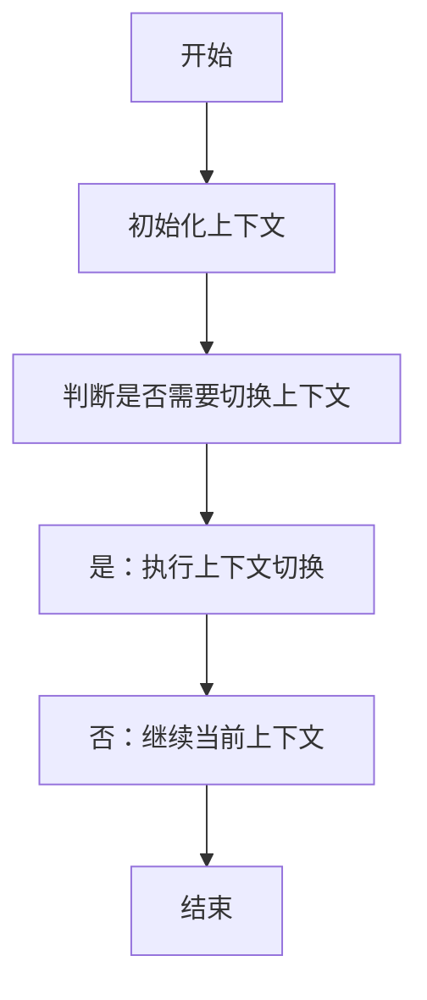
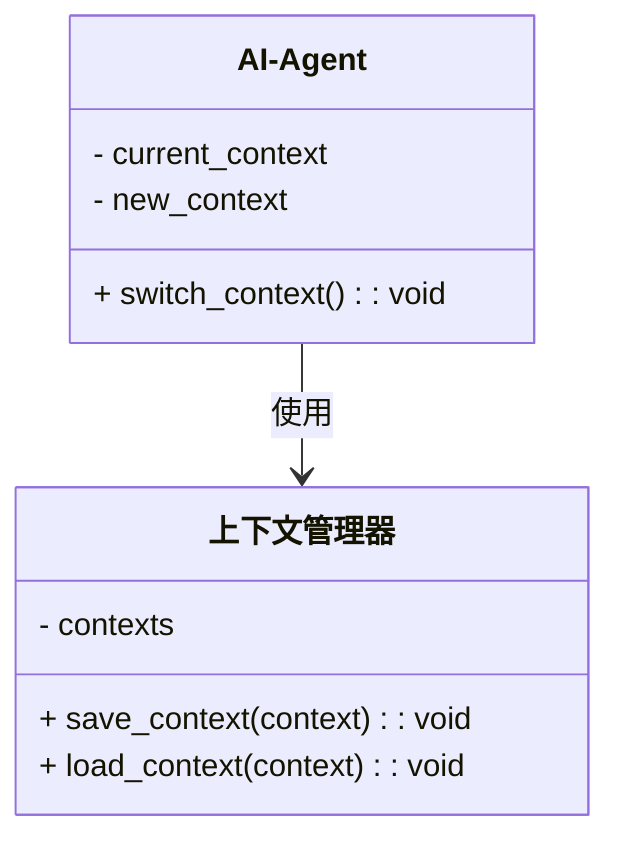
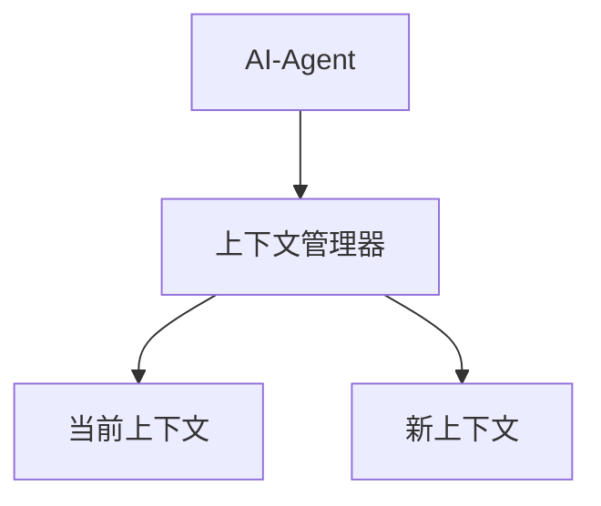
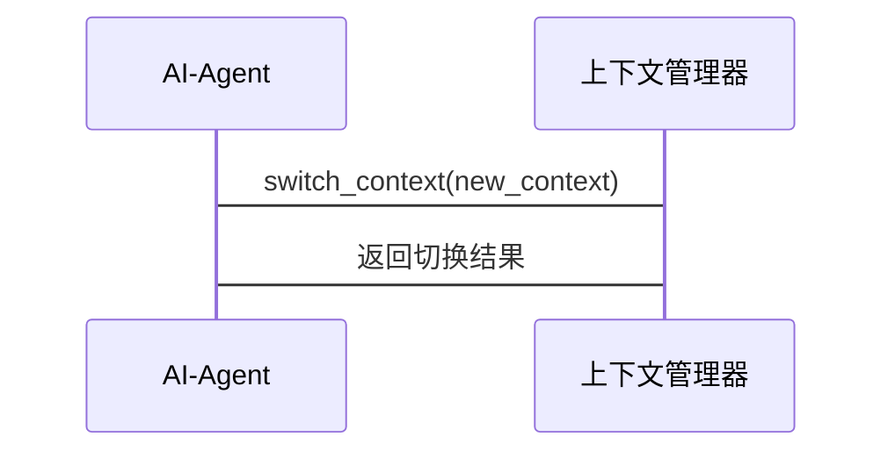

                 


# 实现AI Agent的上下文切换能力

## 关键词：AI Agent, 上下文切换, 软件架构, 算法原理, 系统设计

## 摘要：本文深入探讨了AI Agent的上下文切换能力的实现方法，从背景、核心概念到算法原理、系统架构设计，再到项目实战，全面解析了如何设计和实现具备上下文切换能力的AI Agent系统。

---

# 第一章: AI Agent与上下文切换能力概述

## 1.1 上下文切换的背景与问题背景

### 1.1.1 什么是AI Agent

AI Agent（人工智能代理）是一种能够感知环境、自主决策并执行任务的智能实体。它广泛应用于自动驾驶、智能助手、推荐系统等领域。

### 1.1.2 上下文切换的定义与重要性

上下文切换是指AI Agent在执行任务过程中，根据需求切换当前处理的上下文环境。这种能力对于处理多任务、动态环境和复杂场景至关重要。

### 1.1.3 问题背景：AI Agent面临的挑战

AI Agent在处理多个任务或动态环境中，需要快速切换上下文以适应变化，否则可能导致任务中断或效率低下。

---

## 1.2 上下文切换能力的描述与问题解决

### 1.2.1 上下文切换的核心问题

上下文切换的核心问题是如何高效地管理多个上下文，确保AI Agent能够快速切换而不影响任务执行。

### 1.2.2 上下文切换的实现目标

通过上下文切换，AI Agent可以在不同任务之间无缝切换，保持高效性和准确性。

### 1.2.3 上下文切换的实现方法

使用状态机模型或上下文管理器来实现上下文切换，确保切换过程平滑且可控。

---

## 1.3 上下文切换能力的边界与外延

### 1.3.1 上下文切换的边界条件

上下文切换仅在AI Agent需要处理新任务或环境变化时触发。

### 1.3.2 上下文切换的外延范围

上下文切换不仅涉及任务切换，还包括资源管理、状态保存与恢复。

### 1.3.3 上下文切换与其他功能的关系

上下文切换与其他功能如任务管理、资源分配密切相关，共同确保AI Agent的高效运行。

---

## 1.4 核心概念结构与组成要素

### 1.4.1 上下文切换的核心要素

| 要素 | 描述 |
|------|------|
| 当前上下文 | 正在处理的任务或环境 |
| 新上下文 | 需要切换的目标任务或环境 |
| 切换条件 | 触发上下文切换的条件 |

### 1.4.2 核心概念的结构化表示

使用ER图表示上下文切换的核心要素及其关系。

```mermaid
entityDiagram {
  entity 当前上下文 {
    [任务ID]
    [环境参数]
  }
  entity 新上下文 {
    [任务ID]
    [环境参数]
  }
  当前上下文 --> 新上下文 : 切换
}
```

---

# 第二章: 上下文切换的核心概念原理

## 2.1 上下文切换的原理与机制

### 2.1.1 上下文切换的基本原理

AI Agent通过状态机或上下文管理器来实现上下文切换，确保任务之间平滑过渡。

### 2.1.2 上下文切换的实现机制

1. 检测切换条件。
2. 保存当前上下文状态。
3. 加载新上下文环境。
4. 执行任务。

### 2.1.3 上下文切换的优化策略

通过缓存和并行处理优化上下文切换效率。

---

## 2.2 上下文切换的核心属性特征对比

### 2.2.1 上下文切换的关键属性

| 属性 | 描述 |
|------|------|
| 切换条件 | 触发上下文切换的条件 |
| 切换时间 | 上下文切换所需的时间 |
| 切换方式 | 上下文切换的具体实现方式 |

---

## 2.3 实体关系图（ER图）架构

使用ER图展示上下文切换的核心要素及其关系。

```mermaid
entityDiagram {
  entity 当前上下文 {
    [任务ID]
    [环境参数]
  }
  entity 新上下文 {
    [任务ID]
    [环境参数]
  }
  当前上下文 --> 新上下文 : 切换
}
```

---

# 第三章: 上下文切换算法的原理与实现

## 3.1 上下文切换算法的原理

### 3.1.1 算法的基本思想

通过状态机模型实现上下文切换，确保AI Agent能够根据需求切换上下文环境。

### 3.1.2 算法的实现步骤

1. 检测切换条件。
2. 保存当前上下文。
3. 加载新上下文。
4. 执行任务。

### 3.1.3 算法的优化方法

通过缓存和并行处理优化上下文切换效率。

---

## 3.2 上下文切换算法的数学模型与公式

### 3.2.1 数学模型的建立

$$
\text{切换时间} = \frac{\text{上下文切换操作数}}{\text{并行度}}
$$

### 3.2.2 关键公式的推导

切换时间与操作数和并行度成反比，公式为：

$$
T = \frac{N}{P}
$$

其中，$T$ 表示切换时间，$N$ 表示切换操作数，$P$ 表示并行度。

### 3.2.3 公式的实际应用

假设上下文切换需要10个操作，且并行度为5，则切换时间为 $T = 10/5 = 2$ 秒。

---

## 3.3 算法实现的mermaid流程图



---

## 3.4 算法实现的Python代码

```python
def context_switch(current_context, new_context):
    # 判断是否需要切换上下文
    if current_context != new_context:
        # 执行上下文切换操作
        print(f"切换上下文：{current_context} -> {new_context}")
        return new_context
    else:
        print(f"无需切换上下文：{current_context}")
        return current_context
```

---

# 第四章: 上下文切换能力的系统架构设计

## 4.1 问题场景介绍

AI Agent需要在多个任务之间切换上下文，确保任务高效执行。

## 4.2 系统功能设计

### 4.2.1 领域模型



---

## 4.3 系统架构设计

### 4.3.1 系统架构图



---

## 4.4 系统接口设计

### 4.4.1 接口描述

- `switch_context(new_context):` 切换到新上下文。
- `save_context(context):` 保存当前上下文。
- `load_context(context):` 加载目标上下文。

---

## 4.5 系统交互mermaid序列图



---

# 第五章: 项目实战

## 5.1 环境安装

安装必要的库和工具，如Python、依赖库。

## 5.2 系统核心实现源代码

```python
class ContextManager:
    def __init__(self):
        selfcontexts = {}

    def save_context(self, context):
        # 保存当前上下文
        self.contexts[context.task_id] = context

    def load_context(self, task_id):
        # 加载目标上下文
        return self.contexts.get(task_id, None)

class AI-Agent:
    def __init__(self):
        self.current_context = None
        self.context_manager = ContextManager()

    def switch_context(self, new_context):
        # 判断是否需要切换上下文
        if self.current_context != new_context:
            # 保存当前上下文
            self.context_manager.save_context(self.current_context)
            # 切换到新上下文
            self.current_context = new_context
            print(f"切换上下文：{self.current_context}")
            return True
        else:
            print("无需切换上下文")
            return False
```

---

## 5.3 代码解读与分析

AI-Agent通过上下文管理器实现上下文切换，确保任务之间的平滑过渡。

---

## 5.4 案例分析

### 5.4.1 案例1：简单上下文切换

```python
agent = AI-Agent()
agent.switch_context(Context1)
agent.switch_context(Context2)
```

---

## 5.5 项目小结

通过实现上下文切换能力，AI-Agent能够高效处理多任务和动态环境。

---

# 第六章: 上下文切换能力的最佳实践

## 6.1 小结与总结

上下文切换能力是AI-Agent实现多任务和动态环境处理的关键。

## 6.2 最佳实践 tips

- 合理设计切换条件，避免频繁切换。
- 使用高效的上下文管理器，优化切换性能。
- 定期维护上下文，确保数据一致性。

## 6.3 注意事项

- 切换上下文时，确保数据完整性和一致性。
- 处理异常情况，避免切换失败导致的任务中断。

## 6.4 拓展阅读

- 《设计模式》
- 《高效并发编程》
- 《人工智能系统架构》

---

# 结语

通过本文的详细讲解，读者可以深入了解AI-Agent的上下文切换能力，并能够实际操作实现这一功能。

