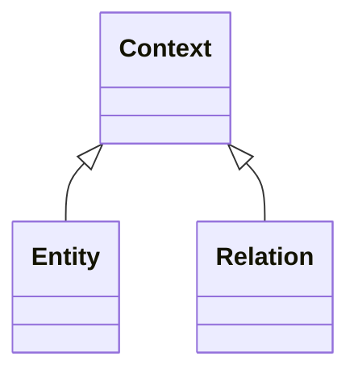
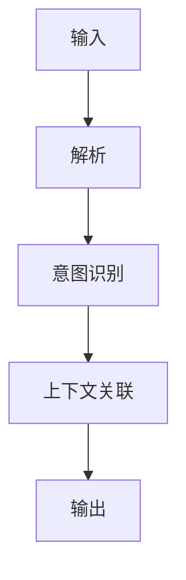

                 

# 实现AI Agent的上下文理解与管理

> 关键词：AI Agent，上下文理解，意图识别，对话管理，知识图谱

> 摘要：本文详细探讨了AI Agent中上下文理解与管理的核心技术，从背景介绍、核心概念、算法原理到系统架构设计、项目实战，全面解析了如何实现高效的上下文管理。通过具体案例分析，深入浅出地展示了AI Agent在上下文理解中的应用，为相关领域的开发者提供了实用的指导。

---

# 第1章: AI Agent与上下文管理概述

## 1.1 AI Agent的基本概念

### 1.1.1 AI Agent的定义与分类

AI Agent（人工智能代理）是指能够感知环境、执行任务并做出决策的智能实体。根据功能和应用场景，AI Agent可以分为以下几类：

- **简单反射型Agent**：基于预定义规则直接响应输入，适用于简单的交互场景。
- **基于模型的反射型Agent**：利用内部模型理解和推理用户需求，适用于复杂场景。
- **目标驱动型Agent**：具有明确的目标，主动规划和执行任务。
- **实用驱动型Agent**：通过优化目标函数来实现最优决策。

AI Agent的核心在于其能够通过上下文理解与用户进行有效交互，并根据环境反馈调整自身行为。

### 1.1.2 上下文理解在AI Agent中的重要性

上下文理解是AI Agent实现智能化交互的关键。通过理解上下文，AI Agent能够：

1. **准确识别用户意图**：通过分析用户输入的历史记录和当前语境，判断用户的深层需求。
2. **提供个性化服务**：基于上下文信息，为用户提供定制化的响应。
3. **增强交互连贯性**：通过保持对话上下文的一致性，提升用户体验。

### 1.1.3 AI Agent的应用场景与挑战

AI Agent广泛应用于智能音箱、聊天机器人、智能客服等领域。然而，上下文管理也面临以下挑战：

- **动态变化的上下文**：用户需求可能随时变化，需要快速调整响应。
- **多模态数据处理**：上下文信息可能来自文本、语音、图像等多种形式，处理复杂。
- **实时性要求高**：在实时交互场景中，上下文理解需要快速响应。

## 1.2 上下文管理的核心概念

### 1.2.1 上下文的定义与特征

上下文（Context）是指在特定场景下与当前任务相关的所有相关信息。其主要特征包括：

- **相关性**：与当前任务直接相关。
- **动态性**：随场景变化而变化。
- **层次性**：上下文可以分解为多个层次，从全局到局部。
- **模糊性**：上下文信息可能存在不确定性。

### 1.2.2 上下文管理的目标与作用

上下文管理的目标是通过收集、分析和利用上下文信息，提升AI Agent的交互能力和决策能力。其主要作用包括：

1. **提高交互准确性**：通过上下文信息准确理解用户意图。
2. **优化决策过程**：基于上下文信息进行更智能的决策。
3. **增强用户体验**：通过个性化服务提升用户满意度。

### 1.2.3 AI Agent中上下文管理的边界与外延

上下文管理的边界在于AI Agent的能力和场景限制。外延则包括：

- **外部知识库**：如互联网搜索结果、数据库信息。
- **用户画像**：如用户的历史行为、偏好等。
- **环境信息**：如地理位置、时间等。

# 第2章: 上下文理解的核心概念与联系

## 2.1 上下文理解的原理

### 2.1.1 上下文理解的基本原理

上下文理解基于自然语言处理（NLP）和机器学习技术，通过分析文本中的语义信息，判断用户的意图和情感倾向。基本步骤包括：

1. **文本预处理**：分词、去停用词、实体识别。
2. **意图识别**：通过训练好的模型判断用户意图。
3. **上下文关联**：将当前输入与历史记录关联，保持对话连贯性。

### 2.1.2 上下文理解的关键要素

关键要素包括：

- **意图识别**：判断用户的主要诉求。
- **实体识别**：提取文本中的关键实体信息。
- **情感分析**：判断用户情感倾向。

### 2.1.3 上下文理解的数学模型与公式

常用概率模型如马尔可夫链和贝叶斯分类器：

$$P(C|U) = \frac{P(U|C)P(C)}{P(U)}$$

其中，$C$表示上下文，$U$表示用户输入。

## 2.2 核心概念的属性特征对比

### 2.2.1 上下文与语境的对比分析

| 属性 | 上下文 | 语境 |
|------|--------|------|
| 定义 | 当前任务相关的信息 | 语言使用的具体环境 |
| 范围 | 较广，涵盖任务内外 | 较窄，主要指语言环境 |
| 动态性 | 高，随任务变化 | 中，主要受语言环境影响 |

### 2.2.2 上下文与意图的关系

意图是上下文的重要组成部分，意图识别依赖于上下文信息，而上下文理解又需要结合意图进行分析。两者相辅相成，共同实现智能化交互。

### 2.2.3 上下文与知识图谱的联系

知识图谱为上下文理解提供了丰富的语义信息，帮助AI Agent更好地理解用户的深层需求。通过知识图谱，可以实现跨领域、多模态的上下文关联。

## 2.3 实体关系图（ER图）与流程图

### 2.3.1 上下文理解的ER实体关系图

### 2.3.2 上下文理解的流程图

# 第3章: 上下文理解的算法原理与实现

## 3.1 意图识别算法

### 3.1.1 基于关键词的意图识别

通过预定义的关键词库，匹配用户输入中的关键词，判断意图。例如，关键词“订单”可能对应“查询订单状态”的意图。

### 3.1.2 基于机器学习的意图识别

使用训练好的机器学习模型（如SVM、随机森林）进行意图分类。模型通过特征提取（如TF-IDF）和训练数据进行分类。

### 3.1.3 基于深度学习的意图识别

利用循环神经网络（RNN）或变换器（如BERT）进行意图识别，捕捉文本的上下文信息，提升准确性。

## 3.2 对话管理算法

### 3.2.1 基于规则的对话管理

通过预定义的规则库，根据当前输入和上下文信息，生成响应。适用于简单的对话场景。

### 3.2.2 基于状态机的对话管理

将对话状态化为有限状态机，根据当前状态和输入，转移至下一个状态，并生成响应。适用于结构化的对话流程。

### 3.2.3 基于强化学习的对话管理

通过强化学习（如DQN）优化对话策略，学习最优的响应方式。适用于复杂的对话场景。

## 3.3 上下文关联算法

### 3.3.1 基于概率论的上下文关联

通过计算上下文条件概率，关联当前输入与历史记录。例如：

$$P(C_i|U_j) = \frac{P(U_j|C_i)P(C_i)}{P(U_j)}$$

### 3.3.2 基于图论的上下文关联

构建上下文关联图，通过图的遍历算法，找到最相关的上下文信息。

### 3.3.3 基于知识图谱的上下文关联

利用知识图谱中的语义关系，关联当前输入与外部知识库中的信息。

## 3.4 算法实现的数学模型与公式

### 3.4.1 概率论模型

$$P(C|U) = \frac{P(U|C)P(C)}{P(U)}$$

其中，$C$表示上下文，$U$表示用户输入。

### 3.4.2 图论模型

$$C = \{c_1, c_2, ..., c_n\}$$

其中，$c_i$表示上下文元素。

## 3.5 本章小结

---

（由于篇幅限制，后续章节内容将根据需要逐步展开，涵盖系统架构设计、项目实战、总结与展望等内容。）

