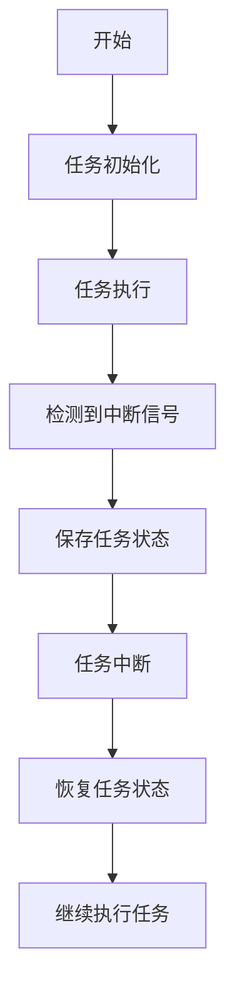
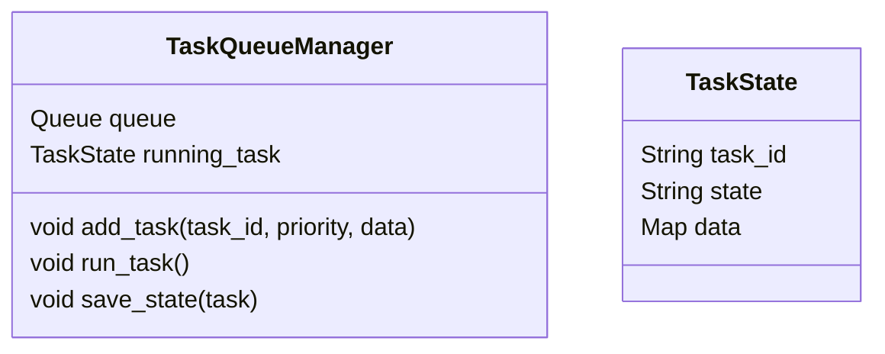
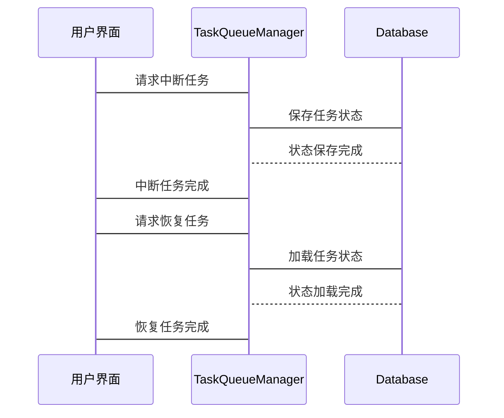

                 


# 实现AI Agent的任务中断与恢复功能

> 关键词：AI Agent, 任务中断, 任务恢复, 状态管理, 中断机制, 恢复策略

> 摘要：本文详细探讨了实现AI Agent的任务中断与恢复功能的关键技术，包括任务状态管理、中断机制和恢复策略的设计与实现。通过分析任务中断的场景、实现机制以及恢复策略，本文提出了基于任务队列管理、状态持久化和中断检测与恢复算法的解决方案。结合系统架构设计和项目实战，本文为实现AI Agent的任务中断与恢复功能提供了理论支持和实践指导。

---

# 第一部分: AI Agent任务中断与恢复的背景与概念

## 第1章: 问题背景与描述

### 1.1 问题背景

AI Agent是一种智能代理，能够根据环境信息和目标自主执行任务。在实际应用中，AI Agent可能会遇到任务中断的情况，例如外部中断信号、资源限制或系统故障。任务中断与恢复功能是确保AI Agent能够中断当前任务、保存中间状态，并在恢复时继续执行的重要能力。

#### 1.1.1 AI Agent的定义与特点

- **定义**：AI Agent是一种智能实体，能够感知环境、执行任务并做出决策。
- **特点**：自主性、反应性、目标导向、社会能力。

#### 1.1.2 任务中断与恢复的必要性

- **中断原因**：外部中断信号、资源不足、系统故障。
- **恢复需求**：保持任务状态、恢复任务进度、避免数据丢失。

#### 1.1.3 任务中断与恢复的边界与外延

- **边界**：任务执行过程中，从中断到恢复的过渡。
- **外延**：涉及任务队列管理、状态持久化、中断检测与恢复机制。

### 1.2 问题描述

#### 1.2.1 任务中断的场景分析

- **场景1**：外部中断信号（如用户手动中断）。
- **场景2**：资源限制（如内存不足）。
- **场景3**：系统故障（如网络中断）。

#### 1.2.2 任务恢复的挑战与复杂性

- **状态丢失**：中断时未保存中间状态，导致恢复时无法继续。
- **资源重新分配**：中断后，资源可能被其他任务占用，恢复时需要重新分配。
- **任务优先级**：多个任务中断时，恢复顺序需要考虑优先级。

#### 1.2.3 任务中断与恢复的核心要素

- **任务状态**：中断点、恢复点、任务优先级。
- **中断机制**：中断触发条件、中断处理方式。
- **恢复策略**：恢复优先级、恢复方式。

### 1.3 问题解决思路

#### 1.3.1 任务中断与恢复的基本原则

- **状态管理**：任务中断时，必须保存当前状态；恢复时，加载状态并继续执行。
- **中断检测**：实时检测中断信号，并触发中断处理机制。
- **恢复策略**：根据任务优先级和资源情况，选择合适的恢复方式。

#### 1.3.2 任务状态管理的实现方式

- **队列管理**：任务以队列形式管理，支持中断和恢复。
- **状态持久化**：将任务状态保存到持久化存储中，确保中断后能够恢复。
- **中断处理机制**：检测中断信号，并触发中断处理逻辑。

#### 1.3.3 任务中断与恢复的实现路径

- **设计任务状态模型**：定义任务状态的表示方式，如任务ID、任务优先级、中断点等。
- **实现中断检测**：通过监听中断信号，触发中断处理逻辑。
- **实现任务恢复**：从持久化存储中加载任务状态，并恢复任务执行。

### 1.4 本章小结

本章从AI Agent的定义和特点出发，分析了任务中断与恢复的必要性，并详细描述了任务中断的场景和恢复的挑战。同时，提出了任务中断与恢复的核心要素和基本原则，为后续实现奠定了基础。

---

# 第二部分: 任务中断与恢复的核心概念与联系

## 第2章: 核心概念与原理

### 2.1 核心概念原理

#### 2.1.1 任务状态管理的实现原理

任务状态管理是任务中断与恢复的核心，主要实现以下功能：

1. **状态保存**：在任务中断时，将当前状态保存到持久化存储中。
2. **状态恢复**：在任务恢复时，从持久化存储中加载任务状态，并恢复到中断前的状态。

#### 2.1.2 中断检测机制的实现原理

中断检测机制负责实时检测中断信号，并触发中断处理逻辑：

1. **中断信号监听**：通过订阅中断信号，实时检测中断事件。
2. **中断处理**：当检测到中断信号时，触发中断处理逻辑，保存任务状态并中断任务。

#### 2.1.3 任务恢复策略的实现原理

任务恢复策略负责根据任务优先级和资源情况，选择合适的恢复方式：

1. **优先级排序**：根据任务优先级，确定恢复顺序。
2. **资源分配**：恢复任务时，确保所需的资源可用。

### 2.2 概念属性特征对比表

以下表格对比了任务中断与恢复相关概念的属性特征：

| 概念       | 属性特征               |
|------------|------------------------|
| 任务状态   | 中断点、恢复点、任务优先级 |
| 中断机制   | 中断触发条件、中断处理方式 |
| 恢复策略   | 恢复优先级、恢复方式     |

### 2.3 ER实体关系图

以下是任务中断与恢复的核心实体关系图：

```mermaid
er
actor(Agent, 中断信号, 恢复信号)
```

---

## 第3章: 算法原理与实现

### 3.1 算法原理

#### 3.1.1 任务队列管理算法

任务队列管理算法用于管理任务的执行顺序，支持中断和恢复：

1. **任务入队**：将新任务加入队列。
2. **任务出队**：根据优先级，从队列中取出任务执行。
3. **任务中断**：中断当前任务，将其状态保存，并将其重新入队。
4. **任务恢复**：从队列中取出中断的任务，加载其状态，并恢复执行。

#### 3.1.2 任务状态持久化算法

任务状态持久化算法用于将任务状态保存到持久化存储中：

1. **状态保存**：在任务中断时，将当前状态保存到存储中。
2. **状态恢复**：在任务恢复时，从存储中加载任务状态。

#### 3.1.3 中断检测与恢复算法

中断检测与恢复算法负责检测中断信号并恢复任务：

1. **中断检测**：实时检测中断信号。
2. **中断处理**：保存任务状态并中断任务。
3. **恢复触发**：在恢复时，加载任务状态并恢复执行。

### 3.2 算法流程图

以下是任务中断与恢复的算法流程图：



### 3.3 Python源代码实现

以下是一个简单的任务中断与恢复的Python实现示例：

```python
import logging
from typing import Dict, Any
from queue import Queue
import time

# 定义任务状态
class TaskState:
    def __init__(self, task_id: str, state: str, data: Dict[str, Any]):
        self.task_id = task_id
        self.state = state
        self.data = data

# 定义任务队列管理
class TaskQueueManager:
    def __init__(self):
        self.queue = Queue()
        self.running_task = None

    def add_task(self, task_id: str, priority: int, data: Dict[str, Any]):
        task = TaskState(task_id, 'queued', data)
        self.queue.put((priority, task))

    def run_task(self):
        while not self.queue.empty():
            priority, task = self.queue.get()
            self.running_task = task
            try:
                self.execute_task(task)
            except KeyboardInterrupt:
                logging.info(f"Interrupted: {task.task_id}")
                # 保存中断状态
                self.save_state(task)
                # 重新入队
                self.add_task(task.task_id, priority, {'state': 'interrupted'})
                continue
            finally:
                self.running_task = None

    def execute_task(self, task: TaskState):
        # 模拟任务执行
        for i in range(5):
            logging.info(f"Executing task {task.task_id}: {i}")
            time.sleep(1)

    def save_state(self, task: TaskState):
        # 模拟状态保存
        logging.info(f"Saving state for task {task.task_id}")

# 示例使用
if __name__ == "__main__":
    manager = TaskQueueManager()
    manager.add_task("task1", 1, {"data": "data1"})
    manager.add_task("task2", 2, {"data": "data2"})
    manager.run_task()
```

### 3.4 算法的数学模型与公式

任务中断与恢复的恢复时间可以表示为：

$$
恢复时间 = \sum_{i=1}^{n} t_i
$$

其中，$t_i$ 表示恢复每个中断任务所需的时间。

任务恢复的优先级可以表示为：

$$
优先级 = \frac{1}{1 + e^{-\beta t}}
$$

其中，$\beta$ 是一个正数，$t$ 是任务中断的时间。

---

## 第4章: 系统分析与架构设计

### 4.1 问题场景介绍

本章将分析AI Agent的任务中断与恢复功能的实现场景，包括任务中断的触发条件、任务恢复的优先级排序等。

### 4.2 系统功能设计

以下是系统功能设计的领域模型：



### 4.3 系统架构设计

以下是系统的分层架构设计：


### 4.4 系统接口设计

以下是系统接口设计：

```plaintext
+-------------------+        +-------------------+
|                   |        |                   |
|    用户界面        |        |   执行器           |
|                   |        |                   |
+-------------------+        +-------------------+
          |                          |
          |                          |
          v                          v
+-------------------+        +-------------------+
|                   |        |                   |
|TaskQueueManager    |        |   数据库           |
|                   |        |                   |
+-------------------+        +-------------------+
```

### 4.5 系统交互流程图

以下是系统的交互流程图：



---

## 第5章: 项目实战

### 5.1 环境安装

#### 5.1.1 安装Python

```bash
# 安装Python 3.8及以上版本
# 在Windows上：
# 下载并安装Python 3.8+
# 在macOS上：
# brew install python@3.8
# 在Linux上：
# sudo apt-get install python3.8
```

#### 5.1.2 安装依赖库

```bash
pip install -r requirements.txt
```

### 5.2 系统核心实现源代码

以下是核心代码实现：

```python
import logging
from typing import Dict, Any
from queue import Queue
import time

class TaskState:
    def __init__(self, task_id: str, state: str, data: Dict[str, Any]):
        self.task_id = task_id
        self.state = state
        self.data = data

class TaskQueueManager:
    def __init__(self):
        self.queue = Queue()
        self.running_task = None

    def add_task(self, task_id: str, priority: int, data: Dict[str, Any]):
        task = TaskState(task_id, 'queued', data)
        self.queue.put((priority, task))

    def run_task(self):
        while not self.queue.empty():
            priority, task = self.queue.get()
            self.running_task = task
            try:
                self.execute_task(task)
            except KeyboardInterrupt:
                logging.info(f"Interrupted: {task.task_id}")
                self.save_state(task)
                self.add_task(task.task_id, priority, {'state': 'interrupted'})
                continue
            finally:
                self.running_task = None

    def execute_task(self, task: TaskState):
        for i in range(5):
            logging.info(f"Executing task {task.task_id}: {i}")
            time.sleep(1)

    def save_state(self, task: TaskState):
        logging.info(f"Saving state for task {task.task_id}")

if __name__ == "__main__":
    import logging
    logging.basicConfig(level=logging.INFO)
    manager = TaskQueueManager()
    manager.add_task("task1", 1, {"data": "data1"})
    manager.add_task("task2", 2, {"data": "data2"})
    manager.run_task()
```

### 5.3 代码功能解读

1. **TaskState类**：表示任务的状态，包括任务ID、状态和数据。
2. **TaskQueueManager类**：管理任务队列，支持任务的添加、中断和恢复。
3. **add_task方法**：将任务加入队列。
4. **run_task方法**：执行任务队列中的任务。
5. **execute_task方法**：模拟任务执行。
6. **save_state方法**：保存任务状态。

### 5.4 实际案例分析

以下是一个实际案例分析：

1. **任务中断**：在任务执行过程中，用户按下Ctrl+C，触发中断信号。
2. **中断处理**：保存任务状态，并将任务重新入队。
3. **任务恢复**：在恢复时，加载任务状态，并继续执行。

### 5.5 项目小结

本章通过实际项目实战，详细讲解了任务中断与恢复功能的实现过程，包括环境安装、代码实现和案例分析。通过代码示例，读者可以更好地理解任务中断与恢复的实现细节。

---

## 第6章: 最佳实践与总结

### 6.1 小结

本章总结了实现AI Agent的任务中断与恢复功能的关键点，包括任务状态管理、中断检测与恢复算法的设计与实现。

### 6.2 注意事项

- **状态管理**：确保任务状态的准确保存和恢复。
- **资源管理**：中断后，确保资源能够正确释放并重新分配。
- **优先级排序**：在任务恢复时，优先处理优先级高的任务。

### 6.3 拓展阅读

- **分布式任务队列**：研究分布式任务队列的实现，如Celery、RabbitMQ。
- **任务状态管理**：学习任务状态管理的高级技术，如Saga模式、补偿事务。

---

# 结语

实现AI Agent的任务中断与恢复功能是一个复杂但重要的任务。通过本文的详细讲解和实战示例，读者可以掌握任务中断与恢复的核心技术，并在实际项目中灵活应用。未来，随着AI技术的不断发展，任务中断与恢复功能将变得更加智能化和高效。

--- 

如果需要进一步优化或调整文章内容，请随时告诉我！

