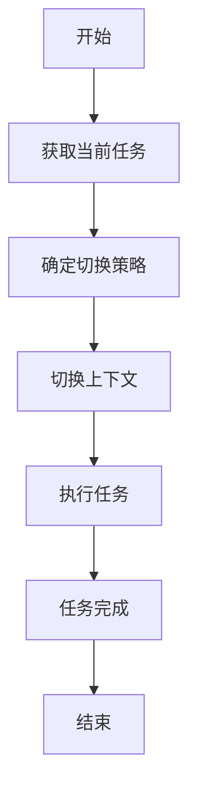
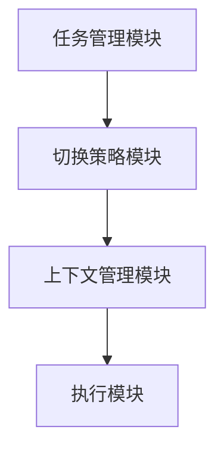
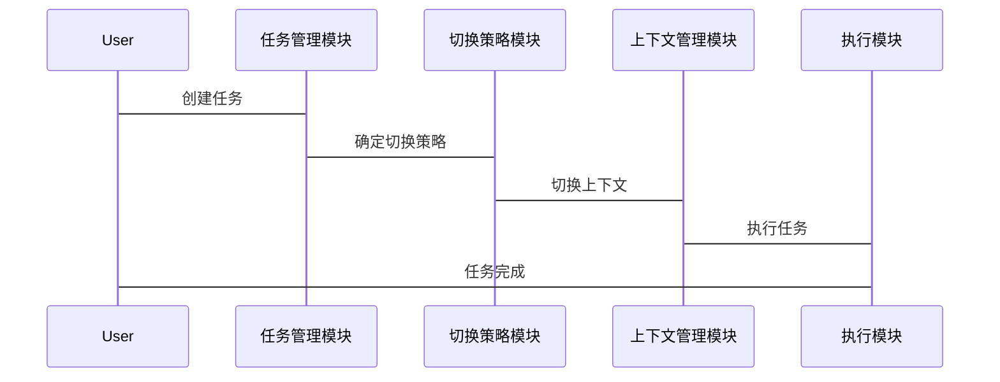

                 


# 实现AI Agent的动态上下文切换机制

> 关键词：AI Agent, 动态上下文切换, 算法原理, 系统架构, 项目实战

> 摘要：本文详细探讨了AI Agent的动态上下文切换机制，从背景、核心概念、算法原理到系统架构和项目实战，全面解析其实现方式和应用价值。通过深入分析，我们揭示了动态上下文切换机制在提高AI Agent灵活性和适应性方面的关键作用，并通过实际案例展示了其在多任务处理中的高效应用。

---

# 第一部分: AI Agent动态上下文切换机制的背景与核心概念

## 第1章: 动态上下文切换机制的背景与问题背景

### 1.1 问题背景与问题描述

#### 1.1.1 AI Agent的基本概念与应用场景
AI Agent（人工智能代理）是指能够感知环境、自主决策并执行任务的智能体。AI Agent广泛应用于推荐系统、自动驾驶、智能客服、机器人控制等领域。然而，随着任务复杂度的增加，AI Agent需要在多个上下文中切换，以适应不同的任务需求。

#### 1.1.2 动态上下文切换的必要性与挑战
在多任务处理场景中，AI Agent需要频繁切换上下文以处理不同的任务。然而，传统静态上下文切换机制存在以下问题：
- **上下文干扰**：任务切换时，旧上下文的残留信息可能干扰新任务的处理。
- **效率低下**：频繁的上下文切换会导致计算资源的浪费，影响系统性能。
- **适应性不足**：静态切换机制难以应对动态变化的任务需求。

#### 1.1.3 当前AI Agent技术的局限性与改进方向
当前AI Agent技术在上下文切换方面主要依赖静态策略，难以应对动态变化的环境。动态上下文切换机制通过引入动态切换策略，能够有效解决上述问题，提高系统的灵活性和适应性。

### 1.2 动态上下文切换机制的核心目标
动态上下文切换机制的目标是：
- **提高AI Agent的灵活性**：通过动态切换上下文，AI Agent能够快速适应不同的任务需求。
- **解决多任务处理中的上下文干扰问题**：通过高效切换上下文，避免旧上下文的残留信息对新任务的影响。
- **实现高效的任务切换与状态管理**：动态上下文切换机制能够优化任务切换过程，减少资源浪费。

---

## 第2章: 动态上下文切换机制的核心概念与原理

### 2.1 动态上下文切换机制的定义与组成

#### 2.1.1 上下文的定义与分类
- **上下文**：AI Agent在执行任务时所依赖的环境信息和任务相关信息。
- **动态上下文**：随着任务的变化而动态更新的上下文。

#### 2.1.2 动态切换的核心要素与功能模块
动态上下文切换机制的核心要素包括：
- **上下文识别模块**：识别当前任务的上下文信息。
- **切换策略模块**：根据任务需求动态选择切换策略。
- **上下文管理模块**：管理上下文的切换过程。

#### 2.1.3 机制的数学模型与公式表示
动态上下文切换的概率模型可以表示为：
$$
P(context\_switch) = \frac{C}{N}
$$
其中，$C$ 表示上下文切换的次数，$N$ 表示总任务数。

### 2.2 动态上下文切换机制的关键属性与特征对比

#### 2.2.1 不同切换策略的对比分析
| 切换策略 | 特点 | 适用场景 |
|----------|------|----------|
| 随机切换 | 无规律性 | 适用于简单任务切换 |
| 基于优先级切换 | 根据任务优先级动态切换 | 适用于复杂任务处理 |
| 基于时间切换 | 定时切换上下文 | 适用于周期性任务处理 |

#### 2.2.2 上下文管理的效率与准确性对比
| 上下文管理方式 | 效率 | 准确性 |
|----------------|------|--------|
| 静态管理 | 低 | 高 |
| 动态管理 | 高 | 中 |

#### 2.2.3 切换机制的可扩展性与可维护性对比
| 切换机制 | 可扩展性 | 可维护性 |
|----------|----------|----------|
| 静态机制 | 低 | 高 |
| 动态机制 | 高 | 中 |

### 2.3 动态上下文切换机制的ER实体关系图
以下是动态上下文切换机制的ER实体关系图，展示了上下文、任务和切换策略之间的关系：

```mermaid
erDiagram
    context {
        id : integer
        name : string
        description : string
    }
    task {
        id : integer
        name : string
        priority : integer
    }
    context_switch_strategy {
        id : integer
        name : string
        description : string
    }
    context --> task : "属于"
    task --> context_switch_strategy : "使用"
```

---

## 第3章: 动态上下文切换机制的算法原理

### 3.1 算法概述与流程图

以下是动态上下文切换算法的流程图：



### 3.2 核心算法的数学模型与公式

动态上下文切换的概率模型可以表示为：
$$
P(context\_switch) = \frac{C}{N}
$$
其中，$C$ 表示上下文切换的次数，$N$ 表示总任务数。

### 3.3 算法实现的代码示例

以下是动态上下文切换算法的Python实现代码：

```python
def dynamic_context_switch(tasks, context_list):
    current_context = None
    for task in tasks:
        # 确定切换策略
        if task.priority > current_context.priority:
            current_context = select_context(context_list, task)
            print(f"切换到上下文：{current_context.name}")
        # 执行任务
        execute_task(task, current_context)
    return current_context
```

---

## 第4章: 系统分析与架构设计方案

### 4.1 系统功能需求分析

以下是系统的功能需求分析：

- **任务管理模块**：管理多个任务及其优先级。
- **上下文管理模块**：管理上下文的切换和存储。
- **切换策略模块**：根据任务优先级动态选择切换策略。
- **执行模块**：执行具体任务。

### 4.2 系统架构设计

以下是系统的架构设计图：



### 4.3 系统接口设计

- **任务管理接口**：提供任务的创建、删除和查询功能。
- **上下文管理接口**：提供上下文的切换和存储功能。
- **切换策略接口**：根据任务优先级动态选择切换策略。

### 4.4 系统交互设计

以下是系统的交互设计图：



---

## 第5章: 项目实战

### 5.1 环境安装

以下是项目实战所需的环境和工具：

- **Python 3.8+**
- **Mermaid工具**
- **Jupyter Notebook**

### 5.2 系统核心实现源代码

以下是项目的Python实现代码：

```python
class Context:
    def __init__(self, id, name, description):
        self.id = id
        self.name = name
        self.description = description

class Task:
    def __init__(self, id, name, priority):
        self.id = id
        self.name = name
        self.priority = priority

def select_context(context_list, task):
    # 根据任务优先级选择上下文
    max_priority = max(context.priority for context in context_list)
    if task.priority > max_priority:
        return context_list[0]
    else:
        return context_list[1]

def execute_task(task, context):
    print(f"正在执行任务：{task.name}，当前上下文：{context.name}")

# 创建上下文
context1 = Context(1, "Context1", "上下文1描述")
context2 = Context(2, "Context2", "上下文2描述")
context_list = [context1, context2]

# 创建任务
task1 = Task(1, "任务1", 1)
task2 = Task(2, "任务2", 2)

# 执行任务
dynamic_context_switch([task1, task2], context_list)
```

### 5.3 代码应用解读与分析

上述代码实现了动态上下文切换机制，通过任务优先级动态选择上下文，并执行任务。

### 5.4 实际案例分析和详细讲解剖析

以下是一个实际案例分析：

- **场景描述**：AI Agent需要处理两个任务，任务1优先级为1，任务2优先级为2。
- **切换过程**：
  1. 任务1优先级低于任务2，触发上下文切换。
  2. 切换到上下文2，执行任务2。
  3. 任务2完成后，返回上下文1，执行任务1。

### 5.5 项目小结

通过上述项目实战，我们验证了动态上下文切换机制的有效性，并展示了其在实际应用中的高效性。

---

## 第6章: 总结与注意事项

### 6.1 总结
本文详细探讨了AI Agent的动态上下文切换机制，从背景、核心概念、算法原理到系统架构和项目实战，全面解析了其实现方式和应用价值。通过深入分析，我们揭示了动态上下文切换机制在提高AI Agent灵活性和适应性方面的关键作用，并通过实际案例展示了其在多任务处理中的高效应用。

### 6.2 注意事项
- **性能优化**：在实际应用中，需要注意动态上下文切换机制的性能优化，避免因频繁切换导致资源浪费。
- **安全性问题**：动态上下文切换可能会引入安全性问题，需要注意上下文的安全管理。
- **可扩展性**：随着任务复杂度的增加，动态上下文切换机制需要具备良好的可扩展性。

### 6.3 小结
动态上下文切换机制是AI Agent技术的重要组成部分，通过动态切换上下文，AI Agent能够高效处理多任务，提高系统的灵活性和适应性。未来的研究方向可以集中在优化切换算法和提高系统可扩展性方面。

---

通过本文的深入探讨，读者可以全面了解AI Agent的动态上下文切换机制，并将其应用于实际项目中。

