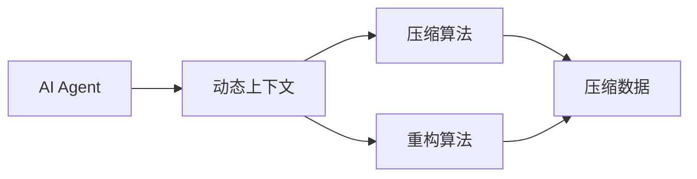
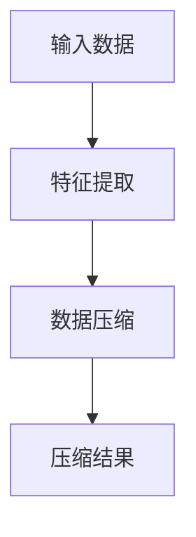
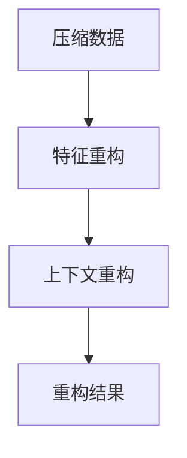

                 


# 实现AI Agent的动态上下文压缩与重构

> 关键词：AI Agent, 动态上下文, 压缩算法, 重构算法, 系统架构, 项目实战

> 摘要：本文详细探讨了AI Agent在动态上下文压缩与重构中的实现方法。通过分析问题背景、核心概念、算法原理、系统架构、项目实战和最佳实践，本文为读者提供了一个全面的视角，帮助他们理解如何高效地进行动态上下文管理，提升AI Agent的性能和应用效果。

---

## 第一部分: AI Agent的动态上下文压缩与重构背景介绍

### 第1章: 问题背景与核心概念

#### 1.1 问题背景
- 1.1.1 AI Agent的定义与应用场景
  - AI Agent的定义
  - AI Agent在智能系统中的角色
  - AI Agent的主要应用场景

- 1.1.2 动态上下文的概念与重要性
  - 上下文的定义
  - 动态上下文的特性
  - 动态上下文在AI Agent中的重要性

- 1.1.3 当前技术面临的挑战
  - 动态上下文处理的复杂性
  - 数据量大与计算资源的限制
  - 上下文压缩与重构的精度问题

#### 1.2 问题描述
- 1.2.1 动态上下文的复杂性
  - 动态变化的环境对上下文的影响
  - 上下文信息的多样性和不确定性

- 1.2.2 上下文压缩的必要性
  - 压缩上下文的原因
  - 压缩对AI Agent性能提升的作用

- 1.2.3 上下文重构的目标与意义
  - 重构的目标
  - 重构对系统性能和用户体验的提升

#### 1.3 问题解决与边界
- 1.3.1 动态上下文压缩的目标
  - 压缩的核心目标
  - 压缩算法的选择与优化

- 1.3.2 上下文重构的边界与限制
  - 重构的边界条件
  - 重构算法的局限性

- 1.3.3 相关技术的对比与选择
  - 常见压缩与重构技术的对比
  - 适合AI Agent的技术选择

#### 1.4 核心概念结构
- 1.4.1 动态上下文压缩的数学模型
  - 压缩模型的构建
  - 模型的输入与输出

- 1.4.2 上下文重构的逻辑框架
  - 重构的逻辑步骤
  - 框架的组成与交互

- 1.4.3 核心要素的组成与关系
  - 核心要素的定义
  - 要素之间的关系与依赖

---

## 第二部分: 核心概念与联系

### 第2章: 核心概念与联系

#### 2.1 动态上下文压缩的原理
- 2.1.1 压缩算法的原理
  - 压缩算法的基本原理
  - 压缩的关键步骤

- 2.1.2 动态变化的处理方式
  - 动态变化的检测
  - 动态变化对压缩的影响

- 2.1.3 压缩效果的评估指标
  - 压缩率的计算
  - 压缩质量的评估

#### 2.2 上下文重构的机制
- 2.2.1 基于压缩数据的重构方法
  - 压缩数据的解码
  - 解码过程中的挑战

- 2.2.2 上下文关联性分析
  - 关联性分析的步骤
  - 关联性对重构的影响

- 2.2.3 重构算法的优化策略
  - 算法优化的方向
  - 优化策略的实施

#### 2.3 核心概念对比
- 2.3.1 动态上下文压缩与静态压缩的对比
  - 静态压缩的定义
  - 动态与静态压缩的对比分析

- 2.3.2 上下文重构与数据恢复的对比
  - 数据恢复的定义
  - 重构与恢复的差异

- 2.3.3 不同压缩算法的优缺点分析
  - 常见压缩算法的对比
  - 适合AI Agent的算法选择

#### 2.4 实体关系图


---

## 第三部分: 算法原理讲解

### 第3章: 算法原理讲解

#### 3.1 动态上下文压缩算法
- 3.1.1 压缩算法流程图


- 3.1.2 算法实现代码
```python
def compress(context):
    # 压缩逻辑
    return compressed_context
```

- 3.1.3 数学模型与公式
$$
\text{压缩率} = \frac{\text{原始数据量}}{\text{压缩后数据量}}
$$

#### 3.2 上下文重构算法
- 3.2.1 重构算法流程图


- 3.2.2 算法实现代码
```python
def reconstruct(compressed_context):
    # 重构逻辑
    return reconstructed_context
```

- 3.2.3 数学模型与公式
$$
\text{重构精度} = \frac{\text{正确重构的数据量}}{\text{原始数据量}}
$$

---

## 第四部分: 系统分析与架构设计方案

### 第4章: 系统分析与架构设计

#### 4.1 问题场景介绍
- 系统背景介绍
- 系统目标
- 系统主要功能

#### 4.2 项目介绍
- 项目背景
- 项目目标
- 项目范围

#### 4.3 系统功能设计
- 领域模型设计
  ```mermaid
  classDiagram
  class AI_Agent {
      compress(context)
      reconstruct(compressed_context)
  }
  class Context {
      data
      metadata
  }
  ```

- 系统架构设计
  ```mermaid
  graph TD
  A[API Gateway] --> B[Compression_Service]
  B --> C[Reconstruction_Service]
  C --> D[Database]
  ```

- 系统接口设计
  - API接口定义
  - 接口交互流程

- 系统交互流程
  ```mermaid
  sequenceDiagram
  participant Agent
  participant Context
  participant Service
  Agent -> Context: get_context
  Context -> Service: compress_context
  Service -> Context: return_compressed_context
  Agent -> Context: reconstruct_context
  Context -> Service: return_reconstructed_context
  ```

---

## 第五部分: 项目实战

### 第5章: 项目实战

#### 5.1 环境安装
- 开发环境要求
- 依赖库安装
- 环境配置

#### 5.2 核心实现
- 压缩算法实现
  ```python
  def compress(context):
      # 压缩逻辑
      return compressed_context
  ```

- 重构算法实现
  ```python
  def reconstruct(compressed_context):
      # 重构逻辑
      return reconstructed_context
  ```

- 代码解读与分析
  - 代码结构分析
  - 关键代码解读

#### 5.3 案例分析与解读
- 实际案例分析
- 案例结果展示
- 结果分析

#### 5.4 项目小结
- 项目成果总结
- 经验与教训
- 改进方向

---

## 第六部分: 最佳实践

### 第6章: 最佳实践

#### 6.1 小结
- 核心内容总结
- 关键点回顾

#### 6.2 注意事项
- 开发中的注意事项
- 使用中的注意事项

#### 6.3 拓展阅读
- 相关领域的推荐读物
- 进一步学习的方向

---

## 参考文献
- [1] 书籍或论文1
- [2] 书籍或论文2
- [3] 书籍或论文3

---

## 附录
- 附录A: 代码示例
- 附录B: 图表补充说明
- 附录C: 进一步的技术细节

---

通过以上目录结构，文章将系统地介绍AI Agent的动态上下文压缩与重构的各个方面，从理论到实践，帮助读者全面理解和掌握相关技术。

