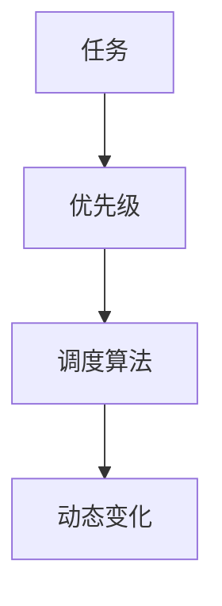
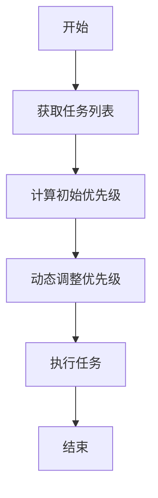
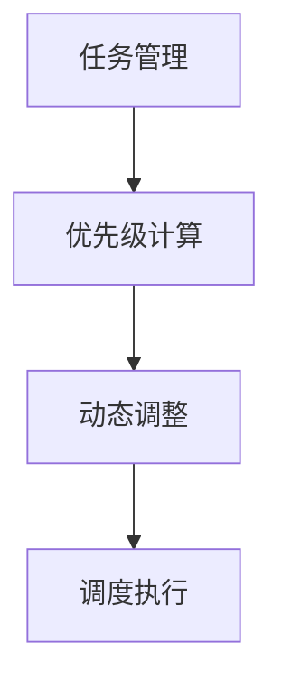

                 


# 实现AI Agent的动态任务优先级调度

> 关键词：AI Agent, 动态任务优先级, 调度算法, 系统架构设计, 任务调度模型

> 摘要：本文详细探讨了AI Agent在动态任务优先级调度中的实现方法，从基本概念、算法原理到系统架构设计，结合实际案例和代码实现，为读者提供了一套完整的解决方案。

---

# 第一部分: AI Agent与动态任务优先级调度基础

## 第1章: AI Agent与动态任务优先级调度概述

### 1.1 AI Agent的基本概念

#### 1.1.1 AI Agent的定义与分类
AI Agent（智能代理）是指能够感知环境并采取行动以实现目标的实体。根据智能水平，AI Agent可以分为：
- **反应式Agent**：基于当前感知做出反应。
- **认知式Agent**：具有推理、规划能力，能够理解复杂环境。
- **学习式Agent**：能够通过经验改进性能。

#### 1.1.2 动态任务优先级调度的背景与意义
在多任务环境中，AI Agent需要同时处理多个任务，但资源有限。动态任务优先级调度通过实时调整任务优先级，确保关键任务优先执行，从而提高整体效率。

#### 1.1.3 动态任务优先级调度的核心问题
动态任务优先级调度需要解决以下问题：
1. 如何量化任务的优先级？
2. 如何实时调整优先级以适应环境变化？
3. 如何确保调度算法的高效性和准确性？

---

## 第2章: 动态任务优先级调度的核心概念与联系

### 2.1 动态任务优先级调度的原理

#### 2.1.1 任务调度模型
任务调度模型包括以下步骤：
1. **任务收集**：获取所有待处理任务。
2. **优先级计算**：根据任务属性计算优先级。
3. **动态调整**：根据环境变化实时调整优先级。
4. **任务执行**：按照优先级顺序执行任务。

#### 2.1.2 优先级计算模型
优先级计算模型可以是基于权重的线性组合：
$$ P_i = \frac{w_1 \cdot T_i + w_2 \cdot D_i}{w_1 + w_2} $$
其中，$P_i$ 是任务i的优先级，$T_i$ 是任务的时间要求，$D_i$ 是任务的依赖性权重，$w_1$ 和 $w_2$ 是权重系数。

#### 2.1.3 动态调整机制
动态调整机制包括：
- **时间窗口调整**：定期重新计算优先级。
- **任务状态调整**：根据任务执行状态动态调整优先级。
- **资源分配调整**：根据资源可用性调整优先级。

### 2.2 核心概念对比分析

#### 2.2.1 任务调度模型对比表
| 模型 | 描述 | 优点 | 缺点 |
|------|------|------|------|
| 简单轮转 | 基于时间轮转调度 | 实现简单 | 无法适应任务重要性差异 |
| 基于优先级 | 根据优先级调度 | 能够优先处理关键任务 | 优先级计算复杂 |

#### 2.2.2 动态调整机制对比表
| 机制 | 描述 | 优点 | 缺点 |
|------|------|------|------|
| 时间窗口 | 定期调整 | 周期性调整，保证公平性 | 可能无法及时响应突发变化 |
| 任务状态 | 实时调整 | 能够快速响应状态变化 | 实时计算资源消耗大 |

### 2.3 实体关系图（ER图）


---

## 第3章: 动态任务优先级调度的算法原理

### 3.1 动态优先级排序算法

#### 3.1.1 算法的基本思想
动态优先级排序算法的核心思想是：
1. **初始化优先级**：根据任务属性初始化优先级。
2. **动态调整**：根据环境变化实时调整优先级。
3. **任务调度**：按照调整后的优先级执行任务。

#### 3.1.2 算法的数学模型
动态优先级计算公式：
$$ P_i(t) = \frac{w_1 \cdot T_i + w_2 \cdot D_i + w_3 \cdot E_i(t)}{w_1 + w_2 + w_3} $$
其中，$E_i(t)$ 是任务i在时间t的环境影响因子。

### 3.2 动态调整机制

#### 3.2.1 基于时间窗口的调整
时间窗口调整算法：
1. 在固定时间窗口（例如每分钟）内重新计算优先级。
2. 根据当前任务状态和环境变化调整优先级。

#### 3.2.2 基于任务状态的调整
任务状态调整算法：
1. 监测任务执行状态（完成、延迟、中断）。
2. 根据状态变化动态调整优先级。

### 3.3 算法流程图


---

## 第4章: 动态任务优先级调度的系统架构设计

### 4.1 系统功能设计

#### 4.1.1 系统功能模块
- **任务管理模块**：负责任务的收集、分配和监控。
- **优先级计算模块**：根据任务属性和环境计算优先级。
- **动态调整模块**：实时调整优先级。
- **调度执行模块**：根据优先级执行任务。

#### 4.1.2 系统功能流程
1. **任务收集**：通过API获取所有待处理任务。
2. **优先级计算**：根据任务属性计算初始优先级。
3. **动态调整**：根据环境变化实时调整优先级。
4. **任务执行**：按照优先级顺序执行任务。

### 4.2 系统架构设计

#### 4.2.1 系统架构图


#### 4.2.2 系统接口设计
- **任务管理接口**：提供任务收集和分配的API。
- **优先级计算接口**：提供优先级计算的API。
- **动态调整接口**：提供优先级调整的API。
- **调度执行接口**：提供任务执行的API。

---

## 第5章: 动态任务优先级调度的项目实战

### 5.1 项目环境安装

#### 5.1.1 环境要求
- Python 3.8+
- 安装依赖：`pip install mermaid`

### 5.2 系统核心实现源代码

#### 5.2.1 优先级计算代码
```python
def calculate_priority(tasks, weights):
    priorities = []
    for task in tasks:
        numerator = weights[0] * task['time'] + weights[1] * task['dependency']
        denominator = weights[0] + weights[1]
        priority = numerator / denominator
        priorities.append(priority)
    return priorities
```

#### 5.2.2 动态调整代码
```python
def adjust_priority(tasks, priorities, environment_factors):
    adjusted_priorities = []
    for i in range(len(tasks)):
        new_priority = priorities[i] * environment_factors[i]
        adjusted_priorities.append(new_priority)
    return adjusted_priorities
```

### 5.3 案例分析与实现

#### 5.3.1 案例分析
假设我们有三个任务：
- 任务1：时间=2，依赖=0.8
- 任务2：时间=3，依赖=0.5
- 任务3：时间=1，依赖=0.7

权重：$w_1=0.6$, $w_2=0.4$

计算优先级：
$$ P_1 = \frac{0.6 \cdot 2 + 0.4 \cdot 0.8}{1.0} = 1.28 $$
$$ P_2 = \frac{0.6 \cdot 3 + 0.4 \cdot 0.5}{1.0} = 1.9 $$
$$ P_3 = \frac{0.6 \cdot 1 + 0.4 \cdot 0.7}{1.0} = 0.94 $$

调整优先级（假设环境因素均为1）：
$$ P_1 = 1.28 \times 1 = 1.28 $$
$$ P_2 = 1.9 \times 1 = 1.9 $$
$$ P_3 = 0.94 \times 1 = 0.94 $$

最终优先级排序：任务2 > 任务1 > 任务3。

---

## 第6章: 动态任务优先级调度的最佳实践与总结

### 6.1 最佳实践

#### 6.1.1 定期优化算法
根据实际应用效果，逐步优化优先级计算模型和动态调整机制。

#### 6.1.2 监控与日志
实时监控任务调度过程，记录优先级调整日志，便于问题排查。

#### 6.1.3 资源分配
合理分配资源，避免资源瓶颈影响任务调度。

### 6.2 小结与展望

#### 6.2.1 小结
本文详细介绍了AI Agent的动态任务优先级调度的实现方法，从基本概念、算法原理到系统架构设计，结合实际案例和代码实现，为读者提供了一套完整的解决方案。

#### 6.2.2 展望
未来的研究方向包括：
1. 更复杂的环境因素建模。
2. 更高效的优先级计算算法。
3. 更智能的动态调整机制。

---

通过本文的讲解，读者可以全面掌握AI Agent的动态任务优先级调度的核心技术和实现方法，为实际应用提供有力的技术支持。

