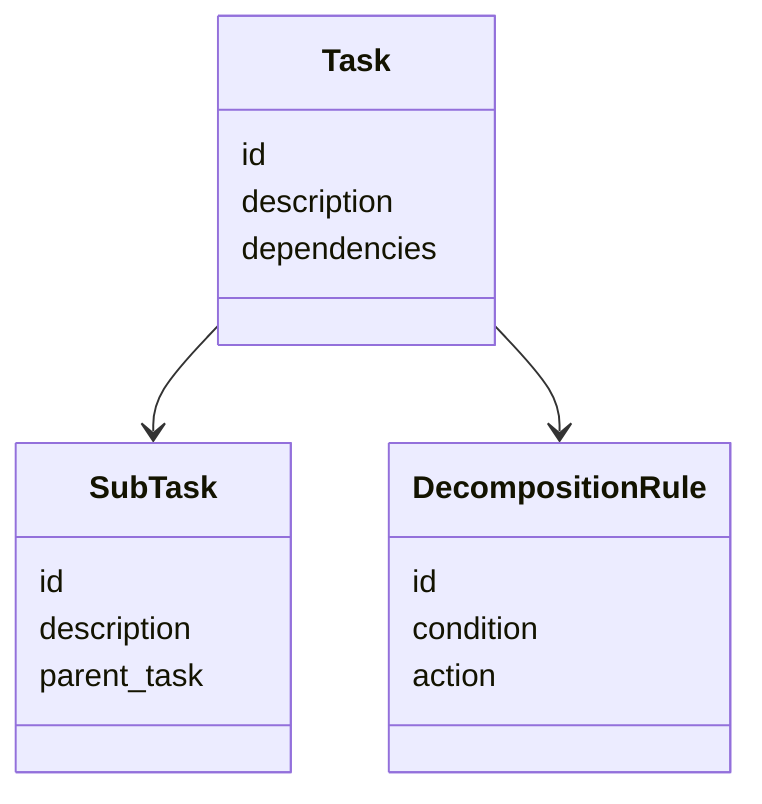

                 


# 实现AI Agent的动态任务分解与重组能力

## 关键词：AI Agent、动态任务分解、任务重组、算法原理、系统架构设计

## 摘要：
本文详细探讨了AI Agent实现动态任务分解与重组的能力，从核心概念、算法原理到系统架构设计，结合实际案例，全面解析了动态任务分解与重组的实现过程。通过具体的技术实现和代码示例，展示了如何构建高效的动态任务分解与重组系统。

---

# 第1章: AI Agent与动态任务分解概述

## 1.1 AI Agent的基本概念
### 1.1.1 AI Agent的定义与特点
- **定义**：AI Agent（智能体）是能够感知环境并采取行动以实现目标的实体。
- **特点**：
  - **自主性**：能够在没有外部干预的情况下运行。
  - **反应性**：能够根据环境反馈动态调整行为。
  - **目标导向性**：所有行为都围绕目标展开。
  - **社会性**：能够与其他Agent或人类进行交互协作。

### 1.1.2 动态任务分解的背景与意义
- **背景**：AI Agent需要在复杂多变的环境中执行任务，任务可能需要在运行时动态调整。
- **意义**：动态任务分解使AI Agent能够灵活应对环境变化，提高任务执行的效率和成功率。

### 1.1.3 问题背景与目标设定
- **问题背景**：传统任务分解方法难以应对动态变化的环境。
- **目标设定**：开发一种动态任务分解与重组的方法，使AI Agent能够灵活调整任务执行策略。

---

# 第2章: 动态任务分解与重组的核心要素

## 2.1 动态任务分解的模型与方法
### 2.1.1 基于规则的分解方法
- **规则定义**：通过预定义的规则将任务分解为子任务。
- **优势**：规则明确，易于实现。
- **不足**：缺乏灵活性，难以应对复杂任务。

### 2.1.2 基于图的分解方法
- **图结构**：将任务表示为图中的节点，通过图结构分解任务。
- **优势**：能够处理复杂任务，灵活调整分解策略。
- **不足**：实现复杂，需要高效的图处理算法。

### 2.1.3 基于优先级的分解策略
- **优先级排序**：根据任务的重要性或紧急性进行分解。
- **优势**：能够快速响应优先级高的任务。
- **不足**：可能忽略次要任务的影响。

## 2.2 核心概念与联系
### 2.2.1 任务分解与重组的概念对比
| **概念**      | **任务分解**         | **任务重组**         |
|----------------|----------------------|----------------------|
| **定义**       | 将任务拆分为子任务   | 将子任务整合为新任务 |
| **目的**       | 提高任务执行效率     | 适应环境变化         |
| **灵活性**     | 较低                 | 较高                 |

### 2.2.2 ER实体关系图
```mermaid
erd
    客体
    ---- 1..n ---------
    任务
    ---- 1..n ---------
    子任务
```

---

# 第3章: 动态任务分解与重组的算法原理

## 3.1 基于规则的分解算法
### 3.1.1 算法流程
1. **任务接收**：AI Agent接收主任务。
2. **规则匹配**：根据预定义规则将任务分解为子任务。
3. **子任务分配**：将子任务分配给不同的执行单元。

### 3.1.2 代码实现
```python
def decompose_task(main_task):
    sub_tasks = []
    for rule in rules:
        if rule.apply(main_task):
            sub_tasks.append(rule.decompose(main_task))
    return sub_tasks
```

### 3.1.3 数学模型
$$
f(task) = \sum_{i=1}^{n} w_i \cdot x_i
$$
其中，$w_i$是规则的重要性权重，$x_i$是任务特征。

## 3.2 基于图的分解算法
### 3.2.1 算法流程
1. **任务建模**：将任务表示为图中的节点。
2. **图分解**：通过图算法将任务分解为子任务。
3. **子任务优化**：根据反馈优化子任务。

### 3.2.2 代码实现
```python
def decompose_graph(graph):
    sub_graphs = []
    for node in graph.nodes:
        sub_graph = graph.find_subgraph(node)
        sub_graphs.append(sub_graph)
    return sub_graphs
```

---

# 第4章: 系统架构设计

## 4.1 系统功能设计
### 4.1.1 领域模型


### 4.1.2 系统架构


---

# 第5章: 项目实战

## 5.1 环境安装
```bash
pip install python-mermaid
pip install networkx
```

## 5.2 核心代码实现
```python
def main():
    # 初始化任务
    main_task = Task(id=1, description="完成项目报告")
    # 分解任务
    sub_tasks = decompose_task(main_task)
    # 执行子任务
    for sub_task in sub_tasks:
        execute(sub_task)
    # 重组任务
    recompose_task(main_task)
```

## 5.3 实际案例分析
### 案例背景
- **任务**：完成项目报告。
- **分解**：分解为收集数据、撰写内容、制作图表。
- **重组**：根据反馈调整优先级。

---

# 第6章: 最佳实践

## 6.1 小结
- 动态任务分解与重组是AI Agent实现复杂任务的关键能力。
- 基于规则和图的分解方法各有优劣，需结合实际场景选择。

## 6.2 注意事项
- **规则设计**：确保规则的可扩展性和灵活性。
- **算法优化**：根据任务特点优化分解与重组算法。

## 6.3 拓展阅读
- 《Dynamic Task Decomposition in AI Agents》
- 《Graph-Based Task Decomposition Methods》

---

通过本文的详细讲解，读者可以全面理解AI Agent动态任务分解与重组的能力，并能够实际应用这些方法和算法来实现高效的AI系统。

