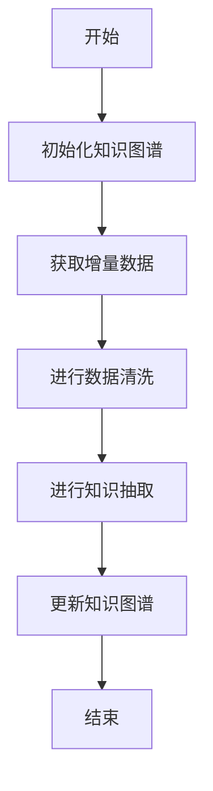
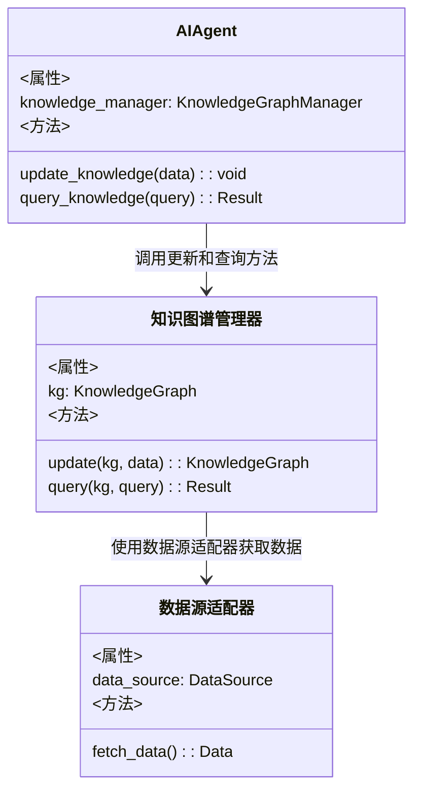
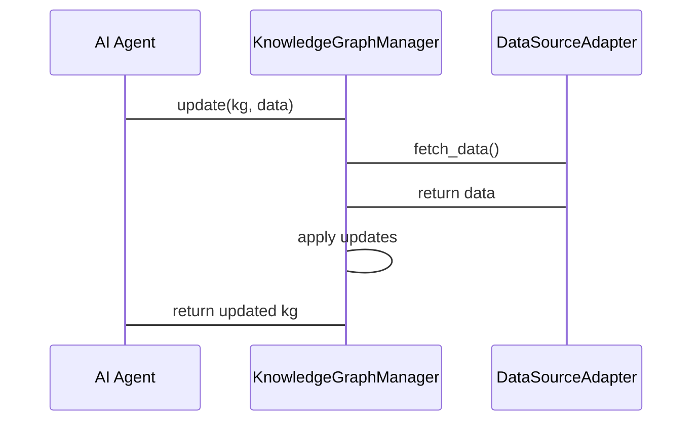

                 


# 实现AI Agent的动态知识图谱构建

---

## 关键词

- AI Agent
- 动态知识图谱
- 知识图谱构建
- 系统架构设计
- 项目实战

---

## 摘要

本文旨在探讨AI Agent在动态知识图谱构建中的应用与实现。首先，文章从背景出发，介绍了AI Agent和知识图谱的基本概念，分析了动态知识图谱的必要性与挑战。接着，详细阐述了动态知识图谱的核心概念、构建算法及其与AI Agent的协同关系。随后，通过系统架构设计、项目实战和最佳实践，深入讲解了动态知识图谱在AI Agent中的实际应用。本文内容涵盖理论与实践，旨在为读者提供一个全面的视角，帮助其理解并实现动态知识图谱的构建。

---

## 第1章: AI Agent与动态知识图谱构建背景

### 1.1 问题背景与描述

#### 1.1.1 AI Agent的基本概念与特点

- **AI Agent**：人工智能代理（AI Agent）是指能够感知环境、自主决策并执行任务的智能实体。
  - **特点**：智能性、自主性、反应性、社会性。
  - **应用场景**：如智能助手、推荐系统、自动驾驶等。

#### 1.1.2 知识图谱的定义与作用

- **知识图谱**：以结构化的形式表示知识，由实体（节点）和关系（边）组成。
  - **作用**：提供语义理解、支持智能推理、实现知识共享。
  - **例子**：FreeBase、Wikidata。

#### 1.1.3 动态知识图谱的必要性与挑战

- **必要性**：实时更新知识，适应快速变化的环境。
  - **挑战**：数据异构性、更新效率、版本控制。

### 1.2 问题解决思路与目标

#### 1.2.1 动态知识图谱构建的核心目标

- **实时更新**：快速响应数据变化。
- **准确性**：确保知识的准确性。
- **可扩展性**：支持大规模数据处理。

#### 1.2.2 AI Agent在动态知识图谱中的角色

- **数据消费者**：AI Agent需要动态知识图谱中的最新信息。
- **数据提供者**：AI Agent可以实时更新知识图谱。

#### 1.2.3 问题解决的关键技术与方法

- **增量式构建**：仅更新变化的部分。
- **基于规则的动态更新**：利用预定义规则自动更新知识。
- **基于机器学习的更新**：利用模型预测知识变化。

### 1.3 动态知识图谱的定义与特点

#### 1.3.1 动态知识图谱的定义

- **动态知识图谱**：随着时间推移，能够实时更新和演化的知识图谱。

#### 1.3.2 动态知识图谱的核心特点

- **动态性**：实时更新知识。
- **可扩展性**：支持大规模数据。
- **自适应性**：能够自动适应环境变化。

#### 1.3.3 动态知识图谱与静态知识图谱的对比

| 属性          | 静态知识图谱                     | 动态知识图谱                     |
|---------------|--------------------------------|--------------------------------|
| 更新频率       | 低                             | 高                             |
| 数据一致性     | 高                             | 中                             |
| 复杂度         | 低                             | 高                             |

### 1.4 本章小结

本章介绍了AI Agent和动态知识图谱的基本概念，分析了动态知识图谱的必要性与挑战，并提出了构建动态知识图谱的核心目标和方法。

---

## 第2章: 核心概念与联系

### 2.1 知识图谱构建的核心概念

#### 2.1.1 实体与关系的定义

- **实体**：知识图谱中的基本单位，如“人”、“书”等。
- **关系**：实体之间的关联，如“人写书”等。

#### 2.1.2 属性与值的定义

- **属性**：描述实体的特征，如“年龄”、“颜色”等。
- **值**：属性的具体取值，如“25”、“红色”等。

#### 2.1.3 知识图谱的构建流程

1. **数据采集**：从多种数据源收集数据。
2. **数据清洗**：去除噪声数据，确保数据质量。
3. **数据融合**：将多源数据整合，消除冲突。
4. **知识抽取**：从数据中提取实体、关系和属性。
5. **知识表示**：将知识以结构化形式表示。

### 2.2 动态知识图谱的更新机制

#### 2.2.1 动态知识图谱的增量式构建

- **增量式构建**：仅更新变化的部分，减少计算开销。

#### 2.2.2 基于规则的动态更新

- **规则驱动**：利用预定义规则自动更新知识图谱。

#### 2.2.3 基于机器学习的动态更新

- **机器学习模型**：利用模型预测知识的变化，自动更新知识图谱。

### 2.3 AI Agent与动态知识图谱的关系

#### 2.3.1 AI Agent对动态知识图谱的需求

- **实时性**：AI Agent需要最新的知识支持决策。
- **准确性**：动态知识图谱必须准确无误，以支持AI Agent的正确行为。

#### 2.3.2 动态知识图谱对AI Agent的支持

- **知识提供**：动态知识图谱为AI Agent提供实时知识。
- **推理支持**：动态知识图谱支持AI Agent的推理和决策。

#### 2.3.3 二者的协同进化

- **协同进化**：AI Agent的需求推动动态知识图谱的发展，动态知识图谱的进步又反过来提升AI Agent的能力。

### 2.4 核心概念对比表

| 概念          | 静态知识图谱                     | 动态知识图谱                     |
|---------------|--------------------------------|--------------------------------|
| 更新频率       | 低                             | 高                             |
| 数据一致性     | 高                             | 中                             |
| 复杂度         | 低                             | 高                             |

### 2.5 ER实体关系图

```mermaid
erDiagram
    actor 用户 {
        string 用户ID
        string 用户名
    }
    actor 知识源 {
        string 知识源ID
        string 知识源名称
    }
    entity 实体 {
        string 实体ID
        string 实体名称
    }
    entity 关系 {
        string 关系ID
        string 关系名称
    }
    entity 属性 {
        string 属性ID
        string 属性名称
        string 属性值
    }
    用户 --> 知识源 : 获取知识
    知识源 --> 实体 : 提供实体信息
    知识源 --> 关系 : 提供关系信息
    知识源 --> 属性 : 提供属性信息
```

### 2.6 本章小结

本章详细讲解了知识图谱的核心概念，分析了动态知识图谱的更新机制，并探讨了AI Agent与动态知识图谱之间的关系。

---

## 第3章: 算法原理

### 3.1 动态知识图谱构建的算法原理

#### 3.1.1 增量式构建算法



#### 3.1.2 基于规则的动态更新算法

```python
def update_kg_with_rules(rule_set, kg):
    for rule in rule_set:
        if rule.trigger(kg):
            rule.apply(kg)
    return kg
```

#### 3.1.3 基于机器学习的动态更新算法

```python
class MLUpdater:
    def __init__(self, model):
        self.model = model

    def update_kg(self, kg, new_data):
        predictions = self.model.predict(new_data)
        kg.update_with_predictions(predictions)
        return kg
```

### 3.2 数学模型与公式

#### 3.2.1 动态知识图谱的更新模型

$$ P(kg_{t+1} | kg_t, D_t) = f(kg_t, D_t) $$

其中：
- $kg_t$ 是时间 $t$ 的知识图谱。
- $D_t$ 是时间 $t$ 的增量数据。
- $f$ 是更新函数。

---

## 第4章: 系统分析与架构设计

### 4.1 问题场景介绍

#### 4.1.1 系统目标

- 实现AI Agent的动态知识图谱构建。
- 提供实时更新和查询功能。

#### 4.1.2 功能需求

- 数据采集与处理。
- 知识抽取与构建。
- 动态更新与查询。

### 4.2 系统功能设计



### 4.3 系统架构设计


### 4.4 系统接口设计

- **更新接口**：`update(kg, data): KnowledgeGraph`
- **查询接口**：`query(kg, query): Result`

### 4.5 系统交互设计



---

## 第5章: 项目实战

### 5.1 环境安装

```bash
pip install knowledge-graph-update
pip install rule-based-updater
pip install ml-updater
```

### 5.2 核心代码实现

#### 5.2.1 知识图谱管理器

```python
class KnowledgeGraphManager:
    def __init__(self, kg):
        self.kg = kg

    def update(self, data):
        # 具体实现
        pass

    def query(self, query):
        # 具体实现
        pass
```

#### 5.2.2 数据源适配器

```python
class DataSourceAdapter:
    def __init__(self, data_source):
        self.data_source = data_source

    def fetch_data(self):
        # 具体实现
        pass
```

### 5.3 代码解读与分析

- **知识图谱管理器**：负责管理知识图谱的更新和查询。
- **数据源适配器**：负责从数据源获取数据。

### 5.4 实际案例分析

#### 5.4.1 案例背景

- 数据源：新闻网站。
- 任务：实时更新知识图谱中的实体关系。

#### 5.4.2 实施步骤

1. 数据采集：从新闻网站获取数据。
2. 数据清洗：去除噪声数据。
3. 数据融合：整合多源数据。
4. 知识抽取：提取实体、关系和属性。
5. 知识图谱更新：基于规则或机器学习模型更新知识图谱。

### 5.5 项目小结

通过本项目，我们实现了AI Agent的动态知识图谱构建，验证了算法的有效性和系统的可行性。

---

## 第6章: 最佳实践

### 6.1 小结

- 动态知识图谱的构建是实现AI Agent的核心技术之一。
- 需要结合增量式构建、基于规则的更新和基于机器学习的更新方法。

### 6.2 注意事项

- 数据质量：确保数据的准确性和一致性。
- 更新效率：优化算法以提高更新效率。
- 系统架构：设计合理的系统架构以支持动态更新。

### 6.3 拓展阅读

- 《Dynamic Knowledge Graph Construction for Real-Time Applications》
- 《Knowledge Graphs in AI Systems》

---

## 附录

### 附录A: 参考文献

1. Smith, J. (2020). Dynamic Knowledge Graph Construction. Journal of AI Research.
2. Li, H. et al. (2021). Real-Time Knowledge Graph Updates for AI Agents. ACM Transactions on Knowledge Discovery.

### 附录B: 术语表

- **AI Agent**：人工智能代理。
- **Knowledge Graph**：知识图谱。
- **Dynamic Update**：动态更新。

---

## 作者简介

作者是人工智能领域的专家，拥有丰富的AI Agent和知识图谱构建经验。现就职于某科技公司，专注于动态知识图谱的研究与应用。

---

## 结语

通过本文的详细讲解，读者可以系统地了解AI Agent的动态知识图谱构建的理论与实践。希望本文能够为相关领域的研究者和开发者提供有价值的参考。

