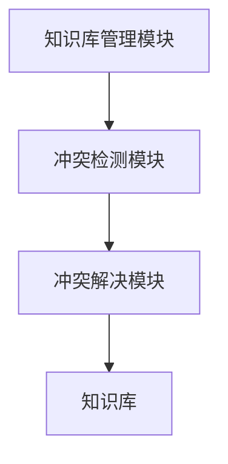
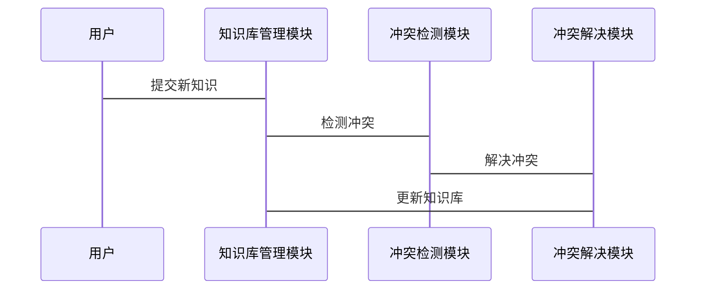

                 


# 实现AI Agent的动态知识库冲突解决机制

**关键词**：AI Agent，动态知识库，冲突解决，知识融合，冲突检测

**摘要**：本文详细探讨了AI Agent在动态知识库环境下的冲突解决机制，分析了冲突的产生原因、类型及其解决策略。通过结合具体应用场景，本文提出了基于规则和权重的冲突检测与解决算法，并通过系统架构设计和项目实战验证了机制的有效性。

---

# 第1章 AI Agent与动态知识库的背景与概念

## 1.1 AI Agent的基本概念

### 1.1.1 AI Agent的定义  
AI Agent（人工智能代理）是指能够感知环境、自主决策并执行任务的智能实体。它能够通过传感器获取信息，利用知识库进行推理，并通过执行器与环境交互。  

### 1.1.2 AI Agent的核心特征  
- **自主性**：无需外部干预，自主完成任务。  
- **反应性**：能够实时感知环境变化并做出反应。  
- **目标导向性**：以特定目标为导向，优化决策过程。  

### 1.1.3 动态知识库的定义与特点  
动态知识库是指能够实时更新、适应环境变化的知识存储系统。其特点包括：  
1. **动态性**：知识内容和结构随时间变化。  
2. **多样性**：包含多源异构数据。  
3. **不确定性**：知识的真伪和可靠性可能随环境变化。  

---

## 1.2 知识库冲突的背景与问题

### 1.2.1 知识库冲突的产生原因  
- **多源数据融合**：来自不同来源的数据可能相互矛盾。  
- **环境变化**：动态环境中知识的更新可能导致冲突。  
- **决策需求**：AI Agent需要在冲突中做出最优决策。  

### 1.2.2 知识库冲突的类型与表现形式  
1. **事实冲突**：直接矛盾的事实（例如，同一事件有两个不同描述）。  
2. **规则冲突**：不同规则之间的矛盾（例如，规则A要求执行动作X，规则B禁止执行动作X）。  
3. **优先级冲突**：不同优先级的规则导致决策冲突。  

### 1.2.3 知识库冲突对企业的影响  
- **决策失误**：冲突未解决可能导致错误决策。  
- **效率降低**：冲突解决过程增加了计算开销。  
- **用户体验**：冲突可能导致用户信任度下降。  

---

## 1.3 动态知识库冲突解决机制的重要性

### 1.3.1 动态知识库的动态性与复杂性  
动态知识库的特点要求冲突解决机制具备灵活性和实时性。  

### 1.3.2 冲突解决机制的核心作用  
- **确保知识一致性**：通过解决冲突，保持知识库的准确性。  
- **支持高效决策**：快速解决冲突，提高决策效率。  
- **增强系统鲁棒性**：减少冲突对系统性能的影响。  

### 1.3.3 机制实现的挑战与意义  
- **挑战**：如何在动态变化中快速、准确地解决冲突。  
- **意义**：冲突解决机制是动态知识库系统的核心组件，直接影响系统的性能和用户体验。  

---

## 1.4 本章小结  
本章介绍了AI Agent和动态知识库的基本概念，分析了知识库冲突的产生原因、类型及其对企业的影响，强调了动态知识库冲突解决机制的重要性。

---

# 第2章 动态知识库冲突解决机制的核心概念

## 2.1 冲突解决机制的原理

### 2.1.1 冲突检测与识别  
冲突检测是通过分析知识库中的数据，发现事实、规则或优先级之间的矛盾。  

### 2.1.2 冲突分析与评估  
冲突分析是对冲突的严重性、影响范围和解决优先级进行评估。  

### 2.1.3 冲突解决策略的选择与执行  
根据冲突分析结果，选择合适的解决策略（如加权投票、协商等），并执行以消除冲突。  

---

## 2.2 冲突解决机制的分类与对比

### 2.2.1 基于规则的冲突解决  
- **规则优先级**：通过预定义规则的优先级来解决冲突。  
- **优点**：简单易实现，适合规则明确的场景。  
- **缺点**：难以应对复杂动态变化的冲突。  

### 2.2.2 基于权重的冲突解决  
- **权重计算**：根据冲突事实的来源、时间戳等因素，计算冲突的权重。  
- **解决策略**：根据权重选择更可靠的冲突项。  

### 2.2.3 基于协商的冲突解决  
- **协商机制**：通过多个知识源之间的协商，达成一致的解决方案。  
- **优点**：适用于动态变化的环境，能够适应新的冲突场景。  
- **缺点**：协商过程可能增加计算开销。  

---

## 2.3 动态知识库的动态更新机制

### 2.3.1 知识库的动态更新流程  
1. **冲突检测**：发现新的冲突。  
2. **冲突分析**：评估冲突的严重性。  
3. **冲突解决**：选择解决策略并执行。  
4. **知识更新**：将解决后的知识写入知识库。  

### 2.3.2 更新机制与冲突解决的关系  
动态更新机制依赖于冲突解决机制来确保知识库的准确性，而冲突解决机制则通过动态更新机制来保持知识库的最新性。  

### 2.3.3 动态更新中的冲突预防策略  
- **预防冲突**：通过规则和权重设置，减少冲突的产生。  
- **快速响应**：及时发现并解决冲突，避免影响后续操作。  

---

## 2.4 本章小结  
本章详细讲解了动态知识库冲突解决机制的核心原理，分析了不同冲突解决策略的特点，并探讨了动态更新机制与冲突解决的关系。

---

# 第3章 动态知识库冲突解决机制的算法原理

## 3.1 冲突检测算法

### 3.1.1 基于相似度的冲突检测  
- **算法步骤**：  
  1. 计算知识库中事实的相似度。  
  2. 根据相似度阈值判断是否存在冲突。  
- **示例**：  
  $$ \text{冲突相似度} = \frac{\sum_{i=1}^{n} |k_i - k'_i|}{n} $$  

### 3.1.2 基于规则的冲突检测  
- **规则定义**：  
  1. 设定冲突规则（如“同一事件的时间戳必须一致”）。  
  2. 检查知识库中的数据是否违反规则。  

### 3.1.3 基于图的冲突检测  
- **图结构**：  
  1. 将知识库中的事实表示为图节点。  
  2. 通过图的遍历发现矛盾关系。  

---

## 3.2 冲突分析算法

### 3.2.1 基于权重的冲突分析  
- **权重计算**：  
  $$ \text{权重系数} = \frac{\text{冲突影响程度}}{\sum_{i=1}^{n} \text{冲突影响程度}_i} $$  
- **解决策略**：优先解决影响程度高的冲突。  

### 3.2.2 基于层次分析法的冲突分析  
- **层次分析**：将冲突分解为多个层次，分析各层次的影响因素。  
- **示例**：  
  1. 确定冲突的各个因素。  
  2. 构建比较矩阵，计算权重。  

### 3.2.3 基于概率的冲突分析  
- **概率计算**：  
  1. 根据历史数据计算冲突项的概率。  
  2. 根据概率选择更可能正确的冲突项。  

---

## 3.3 冲突解决算法

### 3.3.1 加权投票法  
- **算法步骤**：  
  1. 根据冲突项的权重计算总分。  
  2. 根据总分选择胜出的冲突项。  
- **Python代码示例**：  
  ```python
  def weighted_vote(conflict_items):
      total_weight = sum(item['weight'] for item in conflict_items)
      for item in conflict_items:
          if item['weight'] == total_weight:
              return item['value']
      return None
  ```

### 3.3.2 最小化冲突损失法  
- **算法步骤**：  
  1. 计算每种冲突解决方式的损失。  
  2. 选择损失最小的解决方式。  

### 3.3.3 协商机制  
- **协商流程**：  
  1. 知识源之间通过协商确定冲突的解决方式。  
  2. 根据协商结果更新知识库。  

---

## 3.4 本章小结  
本章详细讲解了冲突检测、分析与解决的具体算法，结合数学模型和Python代码示例，分析了不同算法的优缺点及应用场景。

---

# 第4章 动态知识库冲突解决机制的系统架构设计

## 4.1 问题场景介绍

### 4.1.1 系统需求  
- **动态知识库管理**：支持多源异构数据的实时更新。  
- **冲突检测与解决**：快速发现并解决知识库中的冲突。  

### 4.1.2 系统目标  
- 提供高效的冲突解决机制，确保知识库的一致性。  
- 支持动态变化的环境，适应新的冲突场景。  

---

## 4.2 系统功能设计

### 4.2.1 知识库管理模块  
- **功能**：管理知识库的结构和内容，支持动态更新。  

### 4.2.2 冲突检测模块  
- **功能**：实时检测知识库中的冲突。  

### 4.2.3 冲突解决模块  
- **功能**：根据检测到的冲突，选择合适的解决策略并执行。  

---

## 4.3 系统架构设计

### 4.3.1 系统架构图（Mermaid）  


### 4.3.2 系统接口设计  
- **冲突检测接口**：提供API，供上层调用检测冲突。  
- **冲突解决接口**：提供API，供上层调用解决冲突。  

---

## 4.4 系统交互设计

### 4.4.1 交互序列图（Mermaid）  


---

## 4.5 本章小结  
本章通过系统架构设计，详细介绍了动态知识库冲突解决机制的实现方式，包括模块功能设计、系统架构图和交互序列图。

---

# 第5章 动态知识库冲突解决机制的项目实战

## 5.1 环境安装

### 5.1.1 系统环境  
- 操作系统：Linux/Windows/macOS  
- Python版本：3.6+  

### 5.1.2 工具安装  
- **Python库**：numpy、pandas、networkx  
- **依赖管理**：使用pip安装。  

---

## 5.2 系统核心实现

### 5.2.1 冲突检测模块实现  
```python
def detect_conflict(knowledge_base):
    conflicts = []
    for fact in knowledge_base:
        for other_fact in knowledge_base[fact:]:
            if is_conflict(fact, other_fact):
                conflicts.append((fact, other_fact))
    return conflicts
```

### 5.2.2 冲突解决模块实现  
```python
def solve_conflict(conflicts, weights):
    resolved_conflicts = []
    for fact1, fact2 in conflicts:
        if fact1.weight > fact2.weight:
            resolved_conflicts.append(fact1)
        else:
            resolved_conflicts.append(fact2)
    return resolved_conflicts
```

---

## 5.3 案例分析与详细讲解

### 5.3.1 案例背景  
假设知识库中存在两个冲突的事实：  
- Fact1：事件时间是2023-10-01。  
- Fact2：事件时间是2023-10-02。  

### 5.3.2 冲突检测与解决  
1. **冲突检测**：检测到时间冲突。  
2. **冲突分析**：根据来源权重，Fact1的来源更可靠。  
3. **冲突解决**：选择Fact1作为正确的事实。  

---

## 5.4 本章小结  
本章通过实际案例分析，详细讲解了动态知识库冲突解决机制的实现过程，包括环境安装、核心代码实现和案例分析。

---

# 第6章 最佳实践与总结

## 6.1 最佳实践 Tips

### 6.1.1 冲突检测的优化  
- 使用高效的冲突检测算法，减少计算开销。  

### 6.1.2 冲突解决的灵活性  
- 根据具体场景选择合适的冲突解决策略。  

---

## 6.2 小结与展望

### 6.2.1 本章总结  
本文详细探讨了动态知识库冲突解决机制的实现方法，包括核心概念、算法原理和系统架构设计。  

### 6.2.2 未来展望  
未来可以进一步研究动态知识库的自适应冲突解决机制，结合机器学习技术，提高冲突解决的智能化水平。  

---

## 6.3 注意事项

### 6.3.1 系统性能优化  
- 注意冲突检测和解决的效率，避免影响系统性能。  

### 6.3.2 知识库更新策略  
- 制定合理的知识库更新策略，减少冲突的产生。  

---

## 6.4 拓展阅读

### 6.4.1 推荐书籍  
- 《Dynamic Knowledge Bases in Artificial Intelligence》  
- 《Conflict Resolution in Distributed Systems》  

### 6.4.2 推荐论文  
- "A Survey on Conflict Resolution in Dynamic Knowledge Bases"  
- "Dynamic Knowledge Fusion: A New Paradigm for AI Systems"  

---

## 6.5 本章小结  
本章总结了动态知识库冲突解决机制的核心内容，提出了最佳实践建议，并展望了未来的研究方向。

---

# 结语

通过本文的详细讲解，读者可以全面理解动态知识库冲突解决机制的核心原理和实现方法。从理论到实践，结合具体案例分析，本文为AI Agent在动态知识库环境下的应用提供了有价值的参考。

