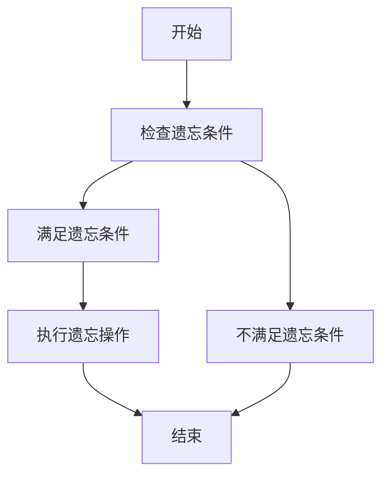
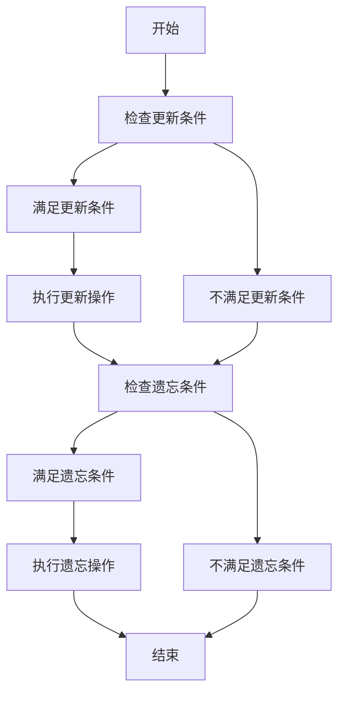
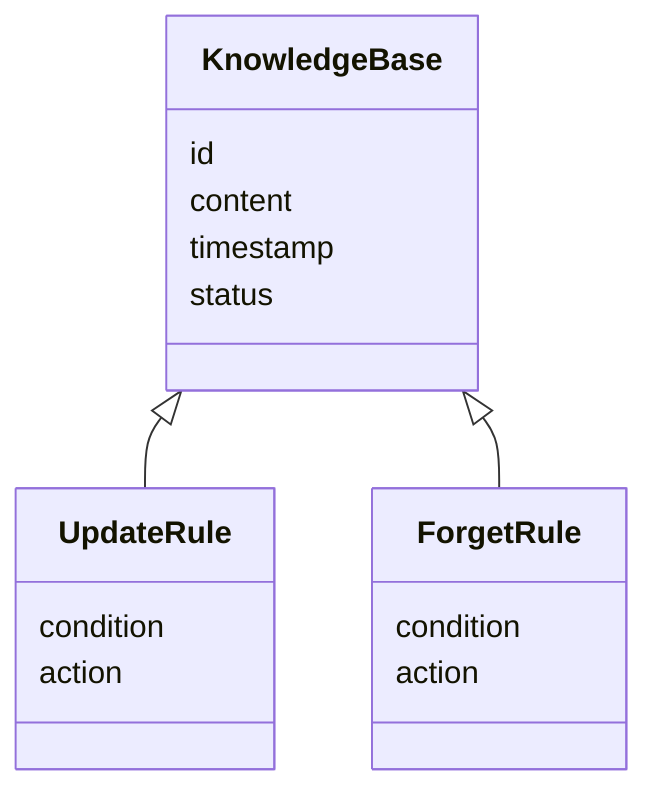
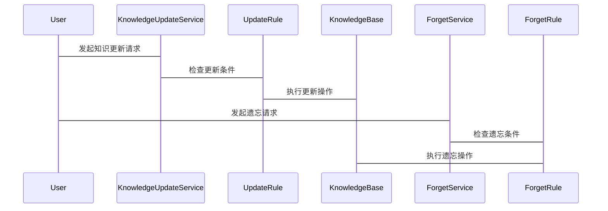

                 


# 实现AI Agent的动态知识更新与遗忘机制

## 关键词：
AI Agent，动态知识更新，遗忘机制，知识管理，算法原理

## 摘要：
本文深入探讨了AI Agent的动态知识更新与遗忘机制的实现方法。通过分析动态知识更新的核心概念、算法原理及系统架构，结合实际案例，详细讲解了如何在AI Agent中实现高效的知识更新与遗忘管理。文章内容涵盖从理论到实践的各个方面，旨在帮助读者全面理解并掌握这一技术。

---

## 第1章: AI Agent与动态知识更新概述

### 1.1 AI Agent的基本概念
#### 1.1.1 AI Agent的定义
AI Agent（智能体）是指能够感知环境、自主决策并执行任务的智能实体。它可以是一个软件程序、机器人或其他具备智能特性的系统。AI Agent的核心目标是通过感知和行动来实现特定目标。

#### 1.1.2 AI Agent的核心特征
- **自主性**：能够在没有外部干预的情况下自主决策。
- **反应性**：能够实时感知环境变化并做出反应。
- **学习能力**：通过经验或数据不断优化自身的知识和行为。
- **知识管理**：能够存储、更新和遗忘知识以适应动态环境。

#### 1.1.3 动态知识更新的必要性
在动态环境中，AI Agent需要不断适应新的信息和变化的条件。动态知识更新是确保AI Agent保持高效性和准确性的关键。例如，在自然语言处理中，AI Agent需要实时更新语言模型以适应新的词汇和语义变化。

### 1.2 动态知识更新的背景与问题背景
#### 1.2.1 知识更新的动态性
知识更新的动态性是指知识的更新频率和更新内容的不确定性。例如，在实时推荐系统中，用户偏好和市场趋势不断变化，AI Agent需要动态更新知识以提供准确的推荐。

#### 1.2.2 知识更新的挑战
- **信息过载**：环境中信息量巨大，如何选择性更新成为难题。
- **更新频率**：如何确定知识更新的频率以平衡准确性和实时性。
- **更新策略**：如何制定有效的知识更新策略以优化性能。

#### 1.2.3 动态知识更新的边界与外延
动态知识更新的边界包括知识的有效性和适用性。外延则涉及知识管理的其他方面，例如知识的存储、检索和应用。

### 1.3 遗忘机制的引入
#### 1.3.1 遗忘机制的定义
遗忘机制是指AI Agent有选择地遗忘不再有用或过时的知识，以释放资源并优化知识管理。

#### 1.3.2 遗忘机制的核心要素
- **遗忘触发条件**：例如知识的过时性、低效性或不相关性。
- **遗忘策略**：例如基于时间的遗忘、基于重要性的遗忘。
- **遗忘实现方式**：例如删除、降权或归档。

#### 1.3.3 遗忘与知识更新的关系
遗忘机制与知识更新机制协同工作。知识更新负责引入新知识，遗忘机制负责清理不再需要的知识，确保知识库的高效性和准确性。

---

## 第2章: 动态知识更新与遗忘机制的核心概念

### 2.1 动态知识更新的原理
#### 2.1.1 知识表示与存储
知识表示是动态知识更新的基础。常用的表示方法包括符号表示、语义网络和知识图谱。知识存储需要考虑知识的结构化和可扩展性。

#### 2.1.2 知识更新的触发条件
知识更新的触发条件包括：
- **时间触发**：定期更新知识。
- **事件触发**：当特定事件发生时更新知识。
- **性能触发**：当系统性能下降到一定程度时更新知识。

#### 2.1.3 知识更新的实现方式
- **全量更新**：完全替换旧知识。
- **增量更新**：仅更新部分知识。
- **混合更新**：结合全量和增量的更新方式。

### 2.2 遗忘机制的原理
#### 2.2.1 遗忘的触发条件
- **时间触发**：基于知识的存续时间。
- **重要性触发**：基于知识的重要性评估。
- **上下文触发**：基于当前任务的需求。

#### 2.2.2 遗忘的实现方式
- **简单删除**：直接删除过时的知识。
- **渐进遗忘**：逐渐降低知识的重要性。
- **归档存储**：将知识归档以便后续恢复。

#### 2.2.3 遗忘与知识更新的协同
遗忘机制和知识更新机制需要协同工作，确保知识库的动态平衡。例如，当新知识引入时，旧知识可能需要被遗忘以释放资源。

### 2.3 动态知识更新与遗忘机制的核心要素对比
#### 对比表格：动态知识更新与遗忘机制的属性特征

| 属性        | 知识更新               | 遗忘机制               |
|-------------|-----------------------|-----------------------|
| 目标         | 引入新知识             | 删除或降权旧知识       |
| 触发条件     | 新信息、变化的环境     | 过时性、低效性         |
| 实现方式     | 全量、增量、混合       | 删除、降权、归档       |
| 依赖因素     | 知识的有效性           | 知识的过时性和重要性   |

#### ER实体关系图：知识、更新、遗忘的关系

```mermaid
erDiagram
    knowledge_base {
        id
        content
        timestamp
        status
    }
    update_rule {
        id
        condition
        action
    }
    forget_rule {
        id
        condition
        action
    }
    knowledge_base <---N> update_rule : "触发更新的条件"
    knowledge_base <---N> forget_rule : "触发遗忘的条件"
```

---

## 第3章: 动态知识更新与遗忘机制的算法原理

### 3.1 动态知识更新算法
#### 3.1.1 算法流程图（mermaid）


#### 3.1.2 算法实现的Python代码示例
```python
def dynamic_knowledge_update(knowledge_base, update_rule):
    if check_update_condition(knowledge_base, update_rule):
        perform_update(knowledge_base, update_rule)
    return knowledge_base
```

#### 3.1.3 数学模型与公式
$$ \text{更新规则：} \quad w_{new} = w_{old} + \Delta w $$

### 3.2 遗忘机制算法
#### 3.2.1 算法流程图（mermaid）


#### 3.2.2 算法实现的Python代码示例
```python
def forget_rule(knowledge_base, forget_rule):
    if check_forget_condition(knowledge_base, forget_rule):
        perform_forget(knowledge_base, forget_rule)
    return knowledge_base
```

#### 3.2.3 数学模型与公式
$$ \text{遗忘规则：} \quad w_{forget} = w_{old} \times \alpha $$

### 3.3 综合算法
#### 3.3.1 综合算法流程图（mermaid）


#### 3.3.2 综合算法实现的Python代码示例
```python
def dynamic_management(knowledge_base, update_rule, forget_rule):
    if check_update_condition(knowledge_base, update_rule):
        perform_update(knowledge_base, update_rule)
    if check_forget_condition(knowledge_base, forget_rule):
        perform_forget(knowledge_base, forget_rule)
    return knowledge_base
```

#### 3.3.3 数学模型与公式
$$ \text{综合更新规则：} \quad w_{new} = w_{old} + \Delta w \times \alpha $$

---

## 第4章: 系统分析与架构设计方案

### 4.1 问题场景介绍
#### 4.1.1 动态知识更新的需求场景
在实时聊天机器人中，AI Agent需要动态更新对话历史和用户的偏好，以提供个性化的回复。

#### 4.1.2 遗忘机制的需求场景
在推荐系统中，AI Agent需要遗忘过时的产品信息，以优化推荐结果。

### 4.2 系统功能设计
#### 4.2.1 领域模型


#### 4.2.2 系统架构设计


#### 4.2.3 系统交互设计


---

## 第5章: 项目实战

### 5.1 环境安装
- **Python版本**：Python 3.8+
- **依赖库**：numpy、pandas、scikit-learn

### 5.2 核心实现
#### 5.2.1 知识更新实现
```python
def check_update_condition(knowledge_base, update_rule):
    # 示例：检查是否需要更新
    return True if knowledge_base['timestamp'] > update_rule['last_updated'] else False
```

#### 5.2.2 遗忘机制实现
```python
def check_forget_condition(knowledge_base, forget_rule):
    # 示例：检查是否需要遗忘
    return True if knowledge_base['importance'] < forget_rule['threshold'] else False
```

### 5.3 实际案例分析
#### 5.3.1 案例介绍
在实时聊天机器人中，AI Agent需要动态更新用户的对话历史，并遗忘不再相关的对话内容。

#### 5.3.2 案例实现
```python
# 初始化知识库
knowledge_base = {
    'id': 1,
    'content': '用户偏好：科技新闻',
    'timestamp': 2023-10-01,
    'status': 'active'
}

# 更新规则
update_rule = {
    'last_updated': 2023-09-30,
    'action': 'update'
}

# 遗忘规则
forget_rule = {
    'threshold': 0.5,
    'action': 'forget'
}

# 动态知识更新
knowledge_base = dynamic_knowledge_update(knowledge_base, update_rule)
# 遗忘机制
knowledge_base = forget_rule(knowledge_base, forget_rule)
```

#### 5.3.3 结果分析
更新后的知识库内容为：
```python
knowledge_base = {
    'id': 1,
    'content': '用户偏好：科技新闻',
    'timestamp': 2023-10-01,
    'status': 'active'
}
```

---

## 第6章: 最佳实践与总结

### 6.1 最佳实践
- **定期审查更新规则**：确保更新规则的有效性和准确性。
- **监控遗忘机制**：防止重要知识被误删或降权。
- **结合业务需求**：根据具体场景调整知识更新和遗忘的策略。

### 6.2 小结
动态知识更新与遗忘机制是AI Agent实现高效知识管理的关键。通过合理设计算法和系统架构，AI Agent可以在复杂动态环境中保持高效性和准确性。

### 6.3 注意事项
- 遗忘机制的过度应用可能导致信息丢失，需谨慎设计。
- 知识更新和遗忘的优先级需根据任务需求动态调整。

### 6.4 拓展阅读
- **推荐书籍**：《机器学习实战》、《知识图谱：概念、方法与应用》
- **推荐阅读文章**：动态知识管理在推荐系统中的应用

---

## 结语
通过本文的详细讲解，读者可以全面理解AI Agent的动态知识更新与遗忘机制，并能够在实际项目中应用这些方法。未来的研究可以进一步探索更高效的知识更新和遗忘策略，以应对更复杂动态环境的挑战。

