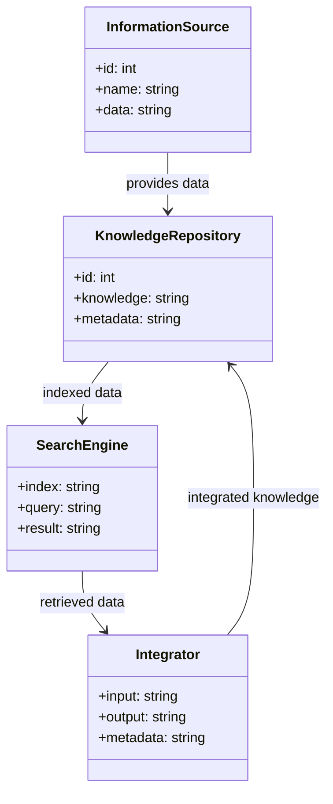
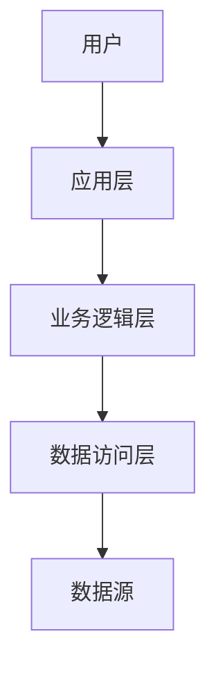
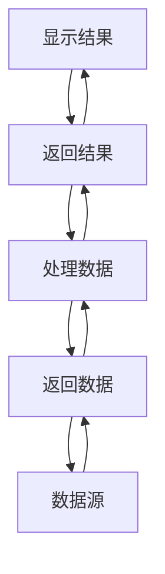

                 


# 实现AI Agent的动态知识检索与整合

## 关键词：AI Agent、动态知识检索、知识整合、检索算法、整合算法、系统架构

## 摘要：本文详细探讨了实现AI Agent的动态知识检索与整合的关键技术与方法。从基本概念到核心算法，再到系统架构与项目实战，系统地分析了动态知识检索与整合的实现过程。文章还提供了丰富的图表、代码示例和数学公式，帮助读者深入理解并掌握相关技术。

---

## 第1章: AI Agent的基本概念与背景

### 1.1 AI Agent的定义与核心特征

#### 1.1.1 AI Agent的基本定义
AI Agent（智能代理）是指能够感知环境、自主决策并执行任务的智能实体。AI Agent可以是软件程序、机器人或其他智能系统，其核心目标是通过与环境交互来实现特定目标。

动态知识检索与整合是AI Agent实现复杂任务的核心能力之一。AI Agent需要实时从多种来源获取信息，并将这些信息整合成可用的知识，以支持决策和行动。

#### 1.1.2 动态知识检索的核心特征
动态知识检索是指AI Agent能够实时从动态变化的环境中获取信息的能力。其核心特征包括：

- **实时性**：信息检索必须在动态变化的环境中实时进行。
- **多样性**：信息来源多样化，包括结构化数据、非结构化数据和半结构化数据。
- **准确性**：检索的信息必须准确无误，以支持AI Agent的决策。

#### 1.1.3 知识整合的必要性与挑战
知识整合是将不同来源的信息合并成一个统一的知识表示的过程。其必要性体现在：

- **统一性**：将分散的信息整合成统一的知识表示，便于后续处理。
- **互补性**：不同信息源可能提供互补的信息，整合后能够更全面地反映实际情况。

知识整合的挑战包括信息冗余、信息冲突和信息不一致等问题。

---

### 1.2 动态知识检索的背景与技术背景

#### 1.2.1 知识检索的历史发展
知识检索技术经历了从早期的基于规则的检索到现在的基于深度学习的检索的演变。早期的检索技术主要依赖于关键词匹配，而现代的检索技术则利用自然语言处理（NLP）和机器学习（ML）模型来提高检索的准确性和效率。

#### 1.2.2 当前AI技术的突破与动态知识检索的兴起
近年来，随着自然语言处理和机器学习技术的快速发展，动态知识检索技术得到了广泛关注。AI Agent需要实时处理大量的动态信息，因此动态知识检索技术的需求日益增长。

#### 1.2.3 动态知识检索的典型应用场景
动态知识检索在多个领域有广泛应用，例如：

- **智能客服**：实时检索客户问题并提供解决方案。
- **实时监控**：动态监控环境并及时响应异常情况。
- **智能推荐系统**：根据用户行为实时推荐相关内容。

---

### 1.3 动态知识整合的重要性

#### 1.3.1 知识整合的基本概念
知识整合是指将不同来源的信息合并成一个统一的知识表示的过程。通过知识整合，AI Agent能够更好地理解和利用信息。

#### 1.3.2 动态知识整合的必要性
动态知识整合的必要性体现在：

- **实时性**：动态环境中的信息不断变化，整合过程需要实时进行。
- **准确性**：整合后的知识必须准确反映实际情况，以支持决策。

#### 1.3.3 整合过程中的主要挑战
整合过程中的主要挑战包括：

- **信息冗余**：不同信息源可能提供重复的信息。
- **信息冲突**：不同信息源可能提供矛盾的信息。
- **信息不一致**：信息在不同源中的表示可能不一致。

---

## 第2章: 动态知识检索与整合的核心概念

### 2.1 动态知识检索的原理

#### 2.1.1 知识检索的基本流程
知识检索的基本流程包括：

1. **信息获取**：从多个来源获取信息。
2. **信息预处理**：对获取的信息进行清洗和转换。
3. **信息检索**：根据查询条件检索相关信息。
4. **结果返回**：将检索结果返回给AI Agent。

#### 2.1.2 动态性对知识检索的影响
动态性对知识检索的影响体现在：

- **信息源的动态变化**：信息源的内容和结构可能随时变化。
- **查询条件的动态变化**：查询条件可能根据环境变化而调整。

#### 2.1.3 检索算法的多样性
常用的检索算法包括：

- **基于向量的检索算法**：如BM25算法。
- **基于图结构的检索算法**：如图索引检索。
- **基于概率的检索算法**：如TF-IDF算法。

---

### 2.2 知识整合的原理

#### 2.2.1 知识整合的基本步骤
知识整合的基本步骤包括：

1. **信息预处理**：清洗和标准化信息。
2. **信息融合**：将多个信息源的信息合并。
3. **知识表示**：将整合后的信息表示为统一的知识结构。

#### 2.2.2 动态性对知识整合的影响
动态性对知识整合的影响体现在：

- **信息源的动态变化**：信息源的内容和结构可能随时变化。
- **整合过程的实时性**：整合过程需要实时进行，以适应环境的变化。

#### 2.2.3 整合算法的多样性
常用的整合算法包括：

- **基于规则的整合算法**：如基于专家规则的整合。
- **基于学习的整合算法**：如基于机器学习的整合。
- **基于图结构的整合算法**：如基于知识图谱的整合。

---

### 2.3 动态知识检索与整合的联系

#### 2.3.1 检索与整合的关系
动态知识检索与整合是相辅相成的过程。检索是整合的前提，整合是检索的目标。通过动态知识检索，AI Agent能够获取所需的信息，通过整合将这些信息转化为可用的知识。

#### 2.3.2 动态性对检索与整合的双重影响
动态性对检索和整合都有双重影响：

- **正面影响**：动态性使得信息更丰富，检索和整合的结果更准确。
- **负面影响**：动态性可能导致信息冗余和冲突，增加检索和整合的难度。

#### 2.3.3 检索与整合的协同优化
通过检索和整合的协同优化，可以提高AI Agent的整体性能。例如，通过动态检索获取最新的信息，并通过整合将这些信息转化为统一的知识表示。

---

## 第3章: 动态知识检索与整合的核心算法原理

### 3.1 知识检索算法

#### 3.1.1 基于向量的检索算法

##### BM25算法
BM25算法是一种基于向量的检索算法，常用于搜索引擎。其基本思想是根据关键词在文档中的出现频率和位置来计算文档的相关性。

##### BM25算法的数学公式
$$
BM25(q, d) = \sum_{i=1}^{n} \text{IDF}(q_i) \times \frac{\text{TF}(q_i, d)}{\text{TF}(q_i, d) + k}
$$

其中，IDF表示逆文档频率，TF表示词频，k是参数。

#### 3.1.2 基于图结构的检索算法

##### 图索引检索算法
图索引检索算法通过构建图结构来表示信息之间的关系，从而提高检索的准确性。

##### 图索引检索算法的流程图
```mermaid
graph TD
    A[起点] -> B[构建图结构]
    B -> C[进行检索]
    C -> D[返回结果]
```

#### 3.1.3 基于概率的检索算法

##### TF-IDF算法
TF-IDF算法是一种基于概率的检索算法，通过计算关键词在文档中的出现频率和逆文档频率来评估文档的相关性。

##### TF-IDF算法的数学公式
$$
\text{TF-IDF}(q_i, d) = \text{TF}(q_i, d) \times \text{IDF}(q_i)
$$

---

### 3.2 知识整合算法

#### 3.2.1 基于规则的整合算法

##### 基于专家规则的整合
基于专家规则的整合算法通过预定义的专家规则来合并信息。这种方法适用于规则明确的场景。

##### 基于专家规则的整合流程图
```mermaid
graph TD
    A[起点] -> B[预定义专家规则]
    B -> C[进行整合]
    C -> D[返回结果]
```

#### 3.2.2 基于学习的整合算法

##### 基于机器学习的整合
基于机器学习的整合算法通过训练模型来自动学习信息的整合规则。这种方法适用于复杂场景。

##### 基于机器学习的整合流程图
```mermaid
graph TD
    A[起点] -> B[训练模型]
    B -> C[进行整合]
    C -> D[返回结果]
```

#### 3.2.3 基于图结构的整合算法

##### 基于知识图谱的整合
基于知识图谱的整合算法通过构建知识图谱来表示信息之间的关系，从而实现知识的整合。

##### 基于知识图谱的整合流程图
```mermaid
graph TD
    A[起点] -> B[构建知识图谱]
    B -> C[进行整合]
    C -> D[返回结果]
```

---

### 3.3 动态性对算法的影响

#### 3.3.1 动态性对检索算法的影响
动态性对检索算法的影响体现在：

- **信息源的动态变化**：检索算法需要能够适应信息源的变化。
- **查询条件的动态变化**：检索算法需要能够适应查询条件的变化。

#### 3.3.2 动态性对整合算法的影响
动态性对整合算法的影响体现在：

- **信息源的动态变化**：整合算法需要能够适应信息源的变化。
- **整合过程的实时性**：整合算法需要能够实时进行。

#### 3.3.3 动态性对算法性能的优化
通过动态性对算法进行优化，可以提高检索和整合的效率和准确性。例如，通过动态调整检索和整合的参数，可以更好地适应环境的变化。

---

## 第4章: 动态知识检索与整合的数学模型与公式

### 4.1 知识检索的数学模型

#### 4.1.1 向量空间模型

##### 向量空间模型的数学公式
$$
\text{向量空间模型} = \{v_1, v_2, \dots, v_n\}
$$

其中，$v_i$ 表示第$i$个文档的向量表示。

#### 4.1.2 图结构模型

##### 图结构模型的数学公式
$$
\text{图结构模型} = \{E, V\}
$$

其中，$E$ 表示边的集合，$V$ 表示顶点的集合。

#### 4.1.3 概率模型

##### 概率模型的数学公式
$$
P(A|B) = \frac{P(B|A)P(A)}{P(B)}
$$

其中，$P(A|B)$ 表示在$B$发生的条件下，$A$发生的概率。

---

### 4.2 知识整合的数学模型

#### 4.2.1 基于规则的整合模型

##### 基于规则的整合模型的数学公式
$$
R(x) = \sum_{i=1}^{n} w_i x_i
$$

其中，$w_i$ 表示规则的权重，$x_i$ 表示输入信息。

#### 4.2.2 基于学习的整合模型

##### 基于学习的整合模型的数学公式
$$
f(x) = \sum_{i=1}^{m} w_i x_i
$$

其中，$w_i$ 表示模型参数，$x_i$ 表示输入信息。

#### 4.2.3 基于图结构的整合模型

##### 基于图结构的整合模型的数学公式
$$
\text{图结构模型} = \{E, V\}
$$

其中，$E$ 表示边的集合，$V$ 表示顶点的集合。

---

### 4.3 动态性对数学模型的影响

#### 4.3.1 动态性对检索模型的影响
动态性对检索模型的影响体现在：

- **模型参数的动态调整**：检索模型需要能够动态调整参数以适应环境的变化。
- **模型结构的动态变化**：检索模型的结构可能需要根据环境变化而调整。

#### 4.3.2 动态性对整合模型的影响
动态性对整合模型的影响体现在：

- **模型参数的动态调整**：整合模型需要能够动态调整参数以适应环境的变化。
- **模型结构的动态变化**：整合模型的结构可能需要根据环境变化而调整。

#### 4.3.3 动态性对模型性能的优化
通过动态性对模型进行优化，可以提高检索和整合的效率和准确性。例如，通过动态调整模型参数，可以更好地适应环境的变化。

---

## 第5章: 动态知识检索与整合的系统架构与设计

### 5.1 系统功能设计

#### 5.1.1 领域模型设计

##### 领域模型设计的类图


---

### 5.2 系统架构设计

#### 5.2.1 系统架构设计的分层架构

##### 系统架构设计的分层架构


---

### 5.3 系统接口设计

#### 5.3.1 系统接口设计的REST API

##### 系统接口设计的REST API
- **获取信息接口**：`GET /api/information`
- **检索信息接口**：`POST /api/search`
- **整合信息接口**：`POST /api/integrate`

---

### 5.4 系统交互设计

#### 5.4.1 系统交互设计的流程图

##### 系统交互设计的流程图


---

## 第6章: 动态知识检索与整合的项目实战

### 6.1 项目背景与目标

#### 6.1.1 项目背景
本项目旨在实现一个基于AI Agent的动态知识检索与整合系统，能够实时从多种信息源获取信息，并将这些信息整合成统一的知识表示。

#### 6.1.2 项目目标
- 实现动态知识检索功能。
- 实现知识整合功能。
- 提供用户友好的接口。

---

### 6.2 环境搭建与工具安装

#### 6.2.1 环境搭建
- **操作系统**：Linux/Windows/MacOS
- **编程语言**：Python 3.8+
- **框架**：Flask/Django
- **依赖管理工具**：pip
- **版本控制工具**：Git

#### 6.2.2 工具安装
- **安装Python**：`python --version`
- **安装pip**：`python get-pip.py`
- **安装Flask**：`pip install flask`

---

### 6.3 系统核心实现

#### 6.3.1 动态知识检索实现

##### 动态知识检索实现的Python代码示例
```python
from flask import Flask, request, jsonify
import requests
import json

app = Flask(__name__)

def retrieve Knowledge(query):
    # 发送请求到搜索引擎
    response = requests.post('http://search-engine:8080/search', json={'query': query})
    return json.loads(response.text)

@app.route('/api/search', methods=['POST'])
def search():
    query = request.json['query']
    result = retrieve Knowledge(query)
    return jsonify({'result': result})

if __name__ == '__main__':
    app.run(port=8000)
```

---

#### 6.3.2 知识整合实现

##### 知识整合实现的Python代码示例
```python
from flask import Flask, request, jsonify
import requests
import json

app = Flask(__name__)

def integrate Knowledge(info1, info2):
    # 发送请求到知识整合服务
    response = requests.post('http://integrator:8081/integrate', json={'info1': info1, 'info2': info2})
    return json.loads(response.text)

@app.route('/api/integrate', methods=['POST'])
def integrate():
    info1 = request.json['info1']
    info2 = request.json['info2']
    result = integrate Knowledge(info1, info2)
    return jsonify({'result': result})

if __name__ == '__main__':
    app.run(port=8001)
```

---

### 6.4 项目总结与优化建议

#### 6.4.1 项目总结
通过本项目，我们实现了一个基于AI Agent的动态知识检索与整合系统。系统能够实时从多种信息源获取信息，并将这些信息整合成统一的知识表示。

#### 6.4.2 优化建议
- **性能优化**：优化检索和整合算法，提高系统的响应速度。
- **扩展性优化**：增加更多的信息源，提高系统的知识获取能力。
- **安全性优化**：增加安全机制，防止数据泄露和攻击。

---

## 第7章: 动态知识检索与整合的最佳实践与注意事项

### 7.1 最佳实践

#### 7.1.1 设计原则
- **模块化设计**：将系统划分为多个模块，每个模块负责特定的功能。
- **可扩展性设计**：设计系统时考虑未来的扩展需求。
- **可维护性设计**：设计系统时考虑系统的可维护性。

#### 7.1.2 开发规范
- **代码规范**：遵循统一的代码规范，如PEP 8。
- **文档规范**：编写详细的文档，包括设计文档、用户手册等。
- **测试规范**：编写单元测试和集成测试，确保系统的稳定性。

#### 7.1.3 部署与运维
- **自动化部署**：使用自动化工具进行部署，如Jenkins。
- **监控与日志**：部署监控工具，实时监控系统的运行状态。
- **备份与恢复**：制定数据备份和恢复策略。

---

### 7.2 注意事项

#### 7.2.1 数据安全
- **数据加密**：对敏感数据进行加密处理。
- **访问控制**：实施严格的访问控制策略。
- **数据备份**：定期备份数据，防止数据丢失。

#### 7.2.2 性能优化
- **算法优化**：不断优化检索和整合算法，提高系统的响应速度。
- **硬件优化**：通过升级硬件配置，提高系统的处理能力。
- **网络优化**：优化网络传输，减少数据丢失和延迟。

#### 7.2.3 系统维护
- **定期更新**：定期更新系统，修复已知漏洞。
- **用户支持**：提供及时的用户支持，解决用户的问题。
- **持续改进**：根据用户反馈，不断改进系统功能。

---

## 第8章: 结语

实现AI Agent的动态知识检索与整合是一项复杂的任务，需要综合运用多种技术。通过本文的探讨，我们深入分析了动态知识检索与整合的核心概念、算法原理、系统架构和项目实战。希望本文能够为读者提供有价值的参考，帮助他们在实际项目中更好地实现动态知识检索与整合。

---

**参考文献**：
1. [BM25算法](https://en.wikipedia.org/wiki/BM25)
2. [TF-IDF算法](https://en.wikipedia.org/wiki/Tf%E2%80%93idf)
3. [知识图谱](https://en.wikipedia.org/wiki/Knowledge_graph)
4. [Flask框架](https://flaskframework.com/)
5. [Python语言](https://www.python.org/)

