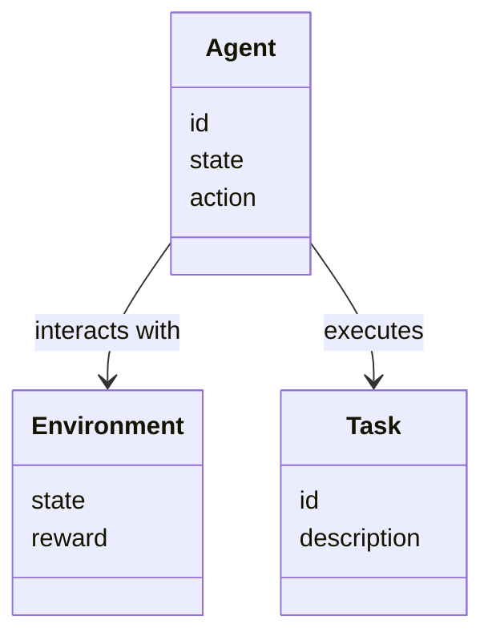
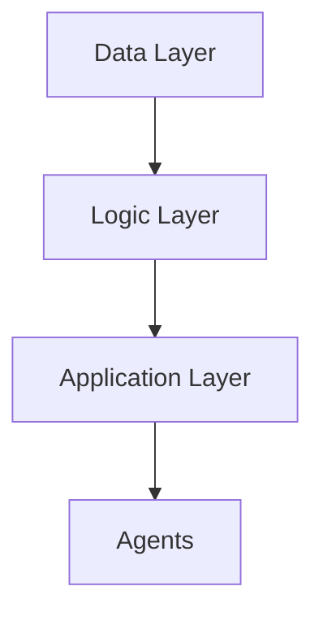
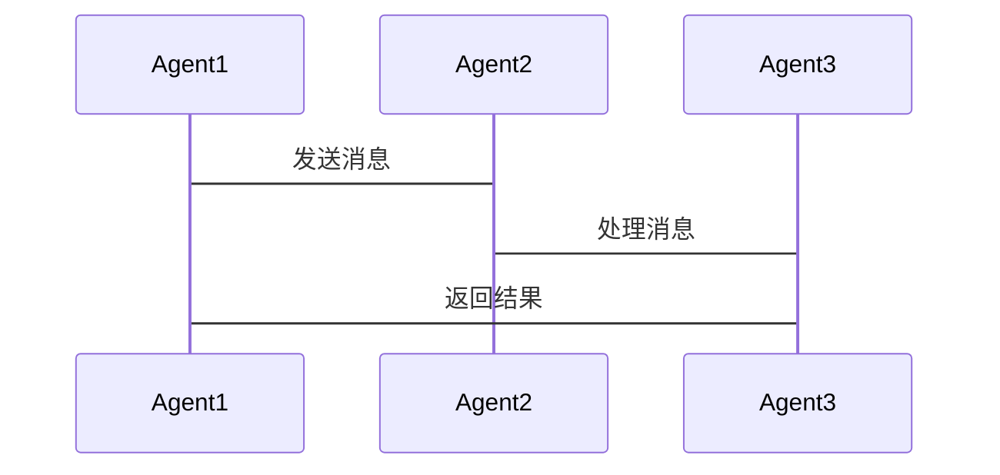

                 


# 实现AI Agent的多Agent协作能力

> 关键词：AI Agent, 多Agent协作, 通信协议, 强化学习, 分布式系统, 算法原理, 系统架构

> 摘要：本文详细探讨了实现AI Agent的多Agent协作能力的关键技术与方法。从基本概念到协作机制，从算法原理到系统架构设计，再到实际项目实战，全面解析多Agent协作的核心要素。通过深入分析和具体案例，揭示了多Agent协作在人工智能领域的广泛应用与重要性。

---

# 第一部分: AI Agent与多Agent协作概述

## 第1章: AI Agent的基本概念与背景

### 1.1 AI Agent的定义与特点
AI Agent（人工智能代理）是指能够感知环境、自主决策并执行任务的智能实体。其核心特点包括自主性、反应性、目标导向和社会性。

#### 1.1.1 什么是AI Agent
AI Agent能够根据环境信息做出决策，并采取行动以实现特定目标。它可以是一个软件程序，也可以是一个物理设备（如自动驾驶汽车）。

#### 1.1.2 AI Agent的核心特点
- **自主性**：无需外部干预，自主决策。
- **反应性**：能够实时感知环境并做出反应。
- **目标导向**：所有行为都围绕实现特定目标展开。
- **社会性**：能够与其他Agent或人类进行交互。

#### 1.1.3 AI Agent的分类
- **简单反射型Agent**：基于当前感知做出反应，不考虑未来状态。
- **基于模型的反射型Agent**：利用内部模型和知识库进行决策。
- **目标驱动型Agent**：根据目标选择最优行动。
- **效用驱动型Agent**：通过最大化效用函数来优化决策。

### 1.2 多Agent系统的基本概念
多Agent系统是指由多个独立且协作的AI Agent组成的系统，这些Agent通过通信和协作完成复杂任务。

#### 1.2.1 多Agent系统的特点
- **分布式智能**：多个Agent协同工作，避免单点故障。
- **自主性**：每个Agent都具有自主决策能力。
- **协作性**：Agent之间通过通信和协作完成共同目标。
- **动态性**：环境和任务需求可能动态变化。

#### 1.2.2 多Agent系统的应用场景
- **分布式计算**：如分布式数据库、云计算。
- **机器人协作**：如工业自动化、物流配送。
- **游戏AI**：如MOBA游戏中的英雄协作。
- **智能家居**：如智能音箱、智能家电的协同工作。

#### 1.2.3 多Agent系统与单Agent系统的区别
| 特性          | 单Agent系统            | 多Agent系统            |
|---------------|------------------------|------------------------|
| 系统复杂度    | 低                     | 高                     |
| 资源分配      | 单一                   | 分布式                 |
| 可扩展性      | 有限                   | 高                     |
| 故障容错性    | 低                     | 高                     |

### 1.3 多Agent协作的背景与意义
多Agent协作已成为人工智能领域的重要研究方向，其背景与意义主要体现在以下几个方面：

#### 1.3.1 协作的必要性
- **任务复杂性**：单个Agent难以完成复杂任务，需要多个Agent协作。
- **资源利用率**：通过协作可以提高资源利用率。
- **容错性**：多个Agent协作可以提高系统的容错性和鲁棒性。

#### 1.3.2 多Agent协作的优势
- **分布式智能**：通过多个Agent协作，可以实现更强大的智能。
- **任务分配优化**：通过合理分配任务，提高整体效率。
- **动态适应性**：多个Agent可以快速响应环境变化。

#### 1.3.3 当前技术发展的挑战
- **通信延迟**：多Agent协作需要实时通信，通信延迟可能影响协作效率。
- **同步问题**：多个Agent之间需要同步状态，避免冲突。
- **安全问题**：多Agent协作涉及多个节点，如何确保通信安全是一个挑战。

### 1.4 本章小结
本章主要介绍了AI Agent的基本概念、特点及其分类，重点分析了多Agent系统的特点、应用场景及其与单Agent系统的区别。同时，还探讨了多Agent协作的背景与意义，以及当前技术发展的挑战。

---

## 第2章: 多Agent协作的核心概念与联系

### 2.1 多Agent协作的基本原理
多Agent协作的基本原理是通过通信和协作机制，使得多个Agent能够共同完成复杂任务。

#### 2.1.1 协作机制的定义
协作机制是指多个Agent之间通过通信和协作完成共同目标的一系列规则和流程。

#### 2.1.2 协作机制的分类
- **基于任务分配的协作机制**：根据任务需求分配Agent角色。
- **基于目标的协作机制**：根据目标分解任务，分配给不同的Agent。
- **基于通信的协作机制**：通过实时通信协调Agent行为。

#### 2.1.3 协作机制的实现方式
- **任务分配**：通过算法将任务分配给不同的Agent。
- **协调控制**：通过通信协议协调Agent的行为。
- **状态同步**：确保所有Agent的状态一致。

### 2.2 多Agent协作中的通信协议
通信协议是多Agent协作的核心，决定了Agent之间如何传递信息。

#### 2.2.1 通信协议的定义
通信协议是指Agent之间传递信息的规则和格式。

#### 2.2.2 常见的通信协议类型
- **基于消息的通信协议**：通过消息传递信息。
- **基于服务的通信协议**：通过服务调用传递信息。
- **基于事件的通信协议**：通过事件触发传递信息。

#### 2.2.3 通信协议的设计原则
- **简洁性**：通信协议应尽量简洁，减少开销。
- **可靠性**：确保信息能够可靠传递。
- **安全性**：防止信息被篡改或窃取。

### 2.3 多Agent协作中的任务分配与协调
任务分配与协调是多Agent协作中的关键环节。

#### 2.3.1 任务分配的基本原则
- **能力匹配**：根据Agent的能力分配任务。
- **负载均衡**：确保任务分配合理，避免某些Agent过载。
- **目标一致性**：确保任务分配与整体目标一致。

#### 2.3.2 任务分配的算法
常用的任务分配算法包括：
- **基于优先级的分配算法**：根据任务优先级分配Agent。
- **基于负载的分配算法**：根据Agent的负载情况分配任务。
- **基于能力的分配算法**：根据Agent的能力分配任务。

#### 2.3.3 协调机制的实现
协调机制通过通信协议实现，确保所有Agent的行为一致。

### 2.4 核心概念与联系的总结
通过上述分析，我们可以看到多Agent协作的核心在于通信协议和协作机制。通信协议确保Agent之间能够有效传递信息，协作机制确保任务分配和行为协调。两者共同作用，使得多个Agent能够协同完成复杂任务。

---

## 第3章: 多Agent协作的算法原理

### 3.1 基于强化学习的协作算法
强化学习是一种通过试错机制优化决策的算法，广泛应用于多Agent协作。

#### 3.1.1 强化学习的基本原理
强化学习通过Agent与环境的交互，不断优化策略，以最大化累积奖励。

#### 3.1.2 在多Agent协作中的应用
多Agent协作中的强化学习算法需要考虑多个Agent的协同，通常采用分布式强化学习。

#### 3.1.3 算法流程图
```mermaid
graph TD
A[Agent 1] --> B[Agent 2]: 发送动作
B --> C[Agent 3]: 处理动作
C --> A: 返回结果
```

#### 3.1.4 代码实现
```python
import numpy as np

class Agent:
    def __init__(self, state_space, action_space):
        self.state_space = state_space
        self.action_space = action_space
        self.Q = np.zeros((state_space, action_space))
    
    def act(self, state):
        return np.argmax(self.Q[state, :])
    
    def update(self, state, action, reward, next_state):
        self.Q[state, action] += reward

# 初始化多个Agent
agents = [Agent(state_space, action_space) for _ in range(num_agents)]

# 多Agent协作过程
for _ in range(episodes):
    state = env.reset()
    done = False
    while not done:
        actions = [agent.act(state) for agent in agents]
        next_state, reward, done = env.step(actions)
        for i in range(len(agents)):
            agents[i].update(state, actions[i], reward[i], next_state)
        state = next_state
```

### 3.2 分布式协作算法
分布式协作算法通过局部决策实现全局优化。

#### 3.2.1 分布式算法的基本概念
分布式算法是指在没有中央控制的情况下，通过局部信息实现全局目标的算法。

#### 3.2.2 分布式协作的具体实现
分布式协作算法通常采用博弈论中的纳什均衡概念，通过Agent之间的博弈实现协作。

#### 3.2.3 算法数学模型
$$V(s) = \max_{a} [ r + V(s') ]$$
其中，\( V(s) \) 表示状态 \( s \) 的价值函数，\( r \) 是奖励，\( s' \) 是下一个状态。

### 3.3 跨Agent通信协议的实现
通信协议是多Agent协作的关键，决定了Agent之间的信息传递方式。

#### 3.3.1 通信协议的数学模型
$$P(a|s) = \frac{1}{1 + e^{-s}}$$
其中，\( P(a|s) \) 表示在状态 \( s \) 下采取动作 \( a \) 的概率。

#### 3.3.2 通信协议的代码实现
```python
def communicate(agent, message):
    response = agent.process(message)
    return response
```

---

## 第4章: 系统分析与架构设计

### 4.1 系统需求分析
系统需求分析是多Agent协作系统设计的第一步。

#### 4.1.1 功能需求
- **通信功能**：Agent之间能够实时通信。
- **任务分配功能**：能够根据任务需求分配Agent角色。
- **协作功能**：Agent能够协同完成复杂任务。

#### 4.1.2 性能需求
- **响应时间**：通信延迟必须在可接受范围内。
- **系统吞吐量**：系统能够处理的任务数量。

#### 4.1.3 接口需求
- **API接口**：提供标准的API接口供其他系统调用。

### 4.2 系统架构设计
系统架构设计是多Agent协作系统设计的核心。

#### 4.2.1 领域模型设计
领域模型是系统设计的基础，通过类图展示系统中的实体及其关系。



#### 4.2.2 系统架构设计
系统架构设计通常采用分层架构，包括数据层、逻辑层和应用层。



#### 4.2.3 系统接口设计
系统接口设计需要考虑Agent之间的通信接口和与外部系统的接口。

#### 4.2.4 系统交互设计
系统交互设计通常采用序列图展示Agent之间的协作过程。



### 4.3 本章小结
本章主要分析了多Agent协作系统的系统需求，并设计了系统的架构和接口。通过领域模型和系统架构图，展示了系统的整体结构和各部分之间的关系。

---

## 第5章: 项目实战

### 5.1 环境配置
项目实战需要先进行环境配置。

#### 5.1.1 安装依赖
```bash
pip install numpy matplotlib
```

#### 5.1.2 环境配置
```python
import numpy as np
import matplotlib.pyplot as plt
```

### 5.2 系统核心实现
系统核心实现包括Agent的通信和协作算法。

#### 5.2.1 Agent类实现
```python
class Agent:
    def __init__(self, id):
        self.id = id
        self.state = 0
        self.action = 0
```

#### 5.2.2 通信协议实现
```python
def communicate(agent1, agent2):
    message = agent1.state
    response = agent2.process(message)
    return response
```

#### 5.2.3 协作算法实现
```python
def collaborate(agents, environment):
    while not environment.done():
        actions = [agent.act() for agent in agents]
        environment.step(actions)
```

### 5.3 代码应用解读与分析
通过具体代码实现，解读多Agent协作的实现细节。

#### 5.3.1 代码解读
```python
agents = [Agent(i) for i in range(num_agents)]
environment = Environment()
collaborate(agents, environment)
```

#### 5.3.2 代码分析
- **Agent类**：定义了Agent的基本属性和行为。
- **通信协议**：定义了Agent之间的通信方式。
- **协作算法**：定义了多Agent协作的流程。

### 5.4 案例分析和详细讲解剖析
通过具体案例，分析多Agent协作的实际应用。

#### 5.4.1 案例分析
假设我们有一个多Agent协作的物流配送系统，多个Agent分别负责不同的配送任务。

#### 5.4.2 详细讲解剖析
- **任务分配**：根据每个Agent的负载情况分配任务。
- **通信协议**：通过实时通信协调配送路径。
- **协作算法**：通过协作算法优化配送路线。

### 5.5 项目小结
本章通过具体项目实战，展示了多Agent协作的实现过程。通过环境配置、代码实现和案例分析，详细解读了多Agent协作的核心技术。

---

## 第6章: 总结与展望

### 6.1 本章总结
本文详细探讨了实现AI Agent的多Agent协作能力的关键技术与方法，从基本概念到协作机制，从算法原理到系统架构设计，再到实际项目实战，全面解析了多Agent协作的核心要素。

### 6.2 未来展望
随着人工智能技术的不断发展，多Agent协作将有更广泛的应用场景。未来的研究方向包括：
- **更高效的通信协议**：减少通信延迟，提高协作效率。
- **更智能的任务分配算法**：提高任务分配的智能化水平。
- **更安全的协作机制**：确保多Agent协作的安全性。

---

通过本文的分析，我们可以看到，实现AI Agent的多Agent协作能力是一个复杂但极具挑战性的任务。尽管当前技术已经取得了一定的成果，但未来仍有很大的发展空间。希望本文能够为读者提供有价值的参考和启发。

