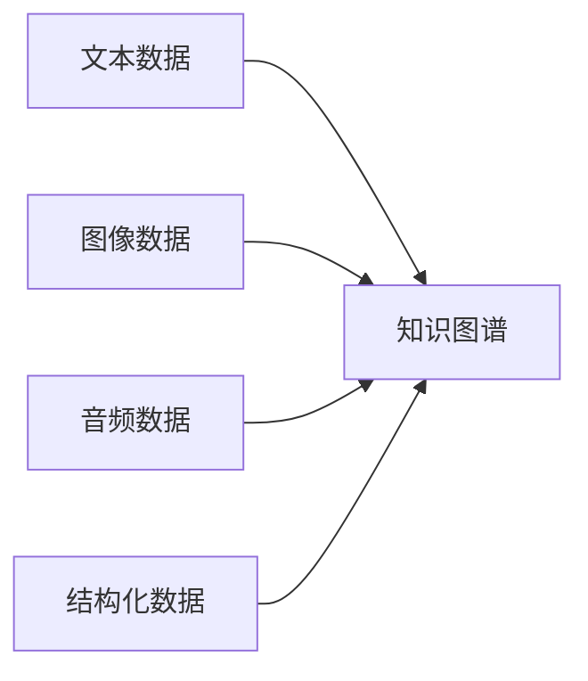
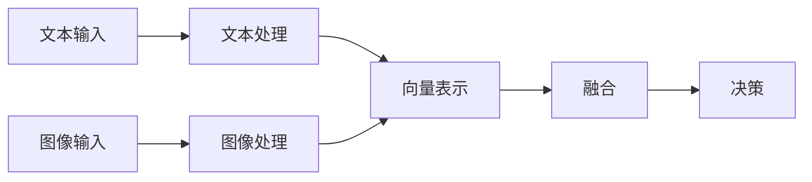
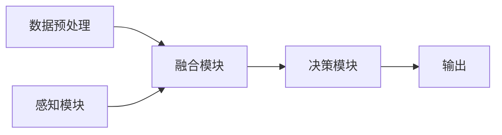

                 


# 实现AI Agent的多模态知识融合

> 关键词：AI Agent, 多模态知识融合, 知识图谱, 注意力机制, 对比学习, 图神经网络

> 摘要：本文详细探讨了实现AI Agent的多模态知识融合的方法，涵盖多模态数据处理、知识表示与推理、算法原理及系统设计。通过结合具体案例和代码实现，深入分析了多模态知识融合在AI Agent中的应用，总结了最佳实践和未来发展方向。

---

# 第一部分: AI Agent与多模态知识融合概述

## 第1章: AI Agent的基本概念与背景

### 1.1 AI Agent的定义与特点

#### 1.1.1 AI Agent的定义
AI Agent（人工智能代理）是指能够感知环境、自主决策并执行任务的智能实体。它具备以下特点：
- **自主性**：能够自主决策，无需外部干预。
- **反应性**：能够实时感知环境并做出反应。
- **目标导向**：以实现特定目标为导向。

#### 1.1.2 AI Agent的核心特点
- **知识表示**：通过知识图谱或其他数据结构表示知识。
- **多模态交互**：能够处理文本、图像、音频等多种数据形式。
- **动态推理**：能够在动态环境中进行实时推理和更新。

#### 1.1.3 AI Agent与传统AI的区别
AI Agent强调自主性和目标导向，而传统AI更多关注任务执行的算法优化。

### 1.2 多模态知识融合的背景与意义

#### 1.2.1 多模态数据的定义与特点
多模态数据指的是来自不同模态（如文本、图像、音频）的数据，具有异构性和互补性。

#### 1.2.2 多模态知识融合的必要性
- **信息完整性**：通过融合多模态数据，能够更全面地理解问题。
- **任务性能提升**：多模态融合能够提高AI Agent的任务执行能力。

#### 1.2.3 多模态知识融合的应用场景
- **智能助手**：如Siri、Alexa，能够处理语音指令和文本信息。
- **自动驾驶**：融合视觉、雷达等多模态数据进行环境感知。

### 1.3 本章小结
本章介绍了AI Agent的基本概念和多模态知识融合的背景及意义，为后续内容奠定了基础。

---

# 第二部分: 多模态知识融合的核心概念

## 第2章: 多模态数据的处理与融合

### 2.1 多模态数据的类型与特征

#### 2.1.1 文本数据
- **结构化文本**：如JSON、XML。
- **非结构化文本**：如自然语言文本。

#### 2.1.2 图像数据
- **RGB图像**：如照片。
- **深度图像**：如深度传感器输出。

#### 2.1.3 音频数据
- **语音信号**：如录音。
- **环境音**：如背景音乐。

#### 2.1.4 结构化数据
- **数据库**：如关系型数据库。
- **知识图谱**：如Neo4j。

### 2.2 多模态数据融合的挑战与解决方案

#### 2.2.1 数据异构性问题
不同模态的数据具有不同的特征和表示方式，需要进行统一处理。

#### 2.2.2 数据冗余与噪声问题
如何去除冗余数据和噪声是多模态融合的难点。

#### 2.2.3 融合方法的选择与优化
根据具体任务选择合适的融合方法，如基于注意力机制的融合。

### 2.3 多模态知识融合的数学模型

#### 2.3.1 向量空间模型
- **向量表示**：将数据转换为向量形式，如Word2Vec。
- **相似性计算**：如余弦相似度。

#### 2.3.2 图结构模型
- **图表示**：如知识图谱中的节点和边。
- **图嵌入**：如GraphSAGE。

#### 2.3.3 概率图模型
- **贝叶斯网络**：用于概率推理。

### 2.4 使用Mermaid绘制知识图谱结构图



---

## 第3章: AI Agent中的多模态知识融合

### 3.1 AI Agent的知识表示与推理

#### 3.1.1 知识图谱的构建
- **知识抽取**：从文本中提取实体和关系。
- **知识存储**：存储在图数据库中。

#### 3.1.2 知识表示的学习方法
- **向量嵌入**：如Word2Vec、BERT。
- **图嵌入**：如GraphSAGE、Node2Vec。

#### 3.1.3 知识推理的逻辑框架
- **逻辑推理**：基于一阶逻辑进行推理。
- **概率推理**：基于概率论进行推理。

### 3.2 多模态数据在AI Agent中的应用

#### 3.2.1 多模态感知与交互
- **语音识别**：将语音转换为文本。
- **图像识别**：识别图像中的物体。

#### 3.2.2 多模态推理与决策
- **多模态特征融合**：将文本和图像特征进行融合。
- **决策推理**：基于融合后的特征进行决策。

#### 3.2.3 多模态学习与优化
- **自监督学习**：利用未标记数据进行学习。
- **迁移学习**：将知识迁移到新任务。

### 3.3 多模态知识融合的算法选择

#### 3.3.1 注意力机制在多模态融合中的应用
- **多模态注意力网络**：如Transformer架构。

#### 3.3.2 对比学习在多模态融合中的应用
- **对比对齐**：将不同模态的数据对齐到同一个空间。

#### 3.3.3 图神经网络在多模态融合中的应用
- **图神经网络**：用于处理图结构数据。

### 3.4 使用Mermaid绘制多模态融合流程图



---

## 第4章: 多模态知识融合的数学模型与算法原理

### 4.1 多模态融合的数学模型

#### 4.1.1 向量空间模型
$$ \text{相似度} = \cos(\theta) = \frac{\vec{a} \cdot \vec{b}}{||\vec{a}|| \cdot ||\vec{b}||} $$

#### 4.1.2 图结构模型
$$ P(X|Y) = \prod_{i=1}^{n} P(x_i|y_i) $$

### 4.2 注意力机制的原理与实现

#### 4.2.1 注意力机制的基本原理
$$ \text{权重} = \text{softmax}(\vec{q} \vec{K}^T) $$

#### 4.2.2 多头注意力机制的实现
$$ \text{多头权重} = \text{concat}(\text{head}_1, \text{head}_2, \dots, \text{head}_n) $$

### 4.3 对比学习的原理与实现

#### 4.3.1 对比学习的基本原理
$$ \text{损失} = -\log \text{softmax}(\text{sim}(x, y)) $$

---

## 第5章: 多模态知识融合的系统架构与设计

### 5.1 系统架构设计

#### 5.1.1 分层架构设计
- **感知层**：处理多模态数据。
- **融合层**：进行数据融合。
- **决策层**：基于融合后的数据进行决策。

#### 5.1.2 模块化设计
- **数据预处理模块**：处理原始数据。
- **融合模块**：进行多模态融合。
- **决策模块**：输出决策结果。

### 5.2 使用Mermaid绘制系统架构图



---

## 第6章: 多模态知识融合的项目实战

### 6.1 环境安装

#### 6.1.1 安装依赖
```bash
pip install numpy matplotlib tensorflow
```

### 6.2 系统核心实现源代码

#### 6.2.1 多模态融合代码
```python
import tensorflow as tf

def multi_modal_fusion(text, image):
    text_embedding = tf.keras.layers.Dense(128)(text)
    image_embedding = tf.keras.layers.Dense(128)(image)
    fused = tf.keras.layers.Add()([text_embedding, image_embedding])
    return fused
```

### 6.3 代码应用解读与分析

#### 6.3.1 代码功能
- 将文本和图像嵌入进行融合。
- 使用加法进行融合。

#### 6.3.2 案例分析
- 文本输入：一段描述图片的文字。
- 图像输入：一张图片。
- 输出：融合后的向量。

---

## 第7章: 最佳实践与总结

### 7.1 小结
多模态知识融合是实现AI Agent的重要技术，能够提升其任务执行能力。

### 7.2 注意事项
- **数据质量**：确保数据的准确性和完整性。
- **模型选择**：根据任务选择合适的融合方法。

### 7.3 拓展阅读
- 《注意力机制在自然语言处理中的应用》
- 《图神经网络入门》

---

# 结语

通过本文的详细讲解，读者可以全面了解AI Agent的多模态知识融合的实现方法，并能够将其应用于实际项目中。未来，随着技术的发展，多模态知识融合将更加智能化和高效化。

