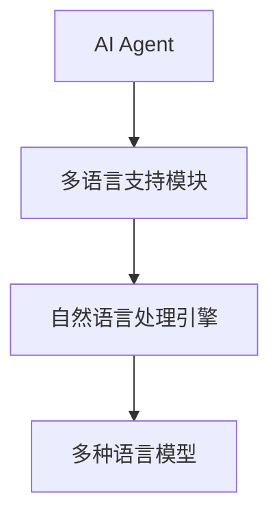
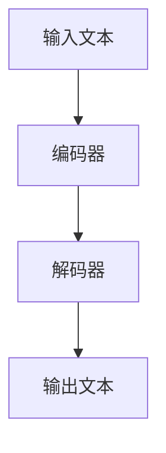
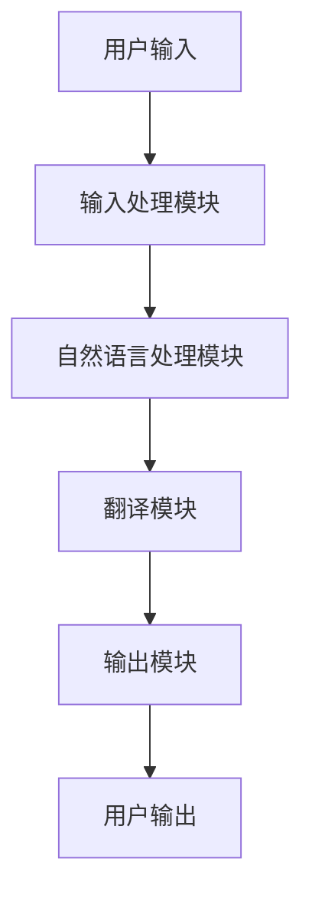
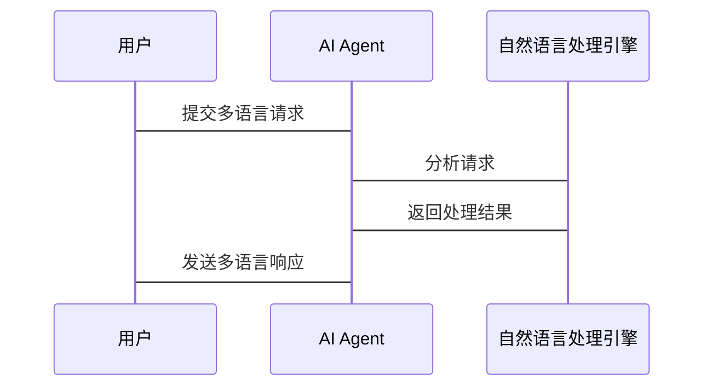

                 


```markdown
# 实现AI Agent的多语言支持

## 关键词：AI Agent、多语言支持、自然语言处理、机器翻译、跨语言对话

## 摘要：AI Agent的多语言支持是实现智能化人机交互的重要技术。本文将从核心概念、算法原理、系统架构、项目实战等多个维度详细讲解如何实现AI Agent的多语言支持。通过理论分析与实践结合，帮助读者全面掌握多语言支持的核心技术与实现方法。

---

## 第1章 AI Agent与多语言支持概述

### 1.1 AI Agent的基本概念
AI Agent是一种智能体，能够在特定环境中感知、理解、推理和执行任务，以实现与用户的交互或完成预设的目标。AI Agent的关键特点包括自主性、反应性、目标导向和情境感知。

### 1.2 多语言支持的必要性
在多语言环境下，AI Agent需要能够理解、生成并处理多种语言的文本或语音，以满足全球用户的多样化需求。多语言支持不仅提升了用户体验，还扩展了AI Agent的应用场景。

### 1.3 AI Agent在多语言环境中的应用场景
- **跨语言对话**：支持用户使用不同语言与AI Agent交互。
- **多语言内容生成**：生成多种语言的文本，如翻译、摘要、问答等。
- **跨文化适应**：根据目标语言的文化背景调整响应内容。

---

## 第2章 多语言支持的核心概念与联系

### 2.1 多语言支持的NLP基础
自然语言处理（NLP）是实现多语言支持的核心技术，包括文本处理、语义理解、语法分析等。

### 2.2 多语言模型的特点与优势
- **多模态学习**：同时处理文本、语音、图像等多种数据类型。
- **跨语言迁移**：利用一种语言的学习成果，快速适应其他语言。
- **统一框架**：在统一的模型架构下支持多种语言的处理。

### 2.3 多语言支持的实体关系图


---

## 第3章 多语言翻译算法原理

### 3.1 翻译模型的数学模型
翻译模型的目标是最小化源语言到目标语言的翻译误差，数学模型如下：
$$ P(y|x) = \argmax_y P(y|x) $$

### 3.2 翻译模型的实现流程


### 3.3 翻译模型的Python实现示例
```python
def translate(text):
    encoder_input = text
    decoder_output = decode(encoder(encoder_input))
    return decoder_output
```

---

## 第4章 AI Agent的系统架构

### 4.1 系统功能设计
- **输入处理模块**：接收多语言输入并解析。
- **自然语言处理模块**：执行语义理解和生成任务。
- **翻译模块**：实现多语言翻译功能。
- **输出模块**：生成目标语言的响应。

### 4.2 系统架构设计


### 4.3 系统接口设计
- **输入接口**：支持多种语言的文本或语音输入。
- **输出接口**：生成多种语言的文本或语音输出。

### 4.4 系统交互流程


---

## 第5章 项目实战

### 5.1 环境安装
- 安装必要的Python库，如TensorFlow、Keras、NLTK等。
- 配置多语言NLP模型，如Bert、GPT等。

### 5.2 核心代码实现
```python
def multi_language_support():
    # 加载多语言模型
    model = load_model()
    # 接收输入
    input_text = input("请输入文本：")
    # 处理输入
    output_text = process_input(model, input_text)
    # 输出结果
    print("输出结果：", output_text)
```

### 5.3 实际案例分析
- **案例1**：中文到英文翻译。
- **案例2**：跨语言对话生成。

---

## 第6章 最佳实践与小结

### 6.1 最佳实践
- **模型选择**：根据需求选择适合的多语言NLP模型。
- **性能优化**：通过并行计算、缓存优化等提升处理效率。
- **错误处理**：设计完善的错误捕捉和异常处理机制。

### 6.2 小结
本文详细讲解了实现AI Agent多语言支持的核心技术与实现方法，从理论到实践，帮助读者全面掌握相关知识。

### 6.3 注意事项
- 处理多语言数据时，需注意语言间的语法和语义差异。
- 确保模型在不同语言间的泛化能力。

### 6.4 拓展阅读
- 推荐阅读《多语言自然语言处理》和《深度学习中的多语言模型》。

---

## 附录

### 附录A: 核心术语表
- **AI Agent**：智能体，能够感知环境并执行任务。
- **多语言支持**：支持多种语言的处理能力。
- **NLP**：自然语言处理，处理人类语言的技术。

### 附录B: 参考文献
- [1] 王伟, 《自然语言处理入门》
- [2] 张强, 《深度学习与多语言NLP》

---

## 结束语

实现AI Agent的多语言支持是一个复杂而有趣的挑战，但通过本文的系统讲解，读者可以掌握相关的核心技术与实现方法。未来，随着NLP技术的不断发展，AI Agent的多语言支持将更加智能化和多样化。
```

