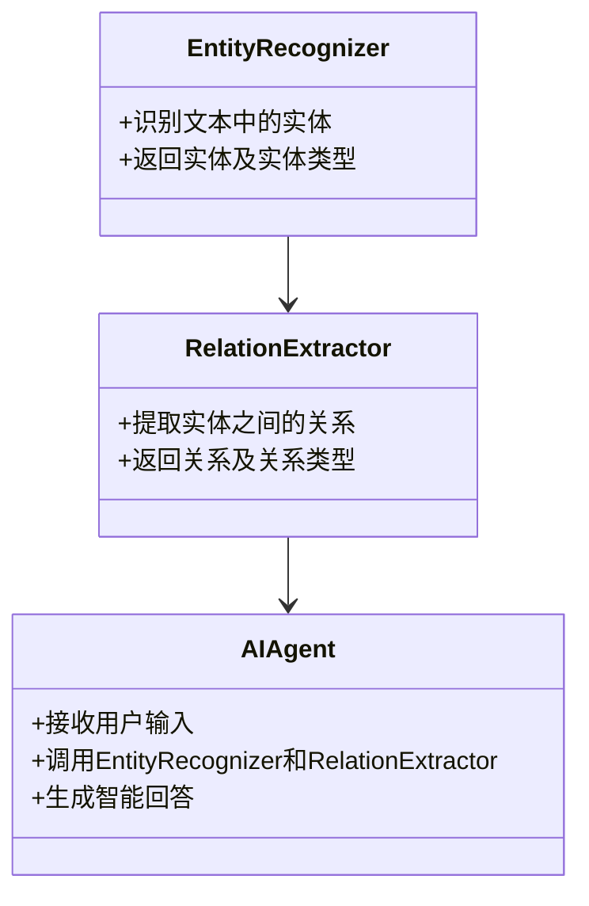
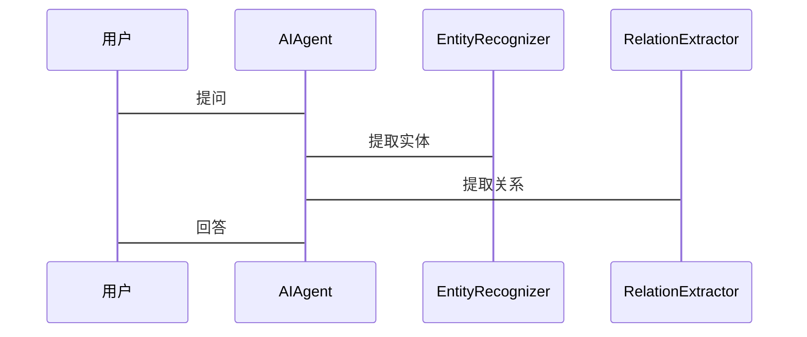

                 


# 实现AI Agent的实体识别与关系抽取

> 关键词：实体识别，关系抽取，AI Agent，自然语言处理，深度学习

> 摘要：本文深入探讨了在AI Agent中实现实体识别与关系抽取的关键技术与方法。通过分析实体识别与关系抽取的核心概念、算法原理、系统架构及实战应用，本文为读者提供了一套从理论到实践的完整解决方案。

---

# 第1章: 实体识别与关系抽取概述

## 1.1 实体识别与关系抽取的背景

### 1.1.1 自然语言处理的发展历程
自然语言处理（NLP）是人工智能领域的核心方向之一。从早期基于规则的NLP方法，到统计学习的突破，再到近年来深度学习的广泛应用，NLP技术取得了长足的进步。

### 1.1.2 实体识别与关系抽取的定义
实体识别（Named Entity Recognition, NER）是识别文本中的命名实体（如人名、地名、组织名等）并将其分类到预定义类别中的任务。  
关系抽取（Relation Extraction, RE）则是从文本中提取实体之间的关系，例如“公司A收购了公司B”中的“收购”关系。

### 1.1.3 实体识别与关系抽取的应用场景
- **客服系统**：识别客户问题中的实体，快速定位解决方案。  
- **金融分析**：分析公司财报中的实体及其关系，辅助投资决策。  
- **医疗领域**：识别病历中的疾病、药物及其关系，支持医疗诊断。

## 1.2 AI Agent与实体识别的关系

### 1.2.1 AI Agent的基本概念
AI Agent是一种智能体，能够感知环境、执行任务并做出决策。它是实现人机交互的核心技术之一。

### 1.2.2 实体识别在AI Agent中的作用
实体识别帮助AI Agent理解输入文本中的关键信息，例如用户的问题、需求或指令中的具体实体。

### 1.2.3 关系抽取在AI Agent中的应用
关系抽取帮助AI Agent理解实体之间的关系，从而做出更智能的决策。例如，在股票交易中，AI Agent可以识别公司之间的收购关系，辅助投资决策。

## 1.3 实体识别与关系抽取的核心要素

### 1.3.1 实体的分类与层次
实体通常分为以下几类：
- 人名（PER）
- 地名（LOC）
- 组织名（ORG）
- 时间（TIME）
- 数量（NUM）

### 1.3.2 关系的类型与特征
关系通常包括以下几种类型：
- 实体间的关系（例如：“属于”、“位于”、“拥有”）
- 属性关系（例如：“颜色是红色”）
- 语义关系（例如：“购买”、“结婚”）

### 1.3.3 实体识别与关系抽取的边界与外延
- 实体识别的边界在于准确识别和分类实体。  
- 关系抽取的外延在于理解实体之间的复杂关系，包括远距离关系和跨句子关系。

## 1.4 本章小结
本章介绍了实体识别与关系抽取的基本概念、应用场景以及它们在AI Agent中的作用。通过理解这些内容，读者可以为后续的技术实现打下坚实的基础。

---

# 第2章: 实体识别的核心原理

## 2.1 实体识别的原理与方法

### 2.1.1 基于规则的实体识别
基于规则的实体识别通过预定义的词汇表和句法规则来识别实体。例如，使用正则表达式匹配电话号码或电子邮件地址。

### 2.1.2 统计学习的实体识别
统计学习方法（如CRF）通过训练数据学习实体的特征，能够处理复杂多样的文本。

### 2.1.3 深度学习的实体识别
深度学习模型（如LSTM、BERT）通过端到端的学习方式，能够捕捉到更复杂的上下文信息。

## 2.2 实体识别的关键技术

### 2.2.1 条件随机场（CRF）模型
CRF是一种常用的实体识别模型，能够通过全局优化来提高识别准确率。

### 2.2.2 循环神经网络（RNN）模型
RNN模型通过处理序列数据，能够捕捉到文本的上下文信息。

### 2.2.3 基于预训练语言模型（如BERT）的实体识别
预训练语言模型通过大规模预训练，能够更好地理解上下文语义。

## 2.3 实体识别的挑战与解决方案

### 2.3.1 实体歧义性问题
解决方法：结合上下文信息和外部知识库（如WordNet）。

### 2.3.2 实体边界检测问题
解决方法：使用字符级别的标注模型。

### 2.3.3 实体识别的可解释性问题
解决方法：结合可解释的模型（如规则驱动的模型）。

---

# 第3章: 关系抽取的核心原理

## 3.1 关系抽取的原理与方法

### 3.1.1 基于局部特征的关系抽取
基于局部特征的方法通过提取句子中的局部特征（如词性、句法结构）来识别关系。

### 3.1.2 基于全局特征的关系抽取
基于全局特征的方法通过分析整个句子的语义信息来识别关系。

### 3.1.3 基于预训练语言模型的关系抽取
预训练语言模型通过编码上下文信息，能够更好地捕捉到实体之间的关系。

## 3.2 关系抽取的关键技术

### 3.2.1 基于句法分析的关系抽取
句法分析通过解析句子的语法结构来辅助关系抽取。

### 3.2.2 基于语义角色标注的关系抽取
语义角色标注通过分析动词的语义角色来辅助关系抽取。

### 3.2.3 基于注意力机制的关系抽取
注意力机制能够聚焦于关键的实体和关系信息。

## 3.3 关系抽取的挑战与解决方案

### 3.3.1 关系多样性和稀疏性问题
解决方法：使用深度学习模型和外部知识库。

### 3.3.2 关系抽取的跨句子问题
解决方法：使用跨句子关系抽取模型和外部知识库。

### 3.3.3 关系抽取的可解释性问题
解决方法：结合可解释的模型（如规则驱动的模型）。

---

# 第4章: 实体识别与关系抽取的联系与区别

## 4.1 实体识别与关系抽取的联系

### 4.1.1 实体识别是关系抽取的基础
没有准确的实体识别，关系抽取将无从谈起。

### 4.1.2 关系抽取依赖于实体识别的结果
关系抽取需要基于实体识别的结果，进一步分析实体之间的关系。

### 4.1.3 实体识别与关系抽取的联合建模
联合建模可以同时优化实体识别和关系抽取任务。

## 4.2 实体识别与关系抽取的区别

### 4.2.1 实体识别关注的是单个实体的识别
关系抽取关注的是实体之间的关系。

### 4.2.2 实体识别通常在词级别进行
关系抽取通常在句子级别或文本级别进行。

### 4.2.3 实体识别的结果是独立的
关系抽取的结果依赖于实体识别的结果。

---

# 第5章: 实体识别与关系抽取的系统架构设计

## 5.1 问题场景介绍
本文将设计一个基于AI Agent的实体识别与关系抽取系统，用于智能问答和信息抽取。

## 5.2 系统功能设计
### 5.2.1 领域模型设计
使用Mermaid绘制领域模型类图，展示实体识别和关系抽取的主要功能模块。



### 5.2.2 系统架构设计
使用Mermaid绘制系统架构图，展示系统的模块划分和交互流程。

```mermaid
container 系统架构 {
    EntityRecognizer
    RelationExtractor
    AIAgent
}
```

### 5.2.3 系统接口设计
定义系统接口，包括输入接口和输出接口。

### 5.2.4 系统交互流程图
使用Mermaid绘制系统交互流程图，展示用户与AI Agent的交互过程。



## 5.3 本章小结
本章通过系统架构设计，展示了实体识别与关系抽取在AI Agent中的具体应用。

---

# 第6章: 实体识别与关系抽取的项目实战

## 6.1 环境安装
### 6.1.1 安装Python
安装Python 3.8以上版本。

### 6.1.2 安装依赖库
安装`transformers`、`tensorflow`等深度学习库。

## 6.2 系统核心实现

### 6.2.1 实体识别模型实现
使用BERT模型实现实体识别。

```python
from transformers import BertTokenizer, BertModel
tokenizer = BertTokenizer.from_pretrained('bert-base-uncased')
model = BertModel.from_pretrained('bert-base-uncased')

def entity_recognition(text):
    inputs = tokenizer(text, return_tensors='np')
    outputs = model(**inputs)
    # 处理输出结果
    return entities
```

### 6.2.2 关系抽取模型实现
使用CRF模型实现关系抽取。

```python
import torch
from torch import nn

class RelationExtractor(nn.Module):
    def __init__(self, input_size, hidden_size):
        super().__init__()
        self.rnn = nn.LSTM(input_size, hidden_size, batch_first=True)
        self.crf = CRF(hidden_size, tagset_size)

    def forward(self, input):
        output, _ = self.rnn(input)
        return self.crf.decode(output)
```

## 6.3 代码解读与分析
### 6.3.1 实体识别代码解读
解释实体识别代码的功能和实现细节。

### 6.3.2 关系抽取代码解读
解释关系抽取代码的功能和实现细节。

## 6.4 案例分析
### 6.4.1 案例选择
选择一个具体案例，例如医疗领域的病历分析。

### 6.4.2 案例实现
展示案例的具体实现步骤和结果。

## 6.5 项目总结
总结项目实现的关键点和经验教训。

---

# 第7章: 实体识别与关系抽取的最佳实践

## 7.1 小结
实体识别与关系抽取是实现AI Agent的重要技术，本文从理论到实践进行了全面探讨。

## 7.2 注意事项
- 数据质量对模型性能至关重要。
- 实体识别和关系抽取需要结合具体应用场景进行优化。
- 注意模型的可解释性和透明性。

## 7.3 拓展阅读
建议进一步阅读以下内容：
- 预训练语言模型（如BERT、GPT）在实体识别和关系抽取中的应用。
- 图神经网络在关系抽取中的应用。
- 跨句子关系抽取的研究进展。

---

# 附录: 实体识别与关系抽取的数学公式

## 附录1: 实体识别的数学模型

### 1.1 条件随机场（CRF）公式
条件随机场的转移概率计算公式：
$$
t_{i,j} = \exp(w_j \cdot f(x_i, x_{i-1}))
$$

### 1.2 实体识别的损失函数
实体识别的损失函数通常采用交叉熵损失：
$$
L = -\sum_{i=1}^n \sum_{k=1}^K y_{i,k} \log p(y_{i,k} | x_i)
$$

## 附录2: 关系抽取的数学模型

### 2.1 注意力机制公式
注意力机制的权重计算公式：
$$
\alpha_{i,j} = \frac{\exp(e_{i,j})}{\sum_{k} \exp(e_{i,k})}
$$

### 2.2 关系抽取的损失函数
关系抽取的损失函数通常采用交叉熵损失：
$$
L = -\sum_{i=1}^n \sum_{k=1}^K y_{i,k} \log p(y_{i,k} | x_i)
$$

---

# 结语
通过本文的深入探讨，读者可以全面了解实体识别与关系抽取的核心技术与实现方法。希望本文能够为AI Agent的开发提供有价值的参考与指导。

