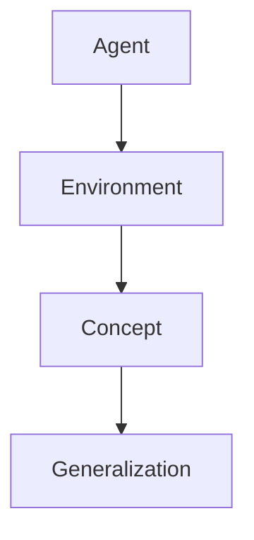
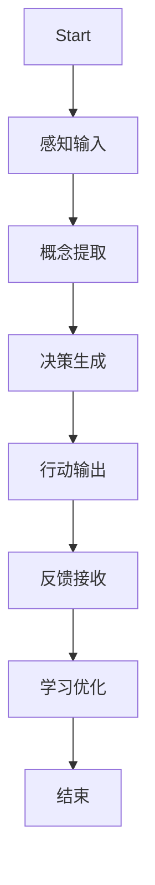
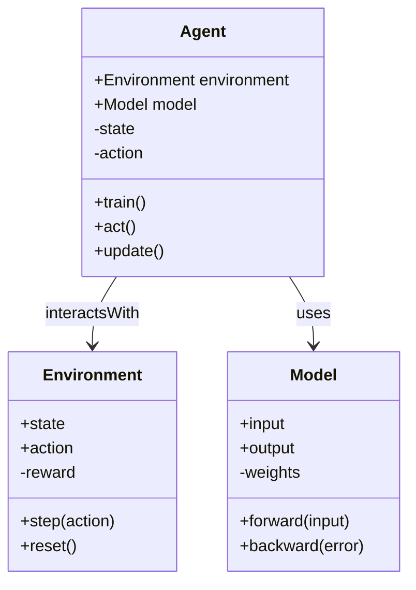
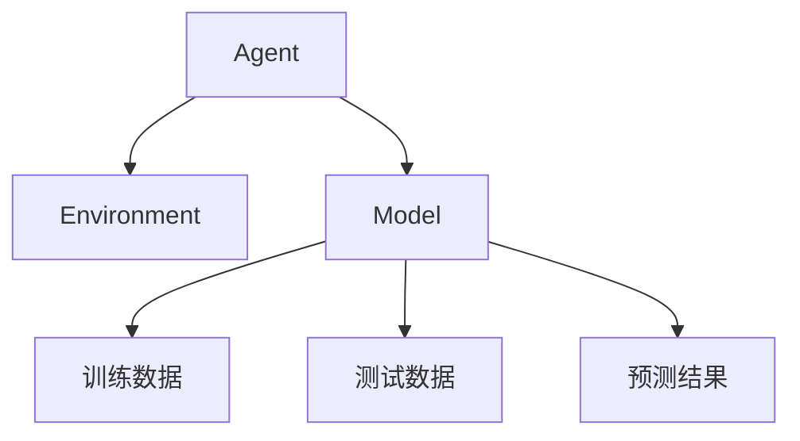
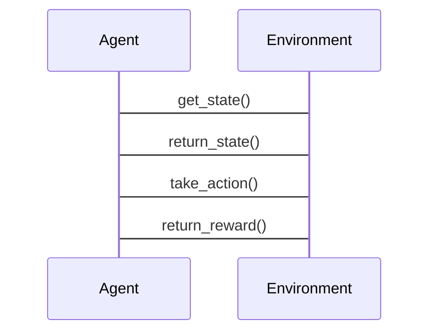

                 


# 实现AI Agent的概念学习与泛化能力

> 关键词：AI Agent, 概念学习, 泛化能力, 系统架构, 项目实战, 最佳实践

> 摘要：本文详细探讨了AI Agent的概念学习与泛化能力的实现方法，通过背景介绍、核心概念分析、算法原理、系统架构设计、项目实战和最佳实践等多维度的深入分析，为读者提供了一套系统化的方法论，帮助其掌握AI Agent的核心技术与实际应用能力。

---

# 第一部分: AI Agent的概念与背景

## 第1章: AI Agent概述

### 1.1 问题背景

#### 1.1.1 当前AI发展的挑战
随着人工智能技术的快速发展，AI系统在各个领域的应用日益广泛。然而，现有的AI系统在面对复杂、动态和多样化的任务时，往往缺乏足够的灵活性和泛化能力。例如，在自然语言处理领域，模型虽然在特定任务上表现出色，但在跨任务、跨领域的情况下面临较大的挑战。

#### 1.1.2 Agent概念的提出与意义
为了应对上述挑战，AI Agent的概念应运而生。AI Agent是一种能够感知环境、自主决策并采取行动的智能实体。它不仅能够处理复杂任务，还能通过学习和适应不断提升自身的性能。

#### 1.1.3 泛化能力的重要性
泛化能力是AI Agent的核心能力之一，它使得AI Agent能够在不同的场景和任务中灵活应用所学知识。提升泛化能力，意味着AI Agent能够更好地应对未知问题，减少对特定任务的过度依赖。

### 1.2 问题描述

#### 1.2.1 Agent的基本定义
AI Agent是指能够感知环境、做出决策并采取行动的智能实体。它可以是一个软件程序，也可以是一个物理设备，其核心目标是通过与环境的交互来实现特定任务。

#### 1.2.2 泛化能力的定义与目标
泛化能力是指AI Agent在面对未见过的数据或场景时，能够依然保持较高的性能。其目标是通过学习和优化，使AI Agent能够在多种不同的环境中表现出色。

#### 1.2.3 问题解决的边界与外延
AI Agent的泛化能力不仅限于单一任务，还包括跨任务、跨领域的应用。例如，一个设计用于图像分类的AI Agent，应该能够适应文本分类或语音识别等任务。

#### 1.2.4 概念的结构与核心要素
AI Agent的概念学习与泛化能力的实现，依赖于以下几个核心要素：
1. **感知能力**：能够从环境中获取信息。
2. **决策能力**：基于感知信息做出决策。
3. **学习能力**：通过经验不断优化自身的模型。
4. **泛化能力**：将学到的知识应用到新的场景中。

### 1.3 问题解决路径

#### 1.3.1 基于概念学习的解决方案
概念学习是实现AI Agent泛化能力的关键。通过概念学习，AI Agent能够提取任务中的核心特征，从而在新场景中快速适应。

#### 1.3.2 泛化能力的实现方法
泛化能力的实现依赖于算法的优化、数据的多样性以及模型的结构设计。例如，使用迁移学习或小样本学习等技术，可以有效提升泛化能力。

#### 1.3.3 核心要素与组成结构
AI Agent的组成结构包括感知模块、决策模块、学习模块和执行模块。这些模块协同工作，共同实现AI Agent的概念学习与泛化能力。

---

## 第2章: AI Agent的核心概念与联系

### 2.1 核心概念原理

#### 2.1.1 概念学习的基本原理
概念学习是指AI Agent通过学习数据中的共同特征，形成对概念的理解。例如，在图像分类任务中，AI Agent需要从大量图片中学习“猫”的概念。

#### 2.1.2 泛化能力的实现机制
泛化能力的实现依赖于AI Agent对概念的深刻理解。通过提取数据中的本质特征，AI Agent能够在新场景中灵活应用所学知识。

#### 2.1.3 Agent与环境的交互模型
AI Agent通过与环境的交互，不断优化自身的模型。例如，在机器人导航任务中，AI Agent通过感知环境、做出决策并执行动作，逐步提高导航能力。

### 2.2 概念属性特征对比

#### 2.2.1 Agent的属性特征分析
| 属性 | 特征描述 |
|------|----------|
| 感知能力 | 能够获取环境中的信息 |
| 决策能力 | 基于感知信息做出决策 |
| 学习能力 | 通过经验优化模型 |
| 泛化能力 | 在新场景中灵活应用所学知识 |

#### 2.2.2 泛化能力的特征对比
| 特征 | 泛化能力弱 | 泛化能力强 |
|------|------------|------------|
| 适应性 | 适应性差 | 适应性强 |
| 复杂性 | 适用于简单任务 | 适用于复杂任务 |
| 性能 | 性能不稳定 | 性能稳定 |

#### 2.2.3 概念学习与泛化能力的关联
概念学习是泛化能力的基础。只有通过概念学习，AI Agent才能在新场景中快速适应并表现出色。

### 2.3 ER实体关系图



---

## 第3章: AI Agent的算法原理

### 3.1 算法原理概述

#### 3.1.1 强化学习的基本原理
强化学习是一种通过试错机制来优化决策的算法。AI Agent通过与环境的交互，获得奖励或惩罚信号，从而优化自身的策略。

#### 3.1.2 监督学习的应用场景
监督学习是一种基于标记数据的训练方法。AI Agent通过学习标记数据，掌握特定任务的规律。

#### 3.1.3 概念学习的算法框架
概念学习的算法框架包括特征提取、模型训练和泛化应用三个阶段。

### 3.2 算法流程图



### 3.3 算法实现

#### 3.3.1 强化学习的Python代码实现

```python
import numpy as np

# 定义环境
class Environment:
    def __init__(self):
        self.state_space = ...  # 状态空间定义
        self.action_space = ...  # 行动空间定义

    def reset(self):
        # 初始化环境
        return self.state_space.initial_state()

    def step(self, action):
        # 执行动作并返回新的状态、奖励和是否终止
        return new_state, reward, done

# 定义AI Agent
class Agent:
    def __init__(self, environment):
        self.env = environment
        self.model = self.build_model()  # 构建模型

    def build_model(self):
        # 定义模型结构
        pass

    def act(self, state):
        # 根据状态选择动作
        pass

    def update(self, state, action, reward, next_state):
        # 更新模型参数
        pass

# 训练过程
def train(agent, num_episodes):
    for episode in range(num_episodes):
        state = agent.env.reset()
        while not done:
            action = agent.act(state)
            next_state, reward, done = agent.env.step(action)
            agent.update(state, action, reward, next_state)
            state = next_state
```

#### 3.3.2 监督学习的数学模型

```latex
$$
\text{损失函数} = \sum_{i=1}^{n} (y_i - \hat{y_i})^2
$$

$$
\text{优化目标} = \min_{\theta} \text{损失函数}
$$
```

---

## 第4章: 系统分析与架构设计

### 4.1 问题场景介绍

#### 4.1.1 问题场景
AI Agent需要在复杂环境中完成特定任务，例如智能客服、自动驾驶等。

### 4.2 系统功能设计

#### 4.2.1 领域模型设计



#### 4.2.2 系统架构设计



#### 4.2.3 系统接口设计



---

## 第5章: 项目实战

### 5.1 环境安装

#### 5.1.1 安装依赖
```bash
pip install numpy matplotlib
```

### 5.2 系统核心实现

#### 5.2.1 实现代码

```python
import numpy as np
import matplotlib.pyplot as plt

# 定义环境
class SimpleEnvironment:
    def __init__(self):
        self.states = ['A', 'B', 'C']
        self.actions = ['left', 'right']

    def reset(self):
        return np.random.choice(self.states)

    def step(self, state, action):
        next_state = self.states[(self.states.index(state) + 1) % len(self.states)]
        reward = 1 if action == 'right' else 0
        return next_state, reward

# 定义AI Agent
class SimpleAgent:
    def __init__(self, environment):
        self.env = environment
        self.Q_table = {state: {action: 0 for action in self.env.actions} for state in self.env.states}

    def act(self, state):
        return max(self.Q_table[state], key=lambda k: self.Q_table[state][k])

    def update(self, state, action, reward, next_state):
        self.Q_table[state][action] += 0.1 * (reward + max(self.Q_table[next_state].values()) - self.Q_table[state][action])

# 训练过程
def train(agent, num_episodes):
    for episode in range(num_episodes):
        state = agent.env.reset()
        while True:
            action = agent.act(state)
            next_state, reward = agent.env.step(state, action)
            agent.update(state, action, reward, next_state)
            state = next_state
            if done:
                break

# 可视化结果
def visualize(agent):
    for state in agent.Q_table:
        plt.bar(agent.Q_table[state].keys(), agent.Q_table[state].values())
        plt.title(f'Q值分布 - {state}')
        plt.show()

if __name__ == "__main__":
    env = SimpleEnvironment()
    agent = SimpleAgent(env)
    train(agent, 100)
    visualize(agent)
```

#### 5.2.2 代码解读
- **环境定义**：定义了一个简单的环境，包括状态和动作。
- **AI Agent实现**：基于Q学习算法，维护一个Q表，记录每个状态的动作价值。
- **训练过程**：通过多次迭代更新Q表，提升AI Agent的决策能力。
- **可视化结果**：展示每个状态下的动作价值分布。

### 5.3 实际案例分析

#### 5.3.1 案例分析
通过上述代码，AI Agent在简单环境中不断学习，最终能够做出最优决策。

#### 5.3.2 性能分析
训练过程中，AI Agent的Q值逐渐收敛，表现出良好的学习能力。

---

## 第6章: 高级应用与最佳实践

### 6.1 高级主题

#### 6.1.1 多智能体协作
多智能体协作是AI Agent研究的前沿方向，通过多个AI Agent的协同工作，能够实现更复杂的任务。

#### 6.1.2 人机协作
人机协作是AI Agent在实际应用中的重要场景，通过结合人类的决策和AI Agent的自动化能力，能够提升整体效率。

### 6.2 最佳实践

#### 6.2.1 系统设计建议
- **模块化设计**：将系统划分为多个模块，便于维护和扩展。
- **数据多样性**：确保训练数据的多样性，提升AI Agent的泛化能力。
- **持续优化**：定期更新模型，适应环境的变化。

#### 6.2.2 开发注意事项
- **性能优化**：通过算法优化和硬件加速，提升系统运行效率。
- **安全性保障**：确保AI Agent的安全性，防止恶意攻击。
- **可解释性**：提升AI Agent的可解释性，便于用户理解和信任。

### 6.3 小结

#### 6.3.1 核心要点总结
- AI Agent的概念学习与泛化能力是实现智能系统的关键。
- 通过算法优化和系统设计，能够有效提升AI Agent的性能。

#### 6.3.2 未来展望
随着技术的发展，AI Agent将在更多领域得到广泛应用，概念学习与泛化能力的研究将更加深入。

---

## 第7章: 总结与展望

### 7.1 总结

#### 7.1.1 核心内容回顾
- AI Agent的概念学习与泛化能力是实现智能系统的关键。
- 通过算法优化和系统设计，能够有效提升AI Agent的性能。

### 7.2 展望

#### 7.2.1 未来发展方向
- **多模态学习**：结合视觉、听觉等多种感知方式，提升AI Agent的综合能力。
- **实时推理**：通过边缘计算和实时处理，实现低延迟的AI Agent应用。
- **人机协作**：进一步提升人机协作的效率和自然性。

---

通过本文的详细分析，读者可以系统地掌握AI Agent的概念学习与泛化能力的实现方法，并在实际应用中灵活运用这些技术。未来，随着技术的不断发展，AI Agent将在更多领域发挥重要作用。

