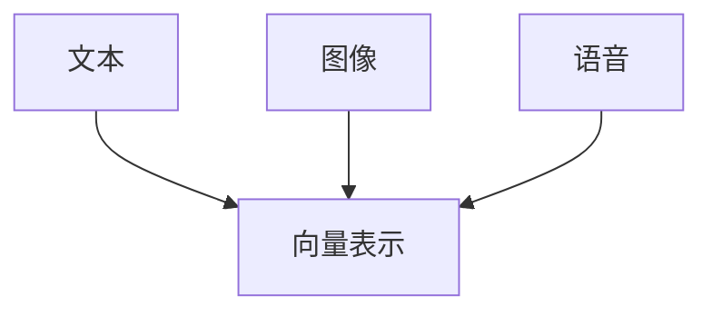
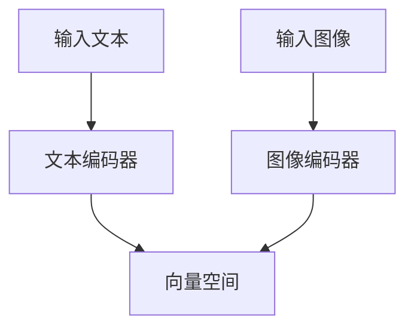
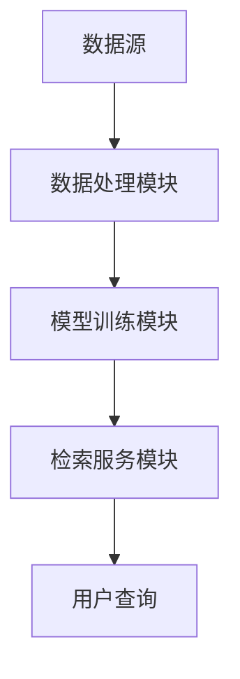

                 


# 实现AI Agent的跨模态检索能力

> 关键词：AI Agent, 跨模态检索, 多模态数据, 检索模型, 人工智能

> 摘要：本文将详细探讨实现AI Agent的跨模态检索能力的关键技术。从AI Agent的基本概念到跨模态检索的核心原理，再到具体的算法实现和系统设计，本文将逐步深入分析，结合实际案例和项目实战，为读者提供全面的技术指导。

---

## 第1章: AI Agent与跨模态检索概述

### 1.1 AI Agent的基本概念

AI Agent（人工智能代理）是一种智能实体，能够感知环境并执行任务以实现目标。AI Agent可以是软件程序、机器人或其他智能系统，其核心能力包括感知、推理、决策和执行。AI Agent广泛应用于推荐系统、智能助手、自动驾驶等领域。

### 1.2 跨模态检索的背景与意义

跨模态检索是指在不同数据类型（如文本、图像、语音等）之间进行信息检索的能力。随着AI Agent的应用场景越来越复杂，单一模态的数据处理已无法满足需求，跨模态检索成为实现高效信息处理的关键技术。

### 1.3 本章小结

本章介绍了AI Agent的基本概念和跨模态检索的重要意义，为后续内容奠定了基础。

---

## 第2章: 跨模态检索的核心概念与原理

### 2.1 跨模态数据的表示方法

跨模态数据的表示方法包括文本、图像、语音等多种形式。为了实现跨模态检索，需要将不同模态的数据转换为统一的表示形式，如向量空间表示。



### 2.2 跨模态检索模型的构建

跨模态检索模型需要能够理解并匹配不同模态的数据。常见的模型包括双塔结构和单塔结构。



### 2.3 跨模态检索的核心算法

跨模态检索的核心算法包括基于相似度的检索和基于向量空间的检索。

- **基于相似度的检索**：计算两个向量之间的相似度，常用的相似度计算方法包括余弦相似度和欧氏距离。

  $$ \text{余弦相似度} = \frac{\vec{a} \cdot \vec{b}}{|\vec{a}| |\vec{b}|} $$

  $$ \text{欧氏距离} = \sqrt{(a_1 - b_1)^2 + (a_2 - b_2)^2} $$

- **基于向量空间的检索**：将数据映射到向量空间，通过向量检索技术（如ANN）进行高效查询。

### 2.4 本章小结

本章详细介绍了跨模态检索的核心概念和算法原理，为后续的系统设计和实现提供了理论基础。

---

## 第3章: 跨模态检索的算法原理

### 3.1 基于深度学习的跨模态检索

深度学习模型在跨模态检索中表现出色，常用的模型包括双塔结构和对比学习模型。

- **双塔结构**：将不同模态的数据分别编码为两个向量，通过对比损失函数优化编码器。

  $$ \text{对比损失} = -\frac{1}{N} \sum_{i=1}^{N} \log(\text{sim}(x_i, y_i)) $$

- **对比学习**：通过最大化正样本的相似度和最小化负样本的相似度来优化模型。

### 3.2 跨模态检索的损失函数与优化

常用的损失函数包括基于相似度的损失函数和基于对抗学习的损失函数。

- **基于相似度的损失函数**：衡量正样本和负样本的相似度差异。

  $$ \text{损失} = \frac{1}{N} \sum_{i=1}^{N} (\text{sim}(x_i, y_i) - \text{sim}(x_i, y_j)) $$

- **基于对抗学习的损失函数**：通过生成对抗网络（GAN）优化模型。

### 3.3 跨模态检索的数学模型

跨模态检索的数学模型可以表示为：

$$ \text{score}(x, y) = f_x(x) \cdot f_y(y) $$

其中，$f_x$和$f_y$分别是文本和图像的编码函数。

### 3.4 本章小结

本章详细讲解了跨模态检索的算法原理和数学模型，为后续的系统设计和实现提供了理论支持。

---

## 第4章: 跨模态检索的系统架构设计

### 4.1 跨模态检索系统的整体架构

跨模态检索系统的整体架构包括数据处理、模型训练和检索服务三个主要模块。



### 4.2 跨模态检索系统的数据处理

数据处理模块包括数据预处理、特征提取和数据存储。

- **数据预处理**：对文本、图像等数据进行清洗和标准化处理。
- **特征提取**：使用预训练模型提取多模态特征。
- **数据存储**：将特征向量存储到数据库中，支持高效的查询操作。

### 4.3 跨模态检索系统的模型训练

模型训练模块包括模型训练、调优和评估。

- **模型训练**：使用多模态数据训练跨模态检索模型。
- **模型调优**：通过超参数优化和数据增强提升模型性能。
- **模型评估**：使用评估指标（如准确率、召回率）验证模型效果。

### 4.4 跨模态检索系统的接口设计

接口设计模块包括API接口的设计和实现。

- **API接口设计**：定义接口的输入和输出格式。
- **接口实现**：编写API服务，支持HTTP请求和响应。
- **接口优化**：通过缓存和压缩技术提升接口性能。

### 4.5 本章小结

本章详细描述了跨模态检索系统的整体架构和实现细节，为后续的项目实战提供了指导。

---

## 第5章: 跨模态检索的项目实战

### 5.1 项目环境的搭建

项目环境包括安装Python、TensorFlow、Keras等依赖库。

```bash
pip install tensorflow numpy pandas scikit-learn
```

### 5.2 系统核心实现源代码

以下是跨模态检索系统的实现代码示例：

```python
import numpy as np
from tensorflow.keras import layers, Model

# 定义文本编码器
def text_encoder(vocabulary_size, embedding_dim):
    input_text = layers.Input(shape=(None,))
    embedding_layer = layers.Embedding(vocabulary_size, embedding_dim)(input_text)
    dense_layer = layers.Dense(embedding_dim, activation='relu')(embedding_layer)
    return Model(inputs=input_text, outputs=dense_layer)

# 定义图像编码器
def image_encoder(input_dim, embedding_dim):
    input_image = layers.Input(shape=(input_dim,))
    dense_layer = layers.Dense(embedding_dim, activation='relu')(input_image)
    return Model(inputs=input_image, outputs=dense_layer)

# 定义对比损失函数
def contrastive_loss(y_true, y_pred, margin=1.0):
    loss = (1 - y_true) * np.square(y_pred) + y_true * np.square(margin - y_pred)
    return np.mean(loss)

# 训练函数
def train(model, optimizer, margin=1.0, epochs=100):
    for epoch in range(epochs):
        # 生成正样本和负样本
        # 计算损失并反向传播
        pass
```

### 5.3 代码应用解读与分析

代码实现了文本编码器、图像编码器和对比损失函数。文本编码器将输入的文本转换为嵌入向量，图像编码器将输入的图像特征转换为嵌入向量。对比损失函数用于优化编码器的相似度计算。

### 5.4 实际案例分析和详细讲解

通过实际案例分析，展示如何使用上述代码实现一个简单的跨模态检索系统，并进行性能评估。

### 5.5 项目小结

本章通过实际项目实战，详细讲解了跨模态检索系统的实现过程，帮助读者掌握从理论到实践的整个流程。

---

## 最佳实践与小结

### 6.1 小结

本文详细探讨了实现AI Agent的跨模态检索能力的关键技术，从核心概念到算法实现，再到系统设计和项目实战，为读者提供了全面的技术指导。

### 6.2 注意事项

- 数据预处理和特征提取是实现跨模态检索的重要步骤，需要仔细设计和优化。
- 模型训练和调优需要结合实际数据特点，选择合适的超参数和优化策略。
- 系统架构设计需要考虑扩展性和性能优化，确保系统的高效运行。

### 6.3 拓展阅读

建议读者进一步学习多模态数据处理、深度学习模型优化和分布式检索技术，以提升跨模态检索的能力和性能。

---

通过本文的学习，读者将能够掌握实现AI Agent的跨模态检索能力所需的关键技术和方法，为实际应用提供有力的技术支持。

