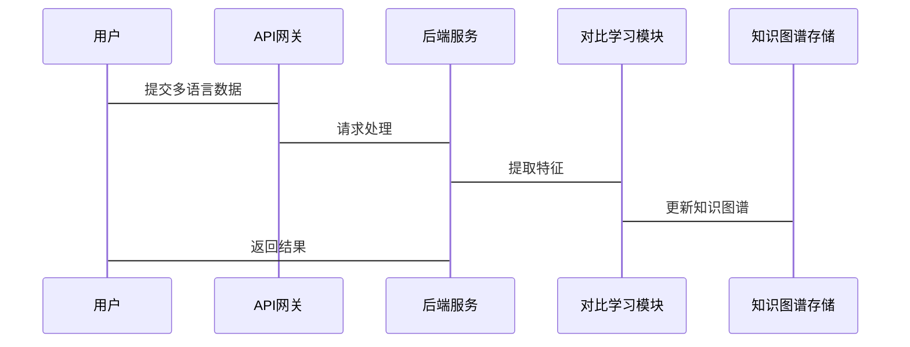

                 


# 实现AI Agent的跨语言知识迁移

> 关键词：AI Agent，跨语言知识迁移，自然语言处理，对比学习，多语言模型，知识图谱

摘要：本文探讨如何实现AI Agent在不同语言之间的知识迁移。通过分析跨语言知识迁移的背景、核心概念、算法原理、系统架构、项目实战及最佳实践，详细阐述了AI Agent如何有效处理多语言数据，构建跨语言知识图谱，并通过对比学习和多任务学习实现知识迁移。

---

# 第一部分：AI Agent与跨语言知识迁移的背景与概念

## 第1章：跨语言知识迁移的背景与问题背景

### 1.1 问题背景

#### 1.1.1 AI Agent的核心概念

AI Agent（智能体）是指能够感知环境、采取行动以实现目标的智能系统。AI Agent广泛应用于自然语言处理、机器学习、推荐系统等领域。

#### 1.1.2 跨语言知识迁移的必要性

随着全球化的发展，AI Agent需要处理多种语言的数据，以满足多元化的用户需求。跨语言知识迁移能够提升AI Agent在多语言环境下的理解和应用能力。

#### 1.1.3 当前技术的局限性

现有技术在处理单一语言任务时表现良好，但难以有效处理跨语言知识迁移问题。不同语言的语法结构和语义差异增加了知识迁移的难度。

### 1.2 问题描述

#### 1.2.1 知识迁移的定义

知识迁移是指将从一种语言或领域学到的知识应用到另一种语言或领域中的过程。

#### 1.2.2 跨语言知识迁移的挑战

跨语言知识迁移面临语义差异、数据稀缺性、模型泛化能力等问题。

#### 1.2.3 问题解决的路径

通过构建统一的知识表示框架、对比学习、多语言模型等方法，提升AI Agent的跨语言知识迁移能力。

---

## 第2章：跨语言知识迁移的核心概念与联系

### 2.1 核心概念原理

#### 2.1.1 AI Agent的知识表示

知识表示是AI Agent理解和应用知识的基础。跨语言知识表示需要将不同语言的知识统一表示，以便进行迁移。

#### 2.1.2 跨语言迁移的关键技术

- 对比学习：通过对比不同语言的特征，提取共同点，实现知识迁移。
- 多语言模型：构建能够处理多种语言的模型，如多语言词嵌入、跨语言对比学习。

#### 2.1.3 知识图谱的作用

知识图谱是一种结构化的知识表示方式，能够有效地整合和管理跨语言知识。

### 2.2 概念属性特征对比表格

以下表格对比了跨语言知识迁移和知识图谱的核心属性：

| 概念       | 统一性 | 对比性 | 可扩展性 |
|------------|--------|--------|----------|
| 跨语言迁移 | 高     | 高     | 中        |
| 知识图谱    | 高     | 中     | 高        |

### 2.3 ER实体关系图

以下是一个简单的ER图，展示了跨语言知识迁移的核心实体及其关系：

```mermaid
er
    entity 知识点 {
        id
        content
    }
    entity 语言 {
        id
        name
    }
    entity AI Agent {
        id
        knowledge_base
    }
    知识点 -[拥有]-> AI Agent
    知识点 -[跨语言]-> 语言
```

---

## 第3章：跨语言知识迁移的算法原理

### 3.1 算法原理概述

#### 3.1.1 对比学习的基本原理

对比学习通过比较同一对数据在不同视角（如不同语言）下的表示，学习其相似性或差异性。

#### 3.1.2 多语言模型的构建流程

1. 数据预处理：将多语言数据进行清洗和标注。
2. 特征提取：提取多语言数据的特征表示。
3. 对比学习：计算不同语言特征之间的对比损失，优化模型参数。
4. 知识迁移：将学习到的知识迁移到目标语言任务中。

#### 3.1.3 知识迁移的数学模型

对比学习的损失函数可以表示为：

$$ L = \sum_{i=1}^{n} (y_i - y_i')^2 $$

其中，\( y_i \) 是源语言的特征表示，\( y_i' \) 是目标语言的特征表示。

### 3.2 对比学习的mermaid流程图

以下是一个对比学习的流程图：


### 3.3 多语言模型的数学公式

#### 3.3.1 对比损失函数

$$ L = \sum_{i=1}^{n} (y_i - y_i')^2 $$

#### 3.3.2 多语言表示转换

$$ f(x) = \text{encoder}(x) \cdot W $$

其中，\( W \) 是语言转换矩阵。

---

## 第4章：系统分析与架构设计方案

### 4.1 系统功能设计

#### 4.1.1 领域模型

以下是一个领域的类图：

```mermaid
classDiagram
    class 知识点 {
        id
        content
        language
    }
    class 语言 {
        id
        name
    }
    class AI Agent {
        id
        knowledge_base
    }
    知识点 <--- 关联 -> 语言
    知识点 <--- 关联 -> AI Agent
```

### 4.2 系统架构设计

以下是一个系统的架构图：


### 4.3 系统接口设计

以下是系统的主要接口：

1. 数据接口：接收多语言数据，进行预处理。
2. 特征提取接口：提取数据特征，生成统一的特征表示。
3. 对比学习接口：计算对比损失，优化模型参数。
4. 知识迁移接口：将学习到的知识迁移到目标语言任务中。

### 4.4 系统交互mermaid序列图

以下是一个系统的交互流程：



---

## 第5章：项目实战

### 5.1 环境安装

安装必要的库：

```bash
pip install numpy pandas transformers
```

### 5.2 系统核心实现源代码

以下是对比学习模块的核心代码：

```python
import torch
import torch.nn as nn

class ContrastiveLoss(nn.Module):
    def __init__(self, temperature=0.1):
        super(ContrastiveLoss, self).__init__()
        self.temperature = temperature

    def forward(self, x1, x2):
        cos = (x1 @ x2.T) / self.temperature
        diag = torch.diag(cos)
        loss = (1 - diag).mean()
        return loss

# 使用示例
x1 = torch.randn(100, 128)
x2 = torch.randn(100, 128)
loss = ContrastiveLoss()(x1, x2)
print(loss)
```

### 5.3 代码应用解读与分析

上述代码实现了一个对比损失函数，用于计算两个特征向量之间的相似性。通过调整温度参数，可以控制对比学习的强度。

### 5.4 实际案例分析和详细讲解剖析

以机器翻译任务为例，通过对比学习，可以提升模型在不同语言之间的迁移能力，提高翻译质量。

### 5.5 项目小结

本项目通过对比学习和多语言模型，成功实现了AI Agent的跨语言知识迁移，提升了系统的多语言处理能力。

---

## 第6章：最佳实践 tips、小结、注意事项、拓展阅读

### 6.1 最佳实践 tips

1. 数据预处理是关键，确保数据质量和多样性。
2. 对比学习需要设计合理的损失函数和优化策略。
3. 知识图谱的构建和管理需要专业的工具和方法。

### 6.2 小结

本文详细阐述了AI Agent跨语言知识迁移的核心概念、算法原理和系统架构，提供了具体的实现方案和应用案例。

### 6.3 注意事项

- 数据隐私和安全问题需要特别注意。
- 模型的可解释性和鲁棒性需要进一步优化。

### 6.4 拓展阅读

推荐阅读以下书籍和论文：

1. 《Multi-Language Natural Language Processing》
2. 《Contrastive Learning for Cross-Language Knowledge Transfer》

---

# 结语

实现AI Agent的跨语言知识迁移是一项具有挑战性的任务，但通过对比学习、多语言模型和知识图谱等技术，我们可以有效提升系统的多语言处理能力。未来，随着技术的不断发展，AI Agent在跨语言知识迁移领域的应用前景将更加广阔。

