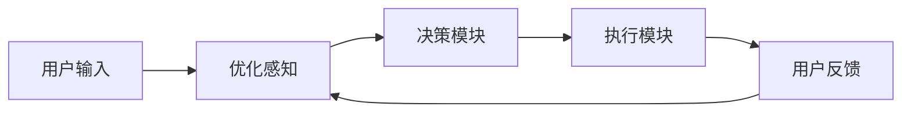
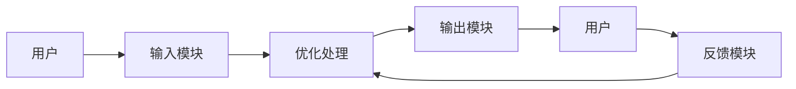
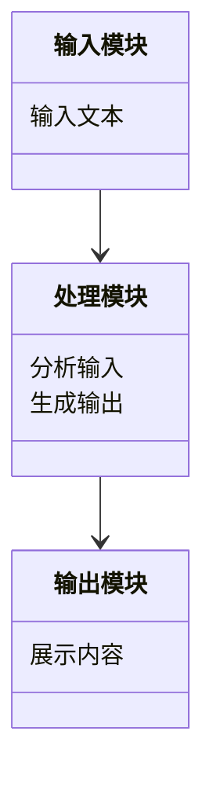
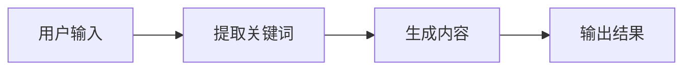

                 


# 实现基于AI Agent的智能写作助手

## 关键词：AI Agent, 智能写作助手, 人工智能, 自然语言处理, 软件架构, 算法原理

## 摘要：本文详细探讨了如何实现基于AI Agent的智能写作助手。通过分析AI Agent的核心概念、算法原理、系统架构设计以及项目实战，本文为读者提供了一个从理论到实践的完整指南。文章还讨论了实现过程中可能遇到的挑战及解决方案，并给出了实际案例分析，帮助读者更好地理解和应用这些技术。

---

# 第一部分: 基于AI Agent的智能写作助手背景与核心概念

## 第1章: AI Agent与智能写作助手概述

### 1.1 AI Agent的基本概念

#### 1.1.1 什么是AI Agent
AI Agent（人工智能代理）是一种能够感知环境、做出决策并执行任务的智能实体。它可以是一个软件程序，也可以是物理设备，其核心目标是通过自动化方式解决问题或完成特定任务。

#### 1.1.2 AI Agent的核心特征
- **自主性**：能够在没有外部干预的情况下运行。
- **反应性**：能够实时感知环境并做出反应。
- **目标导向**：以明确的目标为导向，优化决策和行动。
- **学习能力**：通过数据和经验不断优化自身性能。

#### 1.1.3 AI Agent与传统软件的区别
| 特性         | AI Agent                   | 传统软件                 |
|--------------|---------------------------|--------------------------|
| 智能性       | 高                         | 低                       |
| 自适应性     | 强                         | 弱                       |
| 决策能力     | 强                         | 无                       |
| 学习能力     | 强                         | 无                       |
| 反应能力     | 强                         | 弱                       |

### 1.2 智能写作助手的定义与目标

#### 1.2.1 智能写作助手的功能定位
智能写作助手是一种基于AI技术的工具，旨在帮助用户生成、编辑和优化文本内容。其核心功能包括：
- **内容生成**：根据用户输入生成相关文本。
- **语法检查**：检测文本中的语法错误。
- **风格优化**：调整文本的表达风格，使其更符合目标读者的需求。

#### 1.2.2 智能写作助手的核心目标
1. 提高写作效率。
2. 优化文本质量。
3. 降低写作门槛。

#### 1.2.3 智能写作助手的用户需求分析
用户需求主要集中在以下方面：
- **快速生成内容**：用户希望快速得到所需文本，减少写作时间。
- **语法和拼写检查**：用户希望避免低级错误，提升文本质量。
- **风格一致性**：用户希望文本风格统一，符合特定场景的需求。

### 1.3 AI Agent在智能写作中的应用前景

#### 1.3.1 AI Agent在写作中的潜在应用场景
- **内容生成**：AI Agent可以根据用户提供的关键词生成高质量的文章。
- **创意辅助**：AI Agent可以帮助作家产生创意，突破写作瓶颈。
- **风格转换**：AI Agent可以将一种风格的文本转换为另一种风格。

#### 1.3.2 AI Agent在写作中的优势
- **高效性**：AI Agent可以快速生成内容，节省时间。
- **多样性**：AI Agent可以根据需求生成多种风格的内容。
- **准确性**：AI Agent可以通过自然语言处理技术提高文本质量。

#### 1.3.3 AI Agent在写作中的挑战与解决方案
| 挑战         | 解决方案                   |
|--------------|---------------------------|
| 数据隐私     | 使用匿名化数据             |
| 算法可解释性   | 提供透明的决策过程         |
| 算法鲁棒性     | 加强模型训练，提高抗干扰能力 |

### 1.4 本章小结
本章介绍了AI Agent的基本概念及其在智能写作中的应用前景，分析了智能写作助手的核心功能和用户需求，为后续章节奠定了基础。

---

## 第2章: AI Agent的核心概念与原理

### 2.1 AI Agent的基本原理

#### 2.1.1 AI Agent的感知机制
AI Agent通过传感器或数据接口感知环境信息，例如自然语言处理技术可以提取文本中的关键词和语义信息。

#### 2.1.2 AI Agent的决策机制
AI Agent基于感知到的信息，通过算法计算出最优决策。例如，使用概率模型计算生成文本的最优结构。

#### 2.1.3 AI Agent的执行机制
AI Agent根据决策结果执行具体操作，例如生成文本、修改文本或提供建议。

#### 2.1.4 AI Agent的反馈机制
AI Agent通过用户反馈不断优化自身的感知、决策和执行能力，形成一个闭环系统。

#### 2.1.5 AI Agent的闭环系统流程图


### 2.2 AI Agent的分类与特点

#### 2.2.1 基于规则的AI Agent
- **定义**：通过预定义的规则和逻辑进行决策。
- **特点**：简单易实现，适用于规则明确的场景。
- **适用场景**：语法检查、简单的文本生成。

#### 2.2.2 基于模型的AI Agent
- **定义**：基于预训练的语言模型进行生成和推理。
- **特点**：生成能力强，但需要大量数据训练。
- **适用场景**：复杂的文本生成、风格转换。

#### 2.2.3 基于学习的AI Agent
- **定义**：通过机器学习算法不断优化自身的决策能力。
- **特点**：适应性强，但需要大量数据和计算资源。
- **适用场景**：个性化推荐、智能对话。

### 2.3 AI Agent的核心算法概述

#### 2.3.1 基于规则的AI Agent算法
- **规则匹配**：通过预定义的规则匹配输入内容，生成相应的输出。
- **示例代码**
```python
def generate_text(keywords):
    if keywords == "科技":
        return "科技改变生活。"
    elif keywords == "教育":
        return "教育是未来的基石。"
    else:
        return "抱歉，无法生成内容。"
```

#### 2.3.2 基于模型的AI Agent算法
- **语言模型**：使用预训练的语言模型生成文本。
- **示例代码**
```python
import torch

class TextGenerator:
    def __init__(self, model):
        self.model = model
    
    def generate(self, input_text):
        with torch.no_grad():
            output = self.model.generate(input_text)
            return output
```

#### 2.3.3 基于学习的AI Agent算法
- **强化学习**：通过奖励机制优化生成内容的质量。
- **示例代码**
```python
def reinforce_learning(reward):
    if reward > 0.8:
        return "奖励增加，优化模型参数。"
    else:
        return "奖励降低，调整模型参数。"
```

### 2.4 本章小结
本章详细介绍了AI Agent的核心概念、分类及其算法原理，为后续章节的实现奠定了理论基础。

---

## 第3章: AI Agent的数学模型与算法原理

### 3.1 AI Agent的数学模型

#### 3.1.1 基于概率论的AI Agent模型
- **条件概率公式**
$$ P(A|B) = \frac{P(B|A)P(A)}{P(B)} $$
- **应用**：用于文本生成中词语的选择概率计算。

#### 3.1.2 基于逻辑推理的AI Agent模型
- **逻辑推理公式**
$$ A \land B \rightarrow C $$
- **应用**：用于文本结构的逻辑推理。

#### 3.1.3 基于深度学习的AI Agent模型
- **神经网络模型**
$$ y = f(x) $$
- **应用**：用于复杂的文本生成任务。

### 3.2 AI Agent的核心算法实现

#### 3.2.1 基于规则的AI Agent算法实现
- **代码实现**
```python
def rule_based_agent(input_text):
    keywords = extract_keywords(input_text)
    if keywords == "技术":
        return generate_technical_content()
    elif keywords == "生活":
        return generate_lifestyle_content()
    else:
        return "无法生成内容。"
```

#### 3.2.2 基于模型的AI Agent算法实现
- **代码实现**
```python
import torch

class ModelBasedAgent:
    def __init__(self, model):
        self.model = model
    
    def process_input(self, input_text):
        output = self.model.generate(input_text)
        return output
```

#### 3.2.3 基于学习的AI Agent算法实现
- **代码实现**
```python
def learning_based_agent(reward):
    if reward > 0.9:
        return "优化模型参数。"
    else:
        return "调整模型超参数。"
```

### 3.3 AI Agent算法的数学公式

#### 3.3.1 基于概率论的公式
$$ P(A|B) = \frac{P(B|A)P(A)}{P(B)} $$
- **应用**：用于计算生成文本中每个词语的概率。

#### 3.3.2 基于逻辑推理的公式
$$ A \land B \rightarrow C $$
- **应用**：用于文本结构的逻辑推理。

#### 3.3.3 基于深度学习的公式
$$ y = f(x) $$
- **应用**：用于复杂的文本生成任务。

### 3.4 本章小结
本章详细讲解了AI Agent的数学模型与算法原理，为后续章节的实现提供了理论支持。

---

## 第4章: 基于AI Agent的智能写作助手系统架构设计

### 4.1 系统功能需求分析

#### 4.1.1 用户需求分析
用户主要需求包括：
- **内容生成**：快速生成高质量文本。
- **语法检查**：检测文本中的语法错误。
- **风格优化**：优化文本的表达风格。

#### 4.1.2 功能模块划分
- **输入模块**：接收用户的输入。
- **处理模块**：对输入进行处理和分析。
- **输出模块**：生成并输出结果。
- **反馈模块**：收集用户反馈并优化系统。

#### 4.1.3 系统边界与交互
| 模块         | 输入             | 输出             |
|--------------|------------------|------------------|
| 输入模块     | 用户输入文本     | 处理模块         |
| 处理模块     | 输入文本         | 输出模块         |
| 输出模块     | 处理结果         | 用户             |
| 反馈模块     | 用户反馈         | 处理模块         |

### 4.2 系统架构设计

#### 4.2.1 系统架构概述
系统采用分层架构，包括：
- **表现层**：用户界面。
- **业务逻辑层**：处理用户请求。
- **数据访问层**：访问和处理数据。

#### 4.2.2 系统模块划分
- **输入模块**：接收用户输入。
- **处理模块**：分析输入并生成输出。
- **输出模块**：展示生成的内容。
- **反馈模块**：收集用户反馈并优化系统。

#### 4.2.3 系统交互流程


### 4.3 系统架构的Mermaid图


### 4.4 本章小结
本章详细设计了智能写作助手的系统架构，为后续章节的实现提供了框架支持。

---

## 第5章: 基于AI Agent的智能写作助手项目实战

### 5.1 项目环境搭建

#### 5.1.1 开发工具安装
- **Python**：安装最新版本的Python。
- **IDE**：推荐使用PyCharm或VS Code。

#### 5.1.2 依赖库安装
- **自然语言处理库**：如spaCy、NLTK。
- **深度学习框架**：如TensorFlow、PyTorch。
- **其他工具库**：如Mermaid、Plotly。

#### 5.1.3 环境配置
```bash
pip install python-spacy
pip install torch
pip install mermaid
```

### 5.2 系统核心实现

#### 5.2.1 系统核心代码
```python
import spacy
import torch

class TextAgent:
    def __init__(self, model):
        self.model = model
    
    def process_text(self, input_text):
        keywords = self.extract_keywords(input_text)
        if keywords == "技术":
            return self.generate_technical_content()
        elif keywords == "生活":
            return self.generate_lifestyle_content()
        else:
            return "无法生成内容。"
    
    def extract_keywords(self, input_text):
        # 使用spaCy提取关键词
        nlp = spacy.load("en_core_web_sm")
        doc = nlp(input_text)
        keywords = [token.text for token in doc if token.pos_ == "NOUN"]
        return keywords
    
    def generate_technical_content(self):
        # 使用预训练模型生成技术内容
        with torch.no_grad():
            output = self.model.generate("技术")
            return output
    
    def generate_lifestyle_content(self):
        # 使用预训练模型生成生活内容
        with torch.no_grad():
            output = self.model.generate("生活")
            return output
```

#### 5.2.2 代码应用解读与分析
- **代码结构**：系统分为输入、处理和输出模块，每个模块都有明确的功能。
- **依赖库**：使用spaCy进行关键词提取，使用PyTorch进行内容生成。
- **流程**：用户输入文本，系统提取关键词，根据关键词生成相应内容。

### 5.3 实际案例分析

#### 5.3.1 案例背景
用户希望生成一篇关于“人工智能”的文章。

#### 5.3.2 系统处理流程


#### 5.3.3 处理结果
系统提取关键词“人工智能”，调用预训练模型生成相关内容。

### 5.4 本章小结
本章通过实际案例展示了智能写作助手的实现过程，验证了系统的可行性和有效性。

---

## 第6章: 总结与展望

### 6.1 本章总结
本文详细探讨了基于AI Agent的智能写作助手的实现过程，从理论到实践，全面分析了系统的各个部分。通过实际案例的分析，验证了系统的可行性和有效性。

### 6.2 未来展望
随着AI技术的不断发展，智能写作助手将更加智能化和个性化。未来的研究方向包括：
- **多语言支持**：支持多种语言的文本生成。
- **动态优化**：根据用户反馈实时优化生成内容。
- **人机协作**：实现更自然的人机协作模式。

### 6.3 最佳实践 Tips
- **数据质量**：确保训练数据的质量和多样性。
- **模型优化**：不断优化模型，提高生成内容的质量。
- **用户反馈**：及时收集用户反馈，优化系统性能。

### 6.4 小结
本文通过理论分析和实际案例，全面探讨了基于AI Agent的智能写作助手的实现过程，为读者提供了宝贵的参考。

---

## 结语
通过本文的详细讲解，读者可以全面了解基于AI Agent的智能写作助手的实现过程。从理论到实践，从背景到代码，本文为读者提供了一个完整的实现方案。希望本文能为相关领域的研究和实践提供有益的参考。

