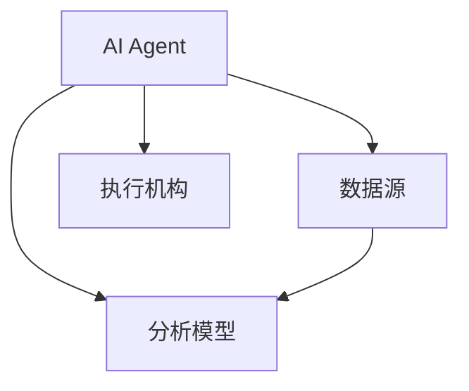
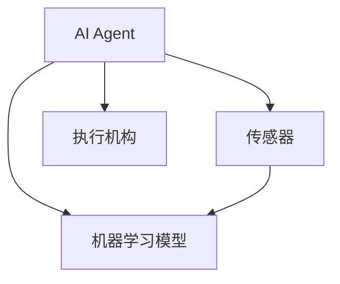
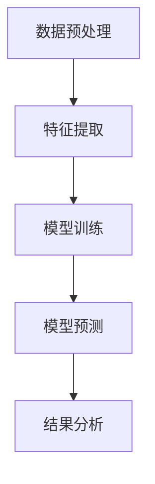
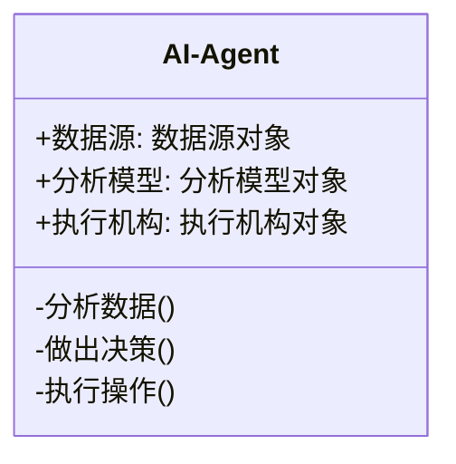
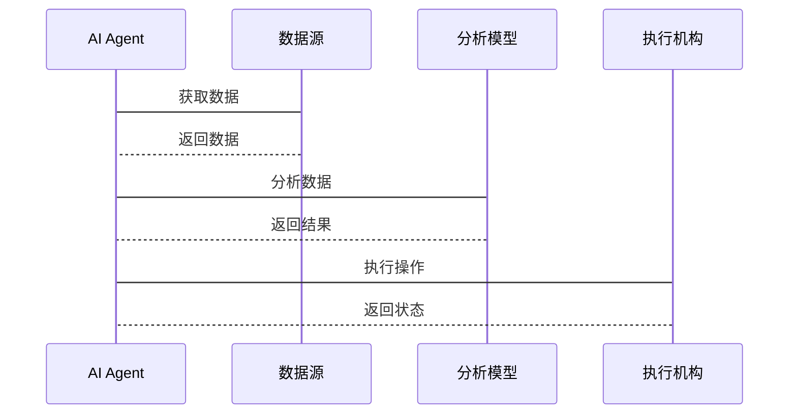

                 


# 实现基于AI Agent的智能质量控制系统

> 关键词：AI Agent, 智能质量控制系统, 机器学习, 系统架构, 项目实战

> 摘要：本文详细探讨了基于AI Agent的智能质量控制系统的设计与实现。从问题背景到解决方案，从核心概念到算法原理，从系统架构到项目实战，系统地分析了智能质量控制系统的实现过程。文章通过丰富的图表、代码和公式，深入剖析了系统的各个组成部分，为读者提供了一套完整的实现方案。

---

## 第一部分: 背景与概述

### 第1章: 基于AI Agent的智能质量控制系统概述

#### 1.1 问题背景
##### 1.1.1 当前质量控制的挑战
现代制造业和服务业对产品质量的要求越来越高，传统的基于规则的质量控制方法在面对复杂场景时显得力不从心。人工检查效率低下，且容易出错；传统自动化设备难以应对多样化的场景。

##### 1.1.2 传统质量控制的局限性
- 依赖人工经验，主观性强；
- 难以快速适应产品和流程的变化；
- 数据分析能力有限，难以挖掘深层次质量问题。

##### 1.1.3 引入AI Agent的必要性
AI Agent（智能代理）能够通过感知环境、自主决策、执行动作，实现对质量控制的智能化升级。

---

#### 1.2 问题描述
##### 1.2.1 质量控制的核心问题
- 如何高效、准确地检测产品缺陷；
- 如何快速响应生产环境中的变化；
- 如何实现跨部门、跨系统的协同工作。

##### 1.2.2 AI Agent在质量控制中的应用场景
- 实时监控生产过程中的关键指标；
- 自动识别和分类产品缺陷；
- 协调不同设备和系统的协同工作。

##### 1.2.3 系统的目标与功能
系统目标：实现智能化的质量控制，提高效率、降低成本、提升产品一致性。

系统功能：实时监测、智能识别、自主决策、协同工作。

---

#### 1.3 解决方案
##### 1.3.1 AI Agent的核心作用
AI Agent通过感知环境、分析数据、做出决策、执行动作，实现对质量控制的智能化管理。

##### 1.3.2 智能质量控制系统的架构
- 数据采集模块：收集生产过程中的各类数据；
- 数据分析模块：利用AI算法进行分析和预测；
- 决策模块：基于分析结果做出质量控制决策；
- 执行模块：将决策转化为具体操作。

##### 1.3.3 系统的关键技术与实现路径
- 数据采集技术：传感器、物联网技术；
- AI算法：机器学习、深度学习；
- 系统集成：与现有生产系统无缝对接。

---

#### 1.4 系统的边界与外延
##### 1.4.1 系统的边界定义
系统仅关注质量控制相关的功能，不涉及生产过程的其他环节。

##### 1.4.2 系统外延的功能模块
- 数据存储与管理；
- 系统监控与维护；
- 用户界面与交互。

##### 1.4.3 系统与其他系统的接口关系
系统通过API与其他系统（如MES、ERP）进行数据交互。

---

#### 1.5 概念结构与核心要素
##### 1.5.1 系统的核心要素组成
- AI Agent；
- 数据源；
- 分析模型；
- 执行机构。

##### 1.5.2 各要素之间的关系
AI Agent通过数据源获取信息，利用分析模型做出决策，并通过执行机构实现操作。

##### 1.5.3 系统的整体架构图


---

## 第二部分: 核心概念与联系

### 第2章: AI Agent与智能质量控制系统的原理

#### 2.1 AI Agent的定义与特点
##### 2.1.1 AI Agent的定义
AI Agent是一种能够感知环境、自主决策、执行动作的智能实体。

##### 2.1.2 AI Agent的核心特点
- 智能性：能够理解环境并做出合理决策；
- 自主性：无需外部干预，自主执行任务；
- 反应性：能够实时感知环境变化并做出响应；
- 学习能力：通过经验改进自身的性能。

##### 2.1.3 AI Agent与传统自动化的区别
| 特性 | AI Agent | 传统自动化 |
|------|-----------|-------------|
| 决策能力 | 高 | 低 |
| 灵活性 | 高 | 低 |
| 学习能力 | 高 | 无 |

---

#### 2.2 智能质量控制系统的定义与特点
##### 2.2.1 智能质量控制系统的定义
智能质量控制系统是一种基于AI Agent的系统，能够实时监控、分析和优化产品质量。

##### 2.2.2 智能质量控制系统的功能特点
- 实时监控：持续采集和分析生产数据；
- 智能识别：利用AI算法识别潜在问题；
- 自主决策：基于分析结果做出质量控制决策；
- 可扩展性：能够轻松集成新的设备和数据源。

##### 2.2.3 智能质量控制系统与传统质量控制的区别
| 特性 | 智能质量控制系统 | 传统质量控制系统 |
|------|------------------|------------------|
| 数据分析能力 | 强 | 弱 |
| 自适应性 | 高 | 低 |
| 精准度 | 高 | 中 |

---

#### 2.3 AI Agent与智能质量控制系统的协同工作
##### 2.3.1 协同工作流程
1. 数据采集：AI Agent通过传感器采集生产数据；
2. 数据分析：AI Agent利用机器学习模型分析数据，识别潜在问题；
3. 决策制定：AI Agent基于分析结果做出质量控制决策；
4. 执行操作：AI Agent通过执行机构完成具体操作。

##### 2.3.2 协同工作的实体关系图


---

## 第三部分: 算法原理与实现

### 第3章: 基于AI Agent的质量控制算法

#### 3.1 算法原理
##### 3.1.1 算法概述
质量控制算法基于监督学习，利用历史数据训练模型，实现对新数据的分类和预测。

##### 3.1.2 算法流程


##### 3.1.3 算法的数学模型
损失函数：$$L(y, y_{\text{pred}}) = \frac{1}{2n}\sum_{i=1}^{n}(y_i - y_{\text{pred}}_i)^2$$

优化目标：$$\text{最小化 } L$$

---

#### 3.2 算法实现
##### 3.2.1 Python代码实现
```python
import numpy as np
from sklearn import linear_model

# 数据预处理
X = np.array([...]).reshape(-1, 1)
y = np.array([...])

# 特征提取
# 已经完成在数据预处理中

# 模型训练
model = linear_model.LinearRegression()
model.fit(X, y)

# 模型预测
y_pred = model.predict(X)
```

##### 3.2.2 代码解读
- 数据预处理：将原始数据转换为适合模型训练的形式；
- 特征提取：从原始数据中提取关键特征；
- 模型训练：利用训练数据训练机器学习模型；
- 模型预测：利用训练好的模型对新数据进行预测。

##### 3.2.3 算法的优缺点
- 优点：简单易实现，适合线性问题；
- 缺点：对非线性问题的处理能力有限。

---

## 第四部分: 系统分析与架构设计

### 第4章: 智能质量控制系统的架构设计

#### 4.1 系统分析
##### 4.1.1 问题场景介绍
系统需要实时监控生产过程中的关键指标，识别潜在质量问题，并做出相应的决策。

##### 4.1.2 系统功能设计
- 数据采集：通过传感器采集生产数据；
- 数据分析：利用AI算法分析数据，识别潜在问题；
- 决策制定：基于分析结果做出质量控制决策；
- 执行操作：通过执行机构完成具体操作。

##### 4.1.3 领域模型设计


---

#### 4.2 系统架构设计
##### 4.2.1 系统架构图


##### 4.2.2 接口设计
- 数据源接口：提供数据采集的功能；
- 分析模型接口：提供数据分析和预测的功能；
- 执行机构接口：提供执行操作的功能。

##### 4.2.3 交互流程图


---

## 第五部分: 项目实战

### 第5章: 基于AI Agent的质量控制系统实现

#### 5.1 环境安装
##### 5.1.1 系统要求
- Python 3.6+
- NumPy、Scikit-learn等库

##### 5.1.2 安装步骤
```bash
pip install numpy scikit-learn
```

---

#### 5.2 系统核心实现
##### 5.2.1 数据采集模块
```python
import numpy as np

# 数据采集
X = np.array([...]).reshape(-1, 1)
y = np.array([...])
```

##### 5.2.2 数据分析模块
```python
from sklearn import linear_model

# 模型训练
model = linear_model.LinearRegression()
model.fit(X, y)
```

##### 5.2.3 决策模块
```python
# 预测结果
y_pred = model.predict(X)
```

##### 5.2.4 执行模块
```python
# 执行操作
print(y_pred)
```

---

#### 5.3 代码解读与分析
##### 5.3.1 代码结构
- 数据采集模块：负责数据的获取和预处理；
- 数据分析模块：负责数据分析和模型训练；
- 决策模块：负责基于分析结果做出决策；
- 执行模块：负责执行具体的操作。

##### 5.3.2 代码实现细节
- 数据采集：利用传感器获取生产数据；
- 数据分析：利用机器学习模型分析数据，识别潜在问题；
- 决策模块：基于分析结果做出质量控制决策；
- 执行模块：通过执行机构完成具体操作。

---

#### 5.4 实际案例分析
##### 5.4.1 案例背景
某汽车制造厂需要实时监控生产线上的关键指标，识别潜在质量问题。

##### 5.4.2 数据分析
利用机器学习模型分析生产线上的数据，识别潜在质量问题。

##### 5.4.3 决策与执行
基于分析结果，系统做出相应的质量控制决策，并通过执行机构完成操作。

---

#### 5.5 项目小结
通过本项目的实现，我们成功构建了一个基于AI Agent的智能质量控制系统，能够实时监控生产过程，识别潜在质量问题，并做出相应的决策。

---

## 第六部分: 最佳实践

### 第6章: 基于AI Agent的质量控制系统的优化与维护

#### 6.1 系统优化
##### 6.1.1 系统性能优化
- 提高数据采集的频率和精度；
- 优化机器学习模型的训练效率；
- 提高系统的响应速度。

##### 6.1.2 系统功能扩展
- 增加对更多类型数据的支持；
- 增加对更多设备和系统的支持；
- 增加对更多质量问题的识别能力。

---

#### 6.2 系统维护
##### 6.2.1 系统监控
- 实时监控系统的运行状态；
- 监控系统的性能指标；
- 监控系统的数据准确性。

##### 6.2.2 系统更新
- 定期更新机器学习模型；
- 定期更新系统的软件和硬件；
- 定期优化系统的配置。

---

#### 6.3 注意事项
- 系统的稳定性和可靠性是关键；
- 系统的安全性和数据保护是重点；
- 系统的可扩展性和可维护性是长期发展的基础。

---

#### 6.4 拓展阅读
- 《机器学习实战》；
- 《深度学习》；
- 《软件架构设计》。

---

### 总结
通过本文的详细讲解，我们了解了基于AI Agent的智能质量控制系统的实现过程。从问题背景到解决方案，从核心概念到算法原理，从系统架构到项目实战，我们系统地分析了智能质量控制系统的实现过程。希望本文能为读者提供有价值的参考和启发。

