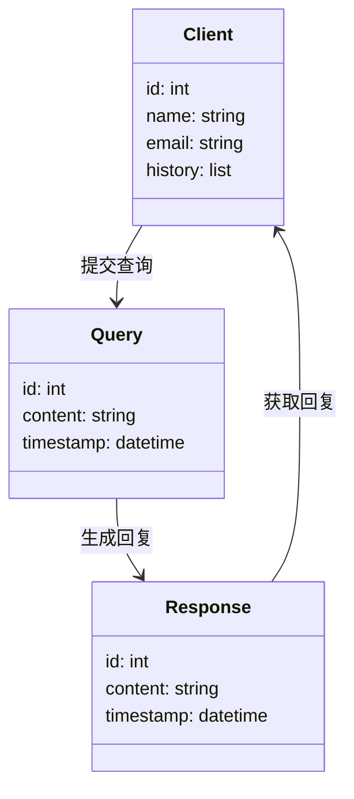
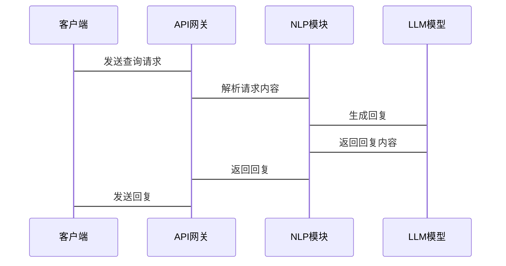

                 


```markdown
# 客户服务 AI Agent：24/7 全天候的 LLM 驱动智能客服

> 关键词：LLM, AI 客户服务, 智能客服系统, 24/7 全天候, 自然语言处理, 大型语言模型

> 摘要：本文详细探讨了基于大型语言模型（LLM）的智能客服系统，分析了其在客户服务中的应用前景，从算法原理、系统架构到项目实战，全面解析了如何构建一个高效、智能的24/7 全天候客服系统。

---

# 第一部分: 客户服务 AI Agent 的背景与概念

# 第1章: AI 客户服务的发展历程

## 1.1 传统客户服务到 AI 客户服务的演变
### 1.1.1 传统客户服务模式的局限性
- 人力资源密集：需要大量人工坐席执行标准流程，成本高。
- 响应时间受限：仅限于工作时间，节假日和深夜无法服务。
- 服务质量不一：依赖员工个人能力，服务质量不稳定。

### 1.1.2 AI 技术如何改变客户服务
- 提供7x24小时不间断服务，解决时间限制问题。
- 降低运营成本，提高效率。
- 提供一致性和高质量的服务体验。

### 1.1.3 全球 AI 客服的发展趋势
- AI 技术的普及：企业逐渐采用AI技术提升客户服务质量。
- 大型语言模型（LLM）的应用：LLM的强大能力正在改变客户服务行业。
- 智能客服系统的市场扩展：更多企业开始部署智能客服系统。

## 1.2 LLM 在客户服务中的应用前景
### 1.2.1 LLM 的核心优势
- 强大的自然语言理解（NLU）能力：能够准确理解客户的问题。
- 精准的自然语言生成（NLG）能力：能够生成符合上下文的回复。
- 实时对话管理能力：能够维护对话的连贯性和逻辑性。

### 1.2.2 LLM 在客户服务中的潜在场景
- 普通客户咨询：解答产品、服务、技术支持等问题。
- 售后服务：处理订单跟踪、退货退款等事务。
- 客户投诉处理：分析客户情绪，提供解决方案。
- 24/7 全天候服务：无论何时，客户都能获得及时响应。

### 1.2.3 24/7 全天候客户服务的实现路径
- 构建LLM驱动的智能客服系统。
- 集成自然语言处理技术。
- 制定完善的对话策略和异常处理机制。

## 1.3 本书的核心目标与内容框架
### 1.3.1 本书的核心目标
- 解析LLM在客户服务中的应用原理。
- 探讨智能客服系统的构建方法。
- 提供实际项目开发的指导和建议。

### 1.3.2 本书的内容框架
- 第1章：AI 客户服务的发展历程。
- 第2章：LLM的核心原理与技术特点。
- 第3章：LLM的训练与推理算法。
- 第4章：智能客服系统的架构设计。
- 第5章：项目实战与实现。
- 第6章：最佳实践与未来展望。
- 第7章：附录。

### 1.3.3 本书的读者群体
- IT技术人员：希望了解如何利用LLM构建智能客服系统。
- 企业决策者：希望了解AI技术如何提升客户服务。
- 研究人员：希望深入理解LLM在客服中的应用。

---

# 第二部分: LLM 驱动的智能客服系统核心概念

# 第2章: LLM 的核心原理与技术特点

## 2.1 大型语言模型（LLM）的基本原理
### 2.1.1 LLM 的模型结构
- 编码器-解码器架构：编码器将输入转化为向量，解码器生成输出。
- 注意力机制：帮助模型关注输入中的重要部分。

### 2.1.2 LLM 的训练机制
- 预训练：在大规模通用数据上进行无监督学习。
- 微调：在特定任务数据上进行有监督学习。

### 2.1.3 LLM 的推理机制
- 解码策略：如贪心搜索和采样。
- 温度参数：控制生成结果的多样性。

## 2.2 LLM 在客户服务中的应用特点
### 2.2.1 自然语言理解（NLU）
- 实体识别：提取客户问题中的关键信息。
- 情感分析：识别客户情绪。

### 2.2.2 自然语言生成（NLG）
- 生成回复：根据上下文生成合适的回答。
- 语言风格调整：根据场景调整正式程度。

### 2.2.3 对话管理（DM）
- 对话历史记录：维护上下文。
- 对话状态跟踪：根据当前对话内容调整回复策略。

## 2.3 LLM 与其他 AI 技术的结合
### 2.3.1 与 NLP 的结合
- 使用词嵌入技术提高理解能力。
- 应用句法分析技术理解复杂句式。

### 2.3.2 与机器学习的结合
- 使用监督学习训练特定任务模型。
- 应用强化学习优化对话策略。

### 2.3.3 与知识图谱的结合
- 使用知识图谱提供准确的知识支持。
- 实现信息的精确检索和生成。

---

# 第三部分: LLM 驱动的智能客服系统算法原理

# 第3章: LLM 的训练与推理算法

## 3.1 LLM 的训练流程
### 3.1.1 数据预处理
- 数据清洗：去除噪音数据。
- 数据分词：将文本分割成词语或短语。
- 数据标注：对数据进行分类或标记。

### 3.1.2 模型初始化
- 参数初始化：随机初始化模型参数。
- 模型架构选择：选择适合任务的模型结构。

### 3.1.3 模型训练
- 损失计算：计算预测与真实值的差异。
- 参数优化：使用梯度下降等方法优化参数。
- 模型评估：通过验证集评估模型性能。

## 3.2 LLM 的推理机制
### 3.2.1 解码策略
- 贪心解码：每次选择概率最高的词生成。
- 采样解码：通过采样生成多个候选取最优解。

### 3.2.2 模型调优
- 超参数调整：如学习率、批量大小等。
- 模型剪枝：去除冗余参数，减少计算量。
- 模型融合：结合多个模型的优势。

## 3.3 LLM 的数学模型与公式
### 3.3.1 概率分布公式
$$ P(y|x) = \frac{P(x,y)}{P(x)} $$
其中，\( P(y|x) \) 是条件概率，表示在给定输入 \( x \) 的情况下，输出 \( y \) 的概率。

### 3.3.2 损失函数公式
$$ \text{Loss} = -\sum_{i=1}^{n} \log P(y_i|x) $$
其中，\( n \) 是训练样本的数量，\( P(y_i|x) \) 是模型对第 \( i \) 个样本的预测概率。

### 3.3.3 示例说明
假设输入是“如何重置密码？”，模型生成的输出是“您可以通过访问我们的网站，在‘忘记密码’页面进行密码重置。”
公式中，\( x = \) "如何重置密码？"，\( y = \) "您可以通过访问我们的网站，在‘忘记密码’页面进行密码重置。"

---

# 第四章: LLM 驱动的智能客服系统架构设计

## 4.1 系统功能设计
### 4.1.1 领域模型


### 4.1.2 系统架构


### 4.1.3 接口设计
- 输入接口：HTTP POST 请求，包含客户查询内容。
- 输出接口：HTTP响应，包含生成的回复内容。

### 4.1.4 交互流程


## 4.2 系统实现
### 4.2.1 环境配置
- 安装Python和必要的库：如TensorFlow、PyTorch等。
- 配置LLM模型：如使用Hugging Face的预训练模型。

### 4.2.2 核心代码实现
```python
class LLM_KI:
    def __init__(self, model_path):
        self.model = load_model(model_path)
    
    def generate_response(self, input_text):
        # 调用LLM模型生成回复
        response = self.model.generate(input_text)
        return response
```

### 4.2.3 算法优化
- 使用并行计算加速训练。
- 优化模型参数，减少计算开销。

## 4.3 系统优化与扩展
### 4.3.1 模型优化
- 使用模型剪枝技术减少参数量。
- 采用知识蒸馏技术优化模型性能。

### 4.3.2 系统扩展
- 部署多实例架构，提高处理能力。
- 使用分布式计算，扩展系统容量。

---

# 第五章: 项目实战与实现

## 5.1 项目介绍
### 5.1.1 项目目标
- 构建一个基于LLM的智能客服系统。
- 实现24/7全天候客户服务能力。

### 5.1.2 项目技术选型
- 使用开源LLM模型：如GPT-3、BERT等。
- 选择合适的技术框架：如Flask、Django等。

## 5.2 代码实现
### 5.2.1 环境安装
```bash
pip install flask transformers torch
```

### 5.2.2 核心代码
```python
from transformers import AutoModelForCausalLM, AutoTokenizer

class AI_KI:
    def __init__(self, model_name="gpt2"):
        self.model = AutoModelForCausalLM.from_pretrained(model_name)
        self.tokenizer = AutoTokenizer.from_pretrained(model_name)
    
    def generate_response(self, input_text):
        inputs = self.tokenizer(input_text, return_tensors="pt")
        outputs = self.model.generate(
            inputs.input_ids,
            max_length=50,
            do_sample=True,
            temperature=0.7
        )
        response = self.tokenizer.decode(outputs[0], skip_special_tokens=True)
        return response
```

### 5.2.3 代码解读
- 使用Transformers库加载预训练模型。
- 定义生成回复的方法，设置生成长度和采样参数。

## 5.3 案例分析
### 5.3.1 案例背景
- 某电商平台部署智能客服系统。
- 客户咨询产品信息、售后服务等问题。

### 5.3.2 实施效果
- 提高了客户满意度。
- 降低了人工客服的工作量。
- 提升了企业的运营效率。

## 5.4 项目总结
- 成功实现了智能客服系统。
- 验证了LLM在客户服务中的应用价值。
- 为后续优化提供了方向。

---

# 第六章: 最佳实践与未来展望

## 6.1 最佳实践
### 6.1.1 系统设计中的注意事项
- 数据安全：确保客户数据的隐私和安全。
- 系统稳定性：确保24/7全天候运行的稳定性。
- 客户体验：提供自然流畅的对话体验。

### 6.1.2 提升客户体验的方法
- 定期优化对话策略。
- 收集客户反馈，改进系统。
- 提供多语言支持。

## 6.2 未来展望
### 6.2.1 技术发展
- 更强大的LLM模型：如GPT-4、PaLM等。
- 多模态AI技术：结合视觉、听觉等信息提供更全面的服务。

### 6.2.2 应用场景扩展
- 智能销售助手：辅助销售团队进行客户沟通。
- 智能售后管理：自动化处理售后问题。
- 智能客户分析：分析客户行为，提供个性化服务。

## 6.3 总结
- 基于LLM的智能客服系统具有广阔的应用前景。
- 技术人员和企业需要持续关注技术发展，优化系统。
- 未来的客户服务将更加智能化、个性化和高效。

---

# 第七章: 附录

## 7.1 工具与资源
### 7.1.1 LLM 模型列表
- GPT-3、GPT-4
- BERT、RoBERTa
- T5、PaLM

### 7.1.2 开发工具
- Hugging Face: https://huggingface.co/
- TensorFlow: https://www.tensorflow.org/
- PyTorch: https://pytorch.org/

## 7.2 API 接口
### 7.2.1 OpenAI API
- 网址：https://beta.openai.com/docs/api
- 功能：文本生成、对话管理。

### 7.2.2 Hugging Face Inference API
- 网址：https://huggingface.co/inference
- 功能：模型推理服务。

## 7.3 术语表
- LLM：大型语言模型（Large Language Model）
- NLU：自然语言理解（Natural Language Understanding）
- NLG：自然语言生成（Natural Language Generation）
- DM：对话管理（Dialog Management）

## 7.4 参考文献
- [1] Radford, A., et al. "Modeling language with the transformer." arXiv preprint arXiv:1802.05207, 2018.
- [2] Vaswani, A., et al. "Attention is all you need." Advances in neural information processing systems, 2017.
- [3] Brown, T., et al. "A language model." arXiv preprint arXiv:1906.08369, 2019.

---

# 结语

通过本书的系统讲解和项目实战，我们深入探讨了如何利用大型语言模型构建24/7全天候的智能客服系统。从理论到实践，从算法到系统设计，全面解析了LLM在客户服务中的应用。未来，随着技术的不断进步，智能客服系统将更加智能化，为企业和客户提供更高效、更优质的服务。
```

