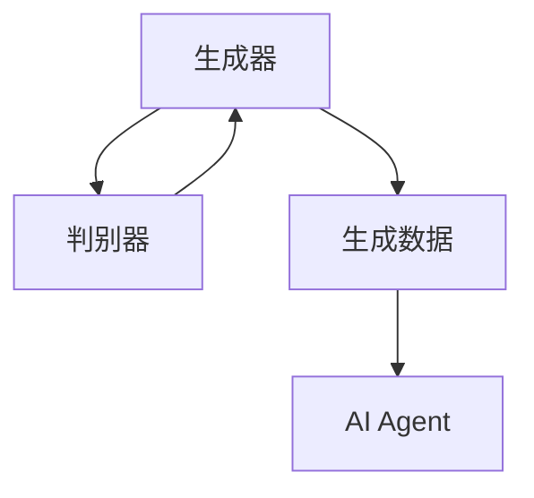

                 

# 对抗生成网络在AI Agent开发中的应用

> 关键词：生成对抗网络、AI Agent、深度学习、图像生成、自然语言处理、决策优化  
> 摘要：本文探讨了对抗生成网络（GANs）在AI Agent开发中的应用，重点分析了GANs的基本原理、其在图像生成、自然语言处理和决策优化中的应用，并通过实际案例展示了GANs如何提升AI Agent的能力。

---

# 第一章：对抗生成网络与AI Agent概述

## 1.1 对抗生成网络的基本概念

### 1.1.1 生成对抗网络的定义
对抗生成网络（GANs）是一种深度学习模型，由Ian Goodfellow等人于2014年提出。GANs由两个神经网络组成：生成器（Generator）和判别器（Discriminator）。生成器负责生成数据，而判别器负责区分真实数据和生成数据。通过对抗训练，生成器和判别器不断优化，最终生成逼真的数据。

### 1.1.2 AI Agent的基本概念
AI Agent是指能够感知环境、执行任务并做出决策的智能体。它可以基于规则、模型或强化学习进行决策。AI Agent的目标是通过与环境交互，完成特定任务，如图像生成、自然语言处理等。

### 1.1.3 对抗生成网络在AI Agent中的作用
GANs在AI Agent中的作用主要体现在生成高质量的数据，如图像、文本和决策。通过GANs，AI Agent可以生成逼真的数据，提升其生成能力和决策水平。

---

## 1.2 对抗生成网络的核心原理

### 1.2.1 生成器与判别器的对抗过程
生成器的目标是生成与真实数据无法区分的数据，而判别器的目标是区分真实数据和生成数据。通过不断对抗，生成器和判别器的能力不断提升。

### 1.2.2 对抗生成网络的数学模型
生成器的损失函数：
$$ L_G = \log(1 - D(G(x))) $$
判别器的损失函数：
$$ L_D = \log(D(x)) + \log(1 - D(G(x))) $$

### 1.2.3 对抗生成网络的优势与局限性
| 优势 | 局限性 |
|------|--------|
| 生成高质量数据 | 易发生模式崩溃 |
| 可用于多种数据类型 | 训练不稳定 |
| 真实数据分布学习 | 需大量计算资源 |

---

## 1.3 对抗生成网络在AI Agent中的应用场景

### 1.3.1 对抗生成网络在自然语言处理中的应用
GANs可以用于生成自然语言文本，如对话生成和文本摘要。例如，生成器生成对话，判别器评估对话的合理性。

### 1.3.2 对抗生成网络在图像生成中的应用
GANs可以生成高质量的图像，用于AI Agent的视觉任务，如图像修复和图像生成。

### 1.3.3 对抗生成网络在决策优化中的应用
GANs可以用于优化AI Agent的决策过程，通过生成多种可能的决策路径，提升决策的多样性和鲁棒性。

---

## 1.4 本章小结
本章介绍了对抗生成网络的基本概念、核心原理及其在AI Agent中的应用场景。通过对抗训练，GANs在生成高质量数据方面表现出色，为AI Agent的开发提供了新的可能性。

---

# 第二章：对抗生成网络的核心算法原理

## 2.1 生成对抗网络的基本架构

### 2.1.1 生成器网络
生成器通常使用深度神经网络，如卷积神经网络（CNN）或循环神经网络（RNN），将噪声输入映射到生成数据。

### 2.1.2 判别器网络
判别器通常也是深度神经网络，用于分类真实数据和生成数据。

### 2.1.3 对抗训练的损失函数
$$ L_G = \log(1 - D(G(x))) $$
$$ L_D = \log(D(x)) + \log(1 - D(G(x))) $$

## 2.2 改进的对抗生成网络算法

### 2.2.1 深度卷积生成对抗网络（DCGAN）
DCGAN使用深度卷积网络结构，提升了生成图像的质量和稳定性。

### 2.2.2 噬菌体对抗网络（WGAN）
WGAN使用 Wasserstein 距离作为损失函数，提高了训练的稳定性。

### 2.2.3 样式对抗网络（StyleGAN）
StyleGAN通过引入样式和内容的分离，生成更高质量的图像。

## 2.3 对抗生成网络的训练过程

### 2.3.1 损失函数的优化
使用梯度下降方法优化生成器和判别器的参数。

### 2.3.2 梯度计算与反向传播
通过反向传播计算梯度，更新生成器和判别器的权重。

### 2.3.3 对抗均衡的实现
通过调整生成器和判别器的损失函数，实现对抗均衡。

---

## 2.4 对抗生成网络的数学模型
生成器和判别器的数学模型如前所述，通过不断迭代优化，生成器生成的数据逐渐接近真实数据分布。

---

## 2.5 本章小结
本章详细讲解了对抗生成网络的核心算法原理，包括生成器和判别器的结构、损失函数的优化以及改进的GANs模型。这些内容为后续章节的应用奠定了基础。

---

接下来的章节将继续探讨对抗生成网络在AI Agent中的具体应用和开发实践。

