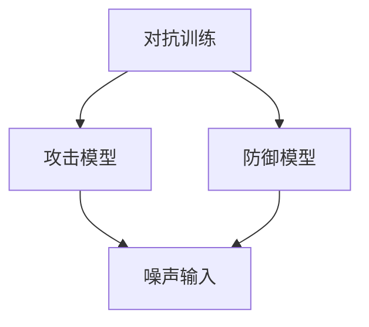
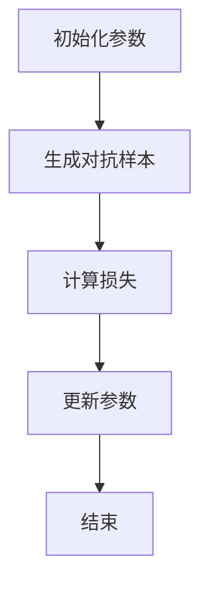
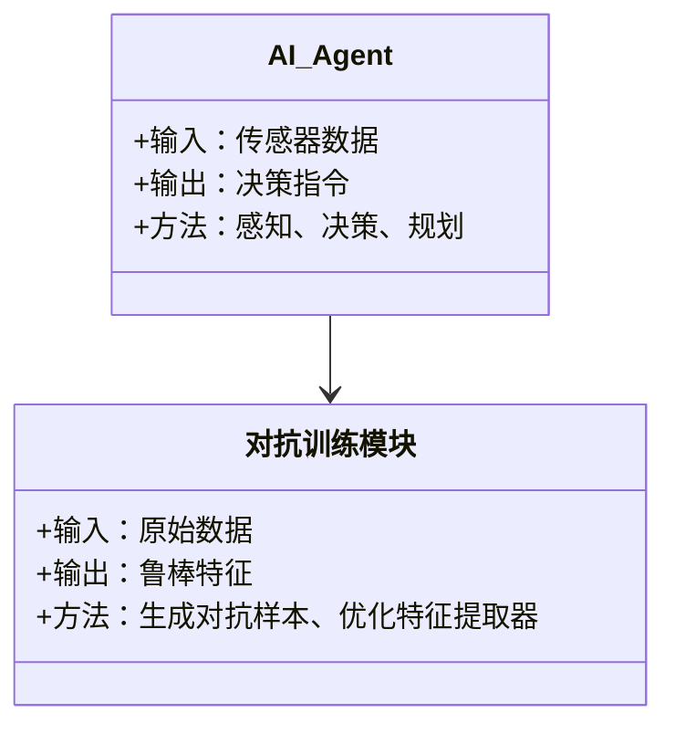
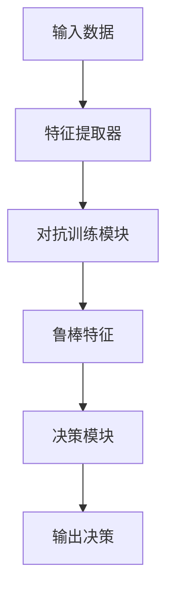
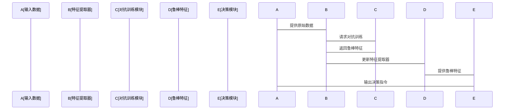

                 


# 对抗训练：提高AI Agent对噪声和攻击的鲁棒性

> 关键词：对抗训练、AI Agent、鲁棒性、噪声、攻击、机器学习、深度学习

> 摘要：本文详细探讨了对抗训练在提高AI Agent对噪声和攻击鲁棒性中的应用。通过分析对抗训练的核心概念、算法原理、系统架构设计以及实际项目案例，本文为读者提供了从理论到实践的全面指导。我们还将对比不同的对抗训练方法，并提供最佳实践建议，帮助读者在实际应用中更好地设计和优化鲁棒的AI系统。

---

# 第1章: 对抗训练的背景与问题描述

## 1.1 对抗训练的背景与意义

### 1.1.1 AI Agent的定义与应用场景

AI Agent（智能体）是指能够感知环境并采取行动以实现目标的智能系统。AI Agent广泛应用于自动驾驶、语音助手、推荐系统、机器人控制等领域。例如，自动驾驶系统需要在复杂的交通环境中实时做出决策，对环境感知的准确性要求极高。

### 1.1.2 对抗训练的必要性

在实际应用中，AI Agent可能会面临多种噪声和攻击，例如：

- **噪声干扰**：传感器噪声、数据缺失、通信延迟等。
- **对抗攻击**：恶意攻击者通过注入噪声或干扰信号来破坏AI系统的正常运行。

这些干扰和攻击可能导致AI Agent做出错误的决策，甚至危及系统安全。例如，在自动驾驶中，恶意干扰可能导致车辆误判路况，引发安全事故。

### 1.1.3 对抗训练在AI安全中的作用

对抗训练是一种通过设计对抗样本和防御机制来增强AI系统鲁棒性的技术。它可以帮助AI Agent在面对噪声和攻击时保持稳定性和准确性。例如，在图像识别任务中，对抗训练可以生成鲁棒的特征提取器，抵御对抗样本的干扰。

## 1.2 对抗训练的核心问题

### 1.2.1 噪声与攻击的定义

- **噪声**：随机的干扰信号，例如图像中的椒盐噪声、语音中的背景噪声等。
- **攻击**：有目的的干扰，例如对抗样本攻击（adversarial attack），通过微小的扰动使模型误分类。

### 1.2.2 对抗训练的目标与挑战

对抗训练的目标是通过设计和优化模型，使其在面对噪声和攻击时仍能保持高性能。然而，对抗训练面临以下挑战：

- **模型的脆弱性**：深度学习模型对对抗样本往往非常敏感。
- **攻击策略的多样性**：攻击者可能采用多种攻击策略，例如梯度下降法生成对抗样本。
- **计算复杂度**：对抗训练通常需要额外的计算资源来优化对抗样本和防御机制。

### 1.2.3 对抗训练的边界与外延

对抗训练不仅适用于监督学习，还可以扩展到强化学习、自监督学习等其他学习范式。例如，在强化学习中，可以通过对抗训练设计更鲁棒的策略网络。

## 1.3 本章小结

本章介绍了对抗训练的背景和意义，分析了AI Agent在实际应用中面临的噪声和攻击问题，并提出了对抗训练的目标和挑战。通过本章，读者可以理解对抗训练在提高AI系统鲁棒性中的重要性。

---

# 第2章: 对抗训练的核心概念与联系

## 2.1 对抗训练的核心原理

### 2.1.1 对抗训练的基本框架

对抗训练的基本框架通常由两个部分组成：

- **生成器**：生成对抗样本。
- **判别器**：区分真实样本和对抗样本。

通过交替优化生成器和判别器的参数，可以逐步提高模型的鲁棒性。

### 2.1.2 对抗训练的数学模型

对抗训练的数学模型可以表示为：

$$\min_{\theta} \max_{\phi} \mathbb{E}_{x \sim p_{\text{data}}(x)} [\mathcal{L}(x, y, \theta)] + \mathbb{E}_{x \sim p_{\text{adv}}(x)} [\mathcal{L}(x, y, \phi)]$$

其中，$\theta$和$\phi$分别表示生成器和判别器的参数，$\mathcal{L}$是损失函数。

### 2.1.3 对抗训练与强化学习的关系

对抗训练与强化学习有相似之处，例如两者都涉及策略优化。然而，对抗训练更注重生成对抗样本，而强化学习更注重通过环境反馈优化策略。

## 2.2 对抗训练的核心要素对比

### 2.2.1 对抗训练与传统训练的对比

| 对比维度 | 传统训练 | 对抗训练 |
|----------|----------|----------|
| 数据来源 | 真实样本 | 真实样本 + 对抗样本 |
| 目标 | 最小化损失 | 最小化最大对抗损失 |
| 计算复杂度 | 低 | 高 |

### 2.2.2 对抗训练与迁移学习的对比

| 对比维度 | 对抗训练 | 迁移学习 |
|----------|----------|----------|
| 核心目标 | 提高鲁棒性 | 知识迁移 |
| 数据需求 | 高 | 中 |
| 适用场景 | 面对攻击和噪声 | 跨领域任务 |

### 2.2.3 对抗训练与自监督学习的对比

| 对比维度 | 对抗训练 | 自监督学习 |
|----------|----------|----------|
| 核心目标 | 提高鲁棒性 | 利用未标记数据学习 |
| 是否需要标签 | 需要 | 不需要 |
| 适用场景 | 面对攻击和噪声 | 未标记数据丰富 |

## 2.3 对抗训练的ER实体关系图



## 2.4 本章小结

本章通过对比分析，详细讲解了对抗训练的核心原理和其与其他机器学习方法的区别。通过表格和图形化工具，我们更清晰地理解了对抗训练的核心要素和系统架构。

---

# 第3章: 对抗训练的算法原理与数学模型

## 3.1 对抗训练的数学模型

### 3.1.1 对抗训练的损失函数

$$L = \max_{\theta} \min_{\phi} L_{adv}(x,y,\theta,\phi)$$

其中，$\theta$和$\phi$分别表示生成器和判别器的参数，$L_{adv}$是对抗损失函数。

### 3.1.2 对抗训练的梯度下降

对抗训练通常采用交替优化策略：

1. 优化生成器：$\theta \leftarrow \theta - \eta \frac{\partial L}{\partial \theta}$
2. 优化判别器：$\phi \leftarrow \phi - \eta \frac{\partial L}{\partial \phi}$

### 3.1.3 对抗训练的均衡点

对抗训练的均衡点是生成器和判别器的参数达到某种平衡状态，使得生成样本和真实样本无法被判别器区分。

## 3.2 对抗训练的算法流程



## 3.3 对抗训练的代码实现

```python
import torch
import torch.nn as nn
import torch.optim as optim

# 定义生成器和判别器
class Generator(nn.Module):
    def __init__(self):
        super(Generator, self).__init__()
        self.gen = nn.Sequential(
            nn.Linear(100, 256),
            nn.ReLU(),
            nn.Linear(256, 10)
        )

    def forward(self, x):
        return self.gen(x)

class Discriminator(nn.Module):
    def __init__(self):
        super(Discriminator, self).__init__()
        self.disc = nn.Sequential(
            nn.Linear(10, 256),
            nn.ReLU(),
            nn.Linear(256, 1)
        )

    def forward(self, x):
        return self.disc(x)

# 初始化模型和优化器
generator = Generator()
discriminator = Discriminator()
optimizer_gen = optim.Adam(generator.parameters(), lr=0.001)
optimizer_disc = optim.Adam(discriminator.parameters(), lr=0.001)

# 对抗训练过程
for _ in range(100):
    # 生成对抗样本
    noise = torch.randn(100, 100)
    adversarial_samples = generator(noise)
    
    # 判别器训练
    optimizer_disc.zero_grad()
    real_output = discriminator(real_samples)
    adversarial_output = discriminator(adversarial_samples)
    disc_loss = (adversarial_output - 1).pow(2).mean() + (real_output - 0).pow(2).mean()
    disc_loss.backward()
    optimizer_disc.step()
    
    # 生成器训练
    optimizer_gen.zero_grad()
    adversarial_output = discriminator(adversarial_samples)
    gen_loss = (adversarial_output - 0).pow(2).mean()
    gen_loss.backward()
    optimizer_gen.step()
```

## 3.4 本章小结

本章通过数学公式和代码实现，详细讲解了对抗训练的算法原理。通过本章，读者可以理解对抗训练的核心算法及其实现细节。

---

# 第4章: 对抗训练的系统分析与架构设计

## 4.1 问题场景介绍

在实际应用中，AI Agent需要处理复杂的环境干扰和攻击。例如，在自动驾驶系统中，传感器可能会受到噪声干扰，导致目标检测失败。

## 4.2 系统功能设计



## 4.3 系统架构设计



## 4.4 系统接口设计

- 输入接口：传感器数据、原始信号
- 输出接口：鲁棒特征、决策指令
- 对抗训练模块接口：生成对抗样本、优化模型参数

## 4.5 系统交互设计



## 4.6 本章小结

本章通过系统架构设计和交互图，详细讲解了对抗训练在AI Agent中的应用。通过本章，读者可以理解如何将对抗训练模块集成到AI Agent的系统架构中。

---

# 第5章: 对抗训练的项目实战

## 5.1 环境安装与配置

### 5.1.1 安装依赖

```bash
pip install torch
pip install matplotlib
pip install numpy
```

### 5.1.2 环境配置

```bash
conda create -n对抗训练 python=3.8 torch=1.9
conda activate 对抗训练
```

## 5.2 系统核心实现

### 5.2.1 对抗训练模块实现

```python
class对抗训练模块:
    def __init__(self):
        self.generator = Generator()
        self.discriminator = Discriminator()
        self.optimizer_gen = optim.Adam(self.generator.parameters(), lr=0.001)
        self.optimizer_disc = optim.Adam(self.discriminator.parameters(), lr=0.001)
        self.criterion = nn.BCELoss()

    def train(self, epochs):
        for epoch in range(epochs):
            for _ in range(100):
                # 生成对抗样本
                noise = torch.randn(100, 100)
                adversarial_samples = self.generator(noise)
                
                # 判别器训练
                self.optimizer_disc.zero_grad()
                real_output = self.discriminator(real_samples)
                adversarial_output = self.discriminator(adversarial_samples)
                disc_loss = (adversarial_output - 1).pow(2).mean() + (real_output - 0).pow(2).mean()
                disc_loss.backward()
                self.optimizer_disc.step()
                
                # 生成器训练
                self.optimizer_gen.zero_grad()
                adversarial_output = self.discriminator(adversarial_samples)
                gen_loss = (adversarial_output - 0).pow(2).mean()
                gen_loss.backward()
                self.optimizer_gen.step()
```

### 5.2.2 整体系统实现

```python
class AI_Agent:
    def __init__(self):
        self传感器数据 = 传感器数据()
        self对抗训练模块 = 对抗训练模块()
        self决策模块 = 决策模块()

    def process(self):
        while True:
            data = self传感器数据获取数据()
            self对抗训练模块.train(1)
            robust_feature = self对抗训练模块.get_robust_feature(data)
            decision = self决策模块做出决策(robust_feature)
            self输出决策(decision)
```

## 5.3 实际案例分析

### 5.3.1 案例背景

假设我们正在开发一个自动驾驶系统，需要在复杂的交通环境中识别道路标志。

### 5.3.2 数据处理

```python
import cv2
import numpy as np

def 添加噪声(image):
    noise = np.random.normal(0, 0.1, image.shape)
    noisy_image = image + noise
    return noisy_image
```

### 5.3.3 对抗训练应用

```python
对抗训练模块.train(100)
鲁棒特征 = 对抗训练模块.get_robust_feature(原始图像)
```

### 5.3.4 结果分析

通过对抗训练，鲁棒特征提取器能够更好地抵抗噪声干扰，提高目标检测的准确性。

## 5.4 本章小结

本章通过实际案例分析，详细讲解了对抗训练在AI Agent中的应用。通过本章，读者可以理解如何在实际项目中应用对抗训练，提高系统的鲁棒性。

---

# 第6章: 对抗训练的最佳实践与小结

## 6.1 对抗训练的最佳实践

### 6.1.1 合理选择对抗训练方法

根据具体任务选择合适的对抗训练方法，例如：

- 对于图像任务，可以使用GAN-based对抗训练。
- 对于分类任务，可以使用梯度下降法生成对抗样本。

### 6.1.2 定期更新模型

对抗训练需要定期更新模型参数，以应对多样化的攻击策略。

### 6.1.3 多模态数据融合

通过多模态数据（如图像、语音、文本）的融合，可以提高系统的鲁棒性。

## 6.2 小结

对抗训练是一种有效的提高AI Agent鲁棒性的技术。通过本篇文章，我们从背景、原理、系统设计到实际应用，全面探讨了对抗训练的核心内容。

## 6.3 注意事项

- 对抗训练可能会增加模型的计算复杂度。
- 需要根据具体任务选择合适的对抗训练方法。
- 定期更新模型参数以应对多样化的攻击策略。

## 6.4 拓展阅读

- Goodfellow, I., Bengio, Y., & Courville, A. (2016). Deep Learning.
- Madry, A., et al. (2017). Towards deep neural networks robust to adversarial perturbations.

---

# 结语

通过本文的探讨，我们深入了解了对抗训练在提高AI Agent鲁棒性中的重要性。对抗训练不仅能够有效应对噪声和攻击，还为AI系统的安全性提供了有力保障。未来，随着对抗训练技术的不断发展，我们期待看到更多创新性的应用和突破。

--- 

*本文完*

