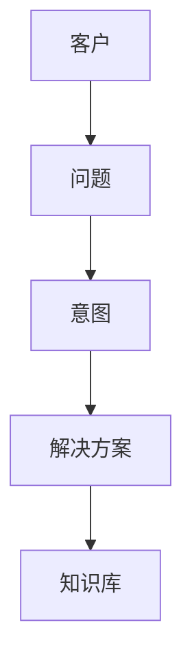
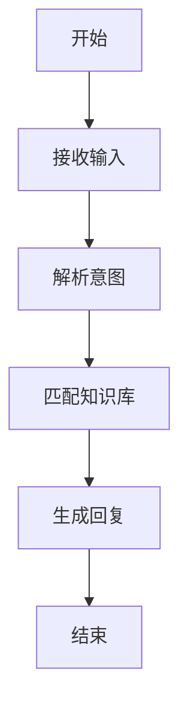
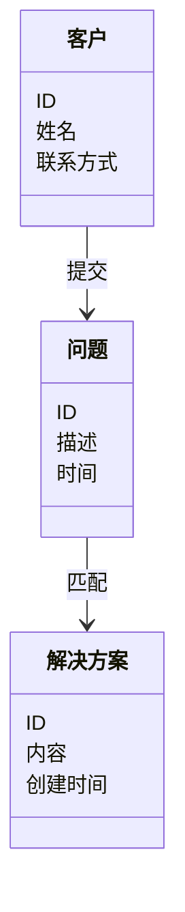
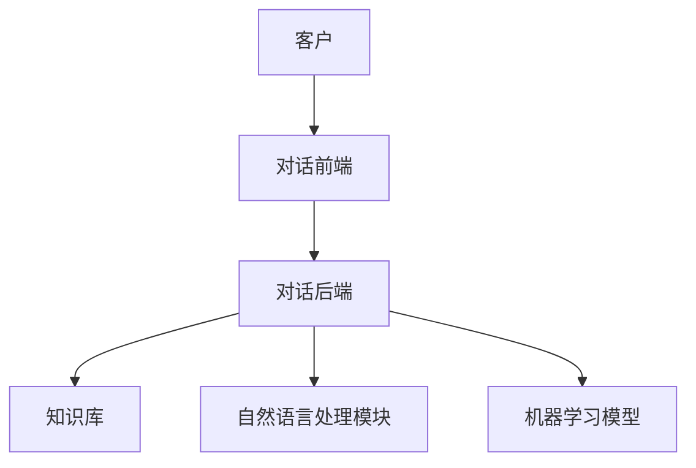
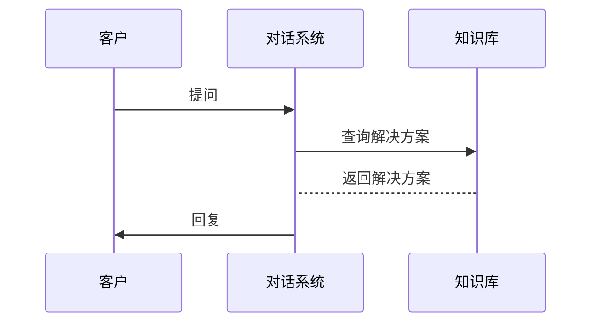

                 


# 对话式AI在客户服务中的应用与优化

> 关键词：对话式AI、客户服务、自然语言处理、机器学习、系统架构、项目实战

> 摘要：本文深入探讨了对话式AI在客户服务中的应用与优化，从核心概念、算法原理到系统架构，再到项目实战，全面解析了对话式AI的技术细节和实际应用。文章结合具体案例，详细讲解了对话式AI的实现过程，包括算法选择、系统设计和优化策略，为读者提供了一套完整的解决方案。

---

## 第1章: 背景介绍

### 1.1 问题背景
#### 1.1.1 客户服务的现状与挑战
随着企业规模的扩大和客户需求的多样化，传统的客服模式（如电话客服、邮件客服）逐渐暴露出效率低、成本高、客户体验差等问题。客户在寻求帮助时，往往需要等待漫长的回复时间，甚至需要多次沟通才能解决问题。这种低效的模式不仅影响了客户的满意度，也增加了企业的运营成本。

#### 1.1.2 对话式AI的出现及其作用
对话式AI（Conversational AI）作为一种新兴的技术，通过自然语言处理（NLP）和机器学习（ML）技术，能够模拟人类对话的方式与客户进行交互。它能够快速响应客户的问题，提供个性化的解决方案，显著提升了客户体验和客服效率。

### 1.2 问题描述
#### 1.2.1 客户服务中的常见问题
- 客户问题理解不准确，导致多次沟通。
- 客服人员数量有限，难以满足大规模客户需求。
- 客户问题复杂多样，需要专业知识支持。

#### 1.2.2 对话式AI如何解决这些问题
- 通过NLP技术准确理解客户需求，减少沟通次数。
- 提供7×24小时的在线客服，降低人力成本。
- 利用知识库和预设规则快速响应复杂问题。

### 1.3 问题解决
#### 1.3.1 对话式AI的解决方案概述
对话式AI通过整合NLP、ML和知识库技术，构建一个智能客服系统，能够实现自动化的客户问题处理。系统的核心在于理解客户意图、匹配知识库中的解决方案，并通过自然语言生成技术输出回复。

#### 1.3.2 技术实现的基本思路
1. **数据收集**：收集客户的对话记录和问题分类数据。
2. **模型训练**：基于数据训练NLP模型，实现意图识别和实体提取。
3. **知识库构建**：整理常见问题和解决方案，构建领域知识库。
4. **系统集成**：将模型和知识库集成到对话式AI系统中，实现自动化客服。

### 1.4 边界与外延
#### 1.4.1 对话式AI的应用范围
对话式AI主要应用于客户服务、销售支持、技术支持等领域，适用于需要快速响应和个性化服务的场景。

#### 1.4.2 与其他技术的界限
对话式AI与其他技术（如搜索引擎、推荐系统）的区别在于其交互性更强，能够通过上下文理解客户意图，并动态调整回复内容。

### 1.5 核心概念
#### 1.5.1 对话式AI的定义与特点
对话式AI是一种基于NLP和ML技术的智能系统，能够通过自然语言与用户进行交互，理解用户意图并提供相应的解决方案。

#### 1.5.2 核心要素组成
1. **自然语言处理（NLP）**：用于理解和生成自然语言。
2. **机器学习（ML）**：用于训练模型和优化对话策略。
3. **知识库**：存储常见问题和解决方案。
4. **对话管理**：负责协调对话流程。

---

## 第2章: 核心概念与联系

### 2.1 对话式AI的核心原理
#### 2.1.1 自然语言处理（NLP）基础
NLP技术是对话式AI的核心，包括文本分词、实体识别、意图识别等步骤。例如，使用分词技术将客户的问题拆分成关键词，再通过意图识别确定客户的需求。

#### 2.1.2 机器学习（ML）的应用
机器学习用于训练模型，实现对话系统的优化。例如，使用深度学习模型（如LSTM）进行对话生成，或者使用监督学习模型进行意图分类。

### 2.2 核心概念对比
#### 2.2.1 规则引擎与深度学习模型的对比
| 对比维度         | 规则引擎             | 深度学习模型         |
|------------------|--------------------|--------------------|
| 实现方式         | 基于预设规则         | 基于数据训练         |
| 灵活性           | 较低                 | 较高                 |
| 可扩展性         | 较差                 | 较好                 |
| 适用场景         | 简单规则场景         | 复杂场景             |

#### 2.2.2 对比表格（使用Markdown表格）

#### 2.2.3 ER实体关系图


### 2.3 ER实体关系图


---

## 第3章: 算法原理讲解

### 3.1 对话式AI的核心算法
#### 3.1.1 基于规则的对话系统
基于规则的对话系统通过预设的规则和模板来生成回复。例如，当客户询问“如何退款？”时，系统会匹配预设的退款规则并生成相应的回复。

#### 3.1.2 基于机器学习的对话系统
基于机器学习的对话系统通过训练数据生成回复。例如，使用LSTM模型训练对话历史数据，生成与上下文相关的回复。

### 3.2 算法流程图


### 3.3 算法实现
#### 3.3.1 Python代码示例
```python
import numpy as np
from sklearn.metrics.pairwise import cosine_similarity

# 示例：计算文本相似度
def compute_similarity(text1, text2):
    # 将文本转换为向量（简化示例）
    vectorizer = lambda x: np.array([x])
    vec1 = vectorizer(text1)
    vec2 = vectorizer(text2)
    similarity = cosine_similarity(vec1, vec2)[0][0]
    return similarity

# 示例使用
text1 = "How can I help you?"
text2 = "What can you do?"
similarity = compute_similarity(text1, text2)
print(f"文本相似度：{similarity}")
```

#### 3.3.2 代码解读与分析
- **compute_similarity**：计算文本相似度的函数，使用余弦相似度公式。
- **cosine_similarity**：Scikit-learn库中的函数，用于计算向量之间的余弦相似度。

---

## 第4章: 数学模型与公式

### 4.1 文本相似度计算
文本相似度是对话式AI中的关键指标，常用的计算方法包括余弦相似度和Jaccard相似度。

#### 4.1.1 余弦相似度公式
$$
\text{余弦相似度} = \frac{\vec{A} \cdot \vec{B}}{|\vec{A}| \cdot |\vec{B}|}
$$

#### 4.1.2 Jaccard相似度公式
$$
\text{Jaccard相似度} = \frac{|\vec{A} \cap \vec{B}|}{|\vec{A} \cup \vec{B}|}
$$

### 4.2 概率模型
#### 4.2.1 马尔可夫链模型
$$
P(x|y) = \frac{P(y|x) \cdot P(x)}{P(y)}
$$

#### 4.2.2 概率树示例
- 客户输入问题的概率为 $P(Q)$。
- 系统理解问题的概率为 $P(R|Q)$。
- 系统生成回复的概率为 $P(A|Q,R)$。

---

## 第5章: 系统分析与架构设计方案

### 5.1 问题场景介绍
假设我们正在设计一个客服对话系统，用于处理客户的技术支持请求。

### 5.2 项目介绍
#### 5.2.1 项目目标
构建一个基于对话式AI的智能客服系统，实现客户问题的自动识别和解决。

#### 5.2.2 领域模型设计


### 5.3 系统架构设计


### 5.4 系统接口设计
- **输入接口**：接收客户输入的文本或语音。
- **输出接口**：生成回复文本或语音。
- **知识库接口**：提供问题解决方案的查询接口。

### 5.5 系统交互流程


---

## 第6章: 项目实战

### 6.1 环境配置
- **Python版本**：Python 3.8+
- **依赖库**：NLTK、Scikit-learn、TensorFlow

### 6.2 系统核心实现源代码
```python
from sklearn.feature_extraction.text import TfidfVectorizer
from sklearn.metrics.pairwise import cosine_similarity

class DialogSystem:
    def __init__(self, knowledge_base):
        self.knowledge_base = knowledge_base
        self.vectorizer = TfidfVectorizer()

    def process_input(self, input_text):
        # 将输入文本转换为向量
        input_vec = self.vectorizer.fit_transform([input_text])
        # 匹配知识库中的最相似文本
        max_similarity = -1
        best_match = ""
        for text in self.knowledge_base:
            text_vec = self.vectorizer.fit_transform([text])
            similarity = cosine_similarity(input_vec, text_vec)[0][0]
            if similarity > max_similarity:
                max_similarity = similarity
                best_match = text
        return best_match

# 示例使用
knowledge_base = [
    "如何退款？请提供订单号和支付方式。",
    "技术支持请联系我们的客服团队。",
    "您可以前往设置页面进行操作。"
]

dialog_system = DialogSystem(knowledge_base)
response = dialog_system.process_input("我需要退款。")
print(response)  # 输出：如何退款？请提供订单号和支付方式。
```

### 6.3 代码解读与分析
- **DialogSystem**：对话系统的核心类，初始化时加载知识库。
- **process_input**：处理客户输入，通过TF-IDF向量化技术匹配最相似的问题。
- **cosine_similarity**：计算文本相似度。

### 6.4 实际案例分析
假设客户输入“如何恢复已删除的订单？”，系统会匹配知识库中最相似的问题“如何退款？请提供订单号和支付方式。”并生成回复。

### 6.5 项目小结
对话式AI系统的核心在于准确理解客户意图，并快速匹配解决方案。通过不断优化NLP模型和知识库，可以显著提升系统的准确率和客户满意度。

---

## 第7章: 最佳实践和小结

### 7.1 最佳实践
- **数据质量**：确保训练数据的多样性和代表性。
- **模型优化**：定期更新模型，引入新的知识和规则。
- **用户体验**：提供多渠道的客服支持，确保系统的易用性。

### 7.2 小结
对话式AI在客户服务中的应用不仅提升了效率，还优化了客户体验。通过结合NLP、ML和知识库技术，企业可以构建一个高效、智能的客服系统，满足客户的多样化需求。

### 7.3 注意事项
- 对话式AI系统需要定期维护和更新，以应对新的问题和需求。
- 在实际应用中，建议结合人工客服，作为对话式AI的补充。

### 7.4 拓展阅读
- 推荐阅读《自然语言处理入门》和《机器学习实战》，深入了解对话式AI的技术细节。

---

通过以上内容，我们全面解析了对话式AI在客户服务中的应用与优化，从技术原理到实际案例，为读者提供了一套完整的解决方案。希望本文能为相关领域的从业者提供有价值的参考和启发。

