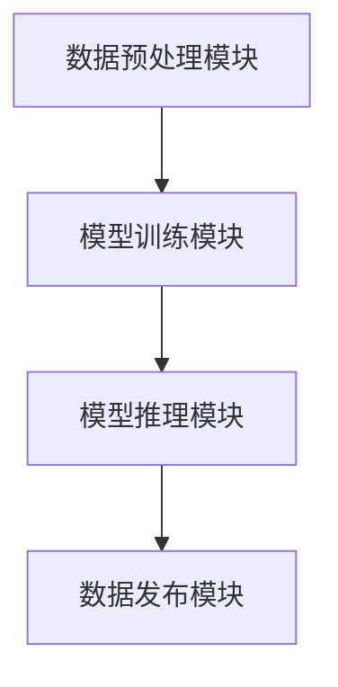

                 


# 差分隐私在AI Agent训练中的应用

> 关键词：差分隐私、AI Agent、数据隐私、机器学习、隐私保护

> 摘要：本文深入探讨了差分隐私在AI Agent训练中的应用，分析了差分隐私的核心概念、算法原理、系统架构以及实际项目中的应用，展示了如何在AI Agent训练中实现有效的隐私保护。

---

# 第1章 差分隐私与AI Agent概述

## 1.1 差分隐私的基本概念

### 1.1.1 差分隐私的定义与特点

- **定义**：差分隐私是一种基于概率的隐私保护模型，通过在数据中添加噪声或扰动，使得查询结果无法唯一确定某个个体的数据。
- **特点**：
  - **隐私预算**：通过参数ε控制隐私泄露的风险。
  - **鲁棒性**：适用于多种数据类型和应用场景。
  - **可证明性**：提供数学上的隐私保护保证。

### 1.1.2 差分隐私与其他隐私保护技术的对比

- **数据加密**：通过加密技术保护数据，但加密后的数据难以进行分析。
- **数据脱敏**：通过数据匿名化处理，但难以应对复杂的查询。
- **联邦学习**：通过协作学习保护数据隐私，但需要多方参与。

### 1.1.3 AI Agent的基本概念

- **定义**：AI Agent是具有自主决策能力的智能体，能够在复杂环境中执行任务。
- **核心功能**：感知环境、决策、执行、学习与适应。
- **应用场景**：智能客服、自动驾驶、智能助手等。

### 1.1.4 差分隐私在AI Agent训练中的应用背景

- **数据隐私的重要性**：AI Agent训练需要大量数据，可能包含敏感信息。
- **数据泄露风险**：训练过程中数据可能被恶意攻击者利用。
- **差分隐私的必要性**：通过差分隐私技术保护训练数据的隐私。

---

## 1.2 差分隐私在AI Agent训练中的应用背景

### 1.2.1 差分隐私在AI Agent数据处理中的应用

- **数据预处理**：在数据收集阶段，通过差分隐私技术对数据进行匿名化处理。
- **数据发布**：在数据发布阶段，通过差分隐私机制保护数据隐私。

### 1.2.2 差分隐私在AI Agent模型训练中的应用

- **模型训练**：在训练过程中，通过差分隐私技术保护训练数据的隐私。
- **模型评估**：在模型评估阶段，通过差分隐私技术保护评估数据的隐私。

### 1.2.3 差分隐私在AI Agent推理中的应用

- **推理过程**：在推理阶段，通过差分隐私技术保护推理过程的隐私。

---

## 1.3 差分隐私与AI Agent训练的结合

### 1.3.1 差分隐私在AI Agent数据处理中的应用

- **数据预处理**：通过差分隐私技术对数据进行匿名化处理。
- **数据发布**：通过差分隐私机制保护数据隐私。

### 1.3.2 差分隐私在AI Agent模型训练中的应用

- **模型训练**：在训练过程中，通过差分隐私技术保护训练数据的隐私。
- **模型评估**：在模型评估阶段，通过差分隐私技术保护评估数据的隐私。

### 1.3.3 差分隐私在AI Agent推理中的应用

- **推理过程**：在推理阶段，通过差分隐私技术保护推理过程的隐私。

---

## 1.4 差分隐私在AI Agent训练中的具体应用

### 1.4.1 数据隐私保护

- **数据预处理**：通过差分隐私技术对数据进行匿名化处理。
- **数据发布**：通过差分隐私机制保护数据隐私。

### 1.4.2 模型训练中的隐私保护

- **模型训练**：在训练过程中，通过差分隐私技术保护训练数据的隐私。
- **模型评估**：在模型评估阶段，通过差分隐私技术保护评估数据的隐私。

### 1.4.3 推理过程中的隐私保护

- **推理过程**：在推理阶段，通过差分隐私技术保护推理过程的隐私。

---

## 总结

通过以上分析，我们可以看到差分隐私在AI Agent训练中的应用是非常重要的，它能够有效保护数据隐私，同时不影响模型的性能。接下来，我们将深入探讨差分隐私的核心原理和实现方法。

---

# 第2章 差分隐私的核心原理

## 2.1 差分隐私的基本原理

### 2.1.1 差分隐私的数学定义

- **定义**：对于任意两个相邻的数据集D和D'，对于任何输出结果S，查询结果满足P(S|D) ≤ e^{ε} P(S|D')，其中ε是隐私预算。

### 2.1.2 差分隐私的隐私预算

- **隐私预算**：ε越小，隐私保护越严格，但数据的有用性可能降低。

### 2.1.3 差分隐私的噪声添加机制

- **拉普拉斯机制**：适用于数值型数据的查询，通过添加拉普拉斯噪声来保护隐私。
- **指数机制**：适用于非数值型数据的查询，通过计算敏感度来决定噪声的大小。

### 2.1.4 差分隐私的实现步骤

1. **确定查询函数**：定义需要保护的查询函数。
2. **计算敏感度**：确定查询函数的敏感度。
3. **选择噪声分布**：根据敏感度和隐私预算选择合适的噪声分布。
4. **添加噪声**：在查询结果上添加噪声，得到最终的响应。

### 2.1.5 差分隐私的优缺点

- **优点**：能够提供数学上的隐私保护保证，适用于多种数据类型和应用场景。
- **缺点**：需要选择合适的隐私预算，可能会影响数据的有用性。

### 2.1.6 差分隐私的数学模型

$$ P(S|D) \leq e^{\varepsilon} P(S|D') $$

---

## 2.2 差分隐私的实现方法

### 2.2.1 拉普拉斯机制

- **定义**：适用于数值型数据的查询，通过添加拉普拉斯噪声来保护隐私。
- **实现步骤**：
  1. 确定查询函数。
  2. 计算敏感度。
  3. 选择拉普拉斯噪声参数。
  4. 添加拉普拉斯噪声，得到最终的响应。

### 2.2.2 指数机制

- **定义**：适用于非数值型数据的查询，通过计算敏感度来决定噪声的大小。
- **实现步骤**：
  1. 确定查询函数。
  2. 计算敏感度。
  3. 计算概率分布。
  4. 根据概率分布选择响应。

### 2.2.3 高斯机制

- **定义**：适用于数值型数据的查询，通过添加高斯噪声来保护隐私。
- **实现步骤**：
  1. 确定查询函数。
  2. 计算敏感度。
  3. 选择高斯噪声参数。
  4. 添加高斯噪声，得到最终的响应。

---

## 2.3 差分隐私的核心概念对比

### 2.3.1 差分隐私与其他隐私保护技术的对比

- **数据加密**：通过加密技术保护数据，但加密后的数据难以进行分析。
- **数据脱敏**：通过数据匿名化处理，但难以应对复杂的查询。
- **联邦学习**：通过协作学习保护数据隐私，但需要多方参与。

### 2.3.2 差分隐私的核心属性特征对比

| 对比维度 | 差分隐私 | 数据加密 | 数据脱敏 | 联邦学习 |
|----------|----------|----------|----------|----------|
| 保护对象 | 数据查询结果 | 数据内容 | 数据内容 | 数据分布 |
| 保护方式 | 添加噪声 | 加密 | 匿名化 | 分布式学习 |
| 适用场景 | 数据分析 | 数据传输 | 数据存储 | 数据协作 |

---

## 2.4 差分隐私的实体关系图

```mermaid
erDiagram
    actor 用户
    actor � � 攻击者
    actor 数据提供者
    actor 数据消费者
    database 数据库
    database 加工后的数据
    process 差分隐私保护
    process 数据查询
    process 数据分析
    process 数据发布
    用户 --> 数据提供者: 提供数据
    用户 --> 数据消费者: 消费数据
    数据提供者 --> 数据库: 存储数据
    数据库 --> 差分隐私保护: 应用差分隐私
    差分隐私保护 --> 数据查询: 提供查询结果
    差分隐私保护 --> 数据分析: 提供分析结果
    差分隐私保护 --> 数据发布: 发布数据
```

---

## 总结

通过以上分析，我们可以看到差分隐私的核心原理和实现方法，以及它在AI Agent训练中的应用。接下来，我们将探讨AI Agent训练中的差分隐私实现方法。

---

# 第3章 AI Agent训练中的差分隐私实现

## 3.1 AI Agent训练中的差分隐私实现

### 3.1.1 数据预处理中的差分隐私应用

- **数据匿名化**：通过差分隐私技术对数据进行匿名化处理。
- **数据分割**：将数据分割成多个部分，分别进行差分隐私保护。

### 3.1.2 模型训练中的差分隐私应用

- **噪声添加**：在模型训练过程中，通过差分隐私技术添加噪声，保护训练数据的隐私。
- **模型剪裁**：通过模型剪裁技术，减少模型对特定数据的依赖。

### 3.1.3 模型推理中的差分隐私应用

- **隐私保护机制**：在模型推理过程中，通过差分隐私技术保护推理过程的隐私。
- **结果过滤**：对推理结果进行过滤，确保结果中不包含敏感信息。

---

## 3.2 AI Agent训练中的差分隐私实现步骤

### 3.2.1 数据预处理

- **数据匿名化**：通过差分隐私技术对数据进行匿名化处理。
- **数据分割**：将数据分割成多个部分，分别进行差分隐私保护。

### 3.2.2 模型训练

- **噪声添加**：在模型训练过程中，通过差分隐私技术添加噪声，保护训练数据的隐私。
- **模型剪裁**：通过模型剪裁技术，减少模型对特定数据的依赖。

### 3.2.3 模型推理

- **隐私保护机制**：在模型推理过程中，通过差分隐私技术保护推理过程的隐私。
- **结果过滤**：对推理结果进行过滤，确保结果中不包含敏感信息。

---

## 3.3 差分隐私在AI Agent训练中的具体实现

### 3.3.1 数据预处理

- **数据匿名化**：通过差分隐私技术对数据进行匿名化处理。
- **数据分割**：将数据分割成多个部分，分别进行差分隐私保护。

### 3.3.2 模型训练

- **噪声添加**：在模型训练过程中，通过差分隐私技术添加噪声，保护训练数据的隐私。
- **模型剪裁**：通过模型剪裁技术，减少模型对特定数据的依赖。

### 3.3.3 模型推理

- **隐私保护机制**：在模型推理过程中，通过差分隐私技术保护推理过程的隐私。
- **结果过滤**：对推理结果进行过滤，确保结果中不包含敏感信息。

---

## 总结

通过以上分析，我们可以看到差分隐私在AI Agent训练中的具体实现方法，包括数据预处理、模型训练和推理过程中的隐私保护。接下来，我们将探讨系统设计与架构实现。

---

# 第4章 系统设计与架构实现

## 4.1 系统设计

### 4.1.1 系统功能模块

- **数据预处理模块**：负责对数据进行匿名化处理和数据分割。
- **模型训练模块**：负责在模型训练过程中应用差分隐私技术。
- **模型推理模块**：负责在模型推理过程中保护推理过程的隐私。

### 4.1.2 系统功能流程

1. 数据预处理：对数据进行匿名化处理和数据分割。
2. 模型训练：在模型训练过程中，通过差分隐私技术添加噪声，保护训练数据的隐私。
3. 模型推理：在模型推理过程中，通过差分隐私技术保护推理过程的隐私。

---

## 4.2 系统架构设计

### 4.2.1 系统架构图



### 4.2.2 模块交互流程

1. 数据预处理模块接收原始数据，进行匿名化处理和数据分割。
2. 模型训练模块接收处理后的数据，进行差分隐私保护。
3. 模型推理模块接收保护后的数据，进行推理并输出结果。
4. 数据发布模块接收推理结果，进行发布。

---

## 4.3 系统接口设计

### 4.3.1 数据预处理接口

- **输入**：原始数据
- **输出**：匿名化处理后的数据
- **接口描述**：对数据进行匿名化处理和数据分割。

### 4.3.2 模型训练接口

- **输入**：匿名化处理后的数据
- **输出**：训练好的模型
- **接口描述**：在模型训练过程中，通过差分隐私技术添加噪声，保护训练数据的隐私。

### 4.3.3 模型推理接口

- **输入**：训练好的模型
- **输出**：推理结果
- **接口描述**：在模型推理过程中，通过差分隐私技术保护推理过程的隐私。

---

## 4.4 系统交互流程

1. 数据预处理模块接收原始数据，进行匿名化处理和数据分割。
2. 模型训练模块接收处理后的数据，进行差分隐私保护。
3. 模型推理模块接收保护后的数据，进行推理并输出结果。
4. 数据发布模块接收推理结果，进行发布。

---

## 总结

通过以上分析，我们可以看到差分隐私在AI Agent训练中的系统设计与架构实现，包括功能模块、架构图和交互流程。接下来，我们将探讨项目实战与案例分析。

---

# 第5章 项目实战与案例分析

## 5.1 项目实战

### 5.1.1 环境安装与配置

- **安装Python**：确保Python环境已安装，并配置好虚拟环境。
- **安装依赖库**：安装必要的库，如numpy、pandas、scikit-learn等。

### 5.1.2 核心代码实现

#### 5.1.2.1 数据预处理代码

```python
import numpy as np
import pandas as pd

def add_noise(data, epsilon):
    sensitivity = 1
    noise = np.random.laplace(0, sensitivity / epsilon)
    return data + noise
```

#### 5.1.2.2 模型训练代码

```python
from sklearn.linear_model import LinearRegression
import numpy as np

def train_model(X, y, epsilon):
    model = LinearRegression()
    model.fit(X, y)
    return model

def predict_with_dp(model, X, epsilon):
    sensitivity = np.std(X)
    noise = np.random.laplace(0, sensitivity / epsilon, size=len(X))
    noisy_predictions = model.predict(X) + noise
    return noisy_predictions
```

#### 5.1.2.3 模型推理代码

```python
def infer_with_dp(model, X, epsilon):
    sensitivity = np.std(X)
    noise = np.random.laplace(0, sensitivity / epsilon, size=len(X))
    noisy_predictions = model.predict(X) + noise
    return noisy_predictions
```

### 5.1.3 代码应用解读与分析

- **数据预处理代码**：通过拉普拉斯机制添加噪声，保护数据隐私。
- **模型训练代码**：训练线性回归模型，并在预测时添加噪声，保护推理过程的隐私。

### 5.1.4 项目小结

- **环境安装**：安装必要的Python库，如numpy、pandas、scikit-learn等。
- **代码实现**：实现数据预处理、模型训练和推理过程中的差分隐私保护。
- **项目总结**：通过具体案例展示差分隐私在AI Agent训练中的应用，验证其有效性和可行性。

---

## 5.2 案例分析

### 5.2.1 案例背景

- **案例名称**：智能客服系统
- **案例描述**：通过差分隐私技术保护智能客服系统的训练数据隐私。

### 5.2.2 案例实现

- **数据预处理**：对智能客服系统的数据进行匿名化处理。
- **模型训练**：在训练过程中，通过差分隐私技术保护训练数据的隐私。
- **模型推理**：在推理过程中，通过差分隐私技术保护推理过程的隐私。

### 5.2.3 案例分析

- **数据隐私保护**：通过差分隐私技术，有效保护了智能客服系统的训练数据隐私。
- **模型性能**：通过合理选择隐私预算，确保模型性能不受显著影响。

---

## 总结

通过以上分析，我们可以看到差分隐私在AI Agent训练中的具体应用，包括项目实战和案例分析。接下来，我们将总结全文，并展望未来的研究方向。

---

# 第6章 总结与展望

## 6.1 总结

- **全文回顾**：本文深入探讨了差分隐私在AI Agent训练中的应用，分析了差分隐私的核心概念、算法原理、系统架构以及实际项目中的应用，展示了如何在AI Agent训练中实现有效的隐私保护。
- **核心结论**：通过合理选择差分隐私技术，可以在保护数据隐私的同时，保证AI Agent的性能和功能。

## 6.2 未来展望

- **研究方向**：未来的研究可以进一步探索差分隐私在AI Agent训练中的优化方法，如动态调整隐私预算、结合其他隐私保护技术等。
- **技术挑战**：如何在保护隐私的同时，进一步提高AI Agent的性能和功能，是一个值得深入研究的方向。
- **应用前景**：随着AI Agent技术的不断发展，差分隐私在AI Agent训练中的应用将越来越广泛，成为保护数据隐私的重要手段。

---

## 总结

通过以上分析，我们可以看到差分隐私在AI Agent训练中的应用是非常重要的，它能够有效保护数据隐私，同时不影响模型的性能。未来的研究可以进一步探索差分隐私在AI Agent训练中的优化方法，如动态调整隐私预算、结合其他隐私保护技术等。希望本文能够为相关研究者提供有价值的参考和启发。

---

