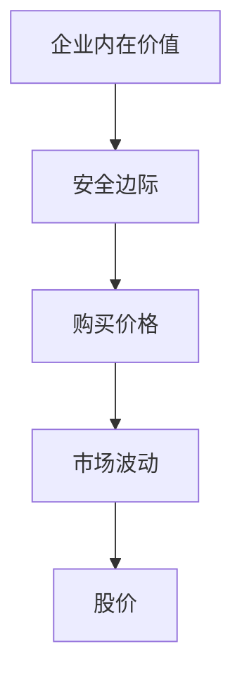

                 


```markdown
# 巴菲特-芒格投资策略解析：价值投资的精髓

> 关键词：巴菲特，芒格，价值投资，安全边际，内在价值，多元思维模型，投资策略

> 摘要：本文系统解析巴菲特和芒格的价值投资策略，从基本概念到具体策略，从数学模型到实际案例，全面阐述价值投资的精髓。文章首先介绍价值投资的背景与基础，然后深入分析巴菲特和芒格的投资策略、分析框架、风险管理，最后通过经典案例分析，展示价值投资的实际应用。通过本文，读者将掌握价值投资的核心思想和实用方法。

---

## 第一部分：价值投资的背景与基础

### 第1章：价值投资的定义与核心理念

#### 1.1 价值投资的定义
价值投资是一种以企业内在价值为核心的投资方法，强调以低于内在价值的价格买入优质资产，长期持有，等待市场重新认识其价值。

- **1.1.1 价值投资的基本概念**
  - 价值投资：通过分析企业的基本面，寻找被市场低估的投资标的。
  - 内在价值：企业未来现金流的现值，反映其真实价值。
  - 投资与投机：价值投资注重长期稳健，而投机注重短期波动。

- **1.1.2 价值投资的核心原则**
  - 质量优先：投资于具有强大竞争优势的企业。
  - 安全边际：购买价格低于内在价值，确保安全空间。
  - 长期持有：耐心等待企业价值的实现。

- **1.1.3 价值投资与投机的区别**
  - 投资：基于基本面分析，追求长期收益。
  - 投机：基于市场情绪，追求短期收益。
  - 巴菲特观点：投资是科学，投机是艺术。

#### 1.2 巴菲特与芒格的生平简介
- **1.2.1 巴菲特的生平与投资历程**
  - 沃伦·巴菲特：1934年出生，伯克希尔·哈撒韦公司董事长兼首席执行官。
  - 投资理念：价值投资，注重长期稳健。
  - 成功案例：收购国民保险公司、可口可乐公司等。

- **1.2.2 芒格的生平与投资历程**
  - 查理·芒格：1924年出生，伯克希尔·哈撒韦公司副主席。
  - 多元思维模型：强调跨学科思考，寻找投资中的常识性错误。
  - 成功案例：早期投资合伙公司，芒格出版《穷查理宝典》。

- **1.2.3 巴菲特与芒格的合作历程**
  - 1965年共同管理合伙企业，1969年转型为长期投资。
  - 伯克希尔·哈撒韦：巴菲特担任CEO，芒格担任副主席，共同决策。
  - 投资理念的结合：巴菲特的价值投资与芒格的多元思维模型相辅相成。

#### 1.3 巴菲特与芒格的投资理念
- **1.3.1 巴菲特的价值投资哲学**
  - 质量第一：投资于具有强大竞争优势的企业。
  - 安全边际：购买价格低于内在价值。
  - 长期持有：耐心等待企业的价值实现。

- **1.3.2 芒格的多元思维模型**
  - 多元思维：通过多个学科的交叉思考，发现投资机会。
  - 市场先生：巴菲特定义的市场情绪波动，投资者应利用市场先生的情绪。
  - 边际效用递减：投资中的分散化与集中化的平衡。

- **1.3.3 两人投资理念的共同点与差异**
  - 共同点：注重内在价值，长期持有，质量优先。
  - 差异：巴菲特更注重企业的财务数据和竞争优势，芒格更注重跨学科的思维方式。

### 第2章：价值投资的核心概念与联系

#### 2.1 核心概念原理
- **企业内在价值**：企业的未来现金流的现值，不因市场波动而改变。
- **安全边际**：购买价格低于内在价值，确保投资的安全性。
- **市场先生**：巴菲特定义的市场情绪，投资者应利用市场波动。

#### 2.2 核心概念属性特征对比表
| 概念          | 特性               | 描述                                   |
|---------------|--------------------|----------------------------------------|
| 企业内在价值  | 客观性             | 不受市场波动影响，反映企业真实价值     |
| 安全边际      | 防护性             | 购买价格低于内在价值，降低风险         |
| 市场先生       | 波动性             | 市场情绪波动，影响股价而非企业价值       |

#### 2.3 实体关系图（Mermaid流程图）


### 第3章：巴菲特与芒格投资策略的数学模型与公式

#### 3.1 企业内在价值的计算公式
$$ V = \frac{CF}{r - g} $$

- **公式解释**：
  - \( V \)：企业内在价值。
  - \( CF \)：未来现金流。
  - \( r \)：折现率。
  - \( g \)：现金流增长率。

- **实际案例**：
  - 假设某企业未来现金流为1000万元，折现率为10%，增长率为5%。
  - 内在价值 \( V = \frac{1000}{0.10 - 0.05} = 20000 \) 万元。

---

## 第二部分：巴菲特与芒格的投资策略

### 第4章：巴菲特的选股标准

#### 4.1 企业竞争优势
- 投资于具有强大护城河的企业，如可口可乐的商标和品牌优势。
- 通过分析企业的商业模式、竞争优势和市场地位，判断其是否具备长期盈利能力。

#### 4.2 财务健康状况
- 重点关注企业的盈利能力、现金流和资产负债表。
- 财务健康：高利润率、稳定的现金流、低负债率。

#### 4.3 管理层能力
- 投资于由诚实、有能力的管理层领导的企业。
- 通过管理层的历史表现和企业治理结构，评估其管理能力。

#### 4.4 估值水平
- 确保购买价格低于企业的内在价值。
- 使用市盈率、市净率等指标，评估股票的吸引力。

### 第5章：芒格的多元思维模型

#### 5.1 思维模型的重要性
- 通过跨学科的思考，识别投资中的逻辑错误。
- 比如，物理学中的能量守恒定律，可以应用于企业评估。

#### 5.2 市场先生的比喻
- 巴菲特创造的市场先生形象，帮助投资者理解市场波动。
- 投资者应利用市场先生的情绪，寻找低估的投资机会。

#### 5.3 边际效用递减法则
- 在投资组合中，分散化可以降低风险，但边际效用递减。
- 集中投资于少数优质资产，分散于多个优质资产。

### 第6章：安全边际与风险管理

#### 6.1 安全边际的重要性
- 安全边际=内在价值-购买价格。
- 确保即使市场波动，也能保持投资的安全性。

#### 6.2 投资组合的风险管理
- 分散投资：降低个股风险。
- 长期持有：避免短期波动的影响。
- 保持耐心：等待市场重新认识企业的价值。

---

## 第三部分：价值投资的分析框架

### 第7章：企业内在价值的评估

#### 7.1 现金流折现模型（DCF）
- 使用DCF模型计算企业的内在价值。
- 实际案例：分析某企业的未来现金流，计算其内在价值。

#### 7.2 相对估值方法
- 使用市盈率、市净率等指标，评估股票的相对吸引力。

### 第8章：财务报表分析

#### 8.1 资产负债表分析
- 评估企业的资产、负债和所有者权益。
- 关注企业的偿债能力、资本结构和资产质量。

#### 8.2 利润表分析
- 评估企业的收入、成本和利润。
- 关注企业的盈利能力、收入增长和成本控制。

#### 8.3 现金流量表分析
- 评估企业的现金流状况。
- 关注经营活动现金流、投资活动现金流和筹资活动现金流。

---

## 第四部分：价值投资的风险管理与心理控制

### 第9章：风险管理策略

#### 9.1 投资组合的风险管理
- 分散投资：降低个股风险。
- 长期持有：避免短期波动的影响。
- 保持耐心：等待市场重新认识企业的价值。

#### 9.2 心理控制
- 避免贪婪和恐惧：保持冷静，理性决策。
- 长期思维：关注企业的长期价值，忽略短期波动。

### 第10章：巴菲特与芒格的风险管理原则

#### 10.1 巴菲特的风险管理
- 避免永久性资本损失：确保投资的安全性。
- 保持流动性：应对市场波动的需求。

#### 10.2 芒格的风险管理
- 多元思维模型：识别潜在风险。
- 避免过度杠杆：保持财务健康。

---

## 第五部分：价值投资的实战应用

### 第11章：经典投资案例分析

#### 11.1 可口可乐的案例
- 投资逻辑：强大的品牌优势、稳定的现金流、合理的估值。
- 操作策略：长期持有，享受复利效应。

#### 11.2 IBM的案例
- 投资逻辑：技术领先、市场地位稳固、管理层优秀。
- 操作策略：买入并持有，等待价值实现。

#### 11.3 比亚迪的案例
- 投资逻辑：行业领先地位、强大的研发能力、合理的估值。
- 操作策略：长期持有，享受企业成长。

---

## 第六部分：总结与展望

### 第12章：价值投资的总结与展望

#### 12.1 投资理念的总结
- 长期投资：耐心等待企业的价值实现。
- 质量优先：投资于优质企业。
- 安全边际：确保投资的安全性。

#### 12.2 投资策略的展望
- 继续坚持价值投资，寻找被低估的投资机会。
- 学习巴菲特和芒格的投资理念，不断完善自己的投资策略。

---

## 第七部分：最佳实践与注意事项

### 第13章：价值投资的最佳实践

#### 13.1 长期投资的重要性
- 保持耐心，避免频繁交易。
- 长期持有优质资产，享受复利效应。

#### 13.2 风险管理的关键
- 避免过度杠杆，保持财务健康。
- 分散投资，降低风险。

### 第14章：价值投资的注意事项

#### 14.1 避免盲目跟风
- 独立思考，避免被市场情绪左右。
- 仔细分析企业的基本面，避免盲目跟随市场。

#### 14.2 学习与成长
- 不断学习，提升自己的投资能力。
- 关注全球经济趋势，了解企业的经营环境。

---

## 第八部分：拓展阅读与进一步思考

### 第15章：拓展阅读

#### 15.1 巴菲特的经典言论
- “价格是你支付的，价值是你得到的。”
- “投资最重要的ことは、ポジティブな邊際利益を生む企業を買うこと。”

#### 15.2 芒格的智慧箴言
- “反常识的投资决策往往最有利可图。”
- “投资是简单的事，但需要智慧。”

### 第16章：进一步思考

#### 16.1 价值投资的局限性
- 市场的有效性：如果市场是有效的，价值投资是否还能奏效？
- 技术进步：如何应对科技企业的快速变化？

#### 16.2 未来投资的趋势
- 数字经济：如何在数字化转型中寻找投资机会？
- 可持续发展：如何将ESG因素融入价值投资？

---

## 结语

通过本文的系统解析，我们深入探讨了巴菲特和芒格的价值投资策略，从基本概念到具体策略，从数学模型到实际案例，全面阐述了价值投资的精髓。价值投资不仅仅是一种投资方法，更是一种投资哲学，需要投资者具备耐心、纪律和持续学习的能力。未来，随着市场的变化和技术的进步，价值投资的理念将不断发展和完善，为投资者提供更有效的指导。
```

